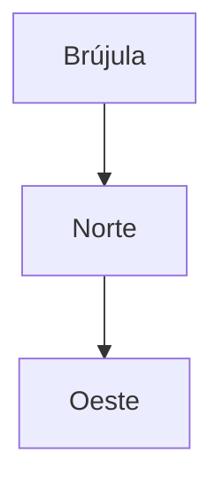
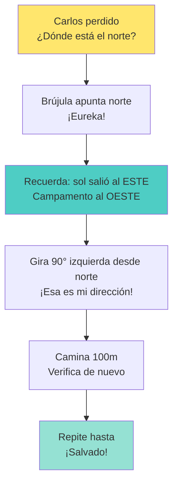
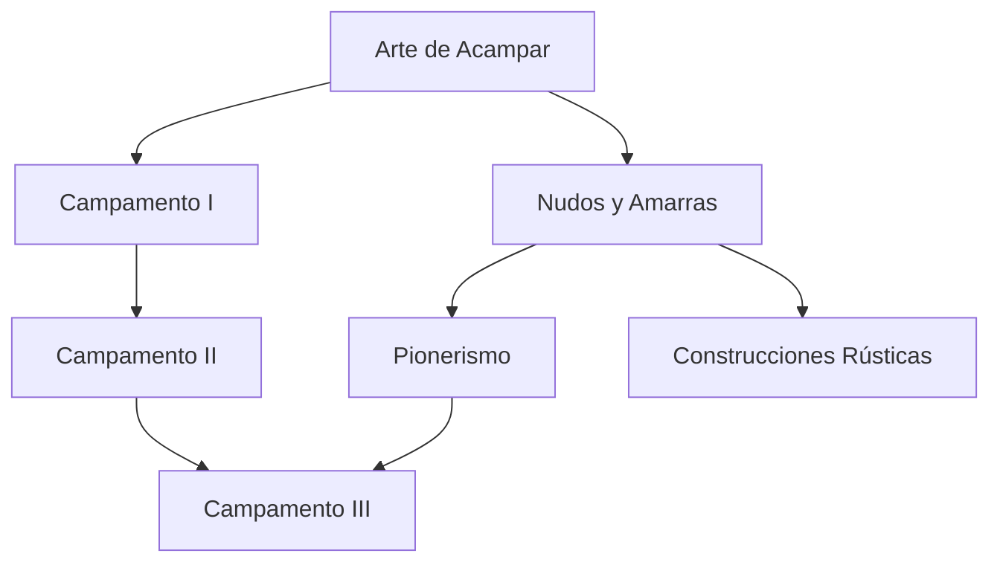

# 🎓 Workflow: Cómo Crear Manuales Estilo GO!

## 📋 Resumen Ejecutivo

Este documento captura el **proceso validado** para transformar especialidades del Manual DSA en manuales narrativos estilo GO!, usando la especialidad **Nudos y Amarras** como caso de éxito.

**Big Win del proyecto:**
> Crear un cuerpo narrativo que cumpla TODOS los requisitos DSA sin mencionarlos explícitamente, dando libertad de elección y aprendizaje contextualizado.

---

## 🔄 WORKFLOW PASO A PASO

### FASE 1: Preparación y Mapeo (1-1.5 horas)

#### 1.1 Extraer Requisitos DSA
```bash
# Si el PDF es escaneado, hacer OCR
ocrmypdf --force-ocr "pdfs/[Especialidad].pdf" /tmp/temp.pdf
pdftotext /tmp/temp.pdf assets/ocr/[especialidad]_dsa.txt

# Buscar la especialidad en el texto
rg -i "especialidad.*nudos" assets/ocr/especialidad_dsa.txt -A 200
```

**Resultado:** Lista completa de requisitos numerados del DSA.

#### 1.2 Identificar Temas Principales

**Pregunta clave:** ¿Qué CONCEPTOS y HABILIDADES cubre cada requisito?

**Ejemplo - Nudos y Amarras:**
- Req 1 (términos) → TEMA: Vocabulario técnico
- Req 2 (cuidados) → TEMA: Mantenimiento
- Req 3 (estática/dinámica) → TEMA: Tipos de cuerdas
- Req 10 (20 nudos) → TEMA: Categorías de nudos

**Técnica:** Agrupa requisitos relacionados en temas coherentes.

#### 1.3 Crear Documento de Mapeo Interno

**Ubicación:** `docs/mapeos/MAPEO_[especialidad].md`

**Contenido mínimo:**
```markdown
# Mapeo de Requisitos - [Especialidad]

## Requisito DSA 1: [texto completo del requisito]
**Ubicación en manual GO!:** Sección "[Título de sección]"
**Conceptos a incluir:**
- Concepto 1
- Concepto 2

**Estado:** ⏳ / ✅

---

[Repetir para cada requisito]

---

## RESUMEN DE COBERTURA
Total requisitos DSA: X
Requisitos cubiertos: Y/X (Z%)

## ESTRUCTURA PROPUESTA DEL MANUAL
1. Sección 1 (cubre reqs 1, 2)
2. Sección 2 (cubre req 3)
...
```

**Propósito:** Asegurar que NO se pierda ningún requisito en la transformación narrativa.

#### 1.4 Diseñar Estructura de Secciones

**Criterios para títulos de sección:**
- ✅ Atractivos y curiosos
- ✅ Evocan acción o descubrimiento
- ✅ Apropiados para 10-16 años
- ❌ NO usan "Requisito X"
- ❌ NO son técnicos/aburridos

**Ejemplos buenos:**
- "¿CONOCES? El mundo de los nudos"
- "CUIDANDO TU CUERDA - Como un escalador profesional"
- "¿SABÍAS QUE? La sabiduría bíblica"
- "PRÁCTICA - ¡Hazlo!"

**Ejemplos malos:**
- "Definiciones técnicas"
- "Requisito 1: Términos"
- "Mantenimiento de equipos"

---

### FASE 2: Redacción Narrativa (2-3 horas)

#### 2.1 Introducción Enganchadora

**Sección obligatoria:** "¿CONOCES? [Tema]"

**Fórmula:**
1. **Hook emocional** - Conecta con experiencia/imaginación
2. **Por qué importa** - Relevancia personal
3. **Qué aprenderás** - Preview atractivo
4. **Invitación** - "Acompáñame en este viaje..."

**Ejemplo - Nudos:**
```markdown
## ¿CONOCES? El mundo de los nudos y amarras

Los nudos han acompañado a la humanidad desde tiempos inmemoriales.
Desde los marineros que surcan los océanos hasta los escaladores que
desafían montañas...

**Un nudo** es mucho más que simplemente atar una cuerda. Es una
habilidad que puede salvar vidas...
```

**Por qué funciona:**
- Crea imágenes mentales (marineros, escaladores)
- Conecta con aspiraciones (yo también quiero ser explorador)
- Establece importancia (puede salvar vidas)

#### 2.2 Desarrollo de Secciones Temáticas

**Para cada sección:**

**Estructura base:**
```markdown
## [TÍTULO ATRACTIVO]
[Subtítulo o tagline opcional]

[Párrafo introductorio del tema]

### [Subtema 1]

[Contenido didáctico...]

**Características:**
- Punto 1
- Punto 2

**¿Cuándo usarlo?**
- Uso 1
- Uso 2

**¿Cuándo NO usarlo?**
- Limitación 1
- Limitación 2

[Imagen o diagrama]

### [Subtema 2]
...
```

**Técnica del "sandwich pedagógico":**
1. Concepto abstracto (qué es)
2. Ejemplo concreto (cómo se ve en la realidad)
3. Aplicación práctica (cuándo lo usarás)

#### 2.3 Integrar Elementos GO!

**Elementos obligatorios en manual GO!:**

1. **"¿CONOCES?" sections** - Introduce temas nuevos
2. **"¿SABÍAS QUE?" boxes** - Datos curiosos, historia, conexiones
3. **"PRÁCTICA - ¡Hazlo!"** - Ejercicios concretos al final
4. **Listas con checkboxes** - Para tracking personal
5. **Imágenes integradas** - No al final, dentro del flujo
6. **Diagramas Mermaid** - Para procesos y estructuras
7. **Cajas de IMPORTANTE/ADVERTENCIA** - Para seguridad

#### 2.4 Lenguaje Apropiado

**Características del lenguaje 10-16 años:**
- ✅ Oraciones cortas y directas
- ✅ Metáforas simples ("como un amortiguador de auto")
- ✅ Lenguaje activo (tú/tu, no "se debe")
- ✅ Ejemplos concretos de su mundo
- ✅ Entusiasmo contenido (no exagerado)
- ❌ NO tecnicismos excesivos sin explicación
- ❌ NO lenguaje académico/formal
- ❌ NO explicaciones ultra-detalladas

---

### FASE 3: Recursos Visuales (1-2 horas)

#### 3.1 Jerarquía de Fuentes

**Orden de búsqueda:**
1. **knots3d.com** (o similar específico) - Primera opción, alta calidad
2. **animatedknots.com** - Segunda opción, tutoriales
3. **Wikimedia Commons** - Tercera opción, licencias abiertas
4. **Wikipedia en general** - Cuarta opción
5. **Libros/PDFs auxiliares** - Última opción (escanear con permiso)

#### 3.2 Organización de Assets

**Estructura estándar:**
```
assets/especialidades/[nombre_especialidad]/
├── images/              # Imágenes específicas
│   ├── [nombre]-[variante].webp
│   └── ...
├── insignia.png        # Badge oficial
├── videos.yml          # Metadata de videos (no archivos)
├── recursos.yml        # Recursos adicionales
└── ATTRIBUTIONS.md     # Fuentes y licencias
```

**Nomenclatura de imágenes:**
- Todo en minúsculas
- Guiones (no guiones bajos)
- Descriptivo: `concepto-variante-numero.webp`
- Formato preferido: WEBP (mejor compresión)

#### 3.3 Diagramas Mermaid

**Cuándo usar Mermaid:**
- Procesos con pasos (flowchart)
- Relaciones entre conceptos (graph)
- Estructuras (classDiagram para formularios/etiquetas)
- Líneas de tiempo (timeline)

**NO usar Mermaid:**
- Cuando una imagen real es más clara
- Para mostrar objetos físicos (usa fotos)
- Anatomía (usa ilustraciones)

---

### FASE 4: Validación (30 min)

#### 4.1 Checklist de Cobertura

Revisar documento de mapeo:
- [ ] Todos los requisitos DSA marcados ✅
- [ ] Cada requisito tiene sección asignada
- [ ] Contenido de cada sección cubre conceptos mapeados
- [ ] No hay requisitos omitidos

#### 4.2 Checklist de Calidad

- [ ] Lenguaje apropiado 10-16 años
- [ ] Sin tecnicismos sin explicar
- [ ] Ejemplos concretos en cada concepto
- [ ] Imágenes integradas (no solo al final)
- [ ] Sección PRÁCTICA con ejercicios verificables
- [ ] Referencias y recursos adicionales
- [ ] Front matter Jekyll correcto

#### 4.3 Libertad de Elección

Si el requisito DSA dice "elegir X de Y opciones":
- [ ] Todas las Y opciones están documentadas
- [ ] Hay información suficiente para elegir informadamente
- [ ] No hay coerción editorial

---

## 🎭 ADAPTACIONES POR TIPO DE ESPECIALIDAD

### TIPO A: Conocimiento Técnico
**Ejemplos:** Nudos, Computación, Internet, Rocas y Minerales

**Formato GO! Base:**
```markdown
## ¿CONOCES? [Introducción al tema]
## [CLASIFICACIÓN/TAXONOMÍA] - Entendiendo las diferencias
## [APLICACIONES] - Para qué sirve
## [TÉCNICAS] - Cómo se hace
## PRÁCTICA - ¡Hazlo!
```

**Énfasis:**
- Explicaciones claras de conceptos
- Comparaciones y contrastes
- Ejemplos visuales abundantes
- Menor storytelling, más información organizada

---

### TIPO B: Procedimientos Prácticos
**Ejemplos:** Primeros Auxilios, Rescate, Orientación, Campamento

**Formato GO! con HISTORIAS:**
```markdown
## ¿CONOCES? [Intro contextualizando por qué importa]

## ESCENARIO 1: [Nombre] - [Situación crítica]
Una historia que puede salvarte la vida

[Narrativa inicial - establece el problema]

**¿Qué está pasando?**
[Diagnóstico/análisis de la situación]

**Señales de [condición]:**
- Señal 1
- Señal 2

**¿Qué haces AHORA? (Primeros 60 segundos)**
1. Paso crítico 1
2. Paso crítico 2
3. Paso crítico 3

**¿Por qué funciona?**
[Explicación del mecanismo/razón]

**Monitoreo continuo:**
- [ ] Check 1
- [ ] Check 2

**BACKLINK:** ¿Recuerdas [concepto previo]? Aquí lo aplicamos...

**LINK FORWARD:** Esta técnica la usaremos después en [situación futura]...

---

## ESCENARIO 2: [Otra situación]
...
```

**Características especiales:**
- Cada procedimiento es una HISTORIA con personajes
- Crea urgencia emocional (engagement)
- Backlinks explícitos a conocimientos previos
- Forward links a aplicaciones futuras
- Explica el "por qué" (no solo el "cómo")

**Por qué funciona:**
- Los humanos recordamos historias mejor que listas
- Emoción = memoria más fuerte (neurociencia)
- Contexto real = transferencia de conocimiento más fácil
- "Juan en shock" es más memorable que "tratamiento de shock"

---

### TIPO C: Estudio/Observación
**Ejemplos:** Árboles, Mamíferos, Aves, Flores, Astronomía

**Formato GO! con EXPEDICIONES:**
```markdown
## ¿CONOCES? [Intro al mundo de X]

## EXPEDICIÓN: En busca de [sujeto de estudio]
Tu guía de campo práctica

### El Desafío
[Narrativa: "Imagina que estás en un bosque y ves un árbol..."]

### ¿Qué Observar?
[Características de identificación con contexto narrativo]

### Historia Natural
[Narrativa sobre el organismo/fenómeno]

### ¿Dónde Encontrarlos?
[Mapa mental de hábitats con ejemplos locales]

### GALERÍA DE CAMPO
[Imágenes con descripciones tipo "diario de explorador"]

**BACKLINK:** Los árboles que vimos antes tenían corteza similar...

**LINK FORWARD:** Estos conocimientos los usarás en la especialidad de Ecología...

## TU CUADERNO DE CAMPO
[Plantillas para registro de observaciones]
```

**Características especiales:**
- Lenguaje de explorador/aventurero
- Crea sensación de "expedición científica"
- Ejemplos LOCALES (no genéricos)
- Conexiones entre especies/fenómenos
- Cuaderno de campo para registro

---

### TIPO D: Espiritual/Reflexivo
**Ejemplos:** Temperancia, Civismo Cristiano, Mayordomía, Testificación

**Formato GO! con REFLEXIONES:**
```markdown
## ¿CONOCES? [Concepto espiritual contextualizado]

## HISTORIA: [Nombre bíblico] y [tema]
Lecciones de vida

[Narrativa bíblica adaptada para 10-16 años]

**¿Qué podemos aprender?**
- Lección 1
- Lección 2

**CONEXIÓN A TU VIDA:**
[Pregunta reflexiva personal]

## DILEMA: ¿Qué harías TÚ?

**Situación:**
[Escenario moral contemporáneo]

**Opciones:**
A) [Opción con consecuencias]
B) [Otra opción]
C) [Tercera opción]

**Reflexión:**
[Guía de pensamiento, no respuesta única]

**BACKLINK:** Como vimos en [concepto previo], los principios son...

## MI COMPROMISO PERSONAL
[Espacio para reflexión y compromiso escrito]

## PRÁCTICA - ¡Hazlo!
[Actividades concretas de servicio/aplicación]
```

**Características especiales:**
- Historias bíblicas accesibles
- Dilemas morales reales (no abstractos)
- Reflexión personal (no solo información)
- Aplicación práctica en vida diaria
- Espacio para compromiso escrito

---

## 🧠 TÉCNICAS DE STORYTELLING PEDAGÓGICO

### 1. Aprendizaje Basado en Historias

**Principio neurológico:**
> El cerebro humano está cableado para recordar historias, no listas de hechos.

**Estructura narrativa efectiva:**
```
1. PROTAGONISTA relatable (edad similar, situación familiar)
2. PROBLEMA concreto (situación de tensión)
3. CONOCIMIENTO necesario (lo que el lector aprenderá)
4. APLICACIÓN del conocimiento (cómo resuelve el problema)
5. RESULTADO exitoso (refuerzo positivo)
6. REFLEXIÓN (¿qué aprendiste? ¿cómo lo aplicarás tú?)
```

**Ejemplo en Primeros Auxilios:**
```markdown
## EMERGENCIA: MARÍA Y LA HERIDA SANGRANTE

María (13 años) estaba en una caminata con su unidad de conquistadores.
Al saltar un arroyo, resbaló y se cortó el brazo con una roca filosa.
La herida sangraba abundantemente. Su amiga Laura recordó lo que
aprendió en la especialidad de Primeros Auxilios...

**¿Qué hizo Laura?** (aquí viene la técnica)
**¿Por qué funcionó?** (aquí viene la explicación)
**¿Qué habrías hecho tú?** (aquí viene la reflexión)
```

### 2. Sistema de Links y Backlinks Mentales

**Backlinks (conexiones hacia atrás):**
Refuerzan conocimiento previo creando red neuronal más fuerte.

**Cuándo usar:**
- Al introducir concepto que usa conocimiento previo
- Al aplicar una técnica en nuevo contexto
- Al conectar especialidades relacionadas

**Formato:**
```markdown
**BACKLINK:** ¿Recuerdas cuando aprendimos [concepto X] en [sección/especialidad Y]?
Ahora usaremos ese conocimiento para [nueva aplicación].

**Por qué conecta:** [Explicación breve de la relación]
```

**Ejemplo real:**
```markdown
### Vendaje para Fractura

**BACKLINK:** ¿Recuerdas el vendaje triangular que aprendimos para
heridas simples? Ese MISMO vendaje lo usaremos ahora como cabestrillo
para inmovilizar un brazo fracturado. La técnica base es igual, solo
cambia la aplicación.
```

**Forward Links (conexiones hacia adelante):**
Crean anticipación y motivación para seguir aprendiendo.

**Cuándo usar:**
- Al enseñar técnica base que se usará después
- Al mencionar especialidad relacionada
- Al introducir concepto que se profundizará

**Formato:**
```markdown
**LINK FORWARD:** Esta técnica de [X] que estás aprendiendo ahora será
fundamental cuando [situación futura]. También la usarás en la
especialidad de [Y].
```

**Ejemplo real:**
```markdown
### Uso de Brújula Básico

**LINK FORWARD:** Este conocimiento básico de orientación con brújula
será la base para navegación avanzada que veremos después. También lo
necesitarás en las especialidades de Campamento III y Pionerismo para
planificar rutas de excursión.
```

### 3. Memoria por Asociación

**Técnicas de memorización integradas:**

**A) Acrónimos memorables:**
```markdown
### RCP: Recuerda CAB

**C**irculación - Compresiones torácicas primero
**A**irway - Abrir vía aérea
**B**reathing - Respiración de rescate

"CAB" es fácil de recordar: ¡como el taxi que llama a emergencias!
```

**B) Rimas y ritmos:**
```markdown
### Profundidad de Compresiones en RCP

"Fuerte y rápido, sin parar,
cinco centímetros debes hundir,
cien por minuto debes dar,
hasta que ayuda llegue al fin"
```

**C) Historias mnemónicas:**
```markdown
### As de Guía - Método del Conejo

1. "El conejo sale de su madriguera" (chicote sale del lazo)
2. "Da la vuelta al árbol" (rodea el firme)
3. "Regresa a su madriguera" (entra de nuevo al lazo)

Esta historia infantil hace que NUNCA olvides cómo hacer el nudo.
```

### 4. Aprendizaje Multisensorial

**Integrar múltiples sentidos:**

```markdown
## Identificando Árboles

### El Pino - Un encuentro sensorial

**VE:** Agujas largas en grupos de 2, 3 o 5
**TOCA:** Corteza rugosa con placas grandes (como rompecabezas)
**HUELE:** Aroma fresco y resinoso (como limpiador de pino)
**ESCUCHA:** El viento susurra diferente en las agujas vs hojas anchas

**Historia sensorial:** Cierra los ojos. Toca la corteza. ¿Sientes las
placas grandes como piezas de rompecabezas? Ahora huele tus dedos.
¿Ese aroma fresco? Es la resina del pino. Ya NUNCA olvidarás cómo
identificar un pino.
```

**Por qué funciona:**
- Más sentidos = más conexiones neuronales = mejor memoria
- Experiencia multisensorial es más memorable
- Crea "ganchos" múltiples para recordar

---

## 🔗 SISTEMA DE CONEXIONES MENTALES

### Mapa de Conexiones Entre Especialidades

**Crear red de conocimientos:**

```markdown
### Conexiones de esta Especialidad

**Requiere conocimiento previo de:**
- [Especialidad X] - [Concepto específico]
- [Especialidad Y] - [Habilidad específica]

**Prepara para especialidades futuras:**
- [Especialidad Z] - [Cómo se usará este conocimiento]
- [Especialidad W] - [Aplicación específica]

**Se complementa con:**
- [Especialidad A] - [Relación/sinergia]
```

**Ejemplo - Nudos y Amarras:**
```markdown
### Conexiones de esta Especialidad

**Requiere conocimiento previo de:**
- Ninguna (es básica)

**Prepara para especialidades futuras:**
- **Pionerismo** - Usarás amarras para construcciones complejas
- **Campamento III** - Necesitarás nudos de rescate
- **Orientación** - Nudos para asegurar equipo en terreno difícil
- **Vida Silvestre** - Construcción de refugios con amarras

**Se complementa con:**
- **Arte de Acampar** - Nudos para armar carpa, asegurar equipo
- **Rescate Básico** - Nudos de salvamento en situaciones reales
```

### Técnica del "Hilo Conductor"

Para especialidades de un mismo paquete, crear una narrativa continua:

**Ejemplo - Paquete Campismo:**

**Arte de Acampar (primera):**
```markdown
Esta es tu primera aventura en el mundo del campismo. Aquí aprenderás
los fundamentos que usarás en TODAS tus futuras experiencias al aire libre.

**LINK FORWARD:** Las técnicas de fogata que aprendes aquí las necesitarás
en Campamento I, II y III. Los nudos básicos te llevarán a la especialidad
de Nudos y Amarras.
```

**Campamento I (segunda):**
```markdown
**BACKLINK:** Ya dominas lo básico de Arte de Acampar. Ahora elevaremos
tu experiencia con técnicas más avanzadas.

**LINK FORWARD:** Este campamento de fin de semana es preparación para
los campamentos largos de Campamento II y III.
```

**Campamento II (tercera):**
```markdown
**BACKLINK:** Recuerdas las técnicas de Campamento I? Ahora las aplicaremos
en campamentos más largos y desafiantes. Aquellas fogatas que aprendiste
a hacer en Arte de Acampar ahora las harás en condiciones más difíciles.
```

Este "hilo conductor" crea sensación de **progresión y aventura continua**.

---

## 📖 EJEMPLOS CONCRETOS DE STORYTELLING

### Ejemplo 1: Primeros Auxilios - RCP

**Formato tradicional (aburrido):**
```markdown
### RCP (Reanimación Cardiopulmonar)

La RCP es un procedimiento de emergencia que combina compresiones
torácicas con ventilaciones para mantener el flujo sanguíneo cuando
el corazón se detiene.

Pasos:
1. Verificar respuesta
2. Llamar al 911
3. Iniciar compresiones
...
```

**Formato GO! con historia (memorable):**
```markdown
## ESCENARIO CRÍTICO: El corazón de papá se detuvo
Una historia que todo conquistador debe saber

Era domingo por la tarde. La familia González estaba almorzando cuando
don Carlos (48 años) se llevó la mano al pecho y se desplomó de la silla.
Su hija Andrea (14 años, conquistadora) vio la escena. Por un segundo
quedó paralizada.

**Entonces recordó:** "En mi especialidad de Primeros Auxilios aprendí
qué hacer cuando el corazón se detiene. ¡Esto es RCP! ¡PUEDO hacer algo!"

### Los Primeros 10 Segundos - Evaluación rápida

Andrea se arrodilló junto a su papá:

1. **"¡Papá! ¿Me escuchas?"** - Tocó su hombro firmemente
   - No responde ❌

2. **Miró su pecho** - ¿Se mueve al respirar?
   - No respira ❌

3. **Gritó:** "¡ALGUIEN LLAME AL 911! ¡TRAIGAN EL DEA!"

**Tiempo transcurrido:** 10 segundos
**Decisión de Andrea:** Iniciar RCP INMEDIATAMENTE

### Los Siguientes 5 Minutos - Manteniendo la vida

**Posición de Andrea:**
1. Arrodillada AL LADO del pecho de papá
2. Manos una sobre otra, en el CENTRO del pecho
3. Brazos rectos, hombros sobre las manos
4. Rodillas firmes en el piso

**Las compresiones:**
*"Fuerte, rápido, sin parar"* - se repitió Andrea.

- **Profundidad:** 5 cm (como hundir el pecho)
- **Velocidad:** 100-120 por minuto (al ritmo de "Stayin' Alive")
- **SIN PAUSAS:** Cada pausa = menos sangre al cerebro

**Minuto 1:** 100 compresiones - brazos de Andrea empiezan a cansarse
**Minuto 2:** 100 compresiones - su hermano mayor se prepara para relevarla
**Minuto 3:** Su hermano toma el turno (Andrea explicó cómo hacerlo)
**Minuto 4:** 100 compresiones - se escucha la ambulancia a lo lejos
**Minuto 5:** Los paramédicos llegan y toman control

### El Resultado

Don Carlos sobrevivió. Los médicos dijeron: **"Si Andrea no hubiera
iniciado RCP inmediatamente, no estaríamos teniendo esta conversación."**

**¿Qué hizo la diferencia?**
- Andrea SABÍA qué hacer (conocimiento)
- Andrea ACTUÓ inmediatamente (no paralizó)
- Andrea mantuvo compresiones constantes (técnica correcta)
- El relevo con su hermano evitó fatiga (trabajo en equipo)

### Ahora TÚ - ¿Qué Aprendiste?

**De esta historia, extrae:**
- [ ] Las señales de paro cardíaco
- [ ] Los primeros 10 segundos de evaluación
- [ ] La técnica correcta de compresiones
- [ ] Por qué NO parar las compresiones
- [ ] La importancia del trabajo en equipo

**BACKLINK a Nudos:** ¿Recuerdas Eclesiastés 4:12? "Cordón de tres
dobleces no se rompe pronto". Aquí lo viste en acción: Andrea + su
hermano + los paramédicos = equipo que salvó una vida.

**LINK FORWARD:** Esta técnica de RCP básica es solo el inicio. En
especialidades avanzadas aprenderás a usar el DEA (desfibrilador) y
técnicas de rescate más complejas.

---

### TU TURNO - Practica con Escenarios

**Escenario A:** Estás en el parque y ves a un señor desplomarse...
[Espacio para que el conquistador escriba qué haría]

**Escenario B:** Tu abuela se desmaya en casa...
[Espacio para respuesta]

**Escenario C:** Un compañero de clase cae inconsciente...
[Espacio para respuesta]
```

**Por qué este formato funciona:**

1. **Emoción = Memoria:** La historia de Andrea crea respuesta emocional
2. **Contexto real:** No es abstracto, es "podría pasarme a mí"
3. **Personaje relatable:** Andrea tiene 14 años (edad del conquistador)
4. **Urgencia:** La narrativa crea tensión que mantiene atención
5. **Héroe accesible:** "Si Andrea pudo, yo también puedo"
6. **Backlinks naturales:** Conecta con conocimientos previos orgánicamente

---

### Ejemplo 2: Orientación - Usando Brújula

**Formato tradicional (aburrido):**
```markdown
### Uso de la brújula

Una brújula es un instrumento de orientación que utiliza una aguja
magnética para indicar el norte.

Partes:
- Aguja magnética
- Limbo graduado
- Flecha de dirección
...
```

**Formato GO! con historia (memorable):**
```markdown
## PERDIDO EN EL BOSQUE: La aventura de Carlos
Una lección de humildad y supervivencia

Carlos (15 años) era un conquistador experimentado. Había acampado
docenas de veces. "No necesito brújula", pensó, "conozco este bosque".

**3 horas después...**

Carlos estaba completamente perdido. El sol se había nublado (no podía
usarlo de referencia). Todos los árboles se veían iguales. El pánico
empezaba a crecer.

**Entonces recordó:** Su mochila tenía una brújula de emergencia.
"Nunca aprendí a usarla bien", pensó, "¿pero qué opciones tengo?"

### La Brújula - Tu mejor amiga en el bosque

Carlos sacó la brújula. Pequeña, simple, pero **poderosa**.

**Lección 1: La aguja SIEMPRE apunta al norte**
Carlos observó la aguja roja moverse y detenerse. Siempre en la misma
dirección. "Eso debe ser el norte", pensó.

**Por qué funciona:** La Tierra es un imán gigante. La aguja de la brújula
es magnética, así que AUTOMÁTICAMENTE se alinea con el campo magnético
terrestre. No necesita baterías, GPS ni satélites. Es física pura.

**Lección 2: Norte ≠ Objetivo (pero es un inicio)**
Carlos pensó: "Ok, sé dónde está el norte. ¿Y ahora qué? El campamento
no está 'al norte', está... ¿al sur? ¿al este?"

**Aquí viene el truco:** No necesitas saber dónde está exactamente el
campamento. Necesitas saber **en qué DIRECCIÓN viniste**.

Carlos recordó: "Esta mañana caminamos hacia el sol naciente... ¡el SOL
NACE AL ESTE! Entonces el campamento está al OESTE de donde estoy ahora."

**BACKLINK a Arte de Acampar:** ¿Recuerdas cuando aprendimos sobre el
movimiento del sol? Sol sale al ESTE, se pone al OESTE. Ese conocimiento
básico acaba de salvar a Carlos.

### Cómo usó Carlos la brújula

1. **Orientó la brújula:** Giró su cuerpo hasta que la aguja roja apuntara
   a la "N" del limbo

2. **Identificó el OESTE:** Desde el norte, giró 90° a su izquierda (eso es Oeste)

3. **Marcó un punto de referencia:** Un árbol grande en dirección oeste

4. **Caminó hacia ese árbol:** Manteniendo la dirección

5. **Repitió el proceso:** Cada 100 metros, verificaba con la brújula

**2 horas después...**

Carlos escuchó voces. Era el grupo de búsqueda del campamento. Su técnica
básica de brújula lo había llevado en la dirección correcta. No llegó
exactamente al campamento, pero llegó lo suficientemente cerca.

### Lecciones de Carlos

**Lo que hizo bien:**
- ✅ No entró en pánico (pensó lógicamente)
- ✅ Usó conocimiento básico (sol + brújula)
- ✅ Se movió con método (no al azar)
- ✅ Verificaba constantemente (cada 100m)

**Lo que aprendió:**
- ✅ SIEMPRE llevar brújula
- ✅ SIEMPRE prestar atención a la dirección al caminar
- ✅ La humildad puede salvarte (admitir que estás perdido)

### Ahora TÚ - Practica sin perderte

**Ejercicio 1: En tu barrio**
1. Párate en tu casa con la brújula
2. Identifica el norte
3. Camina 3 cuadras al este
4. Usa la brújula para regresar al oeste
5. Deberías llegar cerca de tu casa

**Empieza simple, en lugar seguro, antes de ir al bosque.**

**LINK FORWARD:** Esta técnica básica es el fundamento. Después
aprenderás triangulación, uso de mapa + brújula, y navegación nocturna
sin brújula. Pero TODO se construye sobre esto que aprendiste hoy con
la historia de Carlos.
```

**Por qué esta historia funciona:**

1. **Identificación:** Carlos es como ellos (15 años, conquistador)
2. **Error relatable:** "No necesito brújula" = hubris que todos tienen
3. **Consecuencia real:** Se pierde = aprenden la lección SIN sufrirla
4. **Solución práctica:** Ven EXACTAMENTE cómo resolver
5. **Múltiples backlinks:** Conecta con conocimiento de otras especialidades
6. **Forward links:** Crea anticipación para aprendizaje futuro
7. **Práctica guiada:** De simple (barrio) a complejo (bosque)

---

## 🎨 ELEMENTOS VISUALES EN HISTORIAS

### Diagramas que Cuentan Historias

**En lugar de diagrama estático:**


**Diagrama narrativo:**


Este diagrama CUENTA la historia de Carlos, no solo muestra conceptos abstractos.

---

## 💡 TÉCNICAS AVANZADAS DE MEMORIA

### 1. Método de Loci (Palacio de la Memoria)

**Para especialidades con muchos elementos a memorizar:**

```markdown
## Tu Palacio de Primeros Auxilios

Imagina que entras a una casa de emergencias. Cada habitación tiene un
tipo de emergencia:

**Sala 1 (Entrada):** Evaluación inicial
- En el espejo: Chequeo de consciencia
- En el paragüero: Posición de recuperación

**Sala 2 (Cocina):** Quemaduras
- En la estufa: Tratamiento de quemaduras por calor
- En el congelador: NO usar hielo directo

**Sala 3 (Baño):** Heridas y sangrado
- En el botiquín: Vendajes
- En la ducha: Lavar heridas

[Continúa con cada "sala"]

**Cómo usar:** Cuando necesites recordar tratamiento de quemaduras,
"camina" mentalmente a la cocina de tu palacio. Allí está el conocimiento
esperándote.
```

### 2. Chunks de Información con Historias

**Principio:** El cerebro humano recuerda ~7 elementos a la vez, pero puede
recordar historias largas si están bien conectadas.

**Técnica:**
Agrupa información en "chunks" de 5-7 elementos, cada chunk con su historia.

**Ejemplo - 20 nudos:**
En lugar de intentar memorizar 20 nudos en una lista, agrúpalos en "familias"
con historias:

```markdown
### La Familia de los Rescates - Nudos que salvan vidas

**Padre:** As de Guía (el nudo sabio que nunca falla)
**Madre:** Silla de Bombero (abraza y protege)
**Hijo mayor:** Prusik (el trepa-cuerdas autobloqueante)
**Hija menor:** Mariposa (delicada pero muy fuerte)

Cuando alguien está en peligro, llamas a **LA FAMILIA DE LOS RESCATES**.

**Historia mnemónica:** Imagina una familia de superhéroes de rescate.
El padre (As de Guía) es el líder confiable que nunca falla. La madre
(Silla de Bombero) abraza a las víctimas para bajarlas de edificios.
El hijo (Prusik) puede escalar cualquier cuerda como Spider-Man. La hija
(Mariposa) parece delicada pero tiene fuerza de tres direcciones.

Cuando necesites un nudo de rescate, "llama a la familia". Tu cerebro
traerá la historia y con ella, los nudos.
```

### 3. Acrósticos Narrativos

**Para memorizar secuencias:**

```markdown
### Tratamiento de Fracturas - El método RICE

**Ricardo** tenía **Mucha** **Energía** **Congelada**

**R**eposo - Ricardo para de moverse
**I**ce (hielo) - Mucha aplicación de frío
**C**ompresión - Energía contenida con vendaje
**E**levación - Congelada arriba (elevado)

**Historia completa:**
Ricardo se fracturó el tobillo jugando fútbol. Tenía MUCHA energía antes,
pero ahora está CONGELADA (debe reposar). Sus amigos aplican el método
RICE: lo hacen reposar, ponen hielo, comprimen con vendaje, elevan la
pierna.

Cada vez que veas una fractura, recuerda: "Ricardo tenía Mucha Energía
Congelada" = RICE.
```

---

## 🔄 CONEXIONES ENTRE ESPECIALIDADES

### Crear la "Red de Conocimiento"

**Documento sugerido:** `docs/MAPA_conexiones_especialidades.md`

**Contenido:**
```markdown
# Mapa de Conexiones - 25 Especialidades

## Árboles de Dependencias

### Campismo (base)


### Conocimientos Compartidos

**Nudo de As de Guía** se usa en:
- Nudos y Amarras (aprendizaje inicial)
- Rescate Básico (arnés de emergencia)
- Campamento III (aseguramiento)
- Vida Silvestre (construcción de refugios)
- Orientación (asegurar equipo en terreno técnico)

→ Cuando lo aprendes en Nudos, creas el "link maestro"
→ Cada uso posterior es un "backlink" que refuerza

**Orientación con Brújula** se usa en:
- Orientación (aprendizaje inicial)
- Campamento II (navegación de ruta)
- Caminata con Mochila (planificación de excursión)
- Astronomía (encontrar norte con estrellas primero)

```

Este mapa permite crear backlinks/forward links INTENCIONALES entre
especialidades, no solo dentro de una especialidad.

---

## 📝 PLANTILLA MAESTRA - Especialidad Práctica

```markdown
---
layout: guia_instruccion
title: "[Especialidad]"
---

# [Especialidad]

[Insignia + Logo + Datos]

---

## ¿CONOCES? [Introducción contextualizadora]
[Por qué importa este tema en la vida real]

---

## ESCENARIO 1: [Título atractivo] - [Situación]
[Subtítulo que genera curiosidad]

[HISTORIA: Establece protagonista, problema, contexto]

### El Problema
[Describe la situación específica]

### ¿Qué está pasando?
[Diagnóstico/análisis]

### ¿Qué haces AHORA?
[Procedimiento paso a paso EN CONTEXTO de la historia]

1. Paso 1
   - Por qué: [razón]
   - Cómo verificar: [check]

2. Paso 2
   - Por qué: [razón]
   - Cómo verificar: [check]

### ¿Por qué funciona?
[Explicación del mecanismo/ciencia]

### El Resultado
[Cierre de la historia - mostrar éxito]

### Ahora TÚ - ¿Qué aprendiste?
[Extracción de lecciones con checkboxes]

**BACKLINK:** ¿Recuerdas [concepto previo]?...
**LINK FORWARD:** Esta técnica la usarás en [situación futura]...

---

## ESCENARIO 2: [Otra situación]
[Repetir estructura con diferente historia]

---

## GALERÍA DE CASOS REALES
[Opcional: Historias breves de casos reales documentados]

---

## TÉCNICAS Y PROCEDIMIENTOS
[Sección más técnica para referencia rápida]

### [Técnica 1]
[Descripción concisa]

**Cuándo usar:** [Situaciones]
**Pasos:**
1. ...
2. ...

[Diagrama Mermaid con flujo de decisión]

---

## PRÁCTICA - ¡Hazlo!

### Ejercicio 1: Simulacro con historia
[Crea tu propio escenario y resuélvelo]

### Ejercicio 2: Enseña la historia
[Cuenta la historia de [personaje] a alguien más]

---

## 📚 Referencias
[Recursos + casos de estudio reales]
```

---

## 🎯 GUÍA RÁPIDA: Cuándo Usar Cada Técnica

| Tipo de Contenido | Técnica Recomendada | Ejemplo |
|-------------------|---------------------|---------|
| Procedimiento de emergencia | Historia con urgencia | RCP, Shock, Heridas |
| Habilidad técnica | Escenario de aplicación | Brújula, GPS, Mapas |
| Identificación | Expedición narrativa | Árboles, Aves, Mamíferos |
| Conocimiento factual | "¿CONOCES?" + datos organizados | Nudos, Computación |
| Reflexión espiritual | Historia bíblica + dilema moderno | Temperancia, Civismo |
| Construcción/proyecto | Historia de proyecto real | Pionerismo, Construcciones |

---

## ✅ CHECKLIST FINAL DEL MANUAL

### Estructura:
- [ ] Intro "¿CONOCES?" enganchadora
- [ ] Mínimo 1 historia o escenario real por tema principal
- [ ] Backlinks a conocimientos previos (mínimo 3)
- [ ] Forward links a aplicaciones futuras (mínimo 2)
- [ ] Sección "PRÁCTICA - ¡Hazlo!" con ejercicios
- [ ] Referencias y recursos

### Storytelling:
- [ ] Protagonistas relatables (10-16 años)
- [ ] Situaciones realistas (no fantasía)
- [ ] Emociones apropiadas (no exageradas)
- [ ] Resolución exitosa (refuerzo positivo)
- [ ] Lección explícita extraída

### Conexiones Mentales:
- [ ] Backlinks explícitos (mínimo 3)
- [ ] Forward links explícitos (mínimo 2)
- [ ] Conexiones con otras especialidades
- [ ] Acrónimos o mnemónicos donde aplique

### Pedagógico:
- [ ] Lenguaje 10-16 años
- [ ] Ejemplos concretos (no abstractos)
- [ ] Múltiples sentidos (ver, tocar, oler, etc.)
- [ ] Progresión simple → complejo
- [ ] Espacios para práctica/reflexión personal

---

## 🚀 APLICANDO A LAS PRÓXIMAS 24 ESPECIALIDADES

### Paquete 2: Salud (siguiente)

**Temperancia** (Tipo D - Espiritual/Reflexivo)
- Historia de Daniel y sus amigos (Daniel 1)
- Dilemas modernos: redes sociales, comida chatarra, presión de grupo
- Backlinks a salud física + mental
- 8 leyes de salud como "superhéroes de tu cuerpo"

**Primeros Auxilios** (Tipo B - Procedimientos Prácticos)
- 10-12 escenarios críticos (RCP, shock, heridas, fracturas, etc.)
- Cada uno como historia de conquistador
- Backlinks cruzados (shock puede venir de herida grave)
- Énfasis en "los primeros 60 segundos"

**Rescate Básico** (Tipo B - Procedimientos Prácticos)
- Historias de rescates reales
- Técnicas paso a paso en contexto
- Conexión con Nudos (usa nudos de salvamento)
- Conexión con Primeros Auxilios (combina técnicas)

---

*Próxima sesión: Aplicar este workflow a primera especialidad del Paquete 2*
