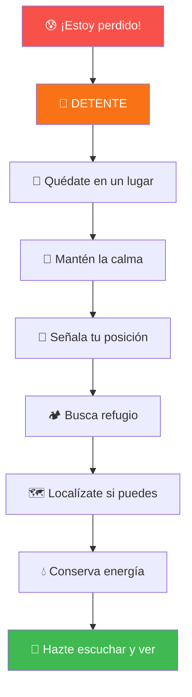
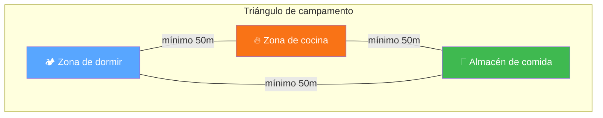

## Tu primer campamento

Esta guía te lleva paso a paso por un campamento de tres días. No es una lista de datos para memorizar - es una experiencia para vivir. Cada sección sigue el orden natural de un campamento real: primero planificas, luego aprendes lo que necesitas saber, después lo vives en el campo, y al final reflexionas.

Si eres instructor, usa esta guía como hilo conductor para enseñar. Si eres conquistador, léela como si estuvieras preparándote para tu próximo campamento - porque lo estás.

> **Sobre los requisitos:** Esta guía cubre los 10 requisitos de la especialidad Arte de Acampar (AR-001). Al final encontrarás una tabla que mapea cada requisito a la sección donde se desarrolla.

---

## Fase 1 - La reunión del sábado

*Tu consejero reúne a la unidad después del culto joven para planificar el campamento.*

---

### Elegir el lugar

*(Requisito 1)*

"Antes de empacar cualquier cosa, necesitamos saber adónde vamos", dice tu consejero mientras despliega un mapa sobre la mesa. "Y para elegir bien, hay tres cosas que siempre debemos considerar."

**El clima y el tiempo**

No es lo mismo acampar con sol que bajo lluvia. Tu consejero explica:

- Busca un lugar protegido del viento fuerte - detrás de rocas, árboles o colinas
- Evita zonas bajas donde se acumula el aire frío por la noche
- No acampes bajo árboles muertos o ramas que puedan caer
- Piensa en la dirección del sol: ¿quieres que te despierte temprano o prefieres sombra?

**La estación del año**

"¿En qué época vamos?", pregunta alguien. Importa:

| Estación | Qué buscar | Qué evitar |
|----------|-----------|------------|
| Verano | Sombra, brisa, agua cerca | Exposición directa al sol todo el día |
| Invierno | Protección del viento, orientación al sol | Zonas húmedas o expuestas |
| Primavera/Otoño | Versatilidad, refugio accesible | Confiar en un solo pronóstico - el clima cambia |

**Las fuentes de agua**

El agua es vida en un campamento, pero también puede ser un riesgo:

- Acampa **cerca** de agua potable (río, arroyo, lago) pero **no al lado** - mínimo 60 metros de distancia
- Esa distancia protege el ecosistema y te protege de crecidas nocturnas
- Verifica si el agua es segura o lleva método de purificación
- Si no hay fuente natural: mínimo 3 litros por persona por día

"Si no hay agua cerca y no podemos cargar suficiente, ese lugar no sirve. Busquemos otro", concluye tu consejero.

  
  
<em>Campamento scout en terreno plano y abierto - el tipo de lugar que buscas. (CC BY-SA 3.0, Fernando Lopez Anido)</em>

---

### Qué llevar puesto

*(Requisito 2)* **[PRÁCTICA REQUERIDA]**

"Ahora que sabemos adónde vamos, hablemos de ropa", dice tu consejero. "Vamos a armar dos listas: una para clima caliente y otra para frío. Dependiendo de adónde vayamos, usamos la que corresponda."

**Clima caliente**

| Prenda | Cantidad | Por qué |
|--------|----------|---------|
| Camisetas manga corta | 2-3 | Tela que respire, se secan rápido |
| Pantalón largo liviano | 1 | Protege de sol e insectos |
| Shorts | 1-2 | Para actividades en el campamento |
| Gorra o sombrero con ala | 1 | Protección solar |
| Ropa interior y calcetines | Cambio diario | Algodón, mantener higiene |
| Calzado cerrado + sandalias | 1+1 | Cerrado para caminar, sandalias para descanso |
| Sudadera liviana | 1 | Las noches refrescan |
| Lentes de sol | 1 | Protección UV |

**Clima frío**

| Prenda | Cantidad | Por qué |
|--------|----------|---------|
| Capa base térmica | 1 juego | Superior e inferior, mantiene calor |
| Camisetas manga larga | 2 | Capas intermedias |
| Pantalón grueso o trekking | 1 | Abrigo y resistencia |
| Chaqueta aislante | 1 | Plumas o sintética |
| Chaqueta impermeable | 1 | Capa externa contra viento y lluvia |
| Calcetines de lana | 2-3 pares | Los pies fríos arruinan todo |
| Gorro de lana | 1 | Cubre orejas |
| Guantes impermeables | 1 par | Manos secas = manos calientes |
| Botas impermeables | 1 par | Trekking, que cubran el tobillo |
| Muda seca en bolsa impermeable | 1 | Emergencia |

"El secreto es el **sistema de capas**", explica tu consejero. "Varias capas delgadas son mejor que una gruesa. Si tienes calor, te quitas una. Si tienes frío, te pones otra. Simple."

---

### Armar las listas de equipo

*(Requisito 5)* **[PRÁCTICA REQUERIDA]**

Tu consejero divide una pizarra en dos columnas: "Lo que llevas tú" y "Lo que lleva la unidad".

"No todo lo carga una persona. Nos organizamos."

**Tu mochila personal**

| Categoría | Artículos |
|-----------|-----------|
| Dormir | Saco de dormir, aislante/colchoneta, almohada pequeña |
| Higiene | Cepillo y pasta de dientes, jabón biodegradable, toalla de secado rápido, papel higiénico en bolsa plástica, repelente, protector solar |
| Documentos | Identificación, tarjeta de seguro médico, contactos de emergencia |
| Herramientas | Linterna frontal + pilas extra, navaja en funda, cantimplora, plato/taza/cubiertos, bolsas de basura, silbato |
| Espiritual | Biblia, materiales devocionales |

**Equipo de la unidad**

| Categoría | Artículos |
|-----------|-----------|
| Refugio | Carpas (calcular por persona), lona/toldo para área común, estacas y cuerdas extras, mazo |
| Cocina | Estufa/parrilla, combustible, ollas/sartenes, tabla de cortar, cuchillo de cocina, abrelatas, cooler, bidones de agua, fósforos en bolsa impermeable, lavavajillas biodegradable |
| Seguridad | Botiquín de primeros auxilios, mapa del área, brújula, radio o medio de comunicación, linterna grande |
| Herramientas | Hacha pequeña, sierra plegable, pala, cuerda de nylon (20-30m), cinta adhesiva |
| Documentos | Lista de participantes con contactos, permisos, itinerario, números de emergencia locales |

"Revisen esta lista antes de salir. Si falta algo, nos damos cuenta acá y no en el campo", dice tu consejero.

---

### Planificar el menú

*(Requisito 6)* **[PRÁCTICA REQUERIDA]**

"¿Quién cocina?", pregunta tu consejero. "Todos. Vamos a armar el menú juntos."

Un buen menú de campamento es **balanceado, práctico y posible de cocinar en fogata o estufa portátil**. Necesitas los cinco grupos: granos, proteínas, frutas/vegetales, lácteos y grasas saludables.

**Ejemplo para un día completo:**

| Comida | Menú | Grupos cubiertos |
|--------|------|------------------|
| **Desayuno** | Avena con pasas y nueces, huevos revueltos, pan tostado, fruta fresca, jugo | Granos, proteínas, grasas, frutas |
| **Almuerzo** | Sándwiches variados, vegetales crudos (zanahoria, pepino), galletas, fruta, trail mix | Granos, proteínas, vegetales, grasas |
| **Cena** | Arroz o pasta, lentejas o hamburguesas vegetarianas a la parrilla, ensalada, pan, fruta asada de postre | Granos, proteínas, vegetales |
| **Snacks** | Trail mix, barras energéticas, frutas secas | Energía sostenida durante el día |

**Principios para el menú:**

- Más actividad física = más calorías necesarias
- Alimentos no perecederos para días 2-3, perecederos en cooler para día 1
- Considera restricciones alimentarias del grupo (vegetarianos, alergias)
- **Hidratación:** mínimo 3 litros por persona/día, más si hace calor

"Cada pareja de conquistadores se encarga de una comida. Así todos participan y todos aprenden", cierra tu consejero.

---

## Fase 2 - Antes de salir

*Es sábado de tarde. La unidad se reúne para practicar tres cosas que necesitan saber antes de ir al campo. Tu consejero dice: "En el campo no hay hospital a cinco minutos. Lo que aprendan hoy puede evitar un accidente."*

---

### Reglas de seguridad

*(Requisito 3)* **[PRÁCTICA REQUERIDA]**

Tu consejero repasa las reglas una por una. "Estas no son sugerencias. Son reglas."

**Ubicación del campamento:**
- Nunca bajo árboles secos o con ramas muertas
- Lejos de hormigueros, panales o nidos
- No en lechos secos de ríos - pueden llenarse de golpe
- Terreno plano y bien drenado

**Fuego:**
- Fogata pequeña y controlada
- Limpiar hojas y ramas en un radio de 2 metros
- NUNCA dejar fuego sin supervisión
- Apagar completamente antes de dormir o salir

**Herramientas cortantes:**
- Cortar siempre alejando la hoja de tu cuerpo
- Entregar por el mango, nunca por la hoja
- Guardar en funda cuando no se usen

**Comida y animales:**
- Guardar alimentos en recipientes cerrados
- Colgar comida lejos del campamento si hay animales grandes
- Lavar platos inmediatamente después de comer

**Sistema de compañeros:**
- NUNCA ir solo a ningún lado
- Informar al grupo si te alejas
- 3 silbidos = emergencia

**Clima:**
- Revisar pronóstico antes y durante
- Tener plan de emergencia
- Saber dónde refugiarse en tormenta eléctrica

**Primeros auxilios:**
- Siempre llevar botiquín
- Conocer la ubicación del centro médico más cercano
- Informar alergias o condiciones médicas al grupo

---

### El cuchillo y la leña

*(Requisito 4)* **[PRÁCTICA REQUERIDA]**

"Saquen sus cuchillos", dice tu consejero. "Hoy aprenden a usarlos bien."

**El círculo de seguridad**

Antes de cualquier corte: extiende tu brazo con el cuchillo y gira 360°. Nadie debe estar dentro de ese radio. Si alguien entra, detén todo.

**Reglas de corte:**
- SIEMPRE corta alejándote de tu cuerpo
- Sostén firme el mango completo - pulgar de un lado, cuatro dedos del otro
- Nunca pongas el dedo índice sobre el lomo de la hoja
- Para transportar: funda puesta. Para entregar: por el mango
- Un cuchillo afilado es más seguro que uno desafilado - el desafilado resbala

**Preparar leña para fogata**

Tu consejero pone tres montones en el suelo. "Para hacer fuego necesitan tres tamaños de madera. Sin los tres, no funciona."

  
  
<em>Leña organizada y lista para armar la fogata. (CC BY-SA 3.0, Alex Zelenko)</em>

| Tipo | Grosor | Largo | Para qué |
|------|--------|-------|----------|
| **Yesca** | Grosor de fósforo o menos | Libre | Prende con chispa. Corteza seca, hojas, virutas finas |
| **Leña pequeña** | De lápiz a dedo | 15-20 cm | Alimenta el fuego inicial |
| **Leña grande** | Grosor de muñeca | 30-40 cm | Mantiene el fuego encendido |

**Técnica de corte:** apoya la rama en un tronco estable, haz cortes en ángulo (nunca directos), deja que el peso del cuchillo haga el trabajo.

"Practiquen en casa. El día del campamento no es momento de aprender esto por primera vez."

---

### Qué hacer si te pierdes

*(Requisito 8)*

"Ahora lo más importante", dice tu consejero. "¿Qué hacen si se pierden en el campo?"

Alguien responde: "Caminar hasta encontrar el camino." Tu consejero niega con la cabeza.

"Eso es exactamente lo que NO haces. Caminar más solo te aleja más."

**Los 8 pasos:**

1. **DETENTE** - En cuanto te das cuenta que estás perdido, para. Siéntate.

2. **QUÉDATE EN UN LUGAR** - Es mucho más fácil encontrarte si estás quieto. Busca un lugar visible: claro del bosque, al lado de un árbol grande.

3. **MANTÉN LA CALMA** - El pánico te hace tomar malas decisiones. Respira profundo. Te van a buscar. La mayoría de personas perdidas se encuentran en 24-48 horas.

4. **SEÑALA TU POSICIÓN** - Usa tu silbato: 3 silbidos = emergencia. Repite cada 5-10 minutos. Cuelga ropa de colores brillantes en una rama alta. Si tienes espejo, usa reflejos de sol. Forma SOS con piedras o ramas en área abierta.

5. **BUSCA O CONSTRUYE REFUGIO** - Protégete del sol, viento o lluvia. Bajo un árbol caído, entre rocas grandes. No gastes mucha energía en algo elaborado.

6. **LOCALÍZATE SI PUEDES** - ¿Cuándo notaste que estabas perdido? ¿Qué puntos de referencia viste? Si tienes mapa y brújula, intenta ubicarte. Pero NO sigas caminando "buscando el camino".

7. **CONSERVA ENERGÍA Y RECURSOS** - Raciona el agua. No comas plantas desconocidas. Descansa.

8. **HAZTE ESCUCHAR Y VER** - Si escuchas voces, grita fuerte. Si escuchas helicóptero, sal a área abierta y mueve los brazos. Por la noche, mantén fogata si sabes hacerla con seguridad.

**Prevención:** NUNCA te separes del grupo. Sistema de compañeros. Lleva siempre silbato, agua y algo de abrigo.

> **Regla del 3:** 3 minutos sin aire, 3 horas sin refugio (clima extremo), 3 días sin agua, 3 semanas sin comida. Prioridad: refugio y temperatura corporal antes que comida.

---

## Fase 3 - Tres días en el campo

*Es viernes temprano. La unidad carga las mochilas en el vehículo. Hay nervios, hay emoción. Tu consejero revisa la lista una última vez: "¿Todos tienen su equipo? ¿Botiquín? ¿Agua extra?" Sí. Vamos.*

---

### Preparar el terreno

*(Requisito 7a)* **[PRÁCTICA REQUERIDA]**

Llegan al lugar. Lo primero: elegir dónde poner las carpas.

Tu consejero camina el terreno señalando: "Acá no - hay una raíz grande. Acá tampoco - es una depresión, se acumula agua si llueve. Acá sí - plano, ligeramente elevado, sin piedras."

**Pasos para preparar el terreno:**

1. **Elegir:** Terreno plano, sin piedras ni raíces, ligeramente elevado para drenaje
2. **Limpiar:** Quitar piedras, piñas, palos. El área debe ser un poco más grande que la carpa
3. **Nivelar:** Si hay desnivel ligero, la cabeza va en la parte alta. Rellenar huecos con tierra suelta. Nunca cavar zanjas - daña el ecosistema
4. **Proteger el suelo:** Colocar lona protectora antes que la carpa. Debe ser del tamaño exacto o más pequeña que la carpa
5. **Orientar:** Puerta lejos del viento dominante. Hacia el sol si quieres calor temprano; lejos si quieres dormir más

---

### Armar la carpa

*(Requisito 7b)* **[PRÁCTICA REQUERIDA]**

"¿Quién ha armado una carpa antes?" Pocas manos se levantan. "Perfecto. Hoy todos aprenden."

**Pasos generales:**

1. **Extender** - Saca todo de la bolsa. Identifica piezas: carpa interna, techo (rainfly), estacas, varillas
2. **Armar estructura** - Ensambla varillas, insértalas en fundas o clips, arquéalas para dar forma
3. **Estaquear** - Comienza por esquinas opuestas. Estacas en ángulo de 45° alejándose de la carpa. Tensa uniformemente
4. **Colocar techo** - El sobretecho debe quedar separado de la carpa interna (ventilación). Asegura con clips y estaca los tensores
5. **Ajustes** - Verifica que esté tensa y simétrica. Prueba abrir y cerrar puertas y ventanas

"Practiquen armar su carpa EN CASA antes de un campamento. Llegar al campo de noche y no saber armarla no es divertido para nadie."

  
  
<em>Carpa tipo domo correctamente armada en terreno plano y despejado. (CC BY-SA 4.0, ModalPeak)</em>

---

### La fogata

*(Requisito 7c)* **[PRÁCTICA REQUERIDA]**

Con las carpas listas, es hora de preparar el área de fogata. "¿Qué tipo de fogata armamos?", pregunta alguien. Tu consejero explica que hay varios tipos, y cada uno tiene su uso:

<strong style="display:block; color:var(--primary-color); font-size:0.95rem;">Tipi</strong>
Cono de leña. Calienta e ilumina. La más común para principiantes.

<strong style="display:block; color:var(--primary-color); font-size:0.95rem;">Cabaña</strong>
Troncos en cuadrado. Brasas parejas - ideal para cocinar.

<strong style="display:block; color:var(--primary-color); font-size:0.95rem;">Estrella</strong>
Troncos en estrella, se empujan al centro. Dura mucho, poco mantenimiento.

<em>Dominio público, Jazzmanian</em>

**Ubicación:**
- Mínimo 5 metros de las carpas
- Lejos de árboles, arbustos, pasto seco
- Protegida del viento pero con ventilación
- En suelo mineral (tierra, arena, roca) o área designada

**Preparación:**

1. Limpiar un radio de 2-3 metros - quitar todo material inflamable
2. Crear círculo de piedras (30-40 cm de diámetro). NO usar piedras de río - pueden explotar con el calor
3. Tener lista la leña en tres tamaños (lo que practicaron en la Fase 2)
4. Preparar más leña de la que crees necesitar
5. Nunca cortar árboles vivos - solo madera caída y seca

**Equipamiento de seguridad cerca:**
- Balde con agua
- Pala para echar tierra
- Guantes
- Palo largo para mover troncos

> **Regla de oro:** Si no puedes apagar el fuego completamente con los recursos disponibles, NO lo enciendas.

---

### Proteger el campamento

*(Requisito 7d)* **[PRÁCTICA REQUERIDA]**

La primera noche siempre trae sorpresas. Tu consejero anticipa: "La naturaleza no se adapta a nosotros. Nosotros nos adaptamos a ella."

**Contra animales:**
- NUNCA guardar comida en la carpa donde duermes
- Colgar comida en un árbol: 3-4 metros de altura, 1 metro del tronco
- Lavar platos inmediatamente después de comer
- Guardar jabón, pasta de dientes y bloqueador junto con la comida - los olores atraen animales

**Contra insectos:**
- Repelente en piel expuesta, especialmente al amanecer y atardecer
- Ropa de manga larga en las horas de más mosquitos
- Cerrar carpas completamente - revisar mosquiteros
- Eliminar agua estancada cerca (mosquitos se reproducen ahí)
- Revisar ropa y zapatos antes de ponértelos (escorpiones, arañas)

**Contra mal tiempo y lluvia:**
- Asegurar estacas y tensores de las carpas
- Verificar que el techo no toque la carpa interna
- Todo el equipo en bolsas impermeables
- Lona extra para cubrir zona de cocina

**En tormenta eléctrica:**
- Entrar a la carpa (más seguro que estar afuera)
- Alejarse de árboles altos aislados
- Si estás afuera: agáchate con pies juntos, no te acuestes
- Esperar 30 minutos después del último trueno

---

### Vivir el campamento

*(Requisito 9)* **[PRÁCTICA REQUERIDA]**

Tres días, dos noches. Este es el corazón de la especialidad.

**Día 1 - Llegada:**
- Armar carpas y organizar campamento
- Preparar área de fogata
- Guardar comida de manera segura
- Primera cena juntos - tu turno de participar en la cocina

**Día 2 - Día completo en el campo:**
- Desayuno en campamento
- Actividades: caminatas, juegos, devocional
- Almuerzo
- Tarde libre o más actividades
- Cena - tu segunda comida preparando
- Fogata nocturna

**Día 3 - Cierre:**
- Desayuno
- Desarmar campamento
- Limpieza del área
- Regreso

**Participación en comidas:** Debes participar activamente en al menos 2 comidas. Esto incluye preparar la fogata, cortar ingredientes, cocinar, servir, lavar platos y guardar sobrantes.

"No se trata solo de estar tres días afuera", dice tu consejero durante el devocional del segundo día. "Se trata de aprender a convivir, a servir, a confiar en tus compañeros y en Dios."

  
  
<em>Fogata nocturna - el corazón del campamento. (CC BY-SA 2.0, Leon Bovenkerk)</em>

---

## Fase 4 - Volver a casa

*Tercer día. El sol sale y el campamento se siente distinto - ya no es nuevo, es familiar. Pero es hora de irse. Y la forma en que te vas importa tanto como la forma en que llegaste.*

---

### No dejar rastro

*(Requisito 7e)* **[PRÁCTICA REQUERIDA]**

Tu consejero reúne a la unidad: "Vamos a dejar este lugar como si nunca hubiéramos estado. Mejor todavía: más limpio que cuando llegamos."

**Principios de "No Dejar Rastro":**

1. **Basura** - LLEVA TODO lo que trajiste. Recoge TODA la basura, incluso la que no es tuya. Empaca cáscaras, semillas, restos orgánicos
2. **Fogata** - Quema toda la leña hasta cenizas. Apaga con agua, revuelve, más agua. Cenizas frías se esparcen lejos. Si creaste anillo de piedras, desármalo
3. **Vida silvestre** - Observa desde lejos. NUNCA alimentes animales silvestres
4. **Sanitarios** - Usa baños si existen. Si no: hueco de 15-20 cm, a 60 metros del agua. Tapa completamente
5. **Plantas** - No cortes árboles ni arbustos vivos. No arranques flores. Usa solo madera caída

**Al desarmar:**
- Inspeccionar toda el área en cuadrícula
- Recoger cada pedacito de basura, cuerda, estaca olvidada
- Aplanar áreas donde dormiste
- Esparcir hojas o agujas de pino para cubrir zonas compactadas

> "Toma solo fotografías, deja solo huellas, mata solo el tiempo."

---

### El Código de Campamentos

*(Requisito 10)*

De vuelta en el vehículo, tu consejero saca una tarjeta y lee:

> *"Por la gracia de Dios, seré:*
> - *Considerado con todos los campistas*
> - *Obediente a los reglamentos del campamento*
> - *Limpio en mi cuerpo, pensamientos y lenguaje*
> - *Cuidadoso con todo el material del campamento*
> - *Cortés y cooperador*
> - *Agradecido por el mundo que Dios me dio"*

"Hace tres días esto eran solo palabras. Ahora ustedes saben lo que significan porque lo vivieron."

**Considerado** - Compartiste espacio, fuiste paciente aunque estabas cansado. Respetar a otros en convivencia no es fácil, y lo hiciste.

**Obediente** - Seguiste las reglas de seguridad. No porque alguien te obligó, sino porque entiendes que protegen a todos.

**Limpio** - Mantuviste higiene personal en el campo. Cuidaste tu lenguaje. Mantuviste tu mente en cosas que edifican.

**Cuidadoso** - Trataste el equipo prestado con respeto. Lo devolviste limpio y en buen estado.

**Cortés y cooperador** - Ayudaste sin que te lo pidieran. Participaste en las tareas con buena actitud.

**Agradecido** - Viste la creación de Dios de cerca. La cuidaste. La valoraste.

"Este código no es una lista de reglas", dice tu consejero. "Es un recordatorio de quiénes queremos ser - en el campo y fuera de él."

---

## Referencia

### Mapa de requisitos

| Requisito | Tema | Fase | Sección |
|-----------|------|------|---------|
| 1 | Elegir lugar (clima, estaciones, agua) | Fase 1 | Elegir el lugar |
| 2 | Listas de ropa | Fase 1 | Qué llevar puesto |
| 3 | Reglas de seguridad | Fase 2 | Reglas de seguridad |
| 4 | Uso de cuchillo y preparar leña | Fase 2 | El cuchillo y la leña |
| 5 | Equipo personal y grupal | Fase 1 | Armar las listas de equipo |
| 6 | Menú balanceado | Fase 1 | Planificar el menú |
| 7a | Preparar terreno | Fase 3 | Preparar el terreno |
| 7b | Armar carpa | Fase 3 | Armar la carpa |
| 7c | Área de fogata | Fase 3 | La fogata |
| 7d | Protección del campamento | Fase 3 | Proteger el campamento |
| 7e | No dejar rastro | Fase 4 | No dejar rastro |
| 8 | Qué hacer si te pierdes | Fase 2 | Qué hacer si te pierdes |
| 9 | Campamento de 3 días/2 noches | Fase 3 | Vivir el campamento |
| 10 | Código de Campamentos | Fase 4 | El Código de Campamentos |

---

## 📚 Referencias y recursos adicionales

- [**Manual No Deje Rastro**](https://drive.google.com/file/d/1g8IEtGrYmk0_mk2vqykZfZ24QE7lniC_/view) - Sendero de Chile / NOLS / CONAMA. Los 7 principios de mínimo impacto adaptados a Chile (22 páginas)
- [**Leave No Trace**](https://lnt.org/why/7-principles/) - Los 7 principios originales en inglés
- [**Pathfinders Online - Camp Craft**](https://wiki.pathfindersonline.org/honors/camping/camp-craft) - Referencia de la especialidad en inglés

**Aplicaciones útiles:**
- [Maps.me](https://maps.me/) - Mapas offline
- [PlantNet](https://plantnet.org/) - Identificación de plantas
- [Cruz Roja - Primeros Auxilios](https://play.google.com/store/apps/details?id=com.cube.arc.fa) - App de primeros auxilios

---

## ✅ Notas para el instructor

**Requisitos prácticos obligatorios:**
- Req 2: Listas de ropa preparadas por el conquistador
- Req 4: Demostración de uso seguro de cuchillo y preparación de leña
- Req 5: Listas de equipo preparadas por el conquistador
- Req 6: Menú planificado por el conquistador
- Req 7a-e: Todas las habilidades demostradas en campamento real
- Req 9: Campamento de 3 días/2 noches obligatorio, con participación en al menos 2 comidas

**Cómo evaluar:**
- Observar al conquistador durante todo el campamento
- Verificar participación activa en tareas
- Confirmar que conoce y aplica reglas de seguridad
- Evaluar actitud de servicio y cuidado del ambiente

**Sugerencias pedagógicas:**
- Practicar habilidades múltiples veces antes del campamento de evaluación
- Hacer campamentos cortos (1 noche) como preparación
- Involucrar a conquistadores en toda la planificación
- Enfatizar el aspecto espiritual: Dios se revela en la naturaleza

**Seguridad:**
- Supervisar siempre el uso de herramientas cortantes
- Verificar que todos conocen señales de emergencia (3 silbidos)
- Mantener botiquín accesible
- Revisar condiciones climáticas regularmente
- Establecer sistema de compañeros antes de iniciar actividades

---

*Manual de Especialidades - Club de Conquistadores - División Sudamericana*
