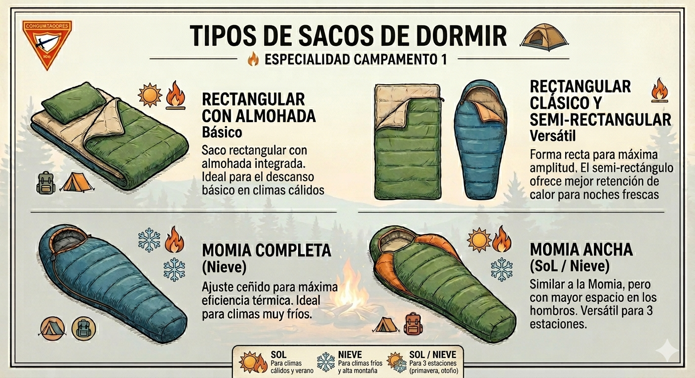

## Tu primer campamento de verdad

> **Esta guía es el Tomo I de la serie Campamento.** Si no has hecho la especialidad [Arte de Acampar](arte_de_acampar.md), te recomendamos leerla primero - es el prólogo de esta historia.

Ya sabes lo básico. Ya fuiste a un campamento con tu unidad, aprendiste a elegir un lugar, armar una carpa, hacer una fogata y cuidar la naturaleza. Ahora viene lo siguiente: un campamento de fin de semana completo, de viernes a domingo, donde vas a dormir dos noches en el campo, cocinar tus propias comidas, y descubrir que acampar es mucho más que sobrevivir al aire libre.

Tu consejero reúne a la unidad: "Este campamento va a ser distinto. Van a tener más responsabilidad. Van a aprender a usar el hacha, a encender fuego con un solo fósforo, a cocinar pan en un palo. Y el sábado, vamos a tener culto al aire libre."

---

## Fase 1 - Prepararse de verdad

*Una semana antes del campamento. Tu consejero convoca una reunión especial: "Esta vez no basta con meter cosas en la mochila. Vamos a prepararnos bien."*

---

### Elegir tu equipo para dormir

*(Requisito 3)*

"¿Qué saco de dormir tienen?", pregunta tu consejero. Algunos muestran el suyo. "No todos los sacos sirven para todo. Depende de dónde vamos y cuánto frío va a hacer."

**Sacos de dormir por temperatura:**

| Tipo | Rango | Cuándo usarlo |
|------|-------|---------------|
| Verano | +5°C o más | Noches cálidas, campamentos de temporada |
| 3 estaciones | -5°C a +10°C | El más versátil, sirve casi siempre |
| Invierno | -10°C o menos | Montaña, nieve, frío extremo |

**Por forma:**

**Por relleno:**
- **Sintético:** Más barato, funciona aunque se moje, se seca rápido. Más pesado.
- **Plumas/plumón:** Más caliente y liviano, pero NO funciona mojado y cuesta más.

**El aislante (colchoneta):**

"El frío del suelo te enfría más que el aire", explica tu consejero. "Sin aislante, tu saco de dormir no sirve de nada."

| Tipo | Ventaja | Desventaja |
|------|---------|------------|
| Espuma (foam) | Barata, no se pincha, liviana | Menos cómoda |
| Inflable | Muy cómoda, compacta | Puede pincharse, más cara |
| Auto-inflable | Buen balance | Precio intermedio |

<strong style="display:block; color:var(--primary-color); font-size:0.95rem;">Espuma (foam)</strong>
Económica y confiable. No se pincha.

<strong style="display:block; color:var(--primary-color); font-size:0.95rem;">Auto-inflable</strong>
Balance entre comodidad y precio.

<em>CC BY-SA 4.0, Superbass</em>

**Cómo elegir:** Revisa la temperatura mínima esperada y agrega margen. Si el pronóstico dice 0°C, lleva equipo para -5°C. Si va a llover, sintético es mejor opción.

---

### Tu lista de equipo

*(Requisito 4)*

> Ya armaste una lista básica en [Arte de Acampar](arte_de_acampar.md#armar-las-listas-de-equipo). Ahora la refinamos para un fin de semana completo.

Tu consejero reparte una hoja con la lista organizada:

**Para dormir:**

| Artículo | Por qué |
|----------|---------|
| Saco de dormir apropiado | Según temperatura esperada |
| Aislante/colchoneta | Aísla del frío del suelo |
| Almohada pequeña (o ropa enrollada) | Comodidad |

**Ropa (para 2 noches):**

| Artículo | Cantidad |
|----------|----------|
| Mudas completas | 2-3 |
| Abrigo extra (sudadera/chaqueta) | 1 |
| Impermeable | 1 |
| Calcetines extras | 2-3 pares |
| Ropa para dormir (limpia, seca) | 1 muda |
| Calzado cerrado + sandalias | 1+1 |
| Gorro y guantes (si hace frío) | 1 |

**Higiene, herramientas, documentos y devocional:** misma lista que en Arte de Acampar, más jabón biodegradable extra, gel antibacterial y bolsas plásticas de sobra.

"Revisen todo el jueves antes de salir. Si falta algo, todavía hay tiempo", dice tu consejero.

---

### Ropa para dormir y mantenerse caliente

*(Requisito 12)*

"Una cosa que nadie les dice hasta que la sufren", dice tu consejero: "la ropa que usaste en el día NO es la ropa para dormir. La ropa del día está sudada, y la humedad te enfría."

**Qué usar para dormir:**

| Clima | Ropa |
|-------|------|
| Templado/cálido | Camiseta de algodón, pantalón liviano, calcetines limpios |
| Frío | Capa base térmica completa, manga larga, calcetines de lana, gorro |

**Qué NO usar:** ropa del día (sudada), ropa muy apretada (corta circulación), ropa mojada, zapatos dentro del saco.

**Cómo mantenerse caliente por la noche:**

1. **Come bien antes de dormir** - una cena caliente genera calor corporal. Los carbohidratos ayudan.
2. **Ve al baño** - mantener la vejiga llena gasta energía en calentarla.
3. **Haz ejercicio ligero** - 20 sentadillas antes de meterte al saco. Genera calor sin sudar.
4. **Afloja tu saco 30 minutos antes** - se esponja y aísla mejor.
5. **Cierra bien el saco** - ajusta el cordón de la cabeza. Sin corrientes de aire.
6. **Botella de agua caliente** - envuélvela en un calcetín y ponla a tus pies.
7. **No respires dentro del saco** - tu aliento crea humedad, y la humedad enfría.
8. **Si tienes frío en la noche** - come un snack calórico (chocolate, frutos secos). Tu cuerpo genera calor al digerir.

---

## Fase 2 - Habilidades que necesitas

*El consejero dedica dos reuniones a practicar habilidades. "En el campo no hay segunda oportunidad. Lo que aprendan ahora les va a servir de verdad."*

---

### Los 7 principios de No Dejar Rastro

*(Requisito 1)* **[PRÁCTICA REQUERIDA]**

> Ya conoces la idea general de [No Dejar Rastro](arte_de_acampar.md#no-dejar-rastro). Ahora aprenderás los 7 principios formales del programa, creado por NOLS y el Servicio Forestal de Estados Unidos.

Tu consejero escribe los 7 principios en una pizarra:

1. **Planifica y prepárate** - Conoce el área, lleva lo necesario, empaca para llevarte tu basura.
2. **Viaja y acampa en superficies durables** - Senderos establecidos, sitios ya usados. No crees caminos nuevos.
3. **Dispón adecuadamente los desechos** - "Lo que llevas, lo regresas." Desechos humanos: hoyo de 15-20 cm, a 60m del agua.
4. **Deja lo que encuentres** - No arranques plantas, no lleves piedras ni conchas. Toma solo fotos.
5. **Minimiza el impacto de fogatas** - Usa estufa cuando puedas. Si haces fogata, quema todo hasta cenizas y apaga completamente.
6. **Respeta la vida silvestre** - Observa desde lejos, no alimentes animales, protege tu comida.
7. **Sé considerado con otros visitantes** - Ruido bajo, respeta otros campistas, deja los mejores lugares para quienes vienen después.

"Estos principios no son reglas que alguien inventó porque sí", explica tu consejero. "Nacieron porque áreas naturales se estaban destruyendo por visitantes descuidados."

> **Para profundizar:** El [Manual No Deje Rastro](https://drive.google.com/file/d/1g8IEtGrYmk0_mk2vqykZfZ24QE7lniC_/view) de Sendero de Chile (NOLS/CONAMA) desarrolla cada principio en detalle.

---

### Qué hacer si te pierdes

*(Requisito 2)*

> Ya aprendiste el protocolo de 8 pasos en [Arte de Acampar](arte_de_acampar.md#qué-hacer-si-te-pierdes). Acá lo repasamos con el acrónimo S.T.O.P. que es más fácil de recordar bajo presión.

Tu consejero pregunta: "¿Se acuerdan qué hacer si se pierden?" Varios levantan la mano. "Bien. Ahora se los voy a enseñar de una forma que nunca van a olvidar."

**S.T.O.P.**

| Letra | Significado | Acción |
|-------|-------------|--------|
| **S** | Sit (Siéntate) | Para de moverte. Siéntate. Caminar más solo te aleja. |
| **T** | Think (Piensa) | Calma. Respira. ¿Cuándo te perdiste? ¿Qué recuerdas? |
| **O** | Observe (Observa) | Mira alrededor. Escucha. Busca algo familiar. |
| **P** | Plan (Planea) | Quédate donde estás. Señaliza. Busca refugio. |

Después de STOP: **señala tu posición** (3 silbidos = emergencia), **busca refugio**, **conserva energía**, y **hazte escuchar y ver** si escuchas búsqueda.

**Prevención:** sistema de compañeros SIEMPRE, silbato en el cuello, avisa si te alejas.

---

### El cuchillo y el hacha

*(Requisito 8)* **[PRÁCTICA REQUERIDA]**

> Ya aprendiste a usar el cuchillo en [Arte de Acampar](arte_de_acampar.md#el-cuchillo-y-la-leña). Ahora sumamos el hacha y aprendemos las 10 reglas de seguridad formales.

"Hoy vamos a practicar con el hacha", dice tu consejero. "Es una herramienta seria. Merece respeto."

**Las 10 reglas de seguridad:**

1. **Círculo de seguridad** - Extiende brazo con herramienta, gira 360°. Nadie adentro.
2. **Condición de la herramienta** - Afilada (no resbala), mango sin astillas, cabeza firme.
3. **Dirección de corte** - SIEMPRE alejándote del cuerpo. Nunca hacia piernas o pies.
4. **Superficie de trabajo** - Estable, firme, despejada. Nunca en el aire.
5. **Transporte** - Cuchillo en funda. Hacha: cabeza abajo, mano cerca de la cabeza, filo alejado.
6. **Atención completa** - No converses mientras cortas. No trabajes cansado.
7. **Almacenamiento** - Cuchillo en funda. Hacha clavada en tronco o en funda. NUNCA en el suelo.
8. **Posición del cuerpo** - Pies separados, rodillas flexionadas, balance estable.
9. **Zona protegida** - Zapatos cerrados, pantalones largos, nadie caminando por tu área.
10. **Respeto por la herramienta** - No es juguete. Úsala solo para su propósito. Limpia después de usar.

**Usar el hacha:**

<em>Postura correcta: pies separados, espalda recta, leña sobre tronco base. (CC BY-SA 4.0, Jay.Jarosz)</em>

Tu consejero demuestra:
- **Agarre:** Mano dominante al final del mango, la otra cerca de la cabeza. Al bajar, la mano de arriba resbala hacia abajo.
- **Cortar leña:** Siempre sobre tronco base estable. Pies separados. Deja que el peso del hacha haga el trabajo.
- **Partir leña:** Golpe vertical en el centro. Si se atora, levanta hacha y leña juntos, golpea de nuevo. NUNCA uses otra hacha para golpear la que está atascada.

---

### Cómo usar los fósforos

*(Requisito 9c)*

"Parece obvio, pero la mayoría de los incendios accidentales en campamento empiezan por mal uso de fósforos", dice tu consejero.

**Almacenamiento:** recipiente impermeable, lejos de calor, separados de combustibles.

<em>Raspa siempre alejándote del cuerpo. (CC BY 2.0, Emilian Robert Vicol)</em>

**Técnica correcta:**

1. Ten la yesca lista ANTES de sacar el fósforo
2. Protege del viento con tu cuerpo
3. Cierra la caja antes de raspar
4. Raspa ALEJÁNDOTE de tu cuerpo
5. Inclina el fósforo para que la llama suba por la madera
6. Acerca rápido a la yesca, protege la llama con la mano en copa
7. Para apagarlo: sacude, toca para verificar que esté frío, descarta en agua o área segura

"Vamos a practicar ahora. Quiero que cada uno encienda una llama con un solo fósforo. Esto es preparación para lo que viene en el campamento."

---

## Fase 3 - Viernes a domingo

*Viernes por la tarde. Llegan al lugar. Las mochilas pesan más que la otra vez porque llevan más equipo. Pero también saben más. Tu consejero mira al grupo: "Esto es un campamento de verdad. Vamos."*

---

### Armar campamento

*(Requisitos 5, 6)* **[PRÁCTICA REQUERIDA]**

> Ya sabes [preparar terreno y armar carpa](arte_de_acampar.md#preparar-el-terreno). Ahora sumamos las normas de prevención de incendios después de armar.

Arman las carpas. Tu consejero revisa cada una y luego señala algo que no cubrieron la vez pasada:

**Prevención de incendios después de armar:**

- **Distancia de fogata:** mínimo 5 metros. Nunca a favor del viento.
- **Distancia de cocina:** cocina FUERA de la carpa, NUNCA adentro. Mínimo 2-3 metros.
- **Dentro de la carpa:** NUNCA velas ni linternas de gas. Solo LED o pilas. No guardes combustibles.
- **Salidas de emergencia:** no bloquees puertas con equipo. Linterna accesible de noche.

"Si tu carpa prende fuego, SAL. No intentes salvar equipo. Sal y avisa al grupo."

---

### La fogata: un solo fósforo

*(Requisitos 9a, 9b, 9d)* **[PRÁCTICA REQUERIDA]**

> La preparación de lugar y leña la aprendiste en [Arte de Acampar](arte_de_acampar.md#la-fogata). Hoy viene el desafío: encender con un solo fósforo.

Tu consejero se para frente al círculo de piedras limpio y dice: "Hoy cada uno va a encender una fogata. Con un solo fósforo. Si falla, analizan qué salió mal y vuelven a intentar."

**Preparación (la clave del éxito):**

1. Recolecta materiales SECOS. Prueba: si se rompe con "crack", está seco. Si se dobla, está húmedo.
2. Organiza por tamaño: un puño de yesca, dos puños de combustible (grosor de fósforo a dedo), 10-15 piezas de leña (grosor de muñeca).

**Materiales que sirven de yesca:**

| Material | Dónde encontrarlo | Efectividad |
|----------|-------------------|-------------|
| Corteza seca (cedro, abedul) | Se pela de troncos caídos | Excelente |
| Agujas de pino secas | Suelo del bosque | Buena |
| Pasto seco | Campos, bordes de sendero | Buena |
| Hojas secas crujientes | Suelo (no las mohosas) | Regular |
| Virutas de madera | Las haces con cuchillo | Excelente |
| Algodón (bolitas) | Llevar de casa | Excelente |
| Papel seco (servilletas) | Llevar de casa | Buena |
| Pelusa de bolsillos/secadora | Llevar de casa en bolsa | Excelente |
| Algodón con vaselina | Preparar en casa | La mejor - arde 3-5 minutos |

"El truco del algodón con vaselina es imbatible", dice tu consejero. "Prepárenlo en casa: bolitas de algodón embebidas en vaselina, guardadas en bolsa plástica. Arden aunque esté húmedo afuera."

**Tipos de fogata:**

El tipi es la que mejor funciona con un fósforo, pero hay otros tipos para distintos usos:

<strong style="display:block; color:var(--primary-color); font-size:0.95rem;">Tipi</strong>
La mejor para un fósforo. Calienta e ilumina.

<strong style="display:block; color:var(--primary-color); font-size:0.95rem;">Cabaña</strong>
Brasas parejas. Ideal para cocinar.

<strong style="display:block; color:var(--primary-color); font-size:0.95rem;">Estrella</strong>
Larga duración, poco mantenimiento.

<em>Dominio público, Jazzmanian. Más detalle en <a href="arte_de_acampar.md#la-fogata">Arte de Acampar</a>.</em>

**Construir fogata tipo tipi (la que mejor funciona con un fósforo):**

1. Puño de yesca en el centro
2. Tipi pequeño de combustible alrededor - deja una "puerta" para meter el fósforo
3. Tipi más grande de leña alrededor - deja espacios para flujo de aire

**Encender:**

1. Protege del viento
2. Enciende el fósforo correctamente
3. Mete por la "puerta" del tipi
4. Aplica a la yesca en la base
5. Mantén hasta que prenda bien
6. Cuando el combustible arda, agrega leña gradualmente - no mucho de golpe

"Más yesca es siempre mejor. Si en duda, agrega más yesca", dice tu consejero.

**Reglas de seguridad del fuego:**
- NUNCA sin supervisión
- No agregues plástico ni basura
- No rocíes líquidos inflamables
- Ten agua cerca siempre
- Para apagar: agua, revuelve, más agua. Si no puedes poner la mano en las cenizas, NO está apagado.

---

### Proteger la leña

*(Requisito 9e)*

Esa noche empieza a llover. Tu consejero señala la leña que quedó afuera: "¿Ven? Por eso siempre protegemos la leña ANTES de que llueva."

<em>Leña apilada y protegida bajo techo - siempre seca y lista. (CC0, Ryan Graybill)</em>

**Métodos:**
- **Lona inclinada** sobre ramas o entre árboles. Leña apilada debajo, elevada del suelo.
- **Cubrir la pila** con lona impermeable, asegurada con piedras. Dejar ventilación abajo.
- **Refugio natural** - bajo árbol con follaje denso, saliente de roca.
- **Apilado inteligente** - leña grande abajo (sacrificable), seca arriba y al centro, corteza arriba (repele agua).

**Si la leña ya está mojada:** corta la capa externa. El centro generalmente está seco. Haz virutas de la madera interna. Usa más yesca y ten paciencia.

---

### Higiene en campamento

*(Requisito 7)* **[PRÁCTICA REQUERIDA]**

A la mañana siguiente, tu consejero reúne al grupo antes del desayuno: "Estamos en el campo, no en la selva. La higiene no es opcional."

**Higiene personal:**
- **Manos:** lava antes de cocinar/comer, después del baño. Jabón biodegradable o gel antibacterial.
- **Baño:** balde con agua y jabón, 60 metros de cualquier fuente de agua. Nunca directamente en río o lago.
- **Dientes:** cepilla después de comidas. Escupe lejos de fuentes de agua.
- **Pies:** lava y seca bien entre dedos. Cambia calcetines si se mojan. Ventila zapatos por la noche.
- **Ropa:** cambia interior y calcetines diario. Ropa limpia para dormir.

**Higiene del campamento:**
- Cocina lejos de zona de dormir (50 metros)
- Lava platos inmediatamente
- No dejes comida expuesta
- Agua potable: si no es segura, hierve 3 minutos o usa filtro/pastillas

**Sanitarios en campamento rústico:**
- Para orinar: lejos del agua (60m), dispersa en diferentes lugares
- Para defecar: hoyo de 15-20 cm, a 60m de agua y campamento. Entierra todo. Lava manos.

---

### Pan al palo

*(Requisito 10)* **[PRÁCTICA REQUERIDA]**

La tarde del sábado. La fogata tiene buenas brasas. Tu consejero saca una bolsa de harina y sonríe: "Ahora viene lo mejor del campamento."

<strong style="display:block; color:var(--primary-color); font-size:0.95rem;">Preparación</strong>
Masa enrollada en espiral alrededor del palo.

<strong style="display:block; color:var(--primary-color); font-size:0.95rem;">Cocción</strong>
Sobre brasas, girando constantemente hasta dorar.

<em>CC BY-SA 4.0, Britta Beck / CC BY-SA 3.0, Nilox7</em>

**Ingredientes (por persona):**
- 1 taza de harina
- 1 cucharadita de polvo para hornear
- Pizca de sal, 1 cucharada de azúcar (opcional)
- 2 cucharadas de aceite o mantequilla
- ¼ taza de agua (aproximadamente)

**Preparar la masa:**
1. Mezcla los secos en bolsa plástica con cierre
2. Agrega aceite
3. Agrega agua poco a poco hasta tener masa manejable - ni aguada ni seca
4. Amasa en la bolsa 2-3 minutos

**Preparar el palo:**
1. Corta rama VERDE (no seca) del grosor de tu pulgar, 60-90 cm
2. Pela corteza de un extremo (30 cm) con cuchillo
3. Deja madera lisa

**Cocinar:**
1. Necesitas brasas rojas/naranjas, NO llamas altas
2. Haz una serpiente de masa de 2-3 cm de grosor
3. Envuelve en espiral alrededor del palo
4. Mantén 20-30 cm sobre las brasas
5. GIRA constantemente - se quema fácil
6. 10-20 minutos hasta dorado
7. Suena hueco al golpearlo = listo

**Servir:** solo, con miel, con mermelada, con chocolate derretido dentro, o con mantequilla de maní.

"La primera vez siempre sale un poco quemada por fuera y cruda por dentro", dice tu consejero. "Paciencia. La segunda sale mejor."

---

### Lavar los utensilios

*(Requisito 11)*

Después de cada comida, tu consejero insiste: "Platos ahora. No después. Ahora."

**El sistema de tres baldes:**

| Balde | Contenido | Función |
|-------|-----------|---------|
| **1 - Lavado** | Agua caliente con jabón biodegradable | Raspa restos primero, luego frota con esponja |
| **2 - Enjuague** | Agua limpia | Quita todo el jabón |
| **3 - Desinfección** | Agua caliente (o con gotas de cloro) | Mata bacterias, sumerge 1-2 minutos |

**Orden de lavado:** vasos y tazas primero, platos, cubiertos, ollas al final.

**Agua residual:** filtra los restos sólidos (a la basura), lleva el agua 60 metros de cualquier fuente, esparce en área amplia.

**Tip del consejero:** "Pon jabón en el exterior de las ollas ANTES de cocinar sobre fuego. Después el hollín sale con facilidad."

---

### Lección espiritual de la naturaleza

*(Requisito 13)* **[PRÁCTICA REQUERIDA]**

El sábado por la noche, alrededor de la fogata, tu consejero pide: "Cada uno va a compartir algo que aprendió de Dios observando la naturaleza durante estos días."

**Cómo preparar tu lección:**

1. **Observa** - mira la naturaleza con atención durante el campamento
2. **Medita** - ¿qué te enseña esto sobre Dios?
3. **Encuentra texto bíblico** - ¿qué verso se relaciona?
4. **Aplica** - ¿cómo esto afecta tu vida?
5. **Comparte** - cuéntalo al grupo

**Ejemplos:**

- **Las estrellas:** En la ciudad no se ven. Acá hay miles. Cuando quitamos las distracciones del mundo, vemos mejor la gloria de Dios.
- **La fogata:** Una brasa sola se apaga. Muchas brasas juntas mantienen el fuego. La comunidad cristiana funciona igual.
- **El sendero:** Nos mantiene seguros en el bosque. La Palabra de Dios es lámpara a nuestros pies (Salmo 119:105).
- **La preparación:** Si olvidaste algo importante, el campamento sufre. La oración y lectura bíblica son nuestro "equipo esencial" diario.

**Textos bíblicos sobre naturaleza:** Salmo 19:1, Romanos 1:20, Mateo 6:26-30, Job 12:7-8.

---

## Fase 4 - Lo que te llevas

*Domingo. Desarman el campamento. Inspeccionan el área en cuadrícula. Recogen cada pedacito de basura, cuerda, estaca olvidada. El lugar queda como si nadie hubiera estado.*

---

### El lema del campista

*(Requisito 14)* **[PRÁCTICA REQUERIDA]**

De vuelta en el vehículo, tu consejero repite el lema:

> *"No llevar nada más que fotografías, no dejar nada más que huellas, no matar nada más que el tiempo."*

Después de dos días viviéndolo, el lema tiene otro peso.

**"No llevar nada más que fotografías"** - No te llevaste flores, piedras ni conchas. Fotografiaste en vez de coleccionar. La naturaleza queda completa para quien venga después.

**"No dejar nada más que huellas"** - Toda la basura vuelve contigo. El círculo de piedras desarmado. Las cenizas esparcidas. El lugar restaurado.

**"No matar nada más que el tiempo"** - Observaste animales desde lejos. No cortaste árboles vivos. Usaste solo madera caída. Respetaste cada forma de vida.

"Somos mayordomos, no dueños", dice tu consejero. "Génesis 2:15 - Dios puso al ser humano en el jardín para cuidarlo. Eso hacemos cada vez que acampamos."

> **En el Tomo II ([Campamento II](campamento_ii.md))** vas a desarrollar tu propia filosofía de campamento, aprender a usar estufa y lámpara, elegir terrenos más difíciles, y cocinar con tres técnicas distintas. El consejero ya no te va a decir todo - va a esperar que tomes la iniciativa.

---

## Referencia

### Mapa de requisitos

| Requisito | Tema | Fase | Sección |
|-----------|------|------|---------|
| 1 | Guías éticas / No Dejar Rastro | Fase 2 | Los 7 principios de No Dejar Rastro |
| 2 | Qué hacer si te pierdes | Fase 2 | Qué hacer si te pierdes |
| 3 | Equipo para dormir | Fase 1 | Elegir tu equipo para dormir |
| 4 | Objetos personales | Fase 1 | Tu lista de equipo |
| 5 | Campamento de fin de semana | Fase 3 | Armar campamento |
| 6 | Armar carpa + prevención incendios | Fase 3 | Armar campamento |
| 7 | Higiene en campamento | Fase 3 | Higiene en campamento |
| 8 | Cuchillo y hacha - 10 reglas | Fase 2 | El cuchillo y el hacha |
| 9a | Escoger lugar y preparar fogata | Fase 3 | La fogata: un solo fósforo |
| 9b | Reglas de seguridad del fuego | Fase 3 | La fogata: un solo fósforo |
| 9c | Uso de fósforos | Fase 2 | Cómo usar los fósforos |
| 9d | Fogata con un fósforo | Fase 3 | La fogata: un solo fósforo |
| 9e | Proteger leña de lluvia | Fase 3 | Proteger la leña |
| 10 | Pan al palo | Fase 3 | Pan al palo |
| 11 | Utensilios de cocina limpios | Fase 3 | Lavar los utensilios |
| 12 | Ropa para dormir / mantenerse caliente | Fase 1 | Ropa para dormir y mantenerse caliente |
| 13 | Lección espiritual de la naturaleza | Fase 3 | Lección espiritual de la naturaleza |
| 14 | Lema del campista | Fase 4 | El lema del campista |

---

## 📚 Referencias y recursos adicionales

- [**Manual No Deje Rastro**](https://drive.google.com/file/d/1g8IEtGrYmk0_mk2vqykZfZ24QE7lniC_/view) - Sendero de Chile / NOLS / CONAMA
- [**Leave No Trace**](https://lnt.org/why/7-principles/) - Los 7 principios originales en inglés
- [**Arte de Acampar**](arte_de_acampar.md) - Prólogo de esta serie, cubre los fundamentos

**Aplicaciones útiles:**
- [Maps.me](https://maps.me/) - Mapas offline
- [PlantNet](https://plantnet.org/) - Identificación de plantas
- [Cruz Roja - Primeros Auxilios](https://play.google.com/store/apps/details?id=com.cube.arc.fa) - App de primeros auxilios

---

## ✅ Notas para el instructor

**Prerrequisitos:** Arte de Acampar recomendado pero no obligatorio.

**Requisitos prácticos obligatorios:**
- Req 5: Campamento de 2 noches (viernes a domingo)
- Req 6: Armar carpa correctamente
- Req 7: Demostrar higiene personal y de campamento
- Req 8: Demostrar uso seguro de cuchillo Y hacha
- Req 9d: Encender fogata con un solo fósforo
- Req 10: Preparar y comer pan al palo
- Req 13: Compartir lección espiritual
- Req 14: Practicar el lema durante todo el campamento

**Cómo evaluar:**
- Observación continua durante el campamento completo
- Verificar conocimiento de seguridad (preguntar las 10 reglas)
- Confirmar participación activa en comidas y tareas
- Evaluar actitud de servicio y cuidado del ambiente
- Escuchar la lección espiritual personal

**Sugerencias pedagógicas:**
- Practicar cuchillo, hacha y fósforos en reuniones ANTES del campamento
- El pan al palo es un punto alto - úsalo como motivación
- La lección espiritual funciona mejor alrededor de la fogata
- Dejar que fallen con el fósforo y analicen por qué - el aprendizaje está en el intento

**Integración espiritual:**
- Escuela Sabática al aire libre el sábado
- Devocionales matutinos y nocturnos
- Lecciones espirituales compartidas (requisito 13)
- Reflexión final con el lema del campista

**Seguridad:**
- Supervisar SIEMPRE el uso de hacha
- Sistema de compañeros obligatorio
- Botiquín accesible
- Conocer ubicación de centro médico cercano
- Establecer señales de emergencia (3 silbidos)

---

*Manual de Especialidades - Club de Conquistadores - División Sudamericana*

> **Siguiente:** [Campamento II](campamento_ii.md) - Tu campamento, tu responsabilidad
