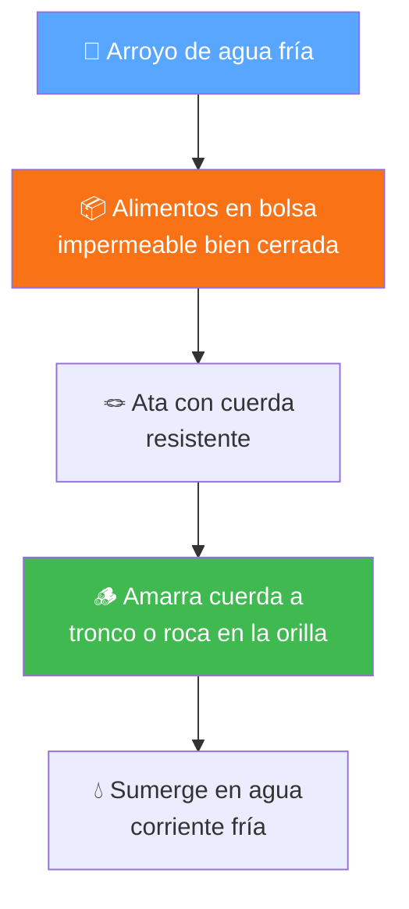

## Tu campamento, tu responsabilidad

> **Este es el Tomo II de la serie Campamento.** Asume que ya completaste [Arte de Acampar](arte_de_acampar.md) y [Campamento I](campamento_i.md). Si no los has hecho, empieza por ahí.

> **Requisito de edad:** Debes tener al menos 11 años para completar esta especialidad.

En Campamento I tu consejero te guió paso a paso. Te dijo dónde poner la carpa, cómo encender la fogata, qué cocinar. Ahora eso cambia.

"Este campamento lo van a planificar ustedes", dice tu consejero. "Yo estoy acá para supervisar y ayudar, pero las decisiones son suyas. Es hora de que dejen de ser aprendices y empiecen a ser campistas."

---

## Fase 1 - Quién quieres ser en el campo

*Dos semanas antes del campamento. Tu consejero pide algo distinto: "Antes de empacar, quiero que piensen en qué tipo de campista quieren ser."*

---

### Tu filosofía personal de campamento

*(Requisito 2)* **[PRÁCTICA REQUERIDA]**

No es un ensayo académico. Es tu compromiso escrito - principios que guían tus acciones en el campo. Tu consejero pide que cada uno escriba el suyo y lo traiga al campamento.

"Piensen en cuatro áreas", dice tu consejero:

**Con Dios:**
- Reconocer la naturaleza como su creación
- Buscar conocerlo a través de lo que vemos en el campo
- Guardar el sábado con reverencia, incluso en campamento

**Con otros campistas:**
- Ser cortés y respetuoso
- Ayudar sin que te lo pidan
- Ser paciente cuando otros cometan errores
- Incluir a todos en las actividades

**Con la naturaleza:**
- No dejar rastro de tu presencia
- Llevar toda tu basura
- Usar solo madera caída
- Dejar el lugar mejor de como lo encontraste

**Con tu seguridad:**
- Seguir las reglas siempre
- Usar herramientas correctamente
- Informar peligros a los líderes

"Escríbanlo en sus palabras. Que sea algo que realmente puedan cumplir, no una lista bonita que se queda en el papel."

**Cómo desarrollar la tuya:**
1. **Reflexiona:** ¿Qué valoras en un campamento? ¿Qué tipo de campista quieres ser?
2. **Escribe:** En tus palabras, específico y práctico
3. **Practica:** Llévala al campamento. Evalúate después. Mejora.

---

### Elegir el terreno

*(Requisito 3)* **[PRÁCTICA REQUERIDA]**

> En [Arte de Acampar](arte_de_acampar.md#elegir-el-lugar) viste los factores básicos. Ahora profundizamos en los 5 elementos que debes evaluar en cualquier terreno.

Tu consejero lleva al grupo a un terreno y pregunta: "¿Dónde armarían campamento acá? Tienen 10 minutos para elegir y explicar por qué."

**a) Viento**

| Qué buscar | Qué evitar |
|-----------|------------|
| Protección natural (árboles, rocas, colinas) | Crestas de colinas (viento fuerte) |
| Algo de ventilación (controla insectos) | Valles estrechos (viento canalizado) |
| Puerta de carpa opuesta al viento | Directamente expuesto sin barrera |

Observa los árboles: si están inclinados permanentemente, el viento es constante. Si las hojas se mueven poco, es zona protegida. Pregunta a locales sobre patrones de viento.

**b) Agua**

Distancia ideal: **60-90 metros** de la fuente. Cerca para acceso, lejos para proteger.

| Qué buscar | Qué evitar |
|-----------|------------|
| Agua corriente (más limpia) | Lechos secos de río (crecidas súbitas) |
| Acceso seguro sin resbalones | Agua estancada (mosquitos) |
| Caudal estable | Aguas abajo de poblados (contaminación) |

Preguntas clave: ¿es potable? Si no, ¿cómo la purifico? ¿Alcanza para todo el grupo?

> **Tip:** Si el agua corre sobre rocas y suena, generalmente está más oxigenada. Agua estancada con espuma verde o mal olor = no la toques. Si ves vegetación sana creciendo dentro del arroyo, es buena señal - pero SIEMPRE purifica antes de beber (hervir 3 minutos, filtro, o pastillas).

**c) Fauna**

Señales de vida silvestre: huellas, excrementos, madrigueras, senderos de animales, marcas en árboles.

| Qué buscar | Qué evitar |
|-----------|------------|
| Área sin señales de animales grandes | Senderos de animales frecuentados |
| Distancia de fuentes de agua animales | Cerca de madrigueras o guaridas |
| Brisa (aleja insectos) | Panales, hormigueros, agua estancada |

"Si ves muchas huellas frescas de animales grandes, ese no es tu lugar", dice tu consejero.

> **Tip:** Las telarañas entre arbustos significan que nadie (ni animales grandes) ha pasado recientemente por ahí. Excrementos frescos y brillantes = animal estuvo hace poco. Secos y grises = hace días. Aprende a leer el terreno como un libro.

**d) Madera**

| Qué buscar | Qué evitar |
|-----------|------------|
| Suficiente madera caída y muerta | Áreas donde toda la leña está mojada |
| Variedad de tamaños (yesca a troncos) | Solo árboles vivos (no cortar) |
| Accesible, no muy lejos | Áreas recolectadas excesivamente |

Si no hay suficiente leña: usa estufa de camping. En muchas áreas protegidas está prohibido recolectar leña.

> **Tip:** La madera seca truena al quebrarse. La húmeda se dobla. Si toda la madera del suelo se dobla, llovió hace poco - busca madera colgada entre ramas (secó más rápido que la del suelo).

**e) Condiciones climáticas**

Revisa el pronóstico 7-10 días antes. Planifica para el peor escenario.

| Clima | Ajuste |
|-------|--------|
| Caluroso | Busca sombra, cerca de agua, ventilación en carpas |
| Frío | Orientación al sol, protección del viento, leña abundante |
| Lluvioso | Terreno elevado, todo en bolsas impermeables, techo para cocinar |

**Señales de cambio climático en el campo:**
- **Nubes:** cúmulos altos que se oscurecen = tormenta en camino. Nubes bajas moviéndose rápido = viento fuerte pronto.
- **Animales:** pájaros que vuelan bajo, insectos que pican más, hormigas que tapan sus nidos = lluvia próxima.
- **Aire:** baja súbita de temperatura, viento que cambia de dirección, humedad que sientes en la piel.
- **Sonido:** si escuchas un río más fuerte que ayer, puede estar creciendo por lluvia aguas arriba.
- **Rocío:** mucho rocío en la mañana = día caluroso y seco. Sin rocío = probable lluvia.

---

## Fase 2 - Herramientas nuevas

*Tu consejero organiza un taller práctico: "Hoy aprenden a usar equipo que antes no tenían permiso de tocar."*

---

### La estufa y la lámpara

*(Requisito 7)* **[PRÁCTICA REQUERIDA]**

"En Campamento I usaron fogata para todo. Ahora van a aprender a usar estufa de gas y lámpara de campamento. Son más prácticas, pero tienen sus propios riesgos."

<strong style="display:block; color:var(--primary-color); font-size:0.95rem;">Estufa a gas</strong>
Cartucho de gas con quemador. Práctica y portátil.

<strong style="display:block; color:var(--primary-color); font-size:0.95rem;">Lámpara a gas</strong>
Coleman 220F. Produce luz intensa pero requiere ventilación.

<em>CC BY-SA 4.0, Sumita Roy Dutta / Dominio público, Eddie Willers</em>

**Estufa de gas - encendido seguro:**

1. **Ubicación:** superficie plana, lejos de carpas (2-3m), NUNCA dentro de carpa
2. **Inspección:** sin fugas, manguera en buen estado, conexiones apretadas
3. **Conectar:** bombona/cartucho firme, sello hermético
4. **Encender:** abre gas lentamente, enciende INMEDIATAMENTE con fósforo o encendedor, luego ajusta llama

**NUNCA:** abras gas y esperes para encender (acumulación peligrosa), enciendas con la cara sobre el quemador, uses si huele a gas.

**Lámpara LED (la más segura):** Verifica pilas, cuelga en lugar seguro, ajusta intensidad.

**Lámpara a gas:**
1. Conecta cartucho, asegura bien
2. Abre válvula lentamente
3. Enciende con encendedor (acerca por debajo, no directo a la camisa)
4. NUNCA dentro de carpa cerrada - produce monóxido de carbono

**Al apagar cualquier equipo a gas:** cierra válvula, deja enfriar completamente, desconecta.

> **Tip - Lámpara de emergencia con aceite:** Si se te acaban las pilas y no tienes gas, puedes improvisar una luz con un frasco de vidrio, aceite de cocina y un cordón de algodón (mecha). Llena el frasco con aceite, pasa el cordón por la tapa (que asome 1 cm) y enciende. Dura horas con poco aceite. No es potente pero ilumina lo suficiente para cocinar o leer. Mantenla en superficie estable y nunca dentro de la carpa.

---

### El hacha y el machete

*(Requisito 8)* **[PRÁCTICA REQUERIDA]**

> Ya conoces las [10 reglas de seguridad](campamento_i.md#el-cuchillo-y-el-hacha) de Campamento I. Ahora sumamos el machete y profundizamos en la técnica de corte.

<em>Herramientas de campamento: hacha, cuchillo y sierra. Cada una tiene su uso. (CC BY-SA 3.0, FunkyFeudalFox)</em>

**Uso del machete (nuevo):**

- **Para ramas pequeñas:** apoya en superficie firme, golpes controlados y cortos, ángulo de 45°
- **Para limpiar vegetación:** golpes laterales controlados, distancia de otros
- **Transporte:** siempre en funda al costado
- **Afilado:** lima o piedra, siempre alejándote del cuerpo

**Demostrar corte de leña correcto:**
1. Leña sobre tronco base estable (altura: entre tu tobillo y tu rodilla, más o menos 20-30 cm)
2. Pies separados, balance estable
3. Levanta hacha controlada, mira el punto exacto
4. Deja que el peso haga el trabajo
5. Si se atora: levanta hacha y leña juntos, golpea de nuevo

**QUÉ NUNCA HACER:** cortar en el aire, lanzar el hacha, usar como martillo, dejarla en el suelo.

---

### Levantar objetos pesados

*(Requisito 11)* **[PRÁCTICA REQUERIDA]**

"En campamento van a necesitar mover troncos, piedras, bidones de agua", dice tu consejero. "Dos técnicas:"

**1. Palanca con tronco:**

<em>Palanca: el punto de apoyo (triángulo) va cerca del objeto pesado. Tú empujas del otro lado. (CC BY-SA 4.0, Dnu72)</em>

- Palo fuerte y largo + punto de apoyo (roca, tronco) cerca del objeto pesado
- Inserta punta bajo el objeto, empuja hacia abajo en el otro extremo
- Más largo el palo y más cerca el apoyo al objeto = menos fuerza necesitas

> **Tip:** Si no tienes un palo suficientemente largo, usa dos personas: una levanta con palanca corta, la otra mete una piedra debajo para sostener. Repite hasta la altura que necesitas.

**2. Trabajo en equipo coordinado:**
- 2-4 personas alrededor del objeto
- Rodillas dobladas, espalda recta (levantar con PIERNAS, no espalda)
- Uno cuenta: "1, 2, 3, ¡arriba!"
- Nunca gires el torso mientras cargas - mueve los pies

---

## Fase 3 - Viernes a domingo

*Llegan al terreno. Tu consejero se sienta en una roca y observa: "El lugar lo eligen ustedes. Yo solo intervengo si hay un problema de seguridad." El grupo mira el terreno, evalúa viento, agua, fauna, madera y clima. Discuten. Deciden. Arman.*

---

### La carpa - nivel avanzado

*(Requisito 13)* **[PRÁCTICA REQUERIDA]**

> Ya sabes [armar una carpa](campamento_i.md#armar-campamento). Ahora agregas: carpa mojada, limpieza y almacenamiento.

**Precauciones con carpa mojada:**
- Arma rápido - minimiza exposición del interior
- Prioriza interior seco: coloca sobretecho primero si puedes
- Ventilación máxima para secar (abre todo)
- NUNCA guardes mojada - genera moho
- Si no puedes secar en campamento, sécala al llegar a casa

**Limpiar la carpa (después del campamento):**
1. Sacude hojas y tierra
2. Arma en jardín, limpia con esponja húmeda y jabón suave
3. Enjuaga (no uses detergente fuerte ni blanqueador)
4. Seca completamente al sol - ambos lados
5. Verifica esquinas y costuras (retienen humedad)

**Guardar:**
- Completamente seca y limpia
- Enrolla o dobla (varía los pliegues cada vez)
- Guarda en bolsa de tela (respira), no plástico sellado
- Varillas desmontadas, estacas limpias en bolsa separada
- Lugar fresco, seco, oscuro

---

### Proteger el agua y la higiene

*(Requisito 4)* **[PRÁCTICA REQUERIDA]**

> Ya conoces la [higiene básica de campamento](campamento_i.md#higiene-en-campamento). Ahora el foco es proteger la fuente de agua.

**Regla de los 60 metros:** TODO a 60m mínimo del agua - campamento, cocina, sanitario, lavado.

**Proteger la fuente:**
- Toma agua aguas arriba
- NUNCA laves directamente en río/lago - lleva agua en recipiente lejos
- Jabón biodegradable siempre
- Filtra partículas del agua jabonosa, desecha en tierra

**Sistema de tres baldes al cocinar:**

> Lo aprendiste en [Campamento I](campamento_i.md#lavar-los-utensilios). Acá es obligatorio en cada comida.

| Balde | Contenido | Función |
|-------|-----------|---------|
| 1 - Lavado | Agua caliente + jabón | Raspa restos primero, luego frota |
| 2 - Enjuague | Agua limpia | Quita todo el jabón |
| 3 - Desinfección | Agua caliente o con cloro | Mata bacterias, 1-2 minutos |

Agua residual: filtra sólidos, lleva 60m de fuentes, esparce en área amplia.

---

### Fogatas avanzadas

*(Requisito 9)* **[PRÁCTICA REQUERIDA]**

> Ya sabes hacer fogata tipi, cabaña y estrella ([Arte de Acampar](arte_de_acampar.md#la-fogata), [Campamento I](campamento_i.md#la-fogata-un-solo-fósforo)). Ahora aprendes el fuego del consejo y fogatas para cocinar.

Tu consejero anuncia: "Esta noche vamos a hacer algo especial. Un fuego del consejo."

<strong style="display:block; color:var(--primary-color); font-size:0.95rem;">Estrella</strong>
Larga duración. Regulable.

<strong style="display:block; color:var(--primary-color); font-size:0.95rem;">Cazador</strong>
2 troncos paralelos. Para cocinar.

<strong style="display:block; color:var(--primary-color); font-size:0.95rem;">Reflector</strong>
Pared detrás refleja calor. Hornear.

<em>Dominio público, Jazzmanian</em>

**Fuego del consejo (Council Fire):**

Fogata grande para reuniones grupales. Más para espectáculo que para cocinar.

1. Círculo de piedras grande (60-90 cm)
2. Estaca gruesa central (50-60 cm de alto)
3. Leña mediana-grande en tipi alrededor del poste
4. Yesca abundante en la base
5. Enciende por la base - el fuego sube por el poste central, crea llama alta

**Uso:** fogatas de apertura/cierre, ceremonias, reuniones grandes.

**Fogata cazador (Hunter's Fire) - para cocinar:**

Dos troncos grandes paralelos (25-35 cm de separación), orientados hacia el viento. Fogata pequeña entre ellos.

- Los troncos son soporte natural para ollas/sartenes
- Protege del viento = más eficiente
- Troncos más juntos = más calor, más separados = calor suave

**Fogata reflector (Reflector Fire):**

Pared de troncos apilados (o roca grande) detrás de la fogata. Refleja calor en una dirección.

- Duplica calor efectivo
- Ideal para hornear (calor envolvente entre fuego y pared)
- Para secar ropa, calentar frente de carpa

**Normas de seguridad:** las mismas de siempre - NUNCA sin supervisión, agua cerca, apagar completamente (cenizas frías al tacto).

---

### Conservar alimentos sin electricidad

*(Requisito 10)*

"¿Cómo mantenemos la comida fresca sin enchufes?", pregunta tu consejero. "La humanidad conservó alimentos por miles de años sin electricidad. Nosotros podemos hacerlo un fin de semana."

**1. Hoyo en la tierra (Ground cooler):**

La tierra bajo la superficie mantiene temperatura más fría y constante que el aire.

- Cava 30-40 cm en zona sombreada
- Coloca alimentos en recipientes cerrados
- Cubre con tabla o piedra plana, luego tierra encima
- Marca el lugar para encontrarlo

> **Tip:** También funciona para agua. Entierra tu cantimplora en la mañana y a la hora de almuerzo tendrás agua fresca.

**2. Método de evaporación (Zeer pot):**

<em>Zeer pot: recipiente interno con alimentos, arena mojada entre ambos, el agua se evapora y enfría el interior. (CC BY-SA 3.0, Peter Rinker)</em>

- Recipiente pequeño dentro de uno grande, espacio entre ambos relleno con arena mojada
- Cubre con tela húmeda, ubica en lugar con brisa y sombra
- Re-humedece arena 2-3 veces al día
- Funciona mejor en clima seco - la evaporación absorbe calor del interior

En campamento: si no tienes ollas de barro, puedes improvisar envolviendo recipientes en tela mojada y dejándolos al viento. Mismo principio, menos eficiente, pero funciona.

**3. Inmersión en arroyo (el refrigerador natural):**

Si tienes un arroyo de agua fría cerca, es el mejor método.

- Coloca alimentos en bolsa impermeable (doble bolsa es mejor)
- Ata con cuerda resistente - nudo firme
- Amarra el otro extremo a un tronco o roca pesada en la orilla
- Sumerge la bolsa en el agua corriente
- El agua fría mantiene los alimentos frescos todo el día

> **Tip:** Usa la sombra del arroyo (bajo un puente, roca saliente, o árbol) para que el sol no caliente la bolsa por encima del agua. Y revisa el nudo cada vez que vayas a buscar algo - la corriente puede aflojarlo.

**Principios generales:**
- Sombra siempre, nunca sol directo
- Consume perecederos primero (día 1)
- Recipientes cerrados
- Verifica estado antes de comer - si huele raro, no lo comas

---

### Cocinar: tres técnicas

*(Requisito 12)* **[PRÁCTICA REQUERIDA]**

"Este campamento van a demostrar que saben hervir, freír y asar", dice tu consejero.

**1. Hervir/guisar:**

Arroz, pasta, sopas, vegetales, legumbres.

- **Arroz:** 2 tazas agua por 1 de arroz, sal, hierve, agrega arroz, reduce fuego, tapa 15-20 min
- **Pasta:** agua abundante con sal, hierve, agrega pasta, cocina según paquete, escurre
- **Sopa:** sofríe cebolla, agrega vegetales duros primero, líquido, hierve, reduce, agrega vegetales tiernos, sazona

**2. Freír:**

Huevos, tortillas, hamburguesas vegetarianas, papas, arepas.

- **Huevos revueltos:** sartén a fuego medio, aceite, bate huevos con sal, vierte, revuelve suave, retira cuando estén casi listos (siguen cocinándose)
- Cuidado con salpicaduras de aceite - seca los alimentos antes de freír

**3. Asar:**

Vegetales a la parrilla, mazorcas, pan al palo, hamburguesas vegetarianas.

- Necesitas brasas, NO llamas
- Vegetales: corta grandes, aceita, sazona, gira para cocinar parejo
- Mazorca: remoja 15 min, en parrilla girando cada 3-4 min, 15-20 min total

**Menú sugerido para demostrar las 3 técnicas:**

| Comida | Técnica | Ejemplo |
|--------|---------|---------|
| Desayuno | Hervir + freír | Avena + huevos revueltos |
| Almuerzo | Hervir + freír | Sopa de vegetales + arepas/tortillas |
| Cena | Hervir + asar | Arroz + vegetales a la parrilla + hamburguesas vegetarianas |

**Seguridad:** mangas recogidas, cabello recogido, mangos hacia adentro, agarraderas siempre.

---

### Cuidar tu equipo de dormir

*(Requisito 14)* **[PRÁCTICA REQUERIDA]**

**a) Enrollar saco de dormir:**

1. Extiende completamente, cremallera cerrada
2. Empieza a enrollar desde los PIES (el aire escapa por la abertura de cabeza)
3. Presiona mientras enrollas - expulsa todo el aire
4. Asegura con correas

**Colchoneta inflable:** abre válvula, enrolla desde extremo opuesto a válvula presionando fuerte, cierra válvula ANTES de soltar.

**b) Mantener seco:**
- En mochila: dentro de bolsa impermeable (dry bag)
- En carpa: no toques paredes (condensación), guarda en bolsa durante el día
- Nunca entres con ropa mojada al saco

**c) Limpiar:**
- **Manchas:** esponja húmeda con jabón suave
- **Lavado completo (1-2 veces/año):** agua tibia, jabón suave, ciclo delicado o a mano
- **Secado:** temperatura BAJA en secadora con pelotas de tenis, o al sol (puede tomar 1-2 días)
- **NUNCA:** detergente fuerte, blanqueador, agua caliente, guardar húmedo

**Almacenamiento:** extendido o en bolsa grande (no comprimido), lugar fresco y seco.

---

### Participar en el culto

*(Requisito 6)* **[PRÁCTICA REQUERIDA]**

El sábado en campamento es distinto. Escuela Sabática al aire libre, culto divino con el cielo de techo. Tu consejero pide que cada uno participe activamente en al menos una actividad:

**a) Estudio de Escuela Sabática:**
- Estudia la lección durante la semana antes
- Comparte respuestas, haz preguntas reflexivas
- Relaciona la lección con lo que ves en la naturaleza

**b) Contar una historia:**
- Historia misionera, bíblica, o de la naturaleza con lección espiritual
- 5-7 minutos: inicio que captura atención, desarrollo vívido, cierre con lección
- Practica en casa antes

**c) Dar testimonio:**
- Comparte algo que Dios hizo en tu vida - sincero y personal
- 3-5 minutos, lenguaje simple
- Estructura: antes (situación), durante (cómo Dios intervino), después (cómo cambió algo)

**d) Dirigir los cantos:**
- Selecciona 4-6 cantos (variedad: alegres y reflexivos)
- Párate donde todos te vean, canta con entusiasmo
- Empieza con cantos alegres, termina reflexivo
- No importa si no cantas "bien" - importa tu actitud

"Participar en el culto no es sentarse y escuchar", dice tu consejero. "Es traer algo. Preparar algo. Dar algo de ti."

---

## Fase 4 - Tu legado

*Domingo. El campamento se desarma. El área queda limpia. Tu consejero reúne al grupo una última vez.*

---

### Lo que te llevas

"Saquen su filosofía personal", dice tu consejero. "La que escribieron antes del campamento. Léanla."

Silencio.

"¿La cumplieron? ¿Qué cambiarían? ¿Qué agregarían?"

Este es el momento de evaluar tu campamento contra tus propios principios. No contra los de otra persona - contra los tuyos. Eso es madurez.

"En Campamento III van a dar un paso más", dice tu consejero. "Van a encender fuego sin fósforos. Van a afilar sus propias herramientas. Van a construir cosas con amarras. Y van a liderar un devocional ustedes solos. Ya no van a ser campistas - van a ser líderes."

> **Siguiente:** [Campamento III](campamento_iii.md) - El campamento autónomo

---

## Referencia

### Mapa de requisitos

| Requisito | Tema | Fase | Sección |
|-----------|------|------|---------|
| 1 | Tener mínimo 11 años | - | Introducción |
| 2 | Filosofía personal de campamento | Fase 1 | Tu filosofía personal de campamento |
| 3a | Viento | Fase 1 | Elegir el terreno |
| 3b | Agua | Fase 1 | Elegir el terreno |
| 3c | Fauna | Fase 1 | Elegir el terreno |
| 3d | Madera | Fase 1 | Elegir el terreno |
| 3e | Condiciones climáticas | Fase 1 | Elegir el terreno |
| 4 | Proteger naturaleza/agua + higiene + cocina | Fase 3 | Proteger el agua y la higiene |
| 5 | Campamento fin de semana 2 noches | Fase 3 | (todo la Fase 3) |
| 6 | Participar en culto | Fase 3 | Participar en el culto |
| 7 | Encender estufa y lámpara | Fase 2 | La estufa y la lámpara |
| 8 | Hacha/machete + cortar leña | Fase 2 | El hacha y el machete |
| 9 | Fuego del consejo + fogatas para cocinar | Fase 3 | Fogatas avanzadas |
| 10 | Conservar alimentos sin electricidad | Fase 3 | Conservar alimentos sin electricidad |
| 11 | Levantar objetos pesados | Fase 2 | Levantar objetos pesados |
| 12 | Cocinar: hervir, freír, asar | Fase 3 | Cocinar: tres técnicas |
| 13 | Carpa: elegir lugar, armar, mojada, limpiar | Fase 3 | La carpa - nivel avanzado |
| 14 | Dormir: enrollar, mantener seco, limpiar | Fase 3 | Cuidar tu equipo de dormir |

---

## 📚 Referencias y recursos adicionales

- [**Manual No Deje Rastro**](https://drive.google.com/file/d/1g8IEtGrYmk0_mk2vqykZfZ24QE7lniC_/view) - Sendero de Chile / NOLS / CONAMA
- [**Leave No Trace**](https://lnt.org/why/7-principles/) - Los 7 principios en inglés
- [**Arte de Acampar**](arte_de_acampar.md) - Prólogo de la serie
- [**Campamento I**](campamento_i.md) - Tomo I: fundamentos

**Aplicaciones útiles:**
- [Maps.me](https://maps.me/) - Mapas offline
- [PlantNet](https://plantnet.org/) - Identificación de plantas
- [Cruz Roja - Primeros Auxilios](https://play.google.com/store/apps/details?id=com.cube.arc.fa)

---

## ✅ Notas para el instructor

**Prerrequisitos:** Campamento I recomendado. Edad mínima 11 años.

**Diferencias con Campamento I:**
- Mayor autonomía del conquistador
- Filosofía personal escrita y practicada
- Nuevas herramientas (estufa, lámpara, machete)
- Fogatas avanzadas (fuego del consejo, cazador, reflector)
- Cocina con 3 técnicas
- Conservación de alimentos
- Cuidado completo de equipo (carpa y saco)
- Participación activa en culto

**Requisitos prácticos obligatorios:**
- Req 2: Filosofía personal ESCRITA antes del campamento
- Req 5: Campamento 2 noches
- Req 6: Participar activamente en culto (elegir una opción)
- Req 7: Demostrar encendido seguro de estufa y lámpara
- Req 8: Demostrar uso de hacha/machete y corte de leña
- Req 9: Construir fuego del consejo o fogata para cocinar
- Req 11: Demostrar 2 técnicas de levantamiento
- Req 12: Cocinar con 3 técnicas (hervir, freír, asar)
- Req 13: Armar carpa + demostrar conocimiento de carpa mojada y mantenimiento
- Req 14: Enrollar saco + demostrar cuidado

**Cómo evaluar:**
- Leer filosofía personal antes y revisar cumplimiento después
- Observar autonomía en decisiones (elegir terreno, organizar campamento)
- Verificar técnicas de cocina (todas vegetarianas en campamento adventista)
- Evaluar participación activa en culto del sábado

**Sugerencias pedagógicas:**
- Dar más espacio de decisión - intervenir solo por seguridad
- Asignar participación en culto con 1-2 semanas de anticipación
- Practicar estufa/lámpara en reuniones previas
- El fuego del consejo es motivador - úsalo para apertura o cierre
- Permitir errores controlados (es donde más se aprende)

**Seguridad:**
- Supervisar uso de hacha/machete y estufa
- NUNCA equipo a gas dentro de carpa
- Botiquín accesible
- Sistema de compañeros obligatorio

---

*Manual de Especialidades - Club de Conquistadores - División Sudamericana*

> **Anterior:** [Campamento I](campamento_i.md) | **Siguiente:** [Campamento III](campamento_iii.md)
