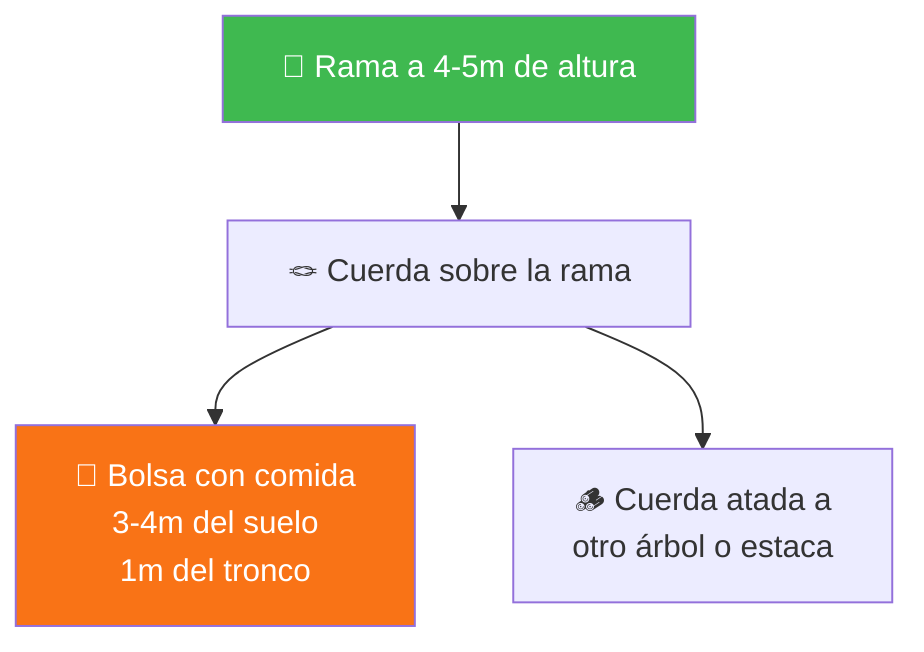

## Condiciones adversas

> **Este es el Tomo IV y final de la serie Campamento.** Asume que ya completaste [Arte de Acampar](arte_de_acampar.md), [Campamento I](campamento_i.md), [Campamento II](campamento_ii.md) y [Campamento III](campamento_iii.md).

> **Requisito de edad:** Debes tener al menos 12 años.

Llueve. La leña está mojada. El viento cambió de dirección tres veces en una hora. Alguien dejó la comida afuera y un animal se la llevó.

Tu consejero no se inmuta. "Esto es Campamento IV. Las condiciones no siempre son ideales. Un campista de verdad no espera que todo sea perfecto - resuelve con lo que tiene."

Ya sabes encender fuego con un solo fósforo y sin fósforos. Ya sabes armar carpa, cocinar, construir con amarras, liderar un devocional. Ahora la pregunta es: **¿puedes hacerlo cuando todo sale mal?**

---

## Fase 1 - Planificar como líder

*Tres semanas antes del campamento. Esta vez tu consejero no planifica por ti. Dice: "Ustedes van a planificar TODO. Yo solo apruebo."*

---

### Actividad para el sábado

*(Requisito 2)* **[PRÁCTICA REQUERIDA]**

"El sábado en campamento no es solo culto y Escuela Sabática", dice tu consejero. "Necesito que planifiquen una actividad apropiada para el sábado que haga del día algo especial - que no sea un culto."

**Ideas de actividades sabáticas en naturaleza:**

- **Caminata contemplativa** - sendero con paradas para observar creación, leer textos bíblicos y reflexionar
- **Estudio de la naturaleza** - identificar plantas, aves o insectos como expresión de la creación de Dios
- **Juego bíblico al aire libre** - búsqueda del tesoro con pistas bíblicas, estaciones con historias
- **Servicio comunitario** - limpieza de sendero, restauración de área, proyecto de conservación
- **Fogata de testimonios** - círculo donde cada persona comparte algo que Dios hizo en su vida
- **Taller creativo** - dibujar la naturaleza, escribir poesía o canciones inspiradas en la creación

**Cómo planificar:**
1. Elige la actividad pensando en el grupo (edades, intereses, condición física)
2. Prepara materiales necesarios
3. Calcula duración (2-3 horas es ideal)
4. Ten plan B por si el clima no coopera
5. Presenta tu plan al consejero para aprobación

> **Tip:** La mejor actividad sabática es la que hace que todos se vayan pensando "hoy fue un buen sábado". No tiene que ser complicada - a veces una caminata silenciosa por el bosque con una lectura bíblica al final es lo que más impacta.

---

### Ensayo sobre conservación

*(Requisito 3)*

Tu consejero pide que cada uno escriba un ensayo de 200 palabras sobre la preservación de la naturaleza, citando reglas de buen comportamiento.

No es un trabajo para el colegio. Es tu compromiso escrito con la creación.

**Estructura sugerida:**
- **Párrafo 1:** Por qué la naturaleza necesita protección (lo que has visto en campamentos)
- **Párrafo 2:** Las reglas que sigues (No Dejar Rastro, protección de agua, manejo de basura)
- **Párrafo 3:** Tu compromiso personal (qué vas a hacer tú, no qué "debería" hacer la gente)

> Los 7 principios de [No Dejar Rastro](campamento_i.md#los-7-principios-de-no-dejar-rastro) y tu [filosofía personal](campamento_ii.md#tu-filosofía-personal-de-campamento) de Campamento II son buena base.

---

### Menú y presupuesto

*(Requisito 4)*

"Cocinar en campamento no es solo saber hacer fuego", dice tu consejero. "Es planificar qué comer, cuánto cuesta, y cómo organizarlo para un grupo."

Debes planear un menú completo para 2 días (4 comidas principales + snacks) y estimar costos.

**Ejemplo de planificación:**

| Comida | Día 1 | Día 2 |
|--------|-------|-------|
| **Desayuno** | Avena con frutas secas, pan, jugo | Huevos revueltos, tortillas, leche |
| **Almuerzo** | Sopa de verduras, arroz con lentejas, ensalada | Pasta con salsa de tomate, pan de ajo, fruta |
| **Cena** | Hamburguesas vegetarianas a la parrilla, papas asadas, ensalada | Guiso de legumbres, arroz, pan |
| **Snacks** | Trail mix, barras, fruta | Trail mix, galletas, fruta |

**Calcular costos:**
1. Lista todos los ingredientes con cantidades (por persona x número de personas)
2. Busca precios en supermercado o feria
3. Suma y agrega 10-15% de margen (siempre se gasta un poco más)
4. Divide por persona para saber cuánto aporta cada uno

> **Tip:** La feria es más barata para verduras y frutas. Los granos secos (lentejas, arroz, porotos) son los alimentos más baratos y nutritivos para campamento. Comprar en cantidad baja el precio por porción.

---

## Fase 2 - Dominar el fuego

*Primer día de campamento. Está nublado. A media tarde empieza a llover. Tu consejero sonríe: "Perfecto. Justo lo que necesitábamos."*

---

### Fuego bajo lluvia

*(Requisito 6)* **[PRÁCTICA REQUERIDA]**

Este es EL requisito que define Campamento IV. Encender y mantener fuego cuando todo está mojado.

"¿Imposible? No", dice tu consejero. "Solo necesitas saber dónde buscar."

**Dónde encontrar material seco cuando llueve:**

- **Ramas muertas colgando de árboles** - no tocaron el suelo, secaron más rápido que las del piso
- **Interior de troncos caídos** - la corteza exterior absorbe agua pero protege el interior
- **Bajo rocas grandes o salientes** - la lluvia no llega ahí
- **Corteza de abedul/cedro** - repele agua naturalmente, arde aunque esté húmeda por fuera
- **Resina de pino** - las "lágrimas" secas de los pinos son inflamables aunque estén mojadas
- **Tu kit de emergencia** - bolitas de algodón con vaselina (preparadas en casa), siempre en bolsa impermeable

> **Tip:** La resina de pino es tu mejor amiga en días de lluvia. Busca zonas donde el tronco tiene heridas o nudos - ahí se acumula resina pegajosa y aromática. Una bolita de resina arde como una vela durante minutos.

**Técnica para encender bajo lluvia:**

1. **Protege el área** - usa tu cuerpo, una lona, o crea techo con ramas grandes
2. **Prepara yesca extra** - el doble de lo normal. La humedad del ambiente dificulta la ignición.
3. **Usa material del interior** - corta la capa externa mojada de los palos. El centro está seco. Haz virutas con cuchillo del interior.
4. **Empieza muy pequeño** - fuego diminuto primero, alimenta gradualmente
5. **Protege la llama** - el viento y la lluvia son el enemigo. Crea barrera alrededor.
6. **Paciencia** - tomará más tiempo que en condiciones secas

**Cómo mantener el fuego ardiendo bajo lluvia:**

- Alimenta constantemente con leña pequeña - no dejes que baje
- Protege con techo improvisado (lona inclinada a distancia segura)
- Apila leña cerca del fuego (no encima) para que se seque con el calor
- Si el fuego baja, agrega yesca antes de que se apague completamente

---

### Conocer las maderas

*(Requisitos 7 y 8)*

"No toda la madera es igual", explica tu consejero. "Unas encienden rápido, otras hacen brasas. Si usas la equivocada para cada cosa, vas a pelear con el fuego toda la noche."

**Maderas para encender rápido (llama alta, se consume rápido):**

| Madera | Características | Dónde encontrar |
|--------|----------------|-----------------|
| Pino/Abeto | Resinosa, enciende fácil, llama alta | Bosques de coníferas, muy común en Chile |
| Sauce | Liviana, seca rápido, enciende fácil | Cerca de ríos y arroyos |
| Álamo | Liviana, arde rápido | Zonas templadas |
| Eucalipto (corteza) | Corteza se pela y arde fácil | Plantaciones |

**Maderas para brasas (calor sostenido, buenas para cocinar):**

| Madera | Características | Dónde encontrar |
|--------|----------------|-----------------|
| Roble/Encina | Densa, brasas duraderas, calor parejo | Bosques nativos |
| Espino | Muy densa, brasas excelentes | Zona central de Chile |
| Boldo | Densa, aromática, buenas brasas | Bosque esclerófilo chileno |
| Aromo | Dura, brasas duraderas | Común en zonas secas |

**La regla práctica:** madera liviana (la puedes romper fácil) = buena para encender. Madera pesada (cuesta romperla) = buena para brasas.

> **Tip:** Si golpeas dos palos y suenan "hueco", son livianos y encienden rápido. Si suenan "sólido", son densos y harán brasas. Tu oído te dice qué tipo de madera tienes en la mano.

---

### Cortar leña correctamente

*(Requisito 9)* **[PRÁCTICA REQUERIDA]**

> Ya aprendiste la técnica de hacha en [Campamento II](campamento_ii.md#el-hacha-y-el-machete). Acá demuestras maestría: cortar leña del tamaño correcto para cada uso.

**Tamaños necesarios:**

| Tamaño | Grosor | Para qué | Cómo cortar |
|--------|--------|----------|-------------|
| Yesca | Virutas finas | Iniciar fuego | Cuchillo, raspar con lomo |
| Combustible | Lápiz a dedo | Alimentar llama inicial | Romper con mano o cuchillo |
| Leña mediana | Muñeca | Mantener fuego | Hacha sobre tronco base |
| Leña grande | Antebrazo | Brasas para cocinar | Hacha, golpes controlados |

"No cortes más de lo que vas a usar", dice tu consejero. "Y recuerda: solo madera muerta y caída."

---

## Fase 3 - Los campamentos

*Este tomo es único: requiere dos campamentos de fin de semana, no uno. Tu consejero explica: "En el primero practican. En el segundo demuestran."*

---

### Proteger los alimentos

*(Requisito 10)* **[PRÁCTICA REQUERIDA]**

> Ya conoces los métodos de [conservación sin electricidad](campamento_ii.md#conservar-alimentos-sin-electricidad). Ahora agregas: construir un escondite para proteger de animales.

"Los ratones de campo pueden roer una bolsa en minutos. Los zorros son más astutos de lo que creen", dice tu consejero.

**Escondite de alimentos en alto (bear hang):**

1. Busca rama fuerte a 4-5 metros de altura, que sobresalga del tronco
2. Ata una piedra a una cuerda larga y lánzala sobre la rama
3. Ata la bolsa de comida a la cuerda
4. Sube la bolsa tirando de la cuerda - debe quedar a 3-4 metros de altura y 1 metro del tronco
5. Ata la cuerda a otro árbol o estaca

**Alternativa si no hay árboles altos:** contenedor rígido (balde con tapa) enterrado parcialmente, con piedras pesadas encima.

**Regla:** la comida NUNCA duerme en tu carpa. Ni siquiera envuelta. Los olores atraen animales.

---

### Cocina completa

*(Requisito 11)* **[PRÁCTICA REQUERIDA]**

Debes preparar una comida que contenga: sopa, legumbres, un plato principal y una bebida. Todo cocido.

**Menú ejemplo:**

| Plato | Receta | Tiempo |
|-------|--------|--------|
| **Sopa** | Sopa de verduras (zanahoria, papa, zapallo, cebolla, ajo) | 25 min |
| **Legumbres** | Porotos guisados con cebolla y tomate | 40 min (remojados noche anterior) |
| **Plato principal** | Arroz con salsa de tomate y vegetales salteados | 20 min |
| **Bebida** | Agua de hierbas caliente (menta, cedrón) o jugo de frutas cocido | 10 min |

**Organización:**
- Los porotos requieren remojo la noche anterior (8-12 horas) - planifica con tiempo
- Empieza por lo que tarda más (porotos), luego sopa, luego arroz
- La bebida se prepara mientras todo lo demás está listo
- Lava y prepara vegetales al inicio, antes de encender fuego

> **Tip:** En Chile las hierbas para agüitas crecen en muchos lugares: menta, toronjil, cedrón. Si sabes identificarlas, puedes preparar la bebida con lo que encuentras en el campo (siempre que estés seguro de la identificación).

---

### Cocinar en fogata reflectora

*(Requisito 12)* **[PRÁCTICA REQUERIDA]**

> Ya conoces la [fogata reflectora](campamento_iii.md#tres-fogatas-tres-usos). Ahora la usas para cocinar una comida completa.

La fogata reflectora es como un horno abierto: el calor del fuego más el calor reflejado por la pared envuelven la comida.

**Cómo montar tu cocina reflectora:**

1. Construye la pared reflectora (troncos apilados o roca grande) - 60-90 cm de alto
2. Fogata a 30-40 cm de la pared
3. Coloca la comida ENTRE el fuego y la pared - recibe calor de ambos lados
4. Para asar: cuelga o coloca a la altura de las brasas
5. Para hornear: envuelve en papel aluminio, coloca cerca de las brasas

**Alternativa: altar de cocina**

Estructura de piedras o troncos verdes que eleva el fuego y crea una superficie plana para cocinar. Como una estufa improvisada.

1. Dos filas de piedras paralelas (como fogata cazador pero con piedras)
2. Fuego entre las piedras
3. Parrilla o rejilla sobre las piedras
4. Altura ajustable moviendo piedras

---

### Purificar agua

*(Requisito 13)* **[PRÁCTICA REQUERIDA]**

"Nunca tomes agua que no hayas purificado, sin importar lo limpia que se vea", dice tu consejero. "Los patógenos no se ven."

**Tres métodos:**

**1. Hervir (el más confiable)**
- Lleva el agua a hervor fuerte (burbujas grandes)
- Mantén hirviendo 3 minutos (5 minutos en altitud sobre 2000m)
- Deja enfriar antes de tomar
- Funciona siempre, mata todo

**2. Pastillas o gotas (químico)**
- Pastillas de cloro o yodo (se compran en farmacia o tienda de camping)
- Sigue instrucciones del fabricante (generalmente 1 pastilla por litro, esperar 30 minutos)
- El agua puede quedar con sabor a cloro - agregar jugo en polvo ayuda
- No funciona bien en agua turbia (filtra primero)

**3. Filtro de agua (mecánico)**
- Filtros portátiles de camping (Lifestraw, Sawyer, etc.)
- Pasa el agua por el filtro - sale limpia al instante
- No requiere esperar ni calentar
- Necesita mantenimiento (limpieza periódica)

**Filtro improvisado de emergencia:**

Si no tienes pastillas ni filtro comercial, puedes improvisar uno:

1. Corta una botella plástica por la mitad
2. Pon capas de abajo hacia arriba: piedras grandes, piedras pequeñas, arena, carbón de fogata triturado, tela
3. Vierte agua por arriba - sale filtrada abajo
4. LUEGO hierve el agua filtrada (el filtro improvisado no mata bacterias, solo filtra partículas)

> **Tip:** El carbón activado de la fogata (carbón triturado fino, no ceniza) es un buen filtro. Absorbe muchas impurezas. Pero NO reemplaza hervir - siempre hierve después de filtrar.

---

## Fase 4 - El cierre de la serie

*Último día del segundo campamento. Tu consejero reúne al grupo una última vez.*

---

### El campista completo

"Hace cuatro especialidades atrás, yo les decía dónde poner la carpa", dice tu consejero.

"En Arte de Acampar aprendieron los fundamentos. En Campamento I hicieron su primer campamento de verdad. En Campamento II asumieron responsabilidad. En Campamento III se volvieron autónomos."

"Y ahora, en Campamento IV, demostraron que pueden resolver cuando las cosas se ponen difíciles. Encendieron fuego bajo lluvia. Cocinaron una comida completa en el campo. Purificaron agua. Protegieron su comida. Planificaron un menú con presupuesto."

"Ya no necesitan que alguien les diga qué hacer. Son campistas completos. Y lo que es más importante: pueden enseñarle a otros."

Silencio alrededor de la fogata. Luego alguien dice: "¿Y qué viene después?"

Tu consejero sonríe. "Después vienen [Nudos y Amarras](nudos_y_amarras.md), [Pionerismo](pionerismo.md), y si se atreven, Construcciones Rústicas. Pero eso es otra historia."

---

## Referencia

### Mapa de requisitos

| Requisito | Tema | Fase | Sección |
|-----------|------|------|---------|
| 1 | Tener mínimo 12 años | - | Introducción |
| 2 | Actividad apropiada para el sábado | Fase 1 | Actividad para el sábado |
| 3 | Ensayo 200 palabras sobre conservación | Fase 1 | Ensayo sobre conservación |
| 4 | Menú para 2 días con costos | Fase 1 | Menú y presupuesto |
| 5 | Dos campamentos de fin de semana | Fase 3 | (toda la Fase 3) |
| 6 | Fogata en día lluvioso | Fase 2 | Fuego bajo lluvia |
| 7 | Madera para encender rápido | Fase 2 | Conocer las maderas |
| 8 | Madera para brasas/carbón | Fase 2 | Conocer las maderas |
| 9 | Cortar leña correctamente | Fase 2 | Cortar leña correctamente |
| 10 | Cuidar alimentos + escondite de animales | Fase 3 | Proteger los alimentos |
| 11 | Comida completa: sopa, legumbres, plato, bebida | Fase 3 | Cocina completa |
| 12 | Cocinar en fogata reflectora o altar | Fase 3 | Cocinar en fogata reflectora |
| 13 | Purificar agua de 3 maneras | Fase 3 | Purificar agua |

---

## 📚 Referencias y recursos adicionales

- [**Manual No Deje Rastro**](https://drive.google.com/file/d/1g8IEtGrYmk0_mk2vqykZfZ24QE7lniC_/view) - Sendero de Chile / NOLS / CONAMA
- [**Leave No Trace**](https://lnt.org/why/7-principles/) - Los 7 principios en inglés
- [**Arte de Acampar**](arte_de_acampar.md) - Prólogo de la serie
- [**Campamento I**](campamento_i.md) - Tomo I: fundamentos
- [**Campamento II**](campamento_ii.md) - Tomo II: responsabilidad
- [**Campamento III**](campamento_iii.md) - Tomo III: autonomía

**Aplicaciones útiles:**
- [Maps.me](https://maps.me/) - Mapas offline
- [PlantNet](https://plantnet.org/) - Identificación de plantas
- [Cruz Roja - Primeros Auxilios](https://play.google.com/store/apps/details?id=com.cube.arc.fa)

---

## ✅ Notas para el instructor

**Prerrequisitos:** Campamento I, II y III recomendados. Edad mínima 12 años.

**Diferencia clave:** este tomo evalúa ejecución en condiciones difíciles, no solo conocimiento.

**Requiere DOS campamentos** de fin de semana (2 noches cada uno). Primero para practicar, segundo para demostrar.

**Requisitos prácticos obligatorios:**
- Req 2: Planificar y ejecutar actividad sabática
- Req 4: Menú con presupuesto (presentar ANTES del campamento)
- Req 6: Encender fogata en día lluvioso (si no llueve, simular con leña mojada)
- Req 9: Demostrar corte correcto de leña
- Req 10: Construir escondite de alimentos funcional
- Req 11: Cocinar comida completa (sopa + legumbres + plato + bebida)
- Req 12: Cocinar en fogata reflectora o altar
- Req 13: Demostrar 3 métodos de purificación

**Cómo evaluar:**
- La planificación (menú, presupuesto, actividad sabática) se presenta ANTES del campamento
- El ensayo de conservación se entrega escrito
- Las habilidades prácticas se evalúan durante los campamentos
- El fuego bajo lluvia es la prueba central - si no llueve, moja la leña con agua

**Sugerencias pedagógicas:**
- Incluir maderas locales chilenas en la enseñanza de tipos de madera
- Practicar el filtro improvisado como actividad de grupo
- La cocina completa funciona como proyecto grupal (cada equipo un plato)
- La fogata reflectora puede ser actividad del segundo campamento

**Seguridad:**
- Supervisar uso de hacha en corte de leña
- Verificar purificación de agua antes de consumir
- Botiquín accesible, especialmente para quemaduras
- En fogata bajo lluvia: cuidado con vapor y chispas

**Alimentación:** todo vegetariano en campamento adventista. El menú ejemplo y las recetas no incluyen carne.

---

*Manual de Especialidades - Club de Conquistadores - División Sudamericana*

> **Anterior:** [Campamento III](campamento_iii.md) | **Serie completa:** [Arte de Acampar](arte_de_acampar.md) > [Campamento I](campamento_i.md) > [Campamento II](campamento_ii.md) > [Campamento III](campamento_iii.md) > **Campamento IV**
