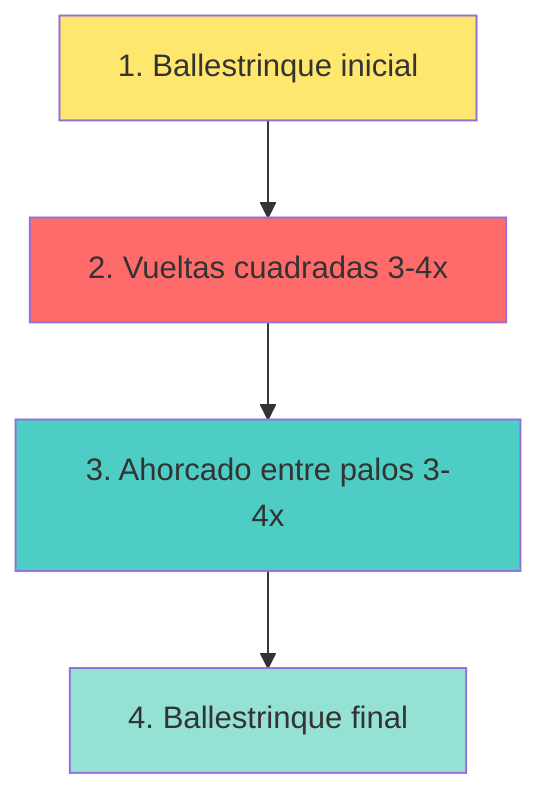
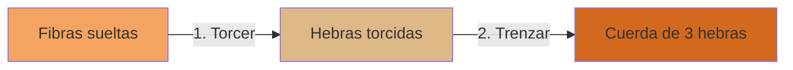

# Nudos y Amarras

**Área:** Actividades Recreativas
**Código:** AR-040
**Nivel:** 1
**Año de creación:** 1997
**Institución de origen:** Asociación General

---

## ¿CONOCES? El mundo de los nudos y amarras

Los nudos han acompañado a la humanidad desde tiempos inmemoriales. Desde los marineros que surcan los océanos hasta los escaladores que desafían montañas, pasando por los pioneros que construyen refugios en el bosque, todos dependen de saber hacer buenos nudos.

**Un nudo** es mucho más que simplemente atar una cuerda. Es una habilidad que puede salvar vidas, construir estructuras, asegurar cargas y resolver innumerables situaciones prácticas. En el escutismo y en las actividades al aire libre, dominar los nudos y amarras no es opcional: ¡es esencial!

### ¿Por qué aprender nudos?

- **Seguridad:** Un buen nudo puede ser la diferencia entre un rescate exitoso y un accidente
- **Autonomía:** Resolver problemas prácticos sin depender de otros
- **Versatilidad:** Cada nudo tiene un propósito específico
- **Tradición:** Conectar con generaciones de exploradores y aventureros

---

## TIPOS DE CUERDAS - Elige la adecuada

No todas las cuerdas son iguales. Elegir la cuerda correcta para cada situación puede marcar la diferencia entre el éxito y el fracaso de tu proyecto.

### Cuerdas Dinámicas 🏔️

Las cuerdas dinámicas son como los amortiguadores de un auto: están diseñadas para **absorber impactos**. Sus fibras están trenzadas de manera helicoidal, lo que les da una elasticidad sorprendente.

**Características:**
- Se elastecen considerablemente bajo carga
- Alta capacidad de absorción de impactos
- Excelente maniobrabilidad y bajo peso
- Diámetro típico: 7.9mm - 11mm

**¿Cuándo usarlas?**
- ✅ Escalada deportiva (simples)
- ✅ Montañismo (dobles o gemelas)
- ✅ Rescates donde puede haber caídas

**¿Cuándo NO usarlas?**
- ❌ Puentes de cuerda (se elastecen demasiado)
- ❌ Tirolinas (peligroso por la elasticidad)
- ❌ Trabajos verticales sin caídas

**Tipos de cuerdas dinámicas:**
- **Simples:** Para uso individual, un solo cabo
- **Dobles:** Se usan dos cabos en paralelo
- **Gemelas:** Corren en dos vías separadas pero paralelas

### Cuerdas Estáticas 🎯

Las cuerdas estáticas son todo lo contrario: **no se elastecen** (máximo 2% bajo carga normal). Son como una barra rígida que mantiene su forma.

**Características:**
- Casi no se elastecen bajo tensión
- Fibras paralelas en el núcleo + manga tejida protectora
- No producen torsión
- Diámetro típico: 9mm - 12mm

**¿Cuándo usarlas?**
- ✅ Puentes de cuerda
- ✅ Tirolinas
- ✅ Trabajos verticales (rapel, ascenso)

**¿Cuándo NO usarlas?**
- ❌ Escalada con posibles caídas (no absorben impacto)
- ❌ Como cuerda de seguridad en escalada

### Cuerdas Semi-estáticas

Un punto intermedio: fabricadas en **poliamida**, diseñadas especialmente para resistir el desgaste de bloqueadores y rapeladores. Son las más usadas en trabajos verticales profesionales.

---

## MATERIALES - ¿De qué está hecha tu cuerda?

### Fibras Sintéticas 🧪

Las cuerdas modernas se fabrican principalmente con materiales sintéticos porque ofrecen un rendimiento muy superior a las naturales en resistencia y durabilidad.

#### Nylon (Poliamida)

El **pionero de las fibras sintéticas** para cuerdas. Fue el primer material sintético utilizado y sigue siendo uno de los más resistentes.

**Ventajas:**
- ✅ Muy alta resistencia
- ✅ Muy elástico (ideal para escalada)
- ✅ Duradero
- ✅ Suave al tacto, sedoso

**Desventajas:**
- ❌ Pierde 5-25% de resistencia cuando está mojado
- ❌ No flota en agua
- ❌ Se enrosca fácilmente

**Usos comunes:** Escalada, montañismo, aplicaciones donde la elasticidad es deseable.

#### Poliéster

Material **importantísimo** en la composición de cuerdas estáticas y en la capa protectora de cuerdas dinámicas.

**Ventajas:**
- ✅ Gran resistencia
- ✅ Excelente compatibilidad con otras fibras
- ✅ Mantiene resistencia cuando está mojado
- ✅ No requiere cuidados especiales
- ✅ Agradable para trabajar

**Desventajas:**
- ❌ No flota

**Usos comunes:** Cuerdas estáticas, capa protectora de dinámicas, trabajos generales.

#### Polipropileno

Fácilmente reconocible por su **color amarillo** característico, aunque puede venir en otros colores.

**Ventajas:**
- ✅ Flota en agua (ideal para aplicaciones marinas)
- ✅ Económico
- ✅ Ligero

**Desventajas:**
- ❌ Algo rígido y quebradizo
- ❌ Difícil de atar bien
- ❌ Poco resistente a abrasión

**Usos comunes:** Aplicaciones marinas, rescate acuático, cuerdas de seguridad flotantes.

#### Polietileno

**Ventajas:**
- ✅ Económico
- ✅ Uso múltiple
- ✅ Ligero
- ✅ Flota bien (rescate acuático)

**Desventajas:**
- ❌ Poco resistente al desgaste sobre superficies abrasivas
- ❌ Menor resistencia que nylon o poliéster

### Fibras Naturales 🌿

Aunque las fibras sintéticas dominan el mercado moderno, las naturales tienen **valor histórico y aplicaciones específicas**. Sin embargo, **no se recomiendan para aplicaciones críticas** que pongan en riesgo la vida del usuario.

**¿Por qué evitar fibras naturales en situaciones críticas?**
- Se deterioran por descomposición biológica
- Susceptibles al moho si se guardan húmedas
- Menor resistencia que las sintéticas
- Durabilidad reducida

#### Sisal

Fibra valorada especialmente para cordeles. Sus fibras son **lisas, rectas y de color amarillo**.

**Características:**
- Buena resistencia y durabilidad
- Capacidad de estiramiento moderada
- Resistente al deterioro en agua salada
- Acepta bien ciertos colorantes

**Usos tradicionales:**
- Marina (cuerdas de barcos)
- Agricultura (guita, rescate)
- Uso industrial general

---

## MATERIALES NATURALES - De la naturaleza a tu mano

Si te encuentras en una situación de supervivencia o simplemente quieres experimentar con técnicas tradicionales, estas plantas pueden salvarte:

### Bambú 🎋

Una fibra natural **ecológica y sorprendentemente versátil**.

**Propiedades especiales:**
- Suave pero resistente
- Antibacteriana (¡natural!)
- Repelente de rayos ultravioletas
- Muy absorbente
- Confortable al tacto

**Proceso:**
Las fibras de bambú se extraen de la vara mediante tratamiento con vapor (bambú natural) o procesamiento químico controlado. Las fibras naturales son más puras y no contienen aditivos químicos. Pueden hilarse solas o mezclarse con algodón u otras fibras.

### Cáñamo 🌿

La **reina histórica** de las cuerdas náuticas.

**Historia impresionante:**
Desde el **siglo V a.C. hasta finales del siglo XIX**, el **90% de las cuerdas y velas para navegación** se hicieron con cáñamo. También era el material favorito para redes de pesca.

**¿Por qué era (y sigue siendo) tan valorado?**
- Resistencia excepcional a la humedad
- No se pudre fácilmente
- Muy duradero en ambientes marinos

Hoy en día se continúa usando en ciertas embarcaciones tradicionales que valoran estas propiedades únicas.

### Esparto 🌾

Una **hierba perenne** que alcanza hasta 1 metro de altura. Sus formaciones se llaman espartales o atochares.

**Productos tradicionales:**
- Sogas y cuerdas
- Alpargatas (calzado tradicional)
- Cestos artesanales
- Estropajos para limpieza

---

## VOCABULARIO ESENCIAL
¡Apréndelo!

Para hablar como un verdadero experto en nudos, necesitas conocer estos términos. Son el "idioma" de los nudos y amarras.

### Partes de la Cuerda

**Chicote** 🔚
Los **extremos de la cuerda**. En cuerdas sintéticas, es importante sellarlos térmicamente (con fuego) para evitar que se deshilachen. En cuerdas naturales, se puede hacer un nudo terminal.

**Firme o Parte Fija** 📏
El **resto de la cuerda** (la parte larga) con respecto a uno de sus chicotes. Es la sección principal que no estás manipulando activamente.

**Seno** ➰
Un **lazo o curva** que resulta al dar vuelta la soga sobre sí misma sin cruzar los cabos. Parece una "U" invertida.

**Punta Corrediza** 🏃
La **parte suelta de la soga** de utilidad secundaria. No es la parte principal con la que trabajas.

### Tipos de Configuraciones

**Curva** 〰️
La **forma que se le da a la cuerda** al unirla consigo misma o con otra cuerda.

**Giro o Vuelta** 🔄
Una vuelta que la cuerda da sobre sí misma y que **se ajusta consigo misma**.

**Nudo Superior** ⬆️
El **primer nudo** que se realiza y que queda en la **parte superior** de la estructura final del nudo compuesto.

**Nudo con Lazo Corredizo** 🎚️
Un tipo de nudo especial que puede ser **ajustado** deslizando una parte de la cuerda. El lazo se hace más grande o pequeño según necesites.

### Técnicas de Unión

**Amarra** 🔗
La **unión de objetos** (generalmente palos o troncos) mediante la atadura de cuerdas. Se usa para construir estructuras como mesas, puentes, torres.

**Unión de Cuerdas (Empalme)** 🤝
La **unión de dos cuerdas** a través de la combinación de sus hebras. No es un simple nudo, sino una conexión más permanente y resistente.

---

## CUIDANDO TU CUERDA
Como un escalador profesional

Tu cuerda puede salvarte la vida. Por eso, cuidarla no es opcional: **es obligatorio**. Nuestra seguridad depende del buen estado de nuestras cuerdas.

### Regla de Oro ⚠️

> **Ante la más mínima duda sobre el estado de una cuerda, CÓRTALA por el lugar dañado o SUSTITÚYELA por completo.**

**¡Nunca te arriesgues!** Es mejor "desperdiciar" un metro de cuerda que arriesgar tu vida o la de otros.

### Cuidados Esenciales 🧼

#### NO Pisarlas 👟❌

Puede parecer inofensivo, pero pisar una cuerda:
- Introduce partículas de tierra y arena
- Daña las fibras internas (aunque no se vea por fuera)
- Reduce drásticamente su vida útil

**Especialmente crítico** en ambientes con arena o grava, que actúa como papel de lija microscópico.

#### Limpieza Correcta 💧

**Proceso paso a paso:**
1. **Elimina barro y suciedad** cuidadosamente
2. **Lava a mano** (nunca en lavadora)
3. Usa agua tibia (no caliente)
4. **NO uses productos químicos agresivos** (jabones suaves están OK)
5. Enjuaga completamente

**Secado:**
- Cuélgala en lugar **bien aireado**
- **Protegida del sol directo** (los rayos UV degradan las fibras)
- Nunca uses secadora ni fuentes directas de calor

#### Almacenamiento 📦

**Lugar ideal:**
- Seco y aireado
- Protegido de luz solar directa
- **Lejos de agentes químicos** (gasolina, solventes, ácidos, etc.)
- Alejado de fuentes de calor (estufas, radiadores)
- Sin objetos cortantes cerca

**Cómo guardarla:**
- Enrollada ordenadamente o en espiral (aduja)
- Nunca anudada permanentemente (debilita las fibras)
- En bolsa de malla (para que respire) o caja limpia

#### Cuidado de los Chicotes 🔥

**Cuerdas sintéticas:**
- Después de cortar, **sella térmicamente los extremos** con fuego
- Acerca brevemente la punta a una llama hasta que se derrita ligeramente
- Deja enfriar (¡cuidado, está caliente!)
- Esto evita que se deshilache

**Cuerdas naturales:**
- Haz un nudo terminal o remate
- Otra opción: envuelve con cinta adhesiva o hilo

### Inspección Regular 🔍

**Antes de cada uso, revisa:**
- ✅ ¿Hay cortes o abrasiones visibles?
- ✅ ¿Partes deshilachadas o aplastadas?
- ✅ ¿Zonas rígidas o muy blandas?
- ✅ ¿Cambios de color (posible daño químico)?
- ✅ ¿Olor extraño (posible contaminación química)?

**Si encuentras CUALQUIERA de estos problemas:** corta esa sección o retira la cuerda de servicio.

---

## ¿SABÍAS QUE? La sabiduría de las cuerdas

La Biblia, en su infinita sabiduría, también habla sobre cuerdas y su importancia. En **Eclesiastés 4:12** encontramos un versículo que todo conquistador debería memorizar:

> *"Y si alguno prevaleciere contra uno, dos le resistirán; y cordón de tres dobleces no se rompe pronto."*
> — Eclesiastés 4:12

### ¿Qué nos enseña esto? 🤔

Este versículo no solo habla de cuerdas físicas, sino de principios profundos:

**1. La unidad es fuerza** 💪
Una cuerda de tres hebras es **significativamente más fuerte** que tres cuerdas individuales. Del mismo modo, cuando trabajamos unidos (familia, equipo, iglesia), somos más fuertes.

**2. El trabajo en equipo** 🤝
En los Conquistadores aprendemos que "juntos logramos más". Este versículo lo confirma: **dos resisten más que uno**, y tres aún más.

**3. Diseño inteligente** 🧠
Las cuerdas trenzadas (de tres o más hebras) no solo son más fuertes: también son más **flexibles y resistentes al desgaste**. Es física y sabiduría antigua combinadas.

**4. Aplicación espiritual** ✝️
Cuando Dios está en el centro de nuestras relaciones (como la tercera hebra), esas relaciones son **prácticamente inquebrantables**.

### Comprobación Práctica

La próxima vez que veas una cuerda trenzada de tres hebras, haz esta prueba:
1. Intenta romper una hebra individual → relativamente fácil
2. Intenta romper las tres hebras trenzadas → ¡casi imposible!

**La diferencia es asombrosa.** No es 3 veces más fuerte, ¡es mucho más!

---

## NUDOS - La práctica hace al maestro

En las siguientes secciones aprenderás los nudos más importantes clasificados por su uso. Para cada nudo encontrarás:
- **¿Para qué sirve?** - Usos prácticos
- **Limitaciones** - Cuándo NO usarlo
- **Cómo hacerlo** - Instrucciones paso a paso

**IMPORTANTE:** Esta especialidad requiere que domines **al menos 20 nudos diferentes** de las siguientes categorías. Practica cada uno hasta que puedas hacerlo de memoria, ¡incluso con los ojos cerrados!

### NUDOS ELEMENTALES - Los básicos que DEBES dominar

#### Nudo Simple (Overhand Knot)

El **nudo más básico** de todos.

**¿Para qué sirve?**
- Evitar que una cuerda se deslice por un agujero
- Base para otros nudos más complejos
- Hacer un tope al final de una cuerda

**Limitaciones:**
- Se aprieta mucho bajo carga (difícil de deshacer)
- Debilita la cuerda aproximadamente 50%

#### Nudo de Ocho (Figure Eight)

El **hermano mayor del nudo simple**. Mucho más útil y seguro.

**¿Para qué sirve?**
- Tope de seguridad que NO se desliza
- Base para el As de Guía
- Inicio de muchos nudos de rescate

**Ventajas:**
- Más fácil de deshacer después de carga
- Más voluminoso (mejor tope)
- Debilita menos la cuerda (~25%)

#### Nudo Simple Triple

Una **variación reforzada** del nudo simple. Ideal cuando necesitas más volumen.

### NUDOS DE UNIÓN - Conectando cuerdas

#### Nudo Llano o Rizo (Square Knot)

El **clásico** para unir dos cuerdas **del mismo grosor**.

**¿Para qué sirve?**
- Unir dos cuerdas temporalmente
- Atar paquetes o vendajes
- Cerrar bolsas

**IMPORTANTE - Limitaciones:**
- ❌ **NUNCA para escalada o rescate**
- ❌ No usar con cuerdas de diferente grosor

**Cómo recordarlo:** "Derecha sobre izquierda, izquierda sobre derecha"

#### Nudo de Pescador (Fisherman's Knot)

Un nudo **seguro y confiable** para unir cuerdas, especialmente mojadas.

**Ventajas:**
- Más seguro que el nudo llano
- Funciona bien con cuerdas mojadas
- No se afloja fácilmente

#### Nudo de Escota (Sheet Bend)

El nudo ideal cuando necesitas unir **cuerdas de diferente grosor**.

### NUDOS DE ANCLAJE - Asegurando tu posición

#### As de Guía (Bowline)

El **rey de los nudos**. Muchos lo consideran el nudo perfecto.

**¿Por qué es tan especial?**
- Forma un lazo que **NO se corre**
- Fácil de deshacer incluso después de mucha tensión
- Seguro bajo carga

**¿Para qué sirve?**
- Rescate (hacer arnés de emergencia)
- Anclar cuerda a árbol o poste
- Escalada
- Marinería

**Cómo recordarlo - Método del conejo:**
1. "El conejo sale de su madriguera"
2. "Da la vuelta al árbol"
3. "Regresa a su madriguera"

#### Ballestrinque (Clove Hitch)

Nudo **rápido y práctico** para sujetar a postes redondos.

**¿Para qué sirve?**
- Inicio y final de amarras
- Sujetar temporalmente a un poste
- Ajustar rápidamente la tensión

**Limitaciones:**
- Se afloja si no hay tensión constante
- Puede deslizarse en postes lisos

#### Cote o Vuelta de Braza (Half Hitch)

El nudo más simple para asegurar.

**Dos Cotes (Two Half Hitches):** Mucho más seguro. Es el estándar para sujetar cuerdas a anillas o postes.

### NUDOS DE SALVAMENTO - Para emergencias

#### Nudo de Silla de Bombero (Bowline on a Bight)

Crea un arnés de emergencia **sin necesidad de los extremos de la cuerda**.

**¿Para qué sirve?**
- Rescate de personas (emergencias)
- Crear dos lazos seguros
- Bajar personas de edificios

**IMPORTANTE:** Este es un arnés de **emergencia**, no reemplaza un arnés profesional.

#### Nudo Prusik

Un nudo **autobloqueante** revolucionario.

**Características:**
- Se desliza cuando NO hay carga
- Se BLOQUEA automáticamente bajo carga
- Puede ser liberado y reposicionado fácilmente

### NUDOS DE IZAMIENTO - Levantando cargas

#### Margarita (Sheepshank)

Un nudo ingenioso que sirve para **acortar una cuerda sin cortarla**.

**¿Para qué sirve?**
- Acortar temporalmente una cuerda larga
- Aislar una sección dañada de la cuerda

**Limitación:**
- Se deshace si no hay tensión constante

#### Vuelta de Ballestrinque con Mosquetón

Combinación ideal para izamiento de materiales.

### NUDOS ORNAMENTALES - Arte con cuerdas

#### Nudo Franciscano

Un nudo decorativo clásico.

**Usos:**
- Decoración de cabos
- Terminales de cortinas
- Trabajo artesanal

#### Piña Americana

Una terminación elaborada y elegante para cabos.

### NUDOS DE SUJETAR - Fijando objetos

#### Tensor o Truckers Hitch

El nudo que te da **superpoderes de fuerza**.

**Magia del nudo:**
Crea un sistema de **polea simple** que multiplica tu fuerza.

**¿Para qué sirve?**
- Asegurar cargas en camionetas
- Tensar cuerdas de carpas
- Atar objetos que necesitan MUCHA tensión

#### Boca de Lobo (Timber Hitch)

Perfecto para **arrastrar troncos** o postes largos.

**Ventaja:** Se aprieta más cuanto más tiras. Se suelta fácilmente cuando no hay carga.

### NUDOS DE ACORTAMIENTO - Ajustando longitud

#### Margarita (ya descrito arriba)

#### Nudo de Cirujano

Similar al nudo llano pero con **vueltas extras** para mayor seguridad.

---

## EMPALMES Y REMATES - Trabajo avanzado

### ¿Qué es un Empalme?

Un **empalme** no es simplemente un nudo: es una técnica donde las **hebras de dos cuerdas se entretejen** para crear una unión casi tan fuerte como la cuerda original.

**Ventajas sobre nudos:**
- Más resistente (conserva ~95% de la fuerza)
- Más delgado (pasa mejor por poleas)
- Permanente (no se deshace)

### Empalmes que debes dominar:

1. **Empalme Corto** - La técnica básica
2. **Empalme "Ojo de Águila"** - Crea un lazo permanente
3. **Empalme Piña Acollador** - Remate decorativo
4. **Remate Piña de Rosa Doble / Matthew Walker** - Técnicas elaboradas
5. **Piña Simple** - Remate básico decorativo
6. **Cola de Puerco** - Remate rápido y efectivo

---

## AMARRAS - Construyendo estructuras

Las amarras son la base de la construcción pionera. Con ellas puedes construir desde mesas simples hasta puentes completos.

### ¿Qué es una Amarra?

Una **amarra** es la unión de dos o más palos/troncos mediante cuerdas, creando estructuras resistentes sin necesidad de clavos o tornillos.

### Principios Básicos

1. **Siempre iniciar con Ballestrinque** (anclaje inicial)
2. **Apretar cada vuelta** (firmeza es clave)
3. **"Ahorcar" el amarre** (vueltas perpendiculares que aprietan)
4. **Terminar con Ballestrinque o Llano** (asegurar el final)

### Amarra Cuadrada

Para unir dos palos que se cruzan a **90 grados** (ángulo recto).

**¿Cuándo usarla?**
- Mesas de campamento
- Marcos rectangulares
- Torres y estructuras

**Proceso:**
1. Ballestrinque en uno de los palos
2. Da 3-4 vueltas SOBRE uno, BAJO el otro
3. Da 3-4 vueltas ENTRE los palos (esto "ahorca")
4. Termina con Ballestrinque

### Amarra Diagonal

Para unir palos que se cruzan en **cualquier ángulo**.

**¿Cuándo usarla?**
- Refuerzos diagonales
- Estructuras tipo "X"
- Trípodes y caballetes

### Amarra Paralela o Redonda

Para unir palos **paralelos**, como extender un palo largo.

**¿Cuándo usarla?**
- Hacer asta bandera larga
- Extender vigas
- Reparar un palo roto

### Amarra Continua Simple

Para unir **varios palos en fila** formando una plataforma.

**¿Cuándo usarla?**
- Hacer mesa larga
- Plataforma elevada
- Piso de refugio

### Amarra Continua Doble

Versión **reforzada** de la continua simple. En cada unión, agregas un **cote** extra.

**¿Cuándo usarla?**
- Mesas que soportarán mucho peso
- Estructuras más permanentes

---

## FABRICANDO TU PROPIA CUERDA
De la naturaleza a tu mano

Una habilidad ancestral que puede salvarte en situaciones de supervivencia.

### ¿Por qué Aprender Esto?

- **Autonomía:** En supervivencia, fabricar cuerda puede ser crucial
- **Conexión histórica:** Así lo hacían nuestros ancestros
- **Comprensión:** Entender cómo funciona una cuerda

**Recuerda Eclesiastés 4:12:** *"Cordón de tres dobleces no se rompe pronto"* — ¡esto es literal!

### Cuerda de Tres Hebras

La técnica más común y efectiva.

**Proceso:**
1. Preparar tres manojos de fibras del mismo grosor
2. Atar los extremos juntos temporalmente
3. Fijar el extremo atado a un punto fijo
4. Torcer cada hebra individualmente en sentido horario
5. Trenzar pasando la hebra derecha sobre la central
6. Agregar fibras cuando las hebras se acortan

**Longitud del proyecto:** 2 metros (requisito de la especialidad)

### Cuerda con Trenzado Triple

Una técnica más **avanzada y fuerte**.

**Diferencia:** En lugar de tres hebras simples, usas tres **cuerdas de tres hebras** (3 × 3 = 9 fibras totales).

**Resultado:**
- Mucho más gruesa y resistente
- Ideal para cargas pesadas

---

## PRÁCTICA - ¡Hazlo!

### ✅ Ejercicio 1: Domina 20 nudos esenciales

Aprende de memoria 20 nudos diferentes:
- 3 Nudos elementales
- 3 Nudos de unión
- 3 Nudos de anclaje
- 3 Nudos de salvamento
- 2 Nudos de izamiento
- 2 Nudos ornamentales
- 2 Nudos de sujetar
- 2 Nudos de acortamiento

**Cómo practicar:**
- Práctica deliberada: 10 repeticiones por nudo, cada día
- Con los ojos cerrados: el test definitivo
- Enseña a otros: si puedes enseñarlo, lo dominas

### ✅ Ejercicio 2: Maestro de empalmes

Realiza los 6 empalmes y remates:
1. Empalme corto
2. Empalme "ojo de águila"
3. Empalme piña acollador
4. Remate piña de rosa doble
5. Piña simple
6. Cola de puerco

### ✅ Ejercicio 3: Construye con amarras

**Proyecto:** Mesa de Campamento
- Usa amarras cuadradas (patas + tablero)
- Usa amarras continuas (tablones del tablero)
- Tamaño sugerido: 1m × 0.5m

**Evaluación:**
- La estructura es estable
- Las amarras están apretadas
- Los nudos están bien hechos

### ✅ Ejercicio 4: Fabricante de cuerdas

Crea dos cuerdas de 2 metros con materiales naturales:
1. **Cuerda de tres hebras** (trenzado simple)
2. **Cuerda con trenzado triple**

**Documentación:** Lleva un registro fotográfico del proceso.

### ✅ Ejercicio 5: Cuadro de nudos

Crea un tablero educativo con al menos 25 nudos diferentes.

**Materiales:**
- Tabla de madera (60cm × 80cm mínimo)
- Cuerdas de colores
- Etiquetas para cada nudo
- Ganchos o tornillos

**Organización:**
- Por categorías
- Con etiquetas: nombre, uso, dificultad

### ✅ Ejercicio 6: Desafío de plantas

Identifica y documenta 3 plantas para fabricar cuerdas. Para cada una:
- Nombre común y científico
- Dónde crece
- Características de sus fibras
- Usos tradicionales
- Práctica de extracción

---

## 📚 Referencias y Recursos

### Sitios Web Recomendados

- **Knots3D** (https://knots3d.com) - Tutoriales interactivos en 3D
- **Pathfinders Online Wiki** - Recursos para Conquistadores

### Libros Clásicos

- **"The Ashley Book of Knots"** - Clifford Ashley (más de 3,800 nudos)
- **"Manual de Nudos"** - Noticonquis
- **"Enciclopedia Ilustrada de los Nudos"** - Geoffrey Budworth

---

**🎉 ¡FELICITACIONES! 🎉**

Al completar esta especialidad, has dominado una **habilidad ancestral**
que conecta a la humanidad desde los primeros marineros
hasta los exploradores modernos.

Estos conocimientos pueden **salvar vidas**, construir refugios,
y resolver innumerables problemas prácticos.

**¡Usa tus habilidades sabiamente y compártelas con otros!**

---

*Manual de Especialidades - Club de Conquistadores*
*División Sudamericana*

