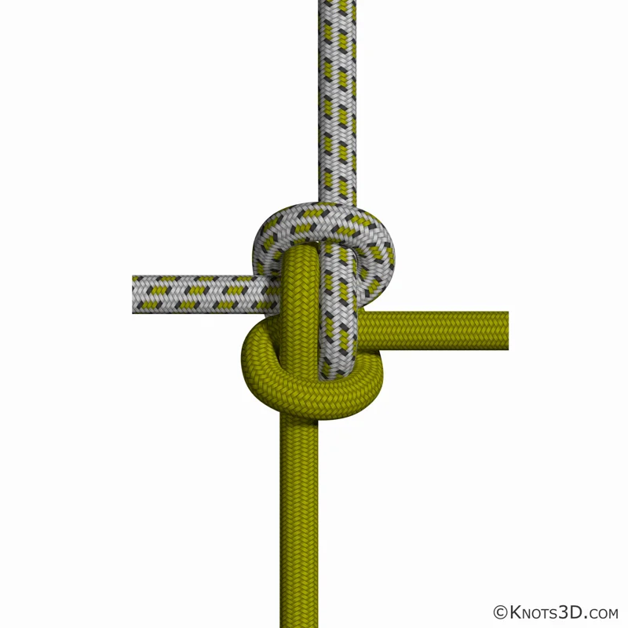
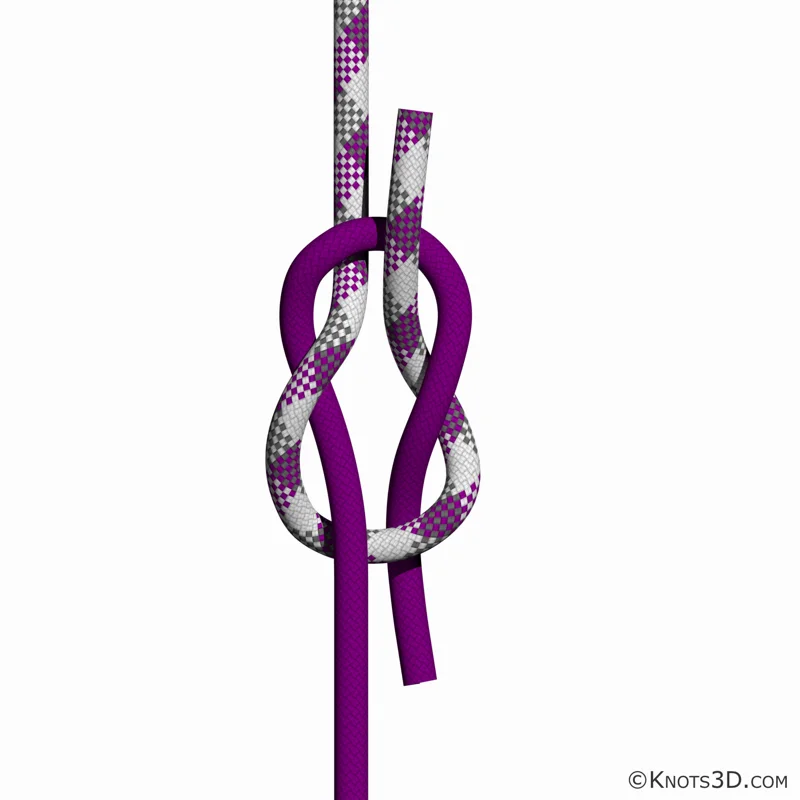
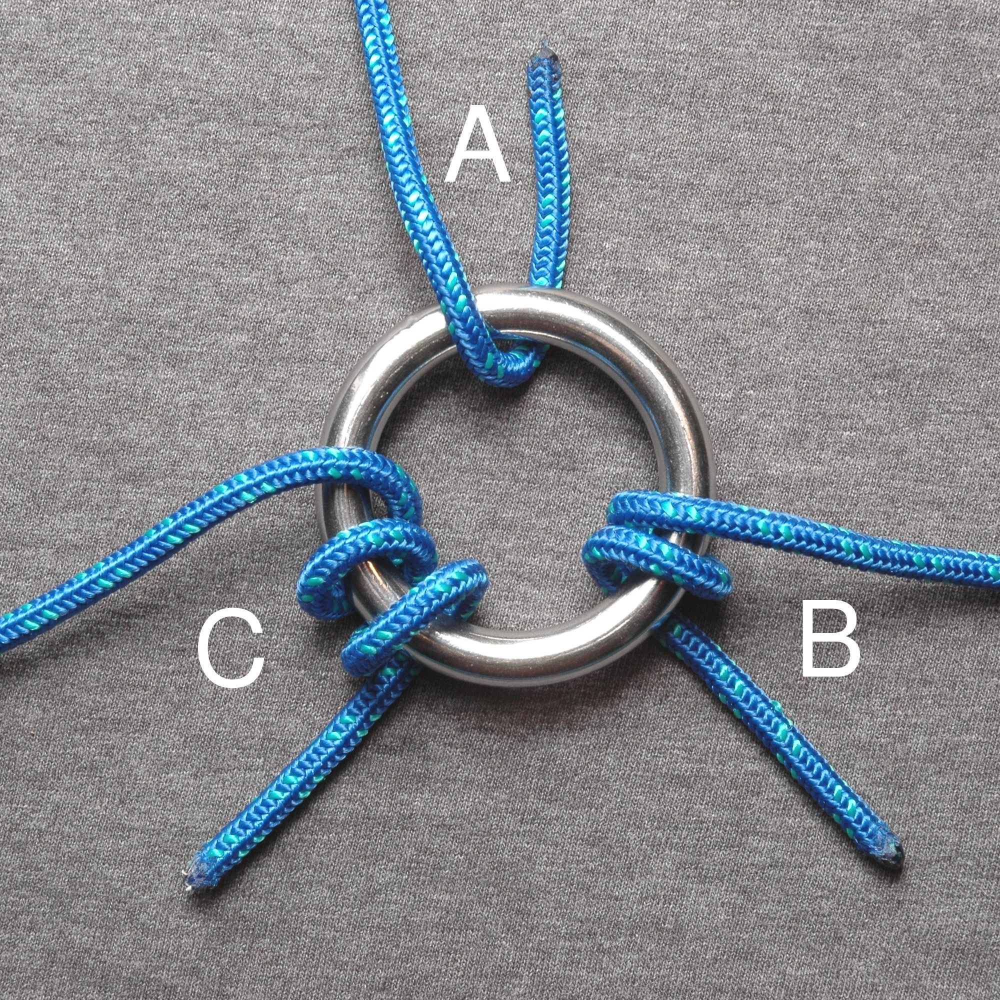
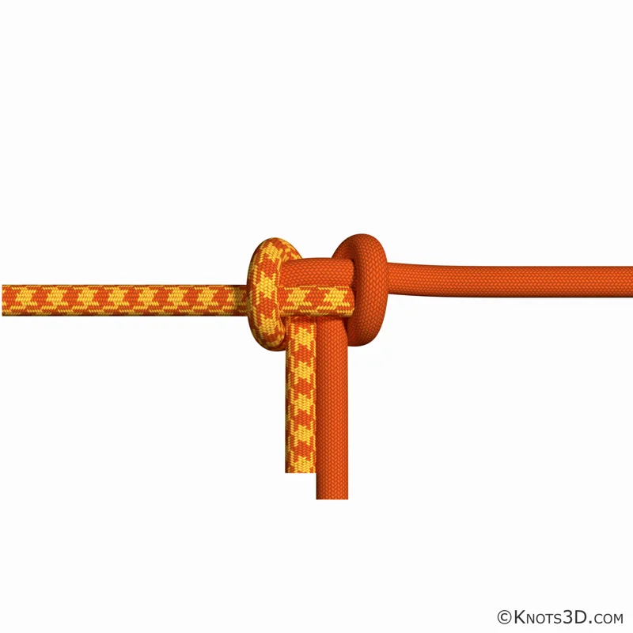
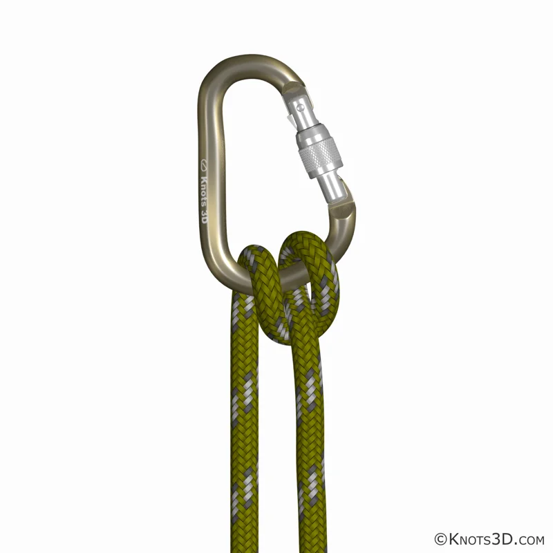
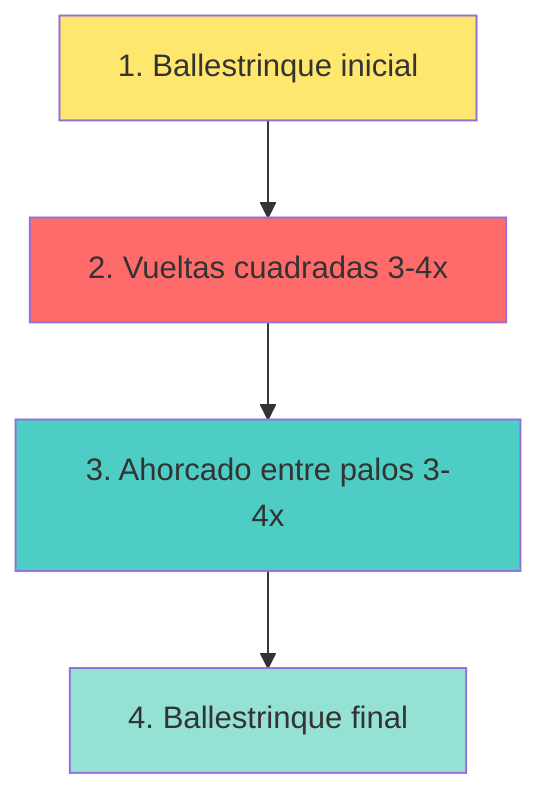
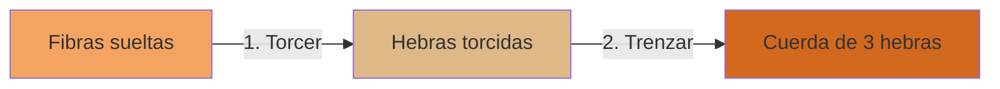

# Nudos y Amarras

**Área:** Actividades Recreativas
**Código:** AR-040
**Nivel:** 1
**Año de creación:** 1997
**Institución de origen:** Asociación General

---

## ¿CONOCES? El mundo de los nudos y amarras

Los nudos han acompañado a la humanidad desde tiempos inmemoriales. Desde los marineros que surcan los océanos hasta los escaladores que desafían montañas, pasando por los pioneros que construyen refugios en el bosque, todos dependen de saber hacer buenos nudos.

**Un nudo** es mucho más que simplemente atar una cuerda. Es una habilidad que puede salvar vidas, construir estructuras, asegurar cargas y resolver innumerables situaciones prácticas. En el escutismo y en las actividades al aire libre, dominar los nudos y amarras no es opcional: ¡es esencial!

### ¿Por qué aprender nudos?

- **Seguridad:** Un buen nudo puede ser la diferencia entre un rescate exitoso y un accidente
- **Autonomía:** Resolver problemas prácticos sin depender de otros
- **Versatilidad:** Cada nudo tiene un propósito específico
- **Tradición:** Conectar con generaciones de exploradores y aventureros

---

## TIPOS DE CUERDAS - Elige la adecuada

No todas las cuerdas son iguales. Elegir la cuerda correcta para cada situación puede marcar la diferencia entre el éxito y el fracaso de tu proyecto.

### Cuerdas Dinámicas 🏔️

Las cuerdas dinámicas son como los amortiguadores de un auto: están diseñadas para **absorber impactos**. Sus fibras están trenzadas de manera helicoidal, lo que les da una elasticidad sorprendente.

**Características:**
- Se elastecen considerablemente bajo carga
- Alta capacidad de absorción de impactos
- Excelente maniobrabilidad y bajo peso
- Diámetro típico: 7.9mm - 11mm

**¿Cuándo usarlas?**
- ✅ Escalada deportiva (simples)
- ✅ Montañismo (dobles o gemelas)
- ✅ Rescates donde puede haber caídas

**¿Cuándo NO usarlas?**
- ❌ Puentes de cuerda (se elastecen demasiado)
- ❌ Tirolinas (peligroso por la elasticidad)
- ❌ Trabajos verticales sin caídas

**Tipos de cuerdas dinámicas:**
- **Simples:** Para uso individual, un solo cabo
- **Dobles:** Se usan dos cabos en paralelo
- **Gemelas:** Corren en dos vías separadas pero paralelas

### Cuerdas Estáticas 🎯

Las cuerdas estáticas son todo lo contrario: **no se elastecen** (máximo 2% bajo carga normal). Son como una barra rígida que mantiene su forma.

**Características:**
- Casi no se elastecen bajo tensión
- Fibras paralelas en el núcleo + manga tejida protectora
- No producen torsión
- Diámetro típico: 9mm - 12mm

**¿Cuándo usarlas?**
- ✅ Puentes de cuerda
- ✅ Tirolinas
- ✅ Trabajos verticales (rapel, ascenso)

**¿Cuándo NO usarlas?**
- ❌ Escalada con posibles caídas (no absorben impacto)
- ❌ Como cuerda de seguridad en escalada

### Cuerdas Semi-estáticas

Un punto intermedio: fabricadas en **poliamida**, diseñadas especialmente para resistir el desgaste de bloqueadores y rapeladores. Son las más usadas en trabajos verticales profesionales.

---

## MATERIALES - ¿De qué está hecha tu cuerda?

### Fibras Sintéticas 🧪

Las cuerdas modernas se fabrican principalmente con materiales sintéticos porque ofrecen un rendimiento muy superior a las naturales en resistencia y durabilidad.

#### Nylon (Poliamida)

El **pionero de las fibras sintéticas** para cuerdas. Fue el primer material sintético utilizado y sigue siendo uno de los más resistentes.

**Ventajas:**
- ✅ Muy alta resistencia
- ✅ Muy elástico (ideal para escalada)
- ✅ Duradero
- ✅ Suave al tacto, sedoso

**Desventajas:**
- ❌ Pierde 5-25% de resistencia cuando está mojado
- ❌ No flota en agua
- ❌ Se enrosca fácilmente

**Usos comunes:** Escalada, montañismo, aplicaciones donde la elasticidad es deseable.

#### Poliéster

Material **importantísimo** en la composición de cuerdas estáticas y en la capa protectora de cuerdas dinámicas.

**Ventajas:**
- ✅ Gran resistencia
- ✅ Excelente compatibilidad con otras fibras
- ✅ Mantiene resistencia cuando está mojado
- ✅ No requiere cuidados especiales
- ✅ Agradable para trabajar

**Desventajas:**
- ❌ No flota

**Usos comunes:** Cuerdas estáticas, capa protectora de dinámicas, trabajos generales.

#### Polipropileno

Fácilmente reconocible por su **color amarillo** característico, aunque puede venir en otros colores.

**Ventajas:**
- ✅ Flota en agua (ideal para aplicaciones marinas)
- ✅ Económico
- ✅ Ligero

**Desventajas:**
- ❌ Algo rígido y quebradizo
- ❌ Difícil de atar bien
- ❌ Poco resistente a abrasión

**Usos comunes:** Aplicaciones marinas, rescate acuático, cuerdas de seguridad flotantes.

#### Polietileno

**Ventajas:**
- ✅ Económico
- ✅ Uso múltiple
- ✅ Ligero
- ✅ Flota bien (rescate acuático)

**Desventajas:**
- ❌ Poco resistente al desgaste sobre superficies abrasivas
- ❌ Menor resistencia que nylon o poliéster

### Fibras Naturales 🌿

Aunque las fibras sintéticas dominan el mercado moderno, las naturales tienen **valor histórico y aplicaciones específicas**. Sin embargo, **no se recomiendan para aplicaciones críticas** que pongan en riesgo la vida del usuario.

**¿Por qué evitar fibras naturales en situaciones críticas?**
- Se deterioran por descomposición biológica
- Susceptibles al moho si se guardan húmedas
- Menor resistencia que las sintéticas
- Durabilidad reducida

#### Sisal

Fibra valorada especialmente para cordeles. Sus fibras son **lisas, rectas y de color amarillo**.

**Características:**
- Buena resistencia y durabilidad
- Capacidad de estiramiento moderada
- Resistente al deterioro en agua salada
- Acepta bien ciertos colorantes

**Usos tradicionales:**
- Marina (cuerdas de barcos)
- Agricultura (guita, rescate)
- Uso industrial general

---

## MATERIALES NATURALES - De la naturaleza a tu mano

Si te encuentras en una situación de supervivencia o simplemente quieres experimentar con técnicas tradicionales, estas plantas pueden salvarte:

### Bambú 🎋

Una fibra natural **ecológica y sorprendentemente versátil**.

**Propiedades especiales:**
- Suave pero resistente
- Antibacteriana (¡natural!)
- Repelente de rayos ultravioletas
- Muy absorbente
- Confortable al tacto

**Proceso:**
Las fibras de bambú se extraen de la vara mediante tratamiento con vapor (bambú natural) o procesamiento químico controlado. Las fibras naturales son más puras y no contienen aditivos químicos. Pueden hilarse solas o mezclarse con algodón u otras fibras.

### Cáñamo 🌿

La **reina histórica** de las cuerdas náuticas.

**Historia impresionante:**
Desde el **siglo V a.C. hasta finales del siglo XIX**, el **90% de las cuerdas y velas para navegación** se hicieron con cáñamo. También era el material favorito para redes de pesca.

**¿Por qué era (y sigue siendo) tan valorado?**
- Resistencia excepcional a la humedad
- No se pudre fácilmente
- Muy duradero en ambientes marinos

Hoy en día se continúa usando en ciertas embarcaciones tradicionales que valoran estas propiedades únicas.

### Esparto 🌾

Una **hierba perenne** que alcanza hasta 1 metro de altura. Sus formaciones se llaman espartales o atochares.

**Productos tradicionales:**
- Sogas y cuerdas
- Alpargatas (calzado tradicional)
- Cestos artesanales
- Estropajos para limpieza

---

## VOCABULARIO ESENCIAL
¡Apréndelo!

Para hablar como un verdadero experto en nudos, necesitas conocer estos términos. Son el "idioma" de los nudos y amarras.

### Partes de la Cuerda

**Chicote** 🔚
Los **extremos de la cuerda**. En cuerdas sintéticas, es importante sellarlos térmicamente (con fuego) para evitar que se deshilachen. En cuerdas naturales, se puede hacer un nudo terminal.

**Firme o Parte Fija** 📏
El **resto de la cuerda** (la parte larga) con respecto a uno de sus chicotes. Es la sección principal que no estás manipulando activamente.

**Seno** ➰
Un **lazo o curva** que resulta al dar vuelta la soga sobre sí misma sin cruzar los cabos. Parece una "U" invertida.

**Punta Corrediza** 🏃
La **parte suelta de la soga** de utilidad secundaria. No es la parte principal con la que trabajas.

### Tipos de Configuraciones

**Curva** 〰️
La **forma que se le da a la cuerda** al unirla consigo misma o con otra cuerda.

**Giro o Vuelta** 🔄
Una vuelta que la cuerda da sobre sí misma y que **se ajusta consigo misma**.

**Nudo Superior** ⬆️
El **primer nudo** que se realiza y que queda en la **parte superior** de la estructura final del nudo compuesto.

**Nudo con Lazo Corredizo** 🎚️
Un tipo de nudo especial que puede ser **ajustado** deslizando una parte de la cuerda. El lazo se hace más grande o pequeño según necesites.

### Técnicas de Unión

**Amarra** 🔗
La **unión de objetos** (generalmente palos o troncos) mediante la atadura de cuerdas. Se usa para construir estructuras como mesas, puentes, torres.

**Unión de Cuerdas (Empalme)** 🤝
La **unión de dos cuerdas** a través de la combinación de sus hebras. No es un simple nudo, sino una conexión más permanente y resistente.

---

## CUIDANDO TU CUERDA
Como un escalador profesional

Tu cuerda puede salvarte la vida. Por eso, cuidarla no es opcional: **es obligatorio**. Nuestra seguridad depende del buen estado de nuestras cuerdas.

### Regla de Oro ⚠️

> **Ante la más mínima duda sobre el estado de una cuerda, CÓRTALA por el lugar dañado o SUSTITÚYELA por completo.**

**¡Nunca te arriesgues!** Es mejor "desperdiciar" un metro de cuerda que arriesgar tu vida o la de otros.

### Cuidados Esenciales 🧼

#### NO Pisarlas 👟❌

Puede parecer inofensivo, pero pisar una cuerda:
- Introduce partículas de tierra y arena
- Daña las fibras internas (aunque no se vea por fuera)
- Reduce drásticamente su vida útil

**Especialmente crítico** en ambientes con arena o grava, que actúa como papel de lija microscópico.

#### Limpieza Correcta 💧

**Proceso paso a paso:**
1. **Elimina barro y suciedad** cuidadosamente
2. **Lava a mano** (nunca en lavadora)
3. Usa agua tibia (no caliente)
4. **NO uses productos químicos agresivos** (jabones suaves están OK)
5. Enjuaga completamente

**Secado:**
- Cuélgala en lugar **bien aireado**
- **Protegida del sol directo** (los rayos UV degradan las fibras)
- Nunca uses secadora ni fuentes directas de calor

#### Almacenamiento 📦

**Lugar ideal:**
- Seco y aireado
- Protegido de luz solar directa
- **Lejos de agentes químicos** (gasolina, solventes, ácidos, etc.)
- Alejado de fuentes de calor (estufas, radiadores)
- Sin objetos cortantes cerca

**Cómo guardarla:**
- Enrollada ordenadamente o en espiral (aduja)
- Nunca anudada permanentemente (debilita las fibras)
- En bolsa de malla (para que respire) o caja limpia

#### Cuidado de los Chicotes 🔥

**Cuerdas sintéticas:**
- Después de cortar, **sella térmicamente los extremos** con fuego
- Acerca brevemente la punta a una llama hasta que se derrita ligeramente
- Deja enfriar (¡cuidado, está caliente!)
- Esto evita que se deshilache

**Cuerdas naturales:**
- Haz un nudo terminal o remate
- Otra opción: envuelve con cinta adhesiva o hilo

### Inspección Regular 🔍

**Antes de cada uso, revisa:**
- ✅ ¿Hay cortes o abrasiones visibles?
- ✅ ¿Partes deshilachadas o aplastadas?
- ✅ ¿Zonas rígidas o muy blandas?
- ✅ ¿Cambios de color (posible daño químico)?
- ✅ ¿Olor extraño (posible contaminación química)?

**Si encuentras CUALQUIERA de estos problemas:** corta esa sección o retira la cuerda de servicio.

---

## ¿SABÍAS QUE? La sabiduría de las cuerdas

La Biblia, en su infinita sabiduría, también habla sobre cuerdas y su importancia. En **Eclesiastés 4:12** encontramos un versículo que todo conquistador debería memorizar:

> *"Y si alguno prevaleciere contra uno, dos le resistirán; y cordón de tres dobleces no se rompe pronto."*
> — Eclesiastés 4:12

### ¿Qué nos enseña esto? 🤔

Este versículo no solo habla de cuerdas físicas, sino de principios profundos:

**1. La unidad es fuerza** 💪
Una cuerda de tres hebras es **significativamente más fuerte** que tres cuerdas individuales. Del mismo modo, cuando trabajamos unidos (familia, equipo, iglesia), somos más fuertes.

**2. El trabajo en equipo** 🤝
En los Conquistadores aprendemos que "juntos logramos más". Este versículo lo confirma: **dos resisten más que uno**, y tres aún más.

**3. Diseño inteligente** 🧠
Las cuerdas trenzadas (de tres o más hebras) no solo son más fuertes: también son más **flexibles y resistentes al desgaste**. Es física y sabiduría antigua combinadas.

**4. Aplicación espiritual** ✝️
Cuando Dios está en el centro de nuestras relaciones (como la tercera hebra), esas relaciones son **prácticamente inquebrantables**.

### Comprobación Práctica

La próxima vez que veas una cuerda trenzada de tres hebras, haz esta prueba:
1. Intenta romper una hebra individual → relativamente fácil
2. Intenta romper las tres hebras trenzadas → ¡casi imposible!

**La diferencia es asombrosa.** No es 3 veces más fuerte, ¡es mucho más!

---

## NUDOS - La práctica hace al maestro

En las siguientes secciones aprenderás los nudos más importantes clasificados por su uso. Para cada nudo encontrarás:
- **¿Para qué sirve?** - Usos prácticos
- **Limitaciones** - Cuándo NO usarlo
- **Cómo hacerlo** - Instrucciones paso a paso

**IMPORTANTE:** Esta especialidad requiere que domines **al menos 20 nudos diferentes** de las siguientes categorías. Practica cada uno hasta que puedas hacerlo de memoria, ¡incluso con los ojos cerrados!

### NUDOS ELEMENTALES - Los básicos que DEBES dominar

#### Nudo Simple (Overhand Knot)

El **nudo más básico** de todos.

**¿Para qué sirve?**
- Evitar que una cuerda se deslice por un agujero
- Base para otros nudos más complejos
- Hacer un tope al final de una cuerda

**Limitaciones:**
- Se aprieta mucho bajo carga (difícil de deshacer)
- Debilita la cuerda aproximadamente 50%

#### Nudo de Ocho (Figure Eight)

El **hermano mayor del nudo simple**. Mucho más útil y seguro.

**¿Para qué sirve?**
- Tope de seguridad que NO se desliza
- Base para el As de Guía
- Inicio de muchos nudos de rescate

**Ventajas:**
- Más fácil de deshacer después de carga
- Más voluminoso (mejor tope)
- Debilita menos la cuerda (~25%)

#### Nudo Simple Triple

Una **variación reforzada** del nudo simple. Ideal cuando necesitas más volumen.

#### Nudo Fraile (Franciscan Knot)

Un nudo **decorativo y funcional** que crea un bulto característico en forma de barril.

**¿Para qué sirve?**
- Crear un tope decorativo al final de una cuerda
- Añadir peso a una cuerda lanzada
- Base para nudos ornamentales más complejos

**Características:**
- Forma una bola o bulto distintivo
- Más voluminoso que el nudo simple
- Mantiene su forma bajo tensión

**Cómo hacerlo:**
1. Forma tres lazos superpuestos
2. Pasa el chicote a través de cada lazo
3. Aprieta gradualmente hasta formar el barril

### NUDOS DE UNIÓN - Conectando cuerdas

#### Nudo Llano o Rizo (Square Knot)

El **clásico** para unir dos cuerdas **del mismo grosor**.

**¿Para qué sirve?**
- Unir dos cuerdas temporalmente
- Atar paquetes o vendajes
- Cerrar bolsas

**IMPORTANTE - Limitaciones:**
- ❌ **NUNCA para escalada o rescate**
- ❌ No usar con cuerdas de diferente grosor

**Cómo recordarlo:** "Derecha sobre izquierda, izquierda sobre derecha"

**Cómo hacerlo:**
1. Primer medio nudo: punta derecha sobre izquierda, pasa por abajo
2. Segundo medio nudo: punta izquierda sobre derecha, pasa por abajo
3. Debe quedar simétrico (chicotes paralelos al firme de cada lado)

**Verificación:** Si los chicotes salen por el mismo lado, es un nudo falso (peligroso). Deshaz y vuelve a intentar.

#### Nudo de Pescador (Fisherman's Knot)

Un nudo **seguro y confiable** para unir cuerdas, especialmente mojadas.

**Ventajas:**
- Más seguro que el nudo llano
- Funciona bien con cuerdas mojadas
- No se afloja fácilmente

#### Nudo de Escota (Sheet Bend)

El nudo ideal cuando necesitas unir **cuerdas de diferente grosor**.

**¿Para qué sirve?**
- Unir cuerda gruesa con cuerda delgada
- Unir cuerda con un lazo o anilla
- Marinería (sujetar velas)

**Cómo hacerlo:**
1. Forma un seno con la cuerda **más gruesa**
2. Pasa la cuerda delgada POR el seno
3. Rodea AMBAS partes del seno
4. Pasa por debajo de sí misma
5. Aprieta

**Nudo de Escota Doble:** Para mayor seguridad, da una vuelta extra.

#### Nudo de Pescador Doble (Double Fisherman's)

La versión **reforzada** del nudo de pescador. Es el estándar para unir cuerdas de escalada.

**¿Para qué sirve?**
- Unir cuerdas de escalada (el más seguro)
- Hacer lazos cerrados permanentes
- Uniones que no se pueden revisar constantemente

**Ventajas:**
- Extremadamente seguro (casi imposible que se deslice)
- Funciona con cuerdas modernas resbaladizas
- Usado por escaladores profesionales

**Limitaciones:**
- Muy difícil de deshacer después de carga
- Más voluminoso que el pescador simple

**Cómo hacerlo:**
1. Haz DOS nudos simples con la primera cuerda alrededor de la segunda
2. Haz DOS nudos simples con la segunda cuerda alrededor de la primera
3. Aprieta cada par de nudos
4. Junta ambos lados tirando de los firmes

#### Nudo de Cazador (Hunter's Bend)

Un nudo **elegante y seguro** para unir cuerdas del mismo grosor.

**¿Para qué sirve?**
- Unir dos cuerdas de forma segura
- Alternativa al nudo llano (más confiable)
- Situaciones donde necesitas deshacer después

**Ventajas:**
- Más seguro que el nudo llano
- Simétrico y equilibrado
- Relativamente fácil de deshacer

**Historia curiosa:** Inventado en 1978 por el Dr. Edward Hunter. ¡Es un nudo relativamente moderno!

**Cómo hacerlo:**
1. Forma dos lazos superpuestos (en direcciones opuestas)
2. Pasa ambos chicotes por ambos lazos
3. Aprieta gradualmente

#### Nudo Cirujano (Surgeon's Knot)

Similar al nudo llano pero con **vueltas extras** en el primer medio nudo para mayor seguridad.

**¿Para qué sirve?**
- Unir cuerdas bajo tensión constante
- Materiales resbaladizos (nylon, sedal de pesca)
- Suturas quirúrgicas (de ahí su nombre)

**Ventajas:**
- Las vueltas extras evitan que se afloje mientras haces el segundo medio nudo
- Más seguro que el nudo llano en materiales resbaladizos
- Aguanta tensión durante el atado

**Cómo hacerlo:**
1. Primer medio nudo: da DOS o TRES vueltas (en lugar de una)
2. Segundo medio nudo: una vuelta normal
3. Aprieta firmemente

**Usos médicos:** Los cirujanos lo usan para suturar porque se mantiene apretado mientras trabajan.

#### Nudo Falso (Granny Knot)

El nudo que **parece** un nudo llano pero **NO lo es**. Es importante conocerlo para NO hacerlo accidentalmente.

**¿Para qué sirve?**
- ❌ **Para NADA** - Es un nudo defectuoso
- Solo se enseña para que aprendas a **evitarlo**

**¿Por qué es peligroso?**
- Se desliza bajo carga
- Se aprieta desordenadamente
- Se deshace fácilmente
- Puede fallar en situaciones críticas

**¿Cómo se hace por error?**
Cuando intentas hacer un nudo llano pero:
- Haces "derecha sobre izquierda" DOS veces (en lugar de alternar)
- Los chicotes salen por el mismo lado (en lugar de opuestos)

**Cómo identificarlo:**
- Nudo llano: chicotes salen por lados opuestos y paralelos ✅
- Nudo falso: chicotes salen por el mismo lado ❌

**Lección importante:** Este nudo te enseña que los detalles importan en nudos. Un pequeño error puede ser la diferencia entre seguro y peligroso.

#### Nudo de Grupo de Calabrote (Carrick Bend)

Un nudo **clásico y decorativo** para unir cuerdas gruesas.

**¿Para qué sirve?**
- Unir cabos gruesos o cables
- Trabajo náutico profesional
- Cuando necesitas un nudo que quede plano

**Ventajas:**
- Muy fuerte con cuerdas gruesas
- Se puede deshacer relativamente fácil
- Queda plano (no hace bulto)
- Hermoso y simétrico

**Limitaciones:**
- Puede deslizarse con cuerdas muy resbaladizas
- Requiere práctica para hacerlo correctamente

**Historia:** Usado tradicionalmente en barcos para unir cables de ancla y cabos gruesos.

**Nudo de Grupo de Calabrote Doble:** Versión reforzada con lazos dobles. Aún más seguro para cargas pesadas.

### NUDOS DE ANCLAJE - Asegurando tu posición

#### As de Guía (Bowline)

El **rey de los nudos**. Muchos lo consideran el nudo perfecto.

**¿Por qué es tan especial?**
- Forma un lazo que **NO se corre**
- Fácil de deshacer incluso después de mucha tensión
- Seguro bajo carga

**¿Para qué sirve?**
- Rescate (hacer arnés de emergencia)
- Anclar cuerda a árbol o poste
- Escalada
- Marinería

**Cómo recordarlo - Método del conejo:**
1. "El conejo sale de su madriguera"
2. "Da la vuelta al árbol"
3. "Regresa a su madriguera"

#### Ballestrinque (Clove Hitch)

Nudo **rápido y práctico** para sujetar a postes redondos.

**¿Para qué sirve?**
- Inicio y final de amarras
- Sujetar temporalmente a un poste
- Ajustar rápidamente la tensión

**Limitaciones:**
- Se afloja si no hay tensión constante
- Puede deslizarse en postes lisos

#### Cote o Vuelta de Braza (Half Hitch)

El nudo más simple para asegurar.

**Dos Cotes (Two Half Hitches):** Mucho más seguro. Es el estándar para sujetar cuerdas a anillas o postes.

#### Nudo Ancla (Anchor Hitch/Bend)

Un nudo **específicamente diseñado** para sujetar cuerdas a anillas de anclas de barcos.

**¿Para qué sirve?**
- Sujetar cabo a anilla de ancla
- Amarrar a argollas bajo tensión constante
- Situaciones donde hay movimiento y vibración

**Ventajas:**
- Muy seguro bajo vibración constante
- No se afloja con movimiento
- Resistente a la abrasión
- Tradicional en marinería

**Cómo hacerlo:**
1. Pasa el cabo por la anilla
2. Da dos vueltas redondas alrededor de la anilla
3. Pasa el chicote por dentro de ambas vueltas
4. Completa con dos cotes alrededor del firme

**Tip náutico:** Los marineros a veces aseguran el chicote al firme con una banda para máxima seguridad.

*Imagen: Descargar de https://knots3d.com/es/vuelta-de-ancla-nudo*

#### Nudo Constrictor (Constrictor Knot)

El nudo que **aprieta como una serpiente** y NO se suelta.

**¿Para qué sirve?**
- Cerrar bolsas de forma permanente
- Sujetar mangos a herramientas
- Hacer vendajes temporales de emergencia
- Sellar extremos de cuerdas (alternativa a sellar con fuego)

**Características especiales:**
- Se aprieta más y más bajo tensión
- **Casi imposible de deshacer** sin cortar (es permanente)
- Muy fino y compacto
- Increíblemente seguro

**Cómo hacerlo:**
1. Da una vuelta alrededor del objeto
2. Cruza por encima formando una "X"
3. Pasa el chicote POR DEBAJO de la primera vuelta
4. Mete el chicote por la "X"
5. Aprieta fuerte

**IMPORTANTE:** Solo úsalo cuando quieras algo PERMANENTE. Para deshacerlo, generalmente hay que cortarlo.

#### Nudo Corredizo (Slip Knot)

Un nudo ajustable que puede apretarse o aflojarse tirando de un extremo.

**¿Para qué sirve?**
- Lazos ajustables
- Atrapar animales (lazo vaquero básico)
- Inicio de proyectos de tejido/crochet
- Sujeciones temporales que necesitas aflojar rápido

**Ventajas:**
- Se ajusta fácilmente
- Se suelta tirando del chicote
- Rápido de hacer

**Limitaciones:**
- ❌ NUNCA para seguridad personal (se puede soltar)
- ❌ No para cargas críticas
- Puede apretarse demasiado y bloquear

**Cómo hacerlo:**
1. Forma un seno
2. Haz un nudo simple ALREDEDOR del firme (no en el chicote)
3. El lazo resultante es corredizo

*Imagen: Descargar de https://knots3d.com/es/nudo-corredizo*

#### Vuelta Redonda (Round Turn)

Una técnica más que un nudo: dar **dos vueltas completas** alrededor de un objeto antes de hacer el nudo.

**¿Para qué sirve?**
- Reducir la tensión en el nudo final
- Aumentar la fricción (más agarre)
- Base para "Vuelta redonda con dos cotes" (nudo muy seguro)

**Ventajas:**
- Distribuye la carga (menos estrés en un punto)
- Aumenta la fricción dramáticamente
- Más seguro para cargas pesadas

**Aplicación común:** "Round Turn and Two Half Hitches" es uno de los nudos de anclaje más seguros que existen.

**Cómo hacerlo:**
1. Da UNA vuelta completa alrededor del poste/anilla
2. Da OTRA vuelta completa en la misma dirección
3. Continúa con tu nudo elegido (usualmente dos cotes)

*Izquierda: Vuelta simple | Centro: Vuelta redonda | Derecha: Dos vueltas redondas*

#### As de Guía Corredizo (Running Bowline)

Un as de guía que puede **ajustarse** como un lazo.

**¿Para qué sirve?**
- Lazos ajustables seguros
- Rescate donde necesitas ajustar el lazo a distancia
- Sujeción de objetos de tamaño variable

**Ventajas:**
- Combina seguridad del as de guía con ajustabilidad
- No se aprieta excesivamente
- Se puede deshacer después de carga

**Cómo hacerlo:**
1. Haz un as de guía normal
2. Pasa TODO el firme por el lazo del as de guía
3. El resultado es un lazo corredizo seguro

### NUDOS DE SALVAMENTO - Para emergencias

#### Nudo de Silla de Bombero (Bowline on a Bight)

Crea un arnés de emergencia **sin necesidad de los extremos de la cuerda**.

**¿Para qué sirve?**
- Rescate de personas (emergencias)
- Crear dos lazos seguros
- Bajar personas de edificios

**Cómo hacerlo:**
1. Dobla la cuerda formando un seno largo
2. Haz un as de guía usando el seno doblado (como si fuera un chicote)
3. El resultado son dos lazos paralelos

**Uso en rescate:**
- Lazo 1: Bajo los brazos de la persona
- Lazo 2: Bajo las piernas (como asiento)

**IMPORTANTE:** Este es un arnés de **emergencia**, no reemplaza un arnés profesional.

#### Nudo Prusik

Un nudo **autobloqueante** revolucionario.

**¿Para qué sirve?**
- Ascender por una cuerda fija
- Sistema de seguridad de respaldo en escalada
- Rescates técnicos verticales

**Características especiales:**
- Se desliza cuando NO hay carga (puedes moverlo)
- Se BLOQUEA automáticamente bajo carga (seguridad)
- Puede ser liberado y reposicionado fácilmente

**Cómo funciona:**
La fricción de las vueltas alrededor de la cuerda principal crea el bloqueo automático. Es física pura.

**Cómo hacerlo:**
1. Usa un lazo cerrado de cuerda auxiliar (más delgada)
2. Enrolla el lazo alrededor de la cuerda principal 3-4 veces
3. Pasa el lazo por sí mismo
4. Aprieta las vueltas

**IMPORTANTE:** La cuerda del prusik debe ser más delgada y flexible que la cuerda principal (diferencia mínima 2mm).

#### As de Guía Doble (Double Bowline / Bowline on a Bight)

Crea **dos lazos seguros** en el medio de una cuerda sin usar los extremos.

**¿Para qué sirve?**
- Rescate de personas (un lazo bajo brazos, otro bajo piernas)
- Crear dos puntos de anclaje
- Silla improvisada de emergencia

**Ventajas:**
- No necesitas los extremos de la cuerda
- Crea dos lazos que NO se corren
- Muy seguro bajo carga
- Se puede deshacer después de uso

**Cómo hacerlo:**
1. Dobla la cuerda formando un seno largo
2. Haz un as de guía usando el seno doblado (como si fuera un chicote)
3. El resultado son dos lazos paralelos

**Uso en rescate:**
- Lazo 1: Bajo los brazos de la persona
- Lazo 2: Bajo las piernas (como asiento)
- La persona queda en posición sentada segura

#### Nudo Mariposa (Alpine Butterfly Loop)

Un nudo **perfecto para el centro de una cuerda** que crea un lazo fijo sin usar los extremos.

**¿Para qué sirve?**
- Crear punto de anclaje en medio de una cuerda
- Aislar una sección dañada de la cuerda
- Enganchar mosquetón en centro de línea de vida
- Rescates donde múltiples personas se atan a la misma cuerda

**Ventajas:**
- Se puede cargar en TRES direcciones (único que lo hace)
- No rota ni deforma la cuerda
- Mantiene 100% resistencia en las direcciones correctas
- El favorito de alpinistas para cuerdas tensadas

**Por qué se llama "Mariposa":**
Cuando lo haces correctamente, la forma se parece a una mariposa con alas extendidas.

**Cómo hacerlo (método rápido):**
1. Enrolla la cuerda alrededor de tu mano 2 veces
2. Pasa el lazo de afuera sobre los otros dos
3. Pasa ese lazo por detrás de los otros
4. Sácalo por el centro y aprieta

**Aplicación crítica:** En cuerdas de seguridad para glaciares, se hacen mariposas cada ciertos metros para que los escaladores se enganchen.

### NUDOS DE IZAMIENTO - Levantando cargas

#### Margarita (Sheepshank)

Un nudo ingenioso que sirve para **acortar una cuerda sin cortarla**.

**¿Para qué sirve?**
- Acortar temporalmente una cuerda larga
- Aislar una sección dañada de la cuerda

**Limitación:**
- Se deshace si no hay tensión constante

#### Vuelta de Ballestrinque con Mosquetón

Combinación ideal para izamiento de materiales.

**¿Para qué sirve?**
- Izar mochilas o equipo al campamento
- Levantar materiales de construcción
- Rescate de objetos (no personas)

**Ventajas:**
- Rápido de hacer
- Fácil de ajustar
- El mosquetón facilita desconexión rápida

#### Nudo Dogal de Verdugo (Hangman's Noose)

Un nudo **histórico y controvertido** con forma de lazo corredizo grande.

**¿Para qué sirve?**
- Izar objetos pesados de forma segura
- Lazo que se ajusta alrededor de objetos irregulares
- Historicamente usado en navegación para izar cargas

**Características:**
- Lazo corredizo con múltiples vueltas (5-13 vueltas típicas)
- Las vueltas múltiples distribuyen la carga
- Muy resistente para cargas verticales
- El lazo se ajusta a la carga

**Nota histórica:** Conocido por su uso histórico en ejecuciones, pero tiene aplicaciones legítimas en marinería e izamiento de cargas. Hoy se usa principalmente en trabajo pesado y construcción.

**Cómo hacerlo:**
1. Forma un lazo largo
2. Enrolla el chicote alrededor del firme formando espiral (5-13 vueltas)
3. Pasa el chicote por el lazo original
4. Aprieta las vueltas hacia el lazo

**Aplicación moderna:** Izar troncos, sacos de materiales, equipo pesado en construcción.

*Imagen: Descargar de https://www.animatedknots.com/hangmans-noose-knot (imagen estática, no GIF)*

#### Nudo Dinámico / UIAA / Munter Hitch (HMS)

El nudo de **aseguramiento dinámico** usado en escalada y rescate.

**¿Para qué sirve?**
- Asegurar a un escalador (dar seguro)
- Rapel de emergencia sin dispositivo especial
- Descenso controlado de cargas
- Rescates técnicos

**Características especiales:**
- Crea FRICCIÓN controlada (permite frenar y soltar)
- Reversible (funciona en ambas direcciones)
- Solo requiere mosquetón HMS (forma de pera)
- Disipa calor del descenso

**Ventajas:**
- No necesitas dispositivo especial de aseguramiento
- Funciona con cualquier mosquetón HMS
- Permite subir y bajar al escalador
- Estándar en rescate profesional

**Limitaciones:**
- Tuerce la cuerda (crea cocas)
- Genera más calor que dispositivos especializados
- Requiere técnica correcta de frenado

**Cómo hacerlo:**
1. Pasa la cuerda por el mosquetón formando una "S"
2. Gira una de las vueltas 180°
3. Engancha ambas vueltas al mosquetón
4. El mosquetón debe tener forma HMS (pera) para que funcione bien

**Técnica de uso:**
- Mano de freno: siempre en el lado del chicote
- Para frenar: agarra fuerte el lado del chicote
- Para soltar: afloja gradualmente

**Por qué se llama "Munter":** Por Werner Munter, rescatista suizo que lo popularizó en los años 70.

#### Vuelta de Gato / Zarpa de Gato (Cat's Paw)

Un nudo **ingenioso** para enganchar un lazo cerrado a un gancho.

**¿Para qué sirve?**
- Conectar eslinga a gancho de grúa
- Izar cargas con un lazo cerrado
- Trabajo industrial y construcción

**Ventajas:**
- Muy fuerte (distribuye carga en 4 puntos)
- Se auto-ajusta bajo carga
- Simple pero efectivo

**Cómo hacerlo:**
1. Dobla un lazo cerrado formando dos lazos paralelos
2. Tuerce cada lazo varias vueltas en direcciones opuestas
3. Pasa el gancho por ambos lazos
4. Al cargar, los lazos se ajustan al gancho

### NUDOS ORNAMENTALES - Arte con cuerdas

Los nudos no son solo utilitarios, ¡también pueden ser obras de arte!

#### Nudo Franciscano / Corona (Crown Knot)

Un nudo **decorativo clásico** también conocido como "Corona".

**¿Para qué sirve?**
- Decoración de extremos de cuerda
- Terminales de cortinas o cordones
- Base para trenzados más complejos
- Trabajo artesanal con cuerdas

**Características:**
- Forma una "corona" con las hebras
- Requiere mínimo 3 hebras
- Puede combinarse con otros nudos decorativos
- Base del nudo fraile

**Técnica:**
Las hebras se entrelazan formando un patrón circular que se ve como una corona desde arriba.

#### Piña Americana (Pineapple Knot)

Una terminación **elaborada y elegante** que parece una piña.

**¿Para qué sirve?**
- Decoración de cabos náuticos
- Remate de látigos o fouets
- Arte decorativo con cuerdas
- Peso decorativo en extremos

**Características:**
- Muy vistoso y profesional
- Requiere práctica considerable
- Múltiples patrones posibles

#### Nudo Cuadrado Decorativo (Chinese Button)

Un nudo **ornamental tridimensional** hermoso y simétrico.

**¿Para qué sirve?**
- Botones decorativos en ropa tradicional
- Joyería con cordón
- Arte decorativo
- Centro de pulseras y collares

**Características:**
- Forma cuadrada o circular simétrica
- Se ve igual desde múltiples ángulos
- Tradicional en cultura china
- También conocido como "botón chino"

**Historia:** Usado durante siglos en Asia para crear botones funcionales y decorativos en vestimenta tradicional.

**Cómo hacerlo:**
Es un nudo complejo que requiere paciencia:
1. Forma dos lazos superpuestos
2. Entreteje los extremos siguiendo un patrón simétrico
3. Ajusta gradualmente hasta formar el cuadrado
4. Los extremos salen por lados opuestos

*Imagen: Descargar de https://upload.wikimedia.org/wikipedia/commons/3/3b/Chinese_button_knot.jpg*

#### Encapilladura (Crown and Wall / Pata de Conejo)

Un nudo **terminal decorativo** para extremos de cuerda de tres hebras.

**¿Para qué sirve?**
- Remate profesional de cabos náuticos
- Evitar deshilachado de forma elegante
- Trabajo marinero tradicional

**Características:**
- Combina nudo de corona con nudo de pared
- Muy firme y profesional
- Requiere cuerda de múltiples hebras

**Aplicación:** Ver en barandas de barcos, terminales de cabos decorativos.

### NUDOS DE SUJETAR - Fijando objetos

#### Tensor o Truckers Hitch

El nudo que te da **superpoderes de fuerza**.

**Magia del nudo:**
Crea un sistema de **polea simple** que multiplica tu fuerza.

**¿Para qué sirve?**
- Asegurar cargas en camionetas
- Tensar cuerdas de carpas
- Atar objetos que necesitan MUCHA tensión

#### Boca de Lobo / Nudo de Leñador (Timber Hitch)

Perfecto para **arrastrar troncos** o postes largos.

**¿Para qué sirve?**
- Arrastrar troncos o postes
- Remolcar objetos cilíndricos
- Inicio de amarras diagonales
- Mover material de construcción

**Características especiales:**
- Se aprieta automáticamente bajo carga (más tiras, más agarra)
- Se suelta fácilmente cuando no hay tensión
- Muy rápido de hacer
- Funciona mejor con superficies rugosas

**Cómo hacerlo:**
1. Rodea el objeto con la cuerda
2. Pasa el chicote alrededor del firme
3. Enrolla el chicote sobre sí mismo 3-4 vueltas
4. Aprieta tirando del firme

**Tip de leñador:** Para troncos muy largos, combina con media vuelta al otro extremo para mejor control de dirección.

### NUDOS DE ACORTAMIENTO - Ajustando longitud

#### Margarita (ya descrito arriba)

#### Nudo de Cirujano

Similar al nudo llano pero con **vueltas extras** para mayor seguridad.

---

## EMPALMES Y REMATES - Trabajo avanzado

### ¿Qué es un Empalme?

Un **empalme** no es simplemente un nudo: es una técnica donde las **hebras de dos cuerdas se entretejen** para crear una unión casi tan fuerte como la cuerda original.

**Ventajas sobre nudos:**
- Más resistente (conserva ~95% de la fuerza)
- Más delgado (pasa mejor por poleas)
- Permanente (no se deshace)

*Ejemplo visual de empalme corto mostrando el entretejido de hebras*

### Empalmes que debes dominar:

1. **Empalme Corto** - La técnica básica
2. **Empalme "Ojo de Águila"** - Crea un lazo permanente
3. **Empalme Piña Acollador** - Remate decorativo
4. **Remate Piña de Rosa Doble / Matthew Walker** - Técnicas elaboradas
5. **Piña Simple** - Remate básico decorativo
6. **Cola de Puerco** - Remate rápido y efectivo

---

## AMARRAS - Construyendo estructuras

Las amarras son la base de la construcción pionera. Con ellas puedes construir desde mesas simples hasta puentes completos.

### ¿Qué es una Amarra?

Una **amarra** es la unión de dos o más palos/troncos mediante cuerdas, creando estructuras resistentes sin necesidad de clavos o tornillos.

### Principios Básicos

1. **Siempre iniciar con Ballestrinque** (anclaje inicial)
2. **Apretar cada vuelta** (firmeza es clave)
3. **"Ahorcar" el amarre** (vueltas perpendiculares que aprietan)
4. **Terminar con Ballestrinque o Llano** (asegurar el final)

### Amarra Cuadrada

Para unir dos palos que se cruzan a **90 grados** (ángulo recto).

**¿Cuándo usarla?**
- Mesas de campamento
- Marcos rectangulares
- Torres y estructuras

**Proceso:**
1. Ballestrinque en uno de los palos
2. Da 3-4 vueltas SOBRE uno, BAJO el otro
3. Da 3-4 vueltas ENTRE los palos (esto "ahorca")
4. Termina con Ballestrinque

### Amarra Diagonal

Para unir palos que se cruzan en **cualquier ángulo**.

**¿Cuándo usarla?**
- Refuerzos diagonales
- Estructuras tipo "X"
- Trípodes y caballetes

### Amarra Paralela o Redonda

Para unir palos **paralelos**, como extender un palo largo.

**¿Cuándo usarla?**
- Hacer asta bandera larga
- Extender vigas
- Reparar un palo roto

### Amarra Continua Simple

Para unir **varios palos en fila** formando una plataforma.

**¿Cuándo usarla?**
- Hacer mesa larga
- Plataforma elevada
- Piso de refugio

### Amarra Continua Doble

Versión **reforzada** de la continua simple. En cada unión, agregas un **cote** extra.

**¿Cuándo usarla?**
- Mesas que soportarán mucho peso
- Estructuras más permanentes

---

## FABRICANDO TU PROPIA CUERDA
De la naturaleza a tu mano

Una habilidad ancestral que puede salvarte en situaciones de supervivencia.

### ¿Por qué Aprender Esto?

- **Autonomía:** En supervivencia, fabricar cuerda puede ser crucial
- **Conexión histórica:** Así lo hacían nuestros ancestros
- **Comprensión:** Entender cómo funciona una cuerda

**Recuerda Eclesiastés 4:12:** *"Cordón de tres dobleces no se rompe pronto"* — ¡esto es literal!

### Cuerda de Tres Hebras

La técnica más común y efectiva.

**Proceso:**
1. Preparar tres manojos de fibras del mismo grosor
2. Atar los extremos juntos temporalmente
3. Fijar el extremo atado a un punto fijo
4. Torcer cada hebra individualmente en sentido horario
5. Trenzar pasando la hebra derecha sobre la central
6. Agregar fibras cuando las hebras se acortan

**Longitud del proyecto:** 2 metros (requisito de la especialidad)

### Cuerda con Trenzado Triple

Una técnica más **avanzada y fuerte**.

**Diferencia:** En lugar de tres hebras simples, usas tres **cuerdas de tres hebras** (3 × 3 = 9 fibras totales).

**Resultado:**
- Mucho más gruesa y resistente
- Ideal para cargas pesadas

---

## 📋 LISTA COMPLETA DE NUDOS DOCUMENTADOS
Elige tus 20 favoritos

Este manual documenta **34 nudos y técnicas** diferentes. El requisito es dominar **mínimo 20** de ellos, distribuyendo tu elección entre las categorías.

### ✅ NUDOS ELEMENTALES (4 disponibles - elige 3)

1. **Nudo Simple** (Overhand Knot) - El más básico
2. **Nudo de Ocho** (Figure Eight) - Tope seguro
3. **Nudo Simple Triple** (Triple Overhand) - Tope reforzado
4. **Nudo Fraile** (Franciscan Knot) - Decorativo y funcional

### ✅ NUDOS DE UNIÓN (9 disponibles - elige 3+)

5. **Nudo Llano/Rizo** (Square Knot) - Clásico básico
6. **Nudo de Pescador** (Fisherman's Knot) - Seguro y confiable
7. **Nudo de Pescador Doble** (Double Fisherman's) - Extra seguro
8. **Nudo de Escota** (Sheet Bend) - Para diferentes grosores
9. **Nudo de Cazador** (Hunter's Bend) - Elegante y moderno
10. **Nudo Cirujano** (Surgeon's Knot) - Con vueltas extras
11. **Nudo Falso** (Granny Knot) - Aprende a evitarlo ❌
12. **Nudo Carrick** (Carrick Bend) - Para cabos gruesos
13. **Nudo Carrick Doble** - Versión reforzada

### ✅ NUDOS DE ANCLAJE (9 disponibles - elige 3+)

14. **As de Guía** (Bowline) - El rey de los nudos
15. **Ballestrinque** (Clove Hitch) - Rápido y práctico
16. **Cote/Vuelta de Braza** (Half Hitch) - El más simple
17. **Dos Cotes** (Two Half Hitches) - Estándar seguro
18. **Nudo Ancla** (Anchor Hitch) - Para anillas
19. **Nudo Constrictor** (Constrictor Knot) - Permanente
20. **Nudo Corredizo** (Slip Knot) - Ajustable
21. **Vuelta Redonda** (Round Turn) - Técnica de fricción
22. **As de Guía Corredizo** (Running Bowline) - Lazo ajustable

### ✅ NUDOS DE SALVAMENTO (5 disponibles - elige 3+)

23. **Silla de Bombero** (Bowline on a Bight) - Arnés de emergencia
24. **Nudo Prusik** - Autobloqueante
25. **As de Guía Doble** (Double Bowline) - Dos lazos seguros
26. **Nudo Mariposa** (Alpine Butterfly) - Para centro de cuerda
27. **As de Guía** (también cuenta aquí)

### ✅ NUDOS DE IZAMIENTO (5 disponibles - elige 2+)

28. **Margarita** (Sheepshank) - Acortar cuerda
29. **Vuelta de Ballestrinque con Mosquetón** - Izar equipo
30. **Nudo Dogal de Verdugo** (Hangman's Noose) - Cargas pesadas
31. **Nudo Dinámico/UIAA** (Munter Hitch) - Aseguramiento
32. **Zarpa de Gato** (Cat's Paw) - Para ganchos

### ✅ NUDOS ORNAMENTALES (5 disponibles - elige 2+)

33. **Nudo Franciscano/Corona** (Crown Knot) - Decorativo clásico
34. **Piña Americana** (Pineapple Knot) - Remate elegante
35. **Nudo Cuadrado Decorativo** (Chinese Button) - Ornamental 3D
36. **Encapilladura** (Crown and Wall) - Terminal náutico
37. **Pata de Conejo** - Decorativo marinero

### ✅ NUDOS DE SUJETAR (3 disponibles - elige 2+)

38. **Tensor/Truckers Hitch** - Sistema de polea
39. **Boca de Lobo** (Timber Hitch) - Arrastrar troncos
40. **Nudo Único** - *Consultar con instructor*

### ✅ NUDOS DE ACORTAMIENTO (2 disponibles - elige 2)

41. **Margarita** (Sheepshank) - Acortar temporalmente
42. **Nudo Cirujano** (también en unión) - Con vueltas extras

---

## 📊 TU SELECCIÓN PERSONAL

**Requisito:** Domina mínimo 20 nudos, distribuyendo entre categorías.

**Distribución recomendada:**
- 3 Elementales
- 4 Unión (hay muchos importantes)
- 4 Anclaje (fundamentales)
- 3 Salvamento (pueden salvar vidas)
- 2 Izamiento
- 2 Ornamentales
- 2 Sujetar
- 2 Acortamiento (puede haber overlap)

**Total recomendado:** 22-25 nudos (más que el mínimo)

**Tip:** Aprende primero los marcados como "fundamentales" o "el más usado", luego expande según tus intereses.

---

## PRÁCTICA - ¡Hazlo!

### ✅ Ejercicio 1: Domina 20 nudos esenciales

**Objetivo:** Elegir y dominar **mínimo 20 nudos** de la lista completa arriba.

**Tu lista personal de nudos:**
Usa la sección "📋 LISTA COMPLETA" arriba para elegir tus 20+ nudos. Marca los que vas dominando:

**Nudos que he dominado:**
- [ ] 1. _______________
- [ ] 2. _______________
- [ ] 3. _______________
- [ ] 4. _______________
- [ ] 5. _______________
- [ ] 6. _______________
- [ ] 7. _______________
- [ ] 8. _______________
- [ ] 9. _______________
- [ ] 10. ______________
- [ ] 11. ______________
- [ ] 12. ______________
- [ ] 13. ______________
- [ ] 14. ______________
- [ ] 15. ______________
- [ ] 16. ______________
- [ ] 17. ______________
- [ ] 18. ______________
- [ ] 19. ______________
- [ ] 20. ______________
- [ ] 21. ______________ (bonus)
- [ ] 22. ______________ (bonus)
- [ ] 23. ______________ (bonus)
- [ ] 24. ______________ (bonus)
- [ ] 25. ______________ (bonus)

**Cómo practicar cada nudo:**
1. **Aprende mirando:** Estudia la imagen y descripción
2. **Practica con instrucciones:** Haz el nudo 5-10 veces siguiendo los pasos
3. **Practica de memoria:** Hazlo sin mirar instrucciones (10 veces)
4. **Test de ojos cerrados:** El verdadero test de dominio
5. **Explica a otros:** Si puedes enseñarlo, verdaderamente lo dominas

**Registro de progreso:**
Para cada nudo, verifica:
- [ ] Puedo hacerlo mirando instrucciones
- [ ] Puedo hacerlo de memoria
- [ ] Puedo hacerlo con ojos cerrados
- [ ] Sé para qué sirve
- [ ] Sé cuándo NO usarlo
- [ ] Puedo enseñarlo a otros

### ✅ Ejercicio 2: Maestro de empalmes

Realiza los 6 empalmes y remates:
1. Empalme corto
2. Empalme "ojo de águila"
3. Empalme piña acollador
4. Remate piña de rosa doble
5. Piña simple
6. Cola de puerco

### ✅ Ejercicio 3: Construye con amarras

**Proyecto:** Mesa de Campamento
- Usa amarras cuadradas (patas + tablero)
- Usa amarras continuas (tablones del tablero)
- Tamaño sugerido: 1m × 0.5m

**Evaluación:**
- La estructura es estable
- Las amarras están apretadas
- Los nudos están bien hechos

### ✅ Ejercicio 4: Fabricante de cuerdas

Crea dos cuerdas de 2 metros con materiales naturales:
1. **Cuerda de tres hebras** (trenzado simple)
2. **Cuerda con trenzado triple**

**Documentación:** Lleva un registro fotográfico del proceso.

### ✅ Ejercicio 5: Cuadro de nudos

Crea un tablero educativo con al menos 25 nudos diferentes.

**Materiales:**
- Tabla de madera (60cm × 80cm mínimo)
- Cuerdas de colores
- Etiquetas para cada nudo
- Ganchos o tornillos

**Organización:**
- Por categorías
- Con etiquetas: nombre, uso, dificultad

### ✅ Ejercicio 6: Desafío de plantas

Identifica y documenta 3 plantas para fabricar cuerdas. Para cada una:
- Nombre común y científico
- Dónde crece
- Características de sus fibras
- Usos tradicionales
- Práctica de extracción

---

## 📚 Referencias y Recursos

### Sitios Web Recomendados

- **Knots3D** (https://knots3d.com) - Tutoriales interactivos en 3D
- **Pathfinders Online Wiki** - Recursos para Conquistadores

### Libros Clásicos

- **"The Ashley Book of Knots"** - Clifford Ashley (más de 3,800 nudos)
- **"Manual de Nudos"** - Noticonquis
- **"Enciclopedia Ilustrada de los Nudos"** - Geoffrey Budworth

---

**🎉 ¡FELICITACIONES! 🎉**

Al completar esta especialidad, has dominado una **habilidad ancestral**
que conecta a la humanidad desde los primeros marineros
hasta los exploradores modernos.

Estos conocimientos pueden **salvar vidas**, construir refugios,
y resolver innumerables problemas prácticos.

**¡Usa tus habilidades sabiamente y compártelas con otros!**

---

*Manual de Especialidades - Club de Conquistadores*
*División Sudamericana*

