*Es viernes por la tarde en la sede del club. Tu consejero llega con una mochila que suena distinto hoy - no son ollas ni estacas. La abre sobre la mesa y caen rollos de cuerdas de todos los colores y grosores. "Hoy empieza algo nuevo", dice. "Antes de construir algo en el próximo campamento, necesitan dominar esto." Toma una cuerda, la pasa entre sus manos, y en tres segundos tiene un nudo que nunca habías visto. "Al final de esta especialidad, van a poder hacer esto con los ojos cerrados."*

Esta guía es el primer tomo de la **Serie Campismo**: Nudos y Amarras -> [Pionerismo](pionerismo.md) -> Construcciones Rústicas. Aquí aprendes la base - vocabulario, materiales, técnicas, catálogo de nudos. En Pionerismo usarás estos nudos para construir. En Construcciones Rústicas, escalarás a proyectos mayores.

Si ya completaste la serie Campamento (especialmente [Campamento III](campamento_iii.md)), ya conoces 4 amarras y algunos nudos básicos. Esta especialidad profundiza: vas a dominar 20+ nudos, fabricar tus propias cuerdas, y entender por qué cada material y cada nudo tiene su lugar.

---

## Fase 1: Tu primera cuerda

*Tu consejero extiende sobre la mesa seis cuerdas distintas. Una gruesa de sisal, una delgada amarilla que parece plástico, una azul de escalada, una blanca rígida, una verde de nylon y una de algodón trenzado. "Antes de hacer un solo nudo", dice, "tienen que conocer su herramienta. Un carpintero conoce sus maderas. Un nudista conoce sus cuerdas."*

### (Requisito 1) Vocabulario de las cuerdas

Cada parte de la cuerda tiene nombre. Cuando tu consejero diga "pasa el chicote por el seno", necesitas entender al instante.

**Chicote** - Los extremos de la cuerda. La punta de trabajo, lo que mueves para hacer el nudo. En cuerdas sintéticas, sella el chicote con calor (un encendedor, girando mientras derrites) para que no se deshilache.

**Firme o fijo** - El resto de la cuerda, la parte larga que no estás manipulando. Si el chicote es tu mano activa, el firme es el brazo que sostiene.

**Seno** - Curva en forma de U que se forma al doblar la cuerda sobre sí misma, sin que los cabos se crucen. Si se cruzan, ya es un lazo.

**Punta corrediza** - Parte suelta de la cuerda, de utilidad secundaria. No es la parte principal con la que trabajas.

**Vuelta** - Giro que la cuerda da sobre sí misma. Base de muchos nudos de anclaje.

**Curva** - Forma que toma la cuerda al unirse consigo misma o con otra cuerda.

**Nudo superior** - Primer nudo en una estructura de nudo compuesto. Queda arriba.

**Nudo con lazo corredizo** - Nudo ajustable. El lazo crece o se achica deslizando la cuerda.

**Amarra** - Unión de objetos (palos, troncos) mediante cuerdas. Para construir estructuras.

**Unión de cuerdas (empalme)** - Unión de dos cuerdas entretejiendo sus hebras. Más fuerte y delgado que un nudo.

> **Tip de oro:** Practica el vocabulario en voz alta mientras manipulas la cuerda. "Paso el chicote por el seno del firme." Suena raro al principio, pero en un rescate o construcción, la comunicación precisa puede evitar accidentes.

### (Requisito 3) Estática vs dinámica

Tu consejero cuelga una piedra de dos cuerdas distintas. Una se estira visiblemente. La otra apenas se mueve. "Esta diferencia puede salvar o costar una vida."

**Cuerda dinámica** - Se estira bajo carga (como un amortiguador). Absorbe el impacto de una caída. Sus fibras van trenzadas en espiral.
- Usos: escalada deportiva, montañismo, rescate donde puede haber caídas
- NO usar para: puentes de cuerda, tirolinas, trabajos verticales estáticos (se estira demasiado)

**Cuerda estática** - No se estira (máximo 2%). Fibras paralelas en el núcleo con manga tejida protectora.

<em>Corte de una cuerda dinámica - se ve el núcleo (kern) de fibras trenzadas rodeado por la manga protectora (mantle). (CC BY-SA 3.0, David J. Fred)</em>

- Usos: puentes, tirolinas, rapel, ascenso, tendederos, amarras de campamento
- NO usar para: escalada con posibles caídas (no absorbe impacto - el golpe va directo al cuerpo)

> **Tip de oro:** Regla simple - estática para construir, dinámica para caer. Si la confundes, el resultado puede ser grave.

### (Requisito 4) Tipos de cuerdas por material

*"Ahora toquen cada una", dice tu consejero. "Huélanla. Dóblenla. Estírenla. Cada material se siente distinto y sirve para cosas distintas."*

**Nylon (poliamida)** - La pionera de las fibras sintéticas. Suave, sedosa al tacto.
- A favor: muy resistente, elástica, durable
- En contra: pierde 5-25% de fuerza mojada, no flota, se enrosca
- Usar en: escalada, montañismo, situaciones donde la elasticidad ayuda

**Poliéster** - Material base de cuerdas estáticas. Mantiene su fuerza mojada.
- A favor: resistente, compatible con otras fibras, no requiere cuidados especiales, agradable para trabajar
- En contra: no flota
- Usar en: cuerdas estáticas, amarras permanentes, trabajos generales

**Sisal** - Fibra natural, amarillenta, lisa. La reconoces por su olor vegetal.
- A favor: buena resistencia, económica, acepta colorantes, resistente en agua salada
- En contra: se pudre con humedad prolongada, menor resistencia que sintéticas, puede irritar la piel
- Usar en: amarras de campamento, práctica de nudos, decoración, cuerdas de tendedero

**Polipropileno** - Generalmente amarilla. Liviana y económica.
- A favor: flota en agua, económica, ligera
- En contra: rígida, difícil de atar bien, poca resistencia a abrasión
- Usar en: rescate acuático, marcaje flotante, usos marinos

> **Tip de oro:** Para saber si una cuerda es polipropileno, échala al agua. Si flota, es polipropileno. Ninguna otra sintética común flota.

[PRÁCTICA REQUERIDA] Trae muestras de cada material a la reunión de club. Cada conquistador identifica por tacto y apariencia.

### (Requisito 5) Cuerdas sintéticas vs naturales

Las sintéticas dominan hoy por razones objetivas:

| Característica | Sintéticas | Naturales |
|---|---|---|
| Resistencia | Superior | Menor |
| Durabilidad | Alta | Se biodegradan |
| Humedad | Resisten (excepto nylon) | Moho y pudrición |
| Peso | Ligeras | Más pesadas |
| Costo | Medio-alto | Económicas |
| Medio ambiente | No biodegradables | Biodegradables |
| Abrasión | Resistentes | Vulnerables |

Las naturales (sisal, cáñamo, algodón) siguen siendo útiles para práctica, decoración, y situaciones donde la biodegradabilidad importa. Pero para seguridad personal, usa sintéticas.

### (Requisito 2) Cuidados de la cuerda

"Una cuerda descuidada es una cuerda peligrosa", dice tu consejero mientras inspecciona una cuerda vieja del club. Señala una zona donde la manga está pelada. "Esta ya no sirve para nada donde haya peso humano."

**Almacenamiento:**
- Seca, en lugar ventilado, sin sol directo
- Enrollada en madeja suelta, nunca apretada
- Lejos de químicos, solventes, ácidos
- Separada del suelo (cuelga de gancho)

**Limpieza:**
- Sintéticas: agua tibia con jabón neutro en balde. Enjuaga. Nunca lavadora.
- Naturales: cepillo suave para quitar tierra. Evitar mojar si no es necesario.
- Secar siempre en sombra. Nunca al sol directo (degrada fibras sintéticas).

**Inspección:**
- Antes de cada uso: recorre toda la cuerda entre tus manos, buscando zonas blandas, desgaste, cortes
- Si encuentras daño en la manga de una cuerda de escalada: retírala de servicio
- Cuerdas pisadas: la arena entra entre las fibras y las corta desde dentro

**Regla de oro:**

> **Tip de oro:** Ante la más mínima duda sobre el estado de una cuerda, córtala por el lugar dañado o sustitúyela. Nunca arriesgues tu seguridad por ahorrarte una cuerda.

---

## Fase 2: La fuerza del cordón triple

*Es sábado de mañana en el campamento. Tu unidad está sentada en círculo para el devocional. El consejero trae tres hilos de diferente color.*

### (Requisito 6) La cuerda más fuerte de la Biblia

Tu consejero lee Eclesiastés 4:9-12:

*"Mejores son dos que uno; porque tienen mejor paga de su trabajo. Porque si cayeren, el uno levantará a su compañero; pero ay del solo que cuando cayere, no habrá segundo que lo levante. También si dos durmieren juntos, se calentarán mutuamente; mas ¿cómo se calentará uno solo? Y si alguno prevaleciere contra uno, dos le resistirán; y cordón de tres dobleces no se rompe pronto."*

"La cuerda más fuerte no es la más gruesa ni la más cara", dice. "Es la que tiene tres hebras trenzadas juntas." Toma los tres hilos. Tuerce uno solo y tira - se corta fácil. Tuerce dos - resiste más. Trenza tres - no se rompe.

La aplicación espiritual es directa: solos somos frágiles. Con un compañero, resistimos más. Con Dios como tercer cordón, la unión no se rompe.

Y la aplicación práctica también es literal. En unos minutos vas a comprobarlo haciendo tu propia cuerda.

### (Requisito 8) Fabricar tu propia cuerda [PRÁCTICA REQUERIDA]

*Después del devocional, tu consejero reparte pabilo y fibras naturales. "Ahora van a probar que Salomón tenía razón. Van a fabricar dos cuerdas de dos metros cada una."*

El secreto de una cuerda resistente está en la **torsión inversa**: cada hebra se tuerce en una dirección, y luego se combinan en la dirección opuesta. Esa tensión contraria es lo que mantiene todo unido. En términos técnicos, se habla de torsión "S" (izquierda) y torsión "Z" (derecha):

<em>Torsión S (izquierda) y torsión Z (derecha). Una cuerda combina ambas direcciones para mantenerse unida. (Dominio público, Gregors/PKM/Dfred)</em>

<em>Estructura de una cuerda de tres hebras torcidas. Cada hebra se tuerce individualmente, luego se combinan en dirección opuesta. (Dominio público, Chambers 1908)</em>

**a) Cuerda de tres hilos (torsión inversa)**

Materiales: pabilo o fibras naturales (sisal, totora, corteza de sauce)

1. Corta tres hebras de 3 metros cada una (se acortan al torcer)
2. Ata las tres juntas en un extremo. Fija ese extremo a un clavo o rama
3. Toma dos hebras. Tuerce cada una en sentido horario (hacia la derecha)
4. Ahora envuelve una sobre otra en sentido antihorario (hacia la izquierda)
5. La tensión opuesta mantiene la cuerda unida - no se destorce sola
6. Integra la tercera hebra cuando las dos primeras estén estables
7. Continúa hasta completar 2 metros. Ata el extremo final.

**b) Cuerda con trenzado triple**

Materiales: los mismos, o cuerda fina ya fabricada

1. Tres hebras de 3 metros, atadas en un extremo
2. Fija el extremo a un punto fijo
3. Cruza la hebra derecha sobre la del medio
4. Cruza la hebra izquierda sobre la nueva del medio
5. Repite alternando: derecha sobre medio, izquierda sobre medio
6. Mantén tensión uniforme - si una queda floja, la trenza queda dispareja
7. Al completar 2 metros, ata el extremo final

> **Tip de oro:** Moja las fibras antes de torcer. Quedan más flexibles y la cuerda queda más apretada al secar.

> **Tip de oro:** Si la cuerda se destorce sola al soltarla, le faltan vueltas. Tuerce más cada hebra individual antes de combinarlas.

### (Requisito 9) Plantas para fabricar cuerdas

Tu consejero muestra fotos y muestras de plantas que sirven para hacer cuerdas. En Chile, las más accesibles son:

**Totora** (*Schoenoplectus californicus*) - Crece en humedales y bordes de lagos. Los pueblos originarios la usaban para balsas, techos y cuerdas. Las fibras largas del tallo se secan, se tuercen y se trenzan. Encuentras totora en lagunas del centro y sur de Chile.

<em>Bote construido con totora en el lago Titicaca. Las mismas fibras sirven para fabricar cuerdas. (Dominio público, Sylx100)</em>

**Sisal** (*Agave sisalana*) - Planta de hojas gruesas y carnosas tipo agave. De las hojas se extraen fibras larguísimas machacando la pulpa y secando al sol. Una de las fibras naturales más resistentes del mundo.

<em>Agave sisalana - la planta del sisal. De cada hoja se extraen fibras largas y resistentes. (CC BY 3.0, J.M.Garg)</em>

**Corteza de sauce** (*Salix*) - Crece junto a ríos y esteros en todo Chile. La corteza interior (la parte flexible entre la corteza dura y la madera) se despega en tiras y se trenza. Los mapuche la usaban para amarrar.

<em>Corteza de sauce. La capa interior, flexible y fibrosa, se despega en tiras para trenzar. (CC BY-SA 3.0, Nino Barbieri)</em>

Otras opciones: cáñamo (fibra histórica de cuerdas náuticas - el 90% de las cuerdas de barcos hasta el siglo XIX eran de cáñamo), esparto, fibra de coco, corteza de quilineja (enredadera nativa del sur de Chile, muy resistente).

---

## Fase 3: Manos a la obra

*Es sábado por la tarde. Tu consejero ha montado siete estaciones en el patio del campamento, cada una con un cartel y cuerdas cortadas a medida. "El requisito 10 pide que dominen al menos 20 nudos de memoria", dice. "Hoy van a rotar por todas las estaciones. Cada estación es una categoría. Al final del día quiero que cada uno pueda hacer al menos tres nudos de cada categoría sin mirar instrucciones."*

### (Requisito 10) Veinte nudos de memoria [PRÁCTICA REQUERIDA]

Debes dominar al menos 20 de los nudos listados abajo, describiendo nombre, uso y limitaciones. Están organizados por función - así los recuerdas mejor. Cada nudo tiene un link "Ver en 3D" donde puedes ver la animación paso a paso - úsalo.

> **Tip de oro:** Instala la app [Knots 3D](https://knots3d.com) en tu celular. Puedes rotar cada nudo en 3D y ver la animación paso a paso. En campamento, sin internet, la app funciona offline.

#### Nudos elementales - Los topes y bases

Sirven como tope al final de la cuerda o como base para nudos más complejos.

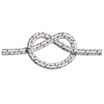
<strong style="display:block; color:var(--primary-color); margin-bottom:4px;">Nudo simple</strong>
Tope básico. Se aprieta mucho bajo carga - difícil de deshacer. Debilita la cuerda ~50%. <a href="https://knots3d.com/es/nudo-simple">Ver en 3D</a>

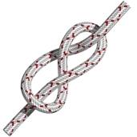
<strong style="display:block; color:var(--primary-color); margin-bottom:4px;">Nudo ocho</strong>
Mejor tope. Más voluminoso, se deshace más fácil, debilita menos (~25%). Estándar en escalada. <a href="https://knots3d.com/es/nudo-en-ocho">Ver en 3D</a>

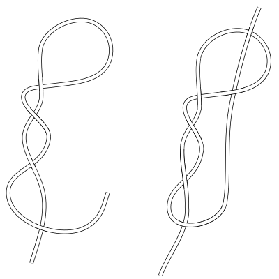
<strong style="display:block; color:var(--primary-color); margin-bottom:4px;">Nudo fraile</strong>
Variante del simple con vueltas extra. Tope grande y decorativo. <a href="https://knots3d.com/es/nudo-fraile">Ver en 3D</a>

> **Tip de oro:** Si solo puedes aprender un nudo de tope, que sea el ocho. Es el estándar en escalada por algo.

#### Nudos de unión - Unir dos cuerdas

Para cuando una cuerda no alcanza, o necesitas unir dos cabos.

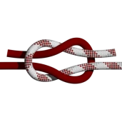
<strong style="display:block; color:var(--primary-color); margin-bottom:4px;">Nudo llano (rizo)</strong>
Une cuerdas del mismo grosor. Truco: "derecho sobre izquierdo, luego izquierdo sobre derecho". Si los dos van igual, queda un nudo falso. <a href="https://knots3d.com/es/nudo-llano">Ver en 3D</a>

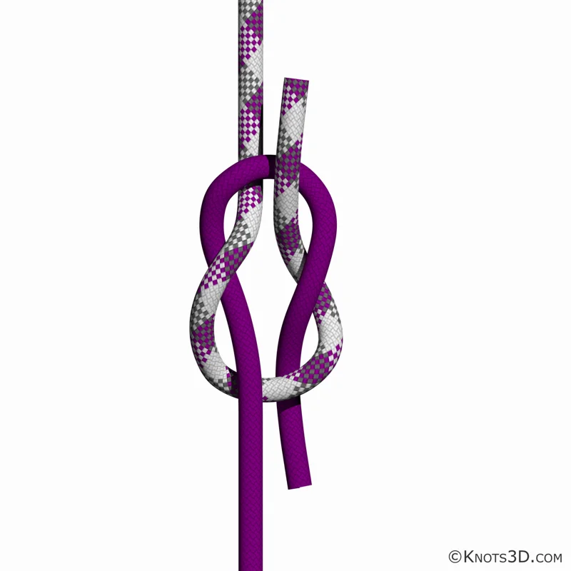
<strong style="display:block; color:var(--primary-color); margin-bottom:4px;">Nudo falso (abuela)</strong>
El ERROR del nudo llano. Se desliza bajo carga. Los chicotes salen cruzados en vez de paralelos. Aprende a reconocerlo.

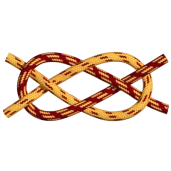
<strong style="display:block; color:var(--primary-color); margin-bottom:4px;">Carrick (calabrote)</strong>
Simétrico y fuerte. Ideal para cuerdas gruesas o mojadas donde el llano no agarra. <a href="https://knots3d.com/es/nudo-carrick">Ver en 3D</a>

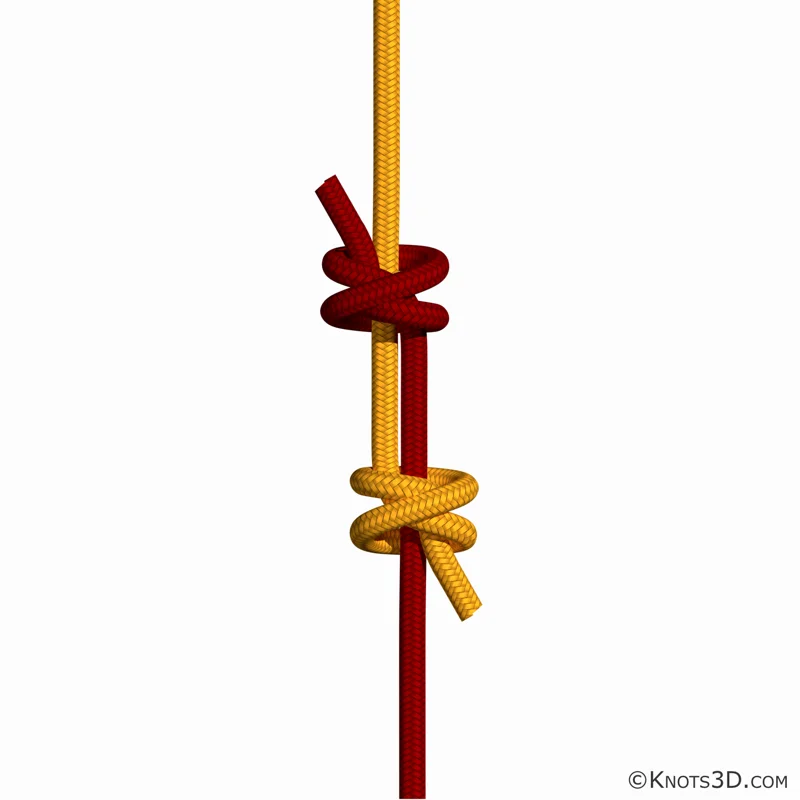
<strong style="display:block; color:var(--primary-color); margin-bottom:4px;">Pescador y pescador doble</strong>
Une cuerdas finas. Cada extremo lleva un nudo simple (o doble) alrededor de la otra. Semi-permanente. <a href="https://knots3d.com/es/nudo-de-pescador-doble">Ver en 3D</a>

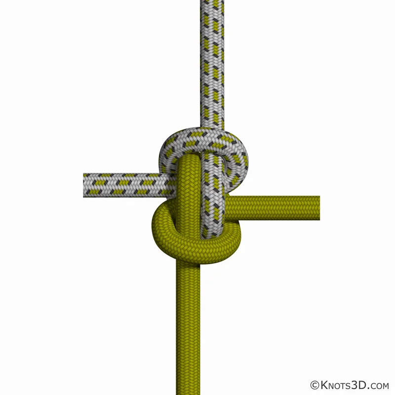
<strong style="display:block; color:var(--primary-color); margin-bottom:4px;">Cazador (hunter)</strong>
Descubierto en 1978. Simétrico, fuerte, se deshace más fácil que el pescador. Funciona con cuerdas de distinto grosor. <a href="https://knots3d.com/es/vuelta-del-cazador-nudo">Ver en 3D</a>

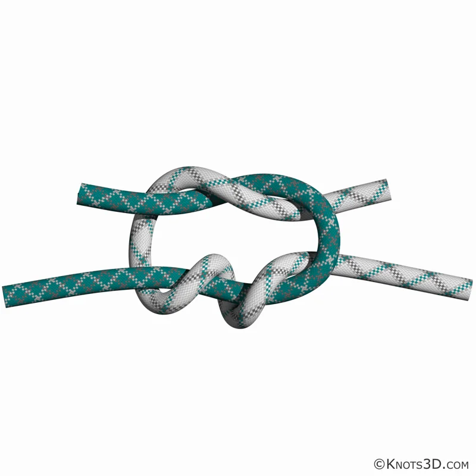
<strong style="display:block; color:var(--primary-color); margin-bottom:4px;">Cirujano</strong>
Como el llano pero con vuelta extra en el primer paso. No se afloja mientras haces el segundo - puedes soltar una mano. <a href="https://knots3d.com/es/nudo-de-cirujano">Ver en 3D</a>

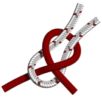
<strong style="display:block; color:var(--primary-color); margin-bottom:4px;">Vuelta de escota</strong>
Une cuerdas de diferente grosor. El lazo lo hace la gruesa, la delgada pasa por dentro. Más seguro que el llano cuando los diámetros no coinciden. <a href="https://knots3d.com/es/vuelta-de-escota-nudo">Ver en 3D</a>

> **Tip de oro:** Para saber si tu nudo llano está bien hecho, mira los chicotes: deben salir paralelos al firme, del mismo lado. Si salen cruzados, es un nudo falso.

#### Nudos de anclaje - Fijar la cuerda a un poste, anillo o palo

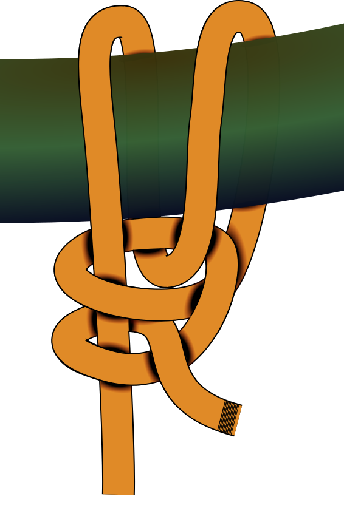
<strong style="display:block; color:var(--primary-color); margin-bottom:4px;">Nudo ancla</strong>
Vuelta completa + dos medios cotes. Para fijar cuerda a argolla, árbol o poste. Seguro bajo carga variable. <a href="https://knots3d.com/es/vuelta-de-ancla-nudo">Ver en 3D</a>

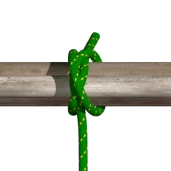
<strong style="display:block; color:var(--primary-color); margin-bottom:4px;">Constrictor</strong>
Aprieta como abrazadera. Para cerrar bolsas, sujetar mangos. Casi imposible de deshacer - hay que cortarlo. <a href="https://knots3d.com/es/nudo-constrictor">Ver en 3D</a>

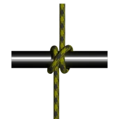
<strong style="display:block; color:var(--primary-color); margin-bottom:4px;">Ballestrinque</strong>
Dos vueltas cruzadas sobre un palo. Inicio de TODAS las amarras. Puede deslizarse sin carga - agrega medio cote extra. <a href="https://knots3d.com/es/nudo-ballestrinque">Ver en 3D</a>

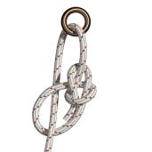
<strong style="display:block; color:var(--primary-color); margin-bottom:4px;">As de guía corredizo</strong>
Lazo ajustable que se aprieta al tirar. Para sujetar a un poste cuando necesitas ajustar tensión después. <a href="https://knots3d.com/es/as-de-guía-corredizo-nudo">Ver en 3D</a>

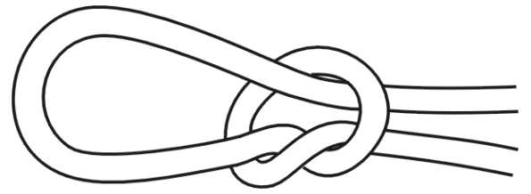
<strong style="display:block; color:var(--primary-color); margin-bottom:4px;">Nudo corredizo</strong>
El lazo más simple. Aprieta al tirar del firme. Útil para cargas adaptables. PELIGROSO: nunca cerca del cuello. <a href="https://knots3d.com/knots/es_es/34/corredizo">Ver en 3D</a>

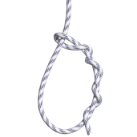
<strong style="display:block; color:var(--primary-color); margin-bottom:4px;">Vuelta de braza</strong>
Para arrastrar troncos - cuanta más carga, más aprieta. Se deshace fácil al soltar. No sirve para cargas perpendiculares. <a href="https://knots3d.com/es/nudo-de-leñador">Ver en 3D</a>

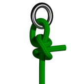
<strong style="display:block; color:var(--primary-color); margin-bottom:4px;">Vuelta redonda (dos cotes)</strong>
Vuelta completa + dos medios cotes. Más segura que el ballestrinque en palos lisos. Buen nudo general de amarre.

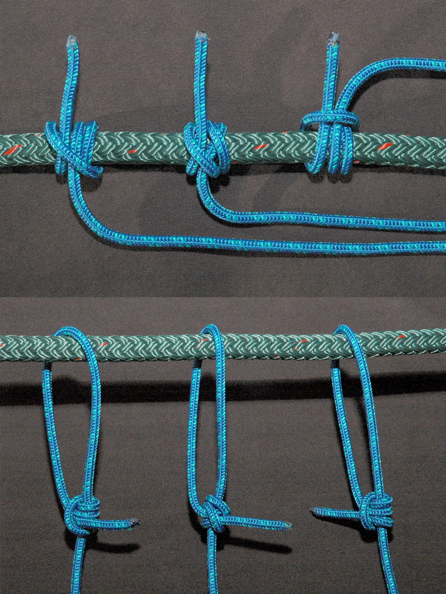
<strong style="display:block; color:var(--primary-color); margin-bottom:4px;">Tensor de carpa (bonus)</strong>
El nudo más usado en campamento. Tensa y afloja vientos de carpa sin desatar. Se desliza cuando empujas, se traba cuando tira. <a href="https://knots3d.com/es/nudo-tensor">Ver en 3D</a>

> **Tip de oro:** El ballestrinque es el nudo de arranque de toda amarra, pero solo funciona bien si después viene carga. En un palo liso sin tensión, agrega un medio cote de seguridad.

#### Nudos de salvamento - Pueden salvar una vida

Truco para recordar el as de guía: "La serpiente sale del pozo, rodea el árbol, y vuelve al pozo." El pozo es el seno, el árbol es el firme, la serpiente es el chicote.

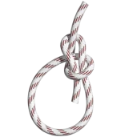
<strong style="display:block; color:var(--primary-color); margin-bottom:4px;">As de guía (bolina)</strong>
"El rey de los nudos." Lazo que no se aprieta bajo carga. Para rescatar personas sin asfixiarlas. El nudo que todo conquistador debe saber. <a href="https://knots3d.com/es/as-de-guía-nudo">Ver en 3D</a>

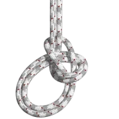
<strong style="display:block; color:var(--primary-color); margin-bottom:4px;">As de guía doble</strong>
Dos lazos: uno por cada pierna. Arnés improvisado para rescate y descenso de emergencia. <a href="https://knots3d.com/es/as-de-guia-por-seno-nudo">Ver en 3D</a>

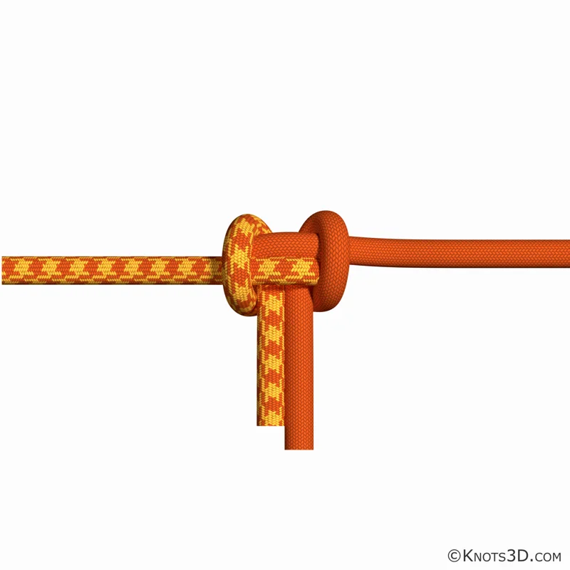
<strong style="display:block; color:var(--primary-color); margin-bottom:4px;">Mariposa alpino</strong>
Lazo en el medio de la cuerda sin usar los chicotes. Puntos de anclaje intermedios. Montañismo para encordarse varios. <a href="https://knots3d.com/es/nudo-mariposa">Ver en 3D</a>

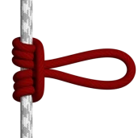
<strong style="display:block; color:var(--primary-color); margin-bottom:4px;">Prusik</strong>
Cordín delgado sobre cuerda gruesa. Sube libre sin peso, se bloquea al tirar. Esencial para ascenso y autorescate. <a href="https://knots3d.com/es/nudo-prusik">Ver en 3D</a>

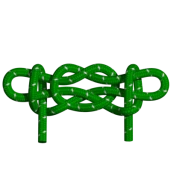
<strong style="display:block; color:var(--primary-color); margin-bottom:4px;">Silla de bombero</strong>
Arnés improvisado con la cuerda misma. Para bajar o izar una persona. Requiere práctica supervisada. <a href="https://knots3d.com/es/silla-de-bombero-nudo">Ver en 3D</a>

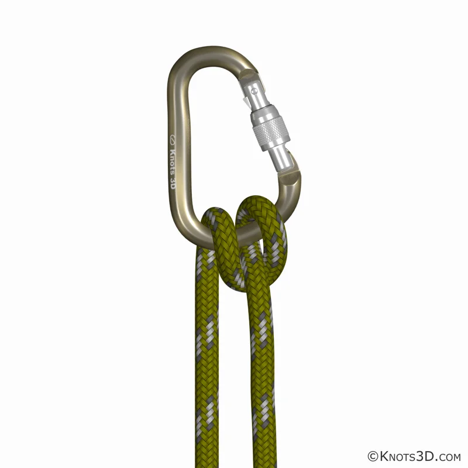
<strong style="display:block; color:var(--primary-color); margin-bottom:4px;">Dinámico (UIAA/HMS)</strong>
Sobre mosquetón. Da cuerda controlada a un escalador o desciende a alguien. Clave en aseguramiento vertical. <a href="https://knots3d.com/es/nudo-de-munter">Ver en 3D</a>

> **Tip de oro:** El as de guía debe ser automático - practica hasta hacerlo con una sola mano, detrás de la espalda, con los ojos cerrados. En un rescate real, las condiciones nunca son cómodas.

#### Nudos de izamiento, ornamentales y otros

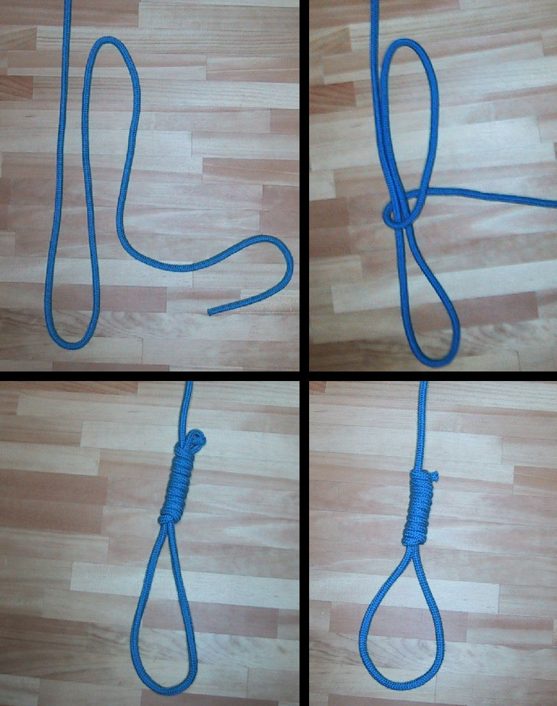
<strong style="display:block; color:var(--primary-color); margin-bottom:4px;">Dogal (de verdugo)</strong>
Múltiples vueltas alrededor del firme. Iza objetos cilíndricos (troncos, tubos). Aprieta proporcional a la carga. Nunca cerca de personas. <a href="https://knots3d.com/es/nudo-dogal">Ver en 3D</a>

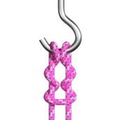
<strong style="display:block; color:var(--primary-color); margin-bottom:4px;">Zarpa de gato</strong>
Para colgar carga de un gancho. Se equilibra solo. Usado por marineros y estibadores. <a href="https://knots3d.com/es/zarpa-de-gato-nudo">Ver en 3D</a>

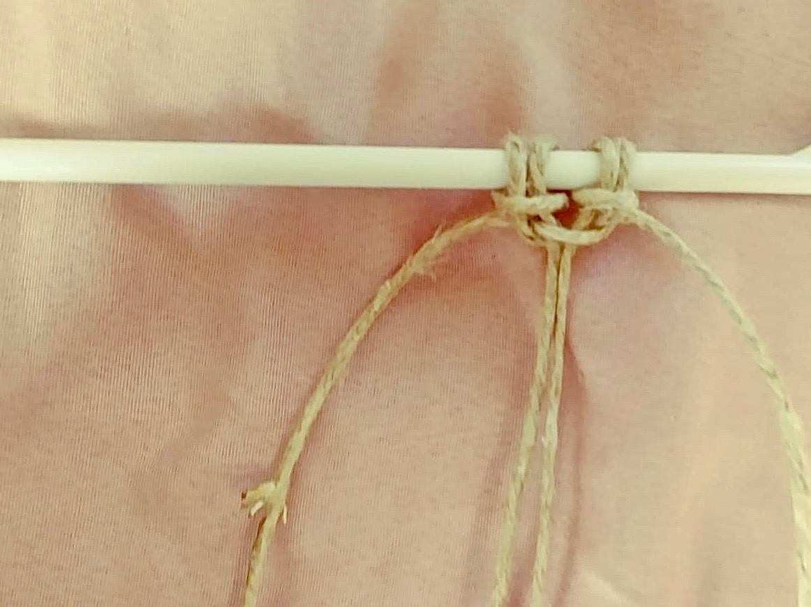
<strong style="display:block; color:var(--primary-color); margin-bottom:4px;">Cuadrado decorativo</strong>
Plano, simétrico. Para macramé y cuadros de nudos. Requisito del cuadro final (req. 12).

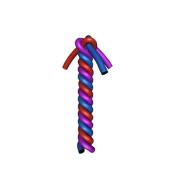
<strong style="display:block; color:var(--primary-color); margin-bottom:4px;">Encapilladura (corona)</strong>
Remate decorativo en el extremo de una cuerda. Evita que se deshilache y se ve bien.

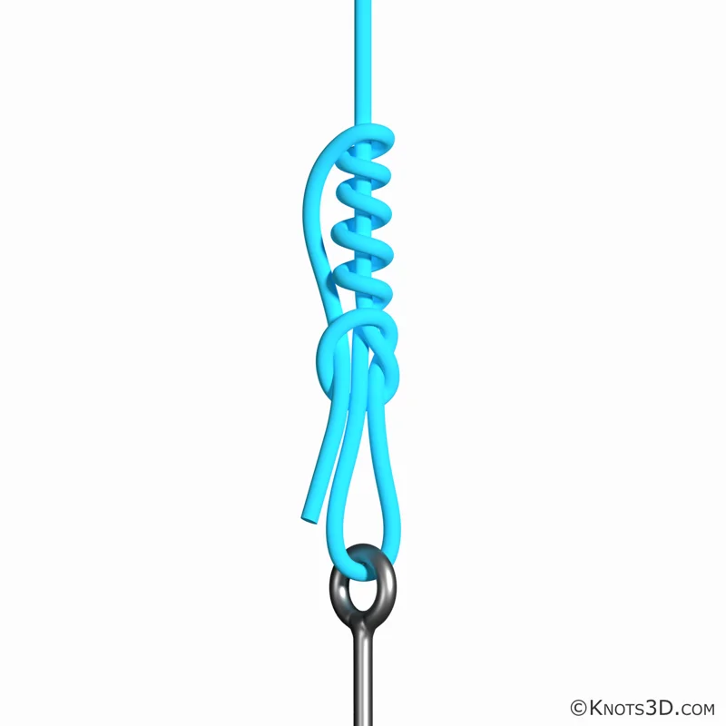
<strong style="display:block; color:var(--primary-color); margin-bottom:4px;">Nudo único (sujetar)</strong>
Lazo simple que no se aprieta. Para colgar objetos livianos o marcar un punto en la cuerda.

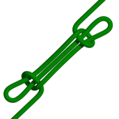
<strong style="display:block; color:var(--primary-color); margin-bottom:4px;">Margarita (acortamiento)</strong>
Acorta una cuerda sin cortarla. También aísla secciones dañadas. Solo funciona bajo tensión constante. <a href="https://knots3d.com/es/nudo-margarita">Ver en 3D</a>

> **Tip de oro:** La margarita parece fácil pero es traicionera. Si la carga se relaja, se suelta. Nunca la uses como solución permanente - es un parche temporal.

---

## Fase 4: Unir y construir

*Domingo de mañana. Tu consejero señala los palos apilados junto al fogón apagado. "Ya saben hacer nudos. Ahora van a aprender dos cosas más: empalmes - para unir cuerdas de forma permanente - y amarras - para unir palos y construir cosas. Si hicieron Campamento III, ya conocen las amarras básicas. Hoy van a perfeccionarlas y agregar dos nuevas."*

### (Requisito 7) Empalmes y remates [PRÁCTICA REQUERIDA]

Un empalme no es un nudo. Es una técnica donde las hebras de dos cuerdas se entretejen, creando una unión casi tan fuerte como la cuerda original (~95% de la fuerza). Más delgado que un nudo (pasa por poleas) y más permanente.

Para practicar empalmes necesitas cuerda de tres o más hebras torcidas (no trenzada). El sisal es ideal para aprender.

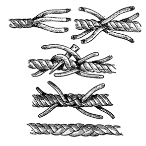
<strong style="display:block; color:var(--primary-color); margin-bottom:4px;">Empalme corto</strong>
La técnica base. Separas hebras de dos chicotes, las entrecruzas y tejes. Tres pasadas por lado. Unión permanente, delgada, fuerte (~95% de la fuerza original).

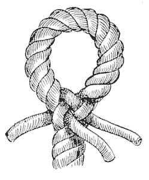
<strong style="display:block; color:var(--primary-color); margin-bottom:4px;">Ojo de águila</strong>
Lazo permanente al final de la cuerda. Doblas el chicote hacia atrás y empalmás las hebras sobre el firme. Para colgar cosas, anclar.

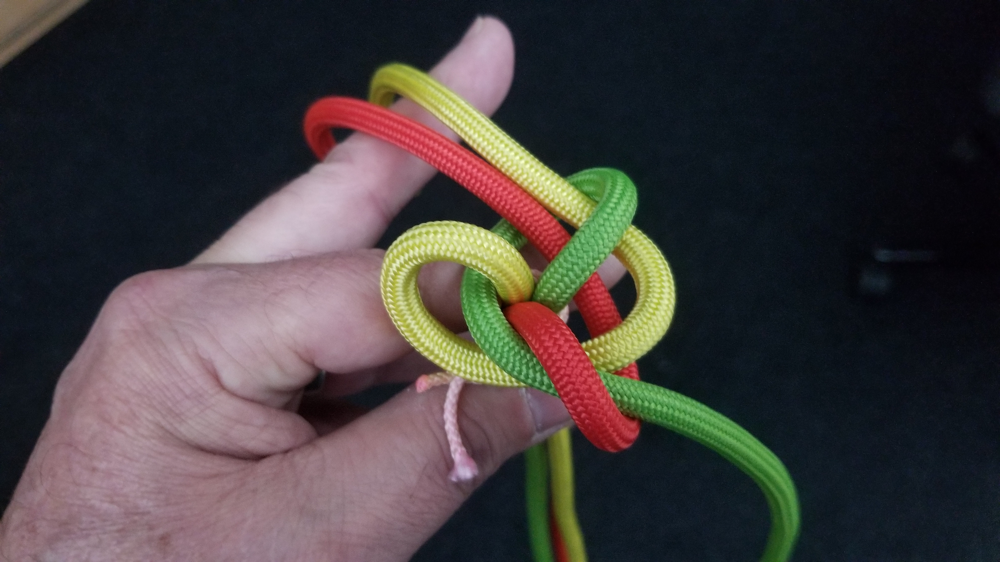
<strong style="display:block; color:var(--primary-color); margin-bottom:4px;">Matthew Walker / Piña de rosa</strong>
Los remates más elegantes del arte de las cuerdas. Cada hebra se anuda de forma específica y todas se aprietan juntas. Requiere paciencia. (CC BY-SA 4.0, Der Barbar)

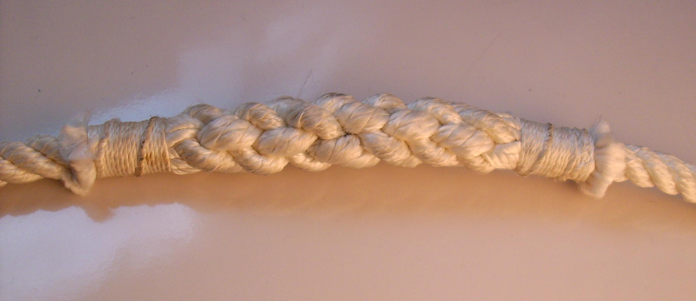
<strong style="display:block; color:var(--primary-color); margin-bottom:4px;">Piña simple / Cola de puerco</strong>
Remates rápidos que evitan que la cuerda se deshilache. La piña forma un engrosamiento, la cola de puerco es el remate más sencillo.

> **Tip de oro:** Antes de empezar un empalme, marca con cinta adhesiva dónde vas a separar las hebras. Así no te pierdes.

> **Tip de oro:** Usa un fid (aguja para empalmes) o un destornillador plano para abrir las hebras. Forzar con los dedos estropea la cuerda.

### (Requisito 11) Las cinco amarras [PRÁCTICA REQUERIDA]

Si ya completaste [Campamento III](campamento_iii.md), conoces la amarra cuadrada, diagonal, redonda y trípode. Aquí perfeccionas esas tres primeras y agregas dos nuevas: la continua simple y la continua doble.

Todas las amarras siguen el mismo principio:
1. Inicia con **ballestrinque** en uno de los palos
2. Da las **vueltas principales** según el tipo de amarra
3. Haz **vueltas de ajuste** entre los palos (perpendiculares a las principales, aprietan todo)
4. Termina con **ballestrinque** en el otro palo

**Amarra cuadrada** - Une palos que se cruzan a 90 grados. Las vueltas pasan sobre un palo y bajo el otro, formando un cuadrado visto desde arriba. 3-4 vueltas principales + 2-3 vueltas de ajuste. Para: mesas, marcos, torres. [Ver en 3D](https://knots3d.com/en/square-lashing-knot)

<em>Amarra cuadrada terminada. Las vueltas forman un cuadrado alrededor de la unión. (CC BY-SA 4.0, Gaby680)</em>

**Amarra diagonal** - Une palos que se cruzan en cualquier ángulo. Las vueltas van en diagonal formando una X. 3 vueltas en una diagonal, 3 en la otra, luego vueltas de ajuste. Para: refuerzos diagonales, trípodes, caballetes. [Ver en 3D](https://knots3d.com/en/diagonal-lashing-knot)

<em>Amarra diagonal. Las vueltas forman una X. (CC BY-SA 3.0, Duk)</em>

**Amarra paralela (redonda)** - Une palos que van lado a lado. Envuelve ambos palos juntos en forma de 8. 6-8 vueltas + vueltas de ajuste. Para: extender un palo, reparar uno roto, hacer un asta. [Ver en 3D](https://knots3d.com/en/round-lashing-knot)

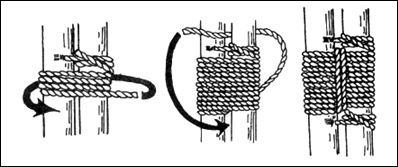

<em>Amarra paralela (redonda). Envuelve ambos palos juntos. (CC BY 3.0, Juan Diego Ardila)</em>

**Amarra continua simple** - Une varios palos en fila formando una plataforma. La cuerda va de palo en palo haciendo un cote en cada uno. Para: superficie de mesa, piso de refugio, camilla.

**Amarra continua doble** - Versión reforzada: en cada palo haces un cote doble en vez de simple. Más firme, soporta más peso. Para: mesas de cocina, plataformas que van a cargar peso.

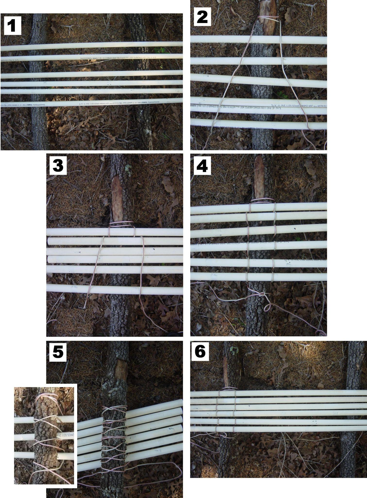

<em>Amarra continua paso a paso - la cuerda va de palo en palo con cotes en cada unión. (CC BY-SA 3.0, Lwan98)</em>

> **Tip de oro:** Cuerdas mojadas amarran mejor. La fibra se hincha y aprieta más al secar. Antes de amarrar, moja la cuerda 5 minutos.

> **Tip de oro:** Remueve la corteza de los palos donde va la amarra. La corteza resbala. Madera desnuda da más agarre.

### Amarras y empalmes en video

**Amarras (animación 3D paso a paso):**
- [Amarra cuadrada](https://knots3d.com/en/square-lashing-knot) - [Amarra diagonal](https://knots3d.com/en/diagonal-lashing-knot) - [Amarra redonda](https://knots3d.com/en/round-lashing-knot) - [Amarra trípode](https://knots3d.com/en/tripod-lashing-knot) - [Amarra japonesa](https://knots3d.com/en/japanese-square-lashing-mkii-knot)

**Empalmes:**
- [Back splice (cola de puerco)](https://knots3d.com/en/back-splice-knot) - el único empalme disponible en Knots 3D
- [Empalme corto - tutorial](https://www.youtube.com/results?search_query=short+splice+rope+tutorial) - [Ojo de águila (eye splice)](https://www.youtube.com/results?search_query=eye+splice+rope+tutorial) - [Matthew Walker](https://www.youtube.com/results?search_query=matthew+walker+knot+tutorial)

---

## Fase 5: Tu cuadro de nudos

*Es la última tarde del campamento. Tu consejero reparte tablas de madera, tachuelas y cuerdas de colores. "Todo lo que aprendieron esta semana va a quedar en un solo lugar. Van a armar un cuadro con al menos 25 nudos. Es su diploma visual - y va a quedar colgado en la sede del club para que lo vea cada generación que viene después."*

### (Requisito 12) El cuadro de nudos [PRÁCTICA REQUERIDA]

Un cuadro de nudos es una tabla donde montas nudos organizados, etiquetados con su nombre y uso. Es proyecto integrador y objeto de exhibición.

**Materiales:**
- Tabla de madera, cartón grueso o corcho (60x80 cm mínimo)
- Cuerdas de 3-5 mm de distintos colores (facilita distinguir cada nudo)
- Tachuelas, clavos pequeños o pegamento caliente
- Etiquetas de cartulina o papel
- Marcador permanente

**Organización sugerida:**

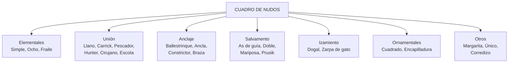
```mermaid
graph TD
    A["CUADRO DE NUDOS"] --> B["Elementales<br/>Simple, Ocho, Fraile"]
    A --> C["Unión<br/>Llano, Carrick, Pescador,<br/>Hunter, Cirujano, Escota"]
    A --> D["Anclaje<br/>Ballestrinque, Ancla,<br/>Constrictor, Braza"]
    A --> E["Salvamento<br/>As de guía, Doble,<br/>Mariposa, Prusik"]
    A --> F["Izamiento<br/>Dogal, Zarpa de gato"]
    A --> G["Ornamentales<br/>Cuadrado, Encapilladura"]
    A --> H["Otros<br/>Margarita, Único,<br/>Corredizo"]
```

**Proceso:**
1. Planifica la distribución antes de pegar. Dibuja el layout en papel
2. Haz cada nudo con unos 20-25 cm de cuerda
3. Fija con tachuelas por los extremos y pegamento por detrás
4. Etiqueta cada nudo: nombre, categoría y uso principal
5. Título arriba: "Nudos y Amarras - [Tu nombre] - [Año]"

> **Tip de oro:** Usa cuerdas de colores distintos para cada categoría. Elementales en rojo, unión en azul, anclaje en verde, salvamento en naranja. Se ve bien y ayuda a recordar.

> **Tip de oro:** Los nudos de 3-5 mm de diámetro quedan bien en un cuadro. Más gruesos ocupan demasiado espacio. Más delgados no se ven bien.

---

## Tabla de mapeo: Requisitos - Secciones

| Requisito DSA | Fase | Sección |
|---|---|---|
| 1. Definir términos de cuerdas | Fase 1 | Vocabulario de las cuerdas |
| 2. Cuidados de la cuerda | Fase 1 | Cuidados de la cuerda |
| 3. Estática vs dinámica | Fase 1 | Estática vs dinámica |
| 4. Tipos de cuerdas por material | Fase 1 | Tipos de cuerdas por material |
| 5. Sintéticas vs naturales | Fase 1 | Cuerdas sintéticas vs naturales |
| 6. Cuerda más fuerte de la Biblia | Fase 2 | La cuerda más fuerte de la Biblia |
| 7. Empalmes y remates | Fase 4 | Empalmes y remates |
| 8. Fabricar dos cuerdas | Fase 2 | Fabricar tu propia cuerda |
| 9. Plantas para cuerdas | Fase 2 | Plantas para fabricar cuerdas |
| 10. 20 nudos de memoria | Fase 3 | Veinte nudos de memoria |
| 11. Cinco amarras | Fase 4 | Las cinco amarras |
| 12. Cuadro de 25 nudos | Fase 5 | El cuadro de nudos |

---

## Referencias

- [Knots 3D](https://knots3d.com/es/nudos-de-amarre) - Animaciones 3D interactivas de nudos y amarras
- *The Ashley Book of Knots* - Clifford Ashley (referencia con más de 3800 nudos)
- *Enciclopedia Ilustrada de los Nudos* - Geoffrey Budworth
- [Campamento III](campamento_iii.md) - Amarras básicas en contexto de campamento
- [Pionerismo](pionerismo.md) - Uso de nudos y cuerdas en construcción pionera

---

## Notas para el instructor

**Materiales para el curso completo:**
- 10-15 trozos de cuerda de práctica (1.5 m cada uno, 6-8 mm)
- Muestras de nylon, poliéster, sisal, polipropileno (30 cm cada una)
- Cuerda de sisal para empalmes (3 hebras torcidas)
- Pabilo o fibras naturales para fabricar cuerdas
- Palos de 1.5-2 m para amarras (pueden ser de escoba)
- Tablas para cuadros de nudos
- Cuerdas de colores (3-5 mm) para los cuadros

**Distribución sugerida:**
- Reunión 1 (club): Fase 1 - vocabulario, materiales, cuidados
- Reunión 2 (club): Fase 3 parte 1 - nudos elementales, unión, anclaje
- Reunión 3 (club): Fase 3 parte 2 - nudos salvamento, izamiento, ornamentales
- Campamento: Fase 2 (devocional + fabricación cuerdas) + Fase 4 (empalmes + amarras)
- Reunión 4 (club): Fase 5 - cuadro de nudos
- Evaluación: cada conquistador demuestra 20 nudos de memoria + cuadro terminado

**Seguridad:**
- Nudos de salvamento: practicar siempre supervisados, nunca al borde de precipicios reales
- Empalmes: cuidado con herramientas punzantes (fid, destornillador)
- Amarras: verificar estabilidad de estructuras antes de cargar peso humano
- Nunca practicar nudos corredizos cerca del cuello

**Serie Campismo:**
Esta guía es el Tomo 1. Prepara para [Pionerismo](pionerismo.md) (construcción con cuerdas y palos) y eventualmente Construcciones Rústicas (estructuras mayores). El consejero guía paso a paso - es la primera exposición sistemática a cuerdas y nudos.

---

*Tu consejero mira los cuadros de nudos terminados, colgados en la pared de la sede. Cada uno distinto, cada uno con 25 nudos prolijos. "La próxima vez que vayamos al campo", dice, "ya no voy a tener que enseñarles a amarrar una carpa o construir una mesa. Ustedes van a saber." Sonríe. "Y en Pionerismo, van a usar todo esto para construir cosas que nunca imaginaron."*

[Siguiente en Serie Campismo: Pionerismo ->](pionerismo.md)
