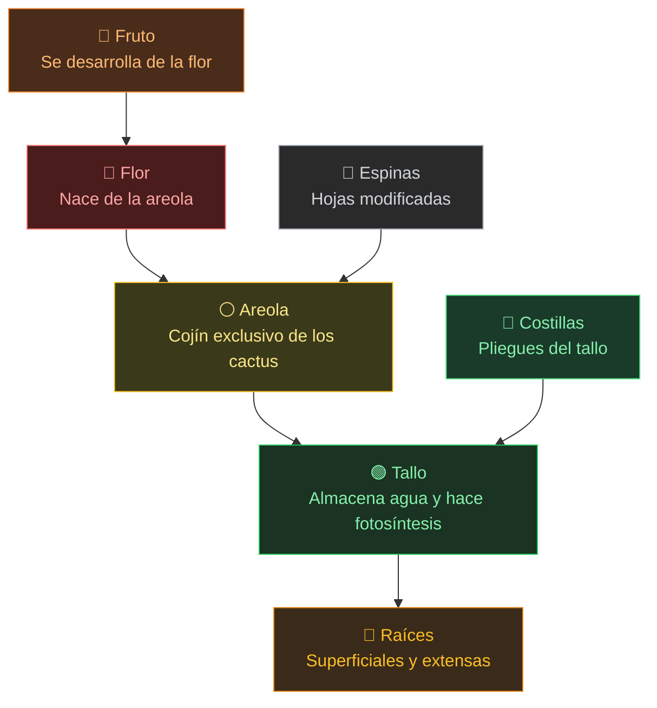

# **CACTUS**

## **Estudios de la Naturaleza (EN-015)**

Esta guía práctica ha sido diseñada para los instructores del Club de Conquistadores, proporcionando la base teórica y práctica necesaria para completar los requisitos de la especialidad de Cactus.

## **1\. ¿Qué es un Cactus?**

> **🎯 Actividad inicial:** Muestra una foto de un cactus y una de otra planta suculenta (como un Aloe Vera). Pregunta al grupo: *"¿Qué hace que un cactus sea un cactus? ¿Cómo lo diferenciarían de otras plantas?"*. Anota las ideas en la pizarra y luego compáralas con las características reales.

Un cactus es una planta de la familia **Cactaceae**, nativa de las Américas. Existen cerca de 1.750 especies conocidas. Pero lo que los hace especiales no es solo su apariencia — pregunta a los conquistadores: *¿qué tienen los cactus que ninguna otra planta del mundo tiene?* (Respuesta: las areolas).

**Características principales:**

* **Areolas:** La característica distintiva más importante. Son pequeños cojines o protuberancias de donde nacen las espinas, flores, ramas y pelos. Ninguna otra familia de plantas las tiene.

  

    
    
<em>Areolas de Opuntia microdasys — los pequeños cojines de donde nacen las espinas. (CC BY-SA 3.0, Frank Vincentz)</em>

  

* **Tallo suculento:** Grueso y carnoso, funciona como un tanque de agua. Además, como la mayoría de los cactus no tienen hojas, el tallo verde se encarga de la fotosíntesis.
* **Costillas:** Pliegues verticales a lo largo del tallo que le permiten expandirse como un acordeón cuando absorbe agua y contraerse en épocas de sequía.
* **Raíces:** Generalmente superficiales y muy extendidas horizontalmente para captar la mayor cantidad de agua de lluvia en poco tiempo. Algunas especies también desarrollan una raíz gruesa (napiforme) para almacenar reservas.

  

    
    
<em>Corte transversal de un Cereus — se observa el tejido verde exterior que realiza fotosíntesis y el interior que almacena agua. (Dominio público, Tangopaso)</em>

  

* **Flores:** Nacen de las areolas. Suelen ser grandes, coloridas y de corta duración (muchas abren solo una noche para ser polinizadas por murciélagos o polillas).
* **Frutos:** Muchos cactus producen frutos comestibles. Los más conocidos son la tuna (higo chumbo) y la pitahaya (fruta del dragón).

## **2\. Las Espinas: ¿Qué son y por qué existen?**

> **🎯 Desafío grupal:** Antes de explicar nada, muestra la imagen de abajo y pregunta: *"Las espinas del cactus en realidad son otra cosa transformada. ¿Qué creen que eran antes?"*. Luego pregunta: *"Si ustedes fueran una planta en el desierto, ¿para qué les servirían las espinas? Piensen en al menos 3 razones."* Deja que discutan y anota las ideas. Después compara con la referencia.

Las espinas de los cactus son **hojas modificadas**. A lo largo de los años, las hojas normales se transformaron en espinas como adaptación a ambientes secos, gracias a esto, el desperdicio de agua es menor. Normalmente no almacenan agua en las espinas, solo en el tallo, exceptuando la Pitajaya. Además, las espinas son el sistema de protección de los cactus contra posibles depredadores y cuidan el Cactus de sobrecalentarse.

  
  
<em>Espinas naciendo desde las areolas en Ferocactus latispinus. (CC BY-SA 4.0, Juan Carlos Fonseca Mata)</em>

**Pista para guiar la discusión:** Las hojas normales pierden mucha agua por evaporación. En el desierto, eso sería fatal. ¿Qué ventaja tiene entonces no tener hojas planas?

📋 Referencia para el instructor: las 4 funciones de las espinas

| Función | Explicación |
| :---- | :---- |
| **Protección** | Evitan que animales herbívoros se coman el tallo lleno de agua. |
| **Reducción de agua perdida** | Al no tener superficie plana, no transpiran como las hojas. Además, crean una capa de sombra sobre el tallo. |
| **Recolección de agua** | En zonas con neblina costera, las espinas condensan gotitas de rocío que escurren hasta las raíces. |
| **Regulación de temperatura** | La capa de espinas funciona como un "paraguas" que protege el tallo del sol directo. |

> **Dato curioso:** No todos los cactus tienen espinas. El Peyote (*Lophophora williamsii*) y algunos cactus epífitos como el Cactus de Navidad carecen de ellas. Pregunta: *si el cactus de Navidad no tiene espinas, ¿cómo sabemos que es un cactus?* (Pista: busca las areolas).

## **3\. Partes del Cactus**

Para el requisito de dibujar un cactus e identificar sus partes, aquí están las estructuras principales que debes conocer y etiquetar:

| Parte | Descripción | Función principal |
| :---- | :---- | :---- |
| **Flor** | Grande, colorida, de vida corta | Reproducción (atrae polinizadores) |
| **Fruto** | Se forma después de la polinización | Contiene semillas para dispersión |
| **Espinas** | Hojas transformadas, duras y puntiagudas | Protección, sombra, captura de rocío |
| **Areola** | Pequeño cojín o protuberancia | Punto de crecimiento de espinas, flores y ramas |
| **Costillas** | Pliegues verticales del tallo | Permiten expandirse y contraerse con el agua |
| **Tallo** | Grueso, verde, carnoso | Fotosíntesis + almacenamiento de agua |
| **Raíces** | Extendidas y superficiales | Absorción de agua de lluvia |

**\[PRÁCTICA REQUERIDA\]** Dibujar un cactus a mano e identificar cada una de estas partes con flechas y etiquetas.

## **4\. Cactus vs. Suculentas**

> **🎯 Observa y decide:** Muestra la imagen de abajo SIN explicar cuál es cuál. Pregunta: *"Estas dos plantas se ven casi idénticas. Una es cactus, la otra no. ¿Cuál es cuál? ¿Cómo lo sabrían?"*

  
  
<em>Una de estas plantas es un cactus y la otra no. ¿Cuál es cuál? (CC BY-SA 4.0, JonTheSucculentDude)</em>

Primero que todo: ¿Qué es una suculenta?
Las suculentas son todas las plantas capaces de almacenar agua en su **tallo**. Por lo tanto, los cactus son parte de la categoría de plantas suculentas.

La regla de oro: **todos los cactus son suculentas, pero no todas las suculentas son cactus.** Pide al grupo que proponga al menos 3 diferencias entre un cactus y otra suculenta. Luego revisen juntos:

📋 Tabla comparativa (referencia para el instructor)

| Característica | Cactus | Otras Suculentas |
| :---- | :---- | :---- |
| **Areolas** | Siempre presentes. | Ausentes. |
| **Espinas** | Agrupadas en areolas. | Pueden tener púas, pero no nacen de areolas. |
| **Flores** | Nacen de las areolas, únicas y complejas. | Varían según la familia. |
| **Familia** | Solo Cactaceae. | Muchas familias distintas (Crassulaceae, Asphodelaceae, Euphorbiaceae, etc.). |
| **Origen** | Exclusivamente de las Américas (excepto *Rhipsalis*). | Todo el mundo. |

> **Respuesta a la foto:** Izquierda: *Euphorbia obesa* (suculenta, NO es cactus). Derecha: *Astrophytum asterias* (cactus verdadero). Se ven casi iguales, pero solo el cactus tiene areolas. El truco: si ves una planta gordita y con espinas, busca las areolas.

## **5\. ¿Dónde hay más cactus? ¿Por qué?**

> **🎯 Piensa antes de leer:** Pregunta al grupo: *"Si tuvieran que buscar cactus en el mundo, ¿a qué tipo de lugares irían? ¿Por qué?"*. Luego: *"¿Creen que hay cactus silvestres en Europa, África o Asia?"*. (La respuesta los va a sorprender).

Los cactus son **nativos exclusivos de las Américas**, desde Canadá hasta la Patagonia. Se concentran especialmente en zonas áridas y semiáridas. Pide que el grupo piense: *¿qué tienen en común los desiertos de México, Arizona y Atacama que favorece a los cactus?*

📋 Regiones con mayor diversidad (referencia para el instructor)

| Región | Ejemplos | Especies destacadas |
| :---- | :---- | :---- |
| **México** | Desierto de Chihuahua, Sonora, Tehuacán | País con más especies del mundo (~670). Nopales, saguaros, biznaga. |
| **Sudoeste de EE.UU.** | Arizona, Nuevo México, Texas | Saguaro, cholla, barril. |
| **Sudamérica** | Atacama (Chile), Patagonia, Nordeste de Brasil | Quisco, quisquito, mandacaru, xique-xique. |
| **Islas del Caribe** | Cuba, Jamaica, Hispaniola | Cactus columnares endémicos. |

**La razón:** Los cactus evolucionaron para sobrevivir donde otras plantas no pueden. Sus adaptaciones (tallo suculento, espinas, raíces extendidas) les dan ventaja en desiertos y zonas rocosas. Pregunta al grupo: *¿qué pasaría si pusiéramos un cactus en un bosque lluvioso? ¿Le iría bien o mal? ¿Por qué?*

**En Chile**, los cactus se encuentran desde el desierto de Atacama hasta la zona central. Las especies más comunes son el **Quisco** (*Echinopsis chiloensis*) en cerros y quebradas, y el **Quisquito** (*Eriosyce subgibbosa*) en la costa. Chile alberga unas 160 especies, muchas endémicas.

> **Dato sorprendente:** El género *Rhipsalis* es el único cactus que crece naturalmente fuera de América (en África, Madagascar y Sri Lanka). Pregunta al grupo: *¿cómo creen que llegó hasta allá si los cactus son americanos?* (Pista: piensen en animales que viajan entre continentes).

## **6\. 15 Especies de Cactus**

A continuación se detallan 15 especímenes para identificación, priorizando especies nativas y comunes en la zona central de Chile.

1. **Quisco (*Echinopsis chiloensis*):** Nativo de Chile. Cactus columnar de gran altura (hasta 8 m) con espinas largas. Muy común en cerros de la zona central. Produce frutos comestibles llamados "quiscos".

   

     
     
<em>Quisco (<i>Echinopsis chiloensis</i>). (CC BY-SA 3.0, Stan Shebs)</em>

   

2. **Tuna o Nopal (*Opuntia ficus-indica*):** Tallos planos en forma de paletas (cladodios) y frutos comestibles. Ampliamente cultivado en Chile y México para alimentación.

   

     
     
<em>Tuna con frutos maduros (<i>Opuntia ficus-indica</i>). (CC BY-SA 3.0, Archenzo)</em>

   

3. **Quisquito (*Eriosyce subgibbosa*):** Cactus globular pequeño, nativo de la costa y valles centrales de Chile. Produce flores rosadas llamativas.

   

     
     
<em>Quisquito en flor (<i>Eriosyce subgibbosa</i>). (CC BY 2.0, Pato Novoa)</em>

   

4. **Asiento de suegra (*Echinocactus grusonii*):** Forma de barril con espinas amarillas brillantes. Originario de México, en peligro de extinción en estado silvestre.

   

     
     
<em>Asiento de suegra (<i>Echinocactus grusonii</i>). (CC BY-SA 3.0, H. Zell)</em>

   

5. **Cactus de Navidad (*Schlumbergera truncata*):** Cactus epífito (crece sobre árboles) que florece en invierno. No tiene espinas visibles.

   

     
     
<em>Cactus de Navidad en flor (<i>Schlumbergera truncata</i>). (CC BY-SA 2.5, Lestat)</em>

   

6. **Saguaro (*Carnegiea gigantea*):** El icónico cactus de los desiertos de Arizona con forma de "brazos". Puede alcanzar 15 metros y vivir más de 150 años.

   

     
     
<em>Saguaro en su hábitat natural (<i>Carnegiea gigantea</i>). (CC BY-SA 3.0, WClarke)</em>

   

7. **Cactus Dedo (*Mammillaria elongata*):** Cilindros delgados que crecen en grupos densos. Popular como planta de interior.

   

     
     
<em>Cactus Dedo (<i>Mammillaria elongata</i>). (Dominio público, Chhe)</em>

   

8. **Pitahaya (*Hylocereus undatus*):** Cactus trepador famoso por su fruto exótico (fruta del dragón). Sus flores enormes abren solo de noche.

   

     
     
<em>Flor de Pitahaya (<i>Hylocereus undatus</i>). (CC BY-SA 3.0, Brocken Inaglory)</em>

   

9. **Cereus (*Cereus hildmannianus*):** Cactus columnar de crecimiento rápido. Usado frecuentemente como cerco vivo en zonas rurales.

   

     
     
<em>Cereus en floración (<i>Cereus hildmannianus</i>). (CC BY-SA 2.0, William Herron)</em>

   

10. **Antorcha de Plata (*Cleistocactus strausii*):** Cubierto de pelos blancos finos que le dan aspecto plateado. Nativo de Bolivia.

    

      
      
<em>Antorcha de Plata (<i>Cleistocactus strausii</i>). (CC BY-SA 2.0, Pamla J. Eisenberg)</em>

    

11. **Birrete de Obispo (*Astrophytum ornatum*):** Forma estrellada con escamas blancas decorativas sobre sus costillas.

    

      
      
<em>Birrete de Obispo (<i>Astrophytum ornatum</i>). (Dominio público, Chrizz)</em>

    

12. **Cactus Injertado (*Gymnocalycium mihanovichii*):** El famoso cactus rojo o amarillo. No puede hacer fotosíntesis por sí solo, así que debe vivir injertado sobre otro cactus verde.

    

      
      
<em>Cactus Injertado rojo sobre portainjerto verde (<i>Gymnocalycium mihanovichii</i>). (CC BY-SA 4.0, Timothy A. Gonsalves)</em>

    

13. **Cactus Barril Azul (*Ferocactus glaucescens*):** Tono azulado (glauco) y forma globular. Produce pequeñas flores amarillas.

    

      
      
<em>Cactus Barril Azul (<i>Ferocactus glaucescens</i>). (CC BY-SA 2.5, Christer Johansson)</em>

    

14. **Rebutia (*Rebutia muscula*):** Pequeño, globular y cubierto de espinas blancas suaves. Florece abundantemente en primavera con flores anaranjadas.

    

      
      
<em>Rebutia en flor (<i>Rebutia muscula</i>). (Dominio público, Chilepine)</em>

    

15. **Peyote (*Lophophora williamsii*):** Cactus pequeño, sin espinas, de forma redondeada y aplanada. Crece muy lentamente en desiertos de México y Texas.

    

      
      
<em>Peyote en su hábitat natural (<i>Lophophora williamsii</i>). (Dominio público, U.S. Fish and Wildlife Service)</em>

    

## **7\. Utilidad y Conservación**

> **🎯 Lluvia de ideas:** Dividan el grupo en 3 equipos. Cada equipo tiene 3 minutos para hacer una lista de todos los usos que se les ocurran para los cactus: un equipo piensa en **alimentación**, otro en **usos para el ser humano**, y el tercero en **beneficios para el medio ambiente**. Gana el equipo con más ideas correctas. Después comparen sus listas con la referencia.

Pista para motivar: uno de los usos más sorprendentes del cactus involucra un insecto que produce el colorante rojo de muchos alimentos y cosméticos...

📋 Referencia completa: usos de los cactus (para el instructor)

**1\. Alimentación**

* **Frutos:** La tuna (fruto del nopal) se consume fresca en toda América Latina. La pitahaya es exportada mundialmente.
* **Paletas de nopal:** Las pencas jóvenes del nopal se cocinan como verdura. Son ricas en fibra, vitamina C y calcio.
* **Bebidas:** Con la tuna se preparan jugos, mermeladas y el "colonche" (bebida fermentada mexicana).

**2\. Uso humano e industrial**

* **Cochinilla:** El insecto *Dactylopius coccus* vive en nopales y produce un colorante rojo natural (ácido carmínico) usado en alimentos, cosméticos y textiles.
* **Cercos vivos:** Especies columnares como el Cereus y el Quisco se plantan como cercas naturales que no requieren mantención.
* **Medicina tradicional:** El nopal se usa para controlar niveles de azúcar en la sangre. Diversas especies se usan en remedios caseros.
* **Ornamental:** Los cactus son de las plantas de interior más populares del mundo por su bajo mantenimiento.

**3\. Medio ambiente**

* **Control de erosión:** Sus raíces estabilizan suelos en zonas desérticos donde otras plantas no sobreviven.
* **Refugio y alimento para fauna:** Aves anidan en cactus columnares (como el saguaro), y murciélagos, abejas e insectos se alimentan de sus flores y frutos.
* **Captura de agua:** En zonas de niebla costera, los cactus contribuyen a captar humedad del aire.

### Conservación

> **🎯 Pregunta para reflexionar:** *"¿Por qué creen que hay personas que sacan cactus del campo para venderlos? ¿Qué problema puede causar eso? ¿Qué podríamos hacer nosotros?"*

Muchas especies de cactus están **amenazadas**. Pide al grupo que piense en al menos 2 razones por las que una especie de cactus podría estar en peligro. Luego comparen:

* Recolección ilegal para venta como plantas ornamentales.
* Destrucción de hábitat por agricultura y urbanización.
* Cambio climático que altera los patrones de lluvia.

En Chile, numerosas especies de *Eriosyce* y *Copiapoa* son endémicas y están en categoría de conservación. **La recolección de cactus silvestres está prohibida por ley.**

## **8\. Parte Práctica**

### Cultivo de tres especies de cactus (2 meses)

**\[PRÁCTICA REQUERIDA\]** Cultivar por lo menos tres especies de cactus y cuidarlos durante dos meses.

**Tres especies recomendadas para principiantes:**

| Especie | Dificultad | Por qué es buena para empezar |
| :---- | :---- | :---- |
| **Nopal** (*Opuntia ficus-indica*) | Muy fácil | Se reproduce por esqueje de paleta. Crece rápido. |
| **Cactus Dedo** (*Mammillaria elongata*) | Fácil | Pequeño, tolera errores de riego. Florece pronto. |
| **Echinopsis** (*Echinopsis* spp.) | Fácil | Resistente al frío. Produce flores grandes y vistosas. |

**Instrucciones de cultivo:**

1. **Sustrato:** Mezclar en partes iguales: tierra de jardín, arena gruesa y piedra pómez (o perlita). El sustrato debe drenar el agua en segundos — si queda barro, hay demasiada tierra.
2. **Maceta:** Usar macetas con agujero de drenaje. El tamaño debe ser apenas más grande que el cactus.
3. **Riego:** En primavera/verano, regar una vez por semana dejando secar completamente entre riegos. En invierno, regar una vez al mes o menos.
4. **Luz:** Ubicar en un lugar con sol directo o mucha luz indirecta (mínimo 4-6 horas de luz).
5. **Registro:** Llevar un cuaderno con fecha, observaciones y fotos semanales de cada planta.

> **Error común:** El riego excesivo es la causa #1 de muerte de cactus. En la duda, NO riegues.

### Preparar y consumir un alimento a base de cactus

**\[PRÁCTICA REQUERIDA\]** Preparar y consumir un alimento a base de cactus.

---

#### Receta 1: Ensalada de Nopal

**Ingredientes:**
* 3 paletas de nopal (pencas jóvenes y tiernas)
* 1 tomate picado en cubos
* ¼ de cebolla morada picada fina
* Cilantro fresco picado
* Jugo de 1 limón
* Sal y aceite de oliva al gusto

**Preparación:**
1. Con un cuchillo, raspar las espinas de las paletas de nopal. Usar guantes o un paño grueso para sujetarlas.
2. Lavar bien los nopales y cortarlos en tiras o cubos pequeños.
3. Hervir los nopales en agua con sal durante 10-15 minutos hasta que cambien a un verde oscuro y estén tiernos. Escurrir y enjuagar con agua fría para quitar la baba.
4. En un bowl, mezclar los nopales cocidos con el tomate, cebolla, cilantro, jugo de limón, sal y aceite.
5. Servir frío como acompañamiento o sobre tostadas.

---

#### Receta 2: Dulce de Tuna (mermelada)

**Ingredientes:**
* 10 tunas maduras (preferir las de color rojo o morado)
* ½ taza de azúcar
* Jugo de 1 limón
* ½ taza de agua

**Preparación:**
1. **Con mucho cuidado** (usar guantes gruesos), pelar las tunas: cortar ambos extremos, hacer un corte longitudinal en la cáscara y desplegarla para sacar la pulpa.
2. Licuar o procesar la pulpa y colar para retirar las semillas.
3. En una olla a fuego medio, mezclar el jugo de tuna colado, el azúcar, el limón y el agua.
4. Cocinar revolviendo durante 20-25 minutos hasta que espese y tenga consistencia de mermelada.
5. Dejar enfriar y guardar en un frasco limpio. Se puede comer con pan, galletas o sobre helado.

---

#### Receta 3: Agua de Tuna (bebida refrescante)

**Ingredientes:**
* 6 tunas maduras peladas
* 1 litro de agua fría
* Jugo de 1-2 limones
* Azúcar o miel al gusto
* Hielo

**Preparación:**
1. Pelar las tunas (con guantes) y licuar con el agua.
2. Colar para retirar las semillas.
3. Agregar jugo de limón y azúcar al gusto.
4. Servir con hielo. Se puede agregar hojas de menta.
