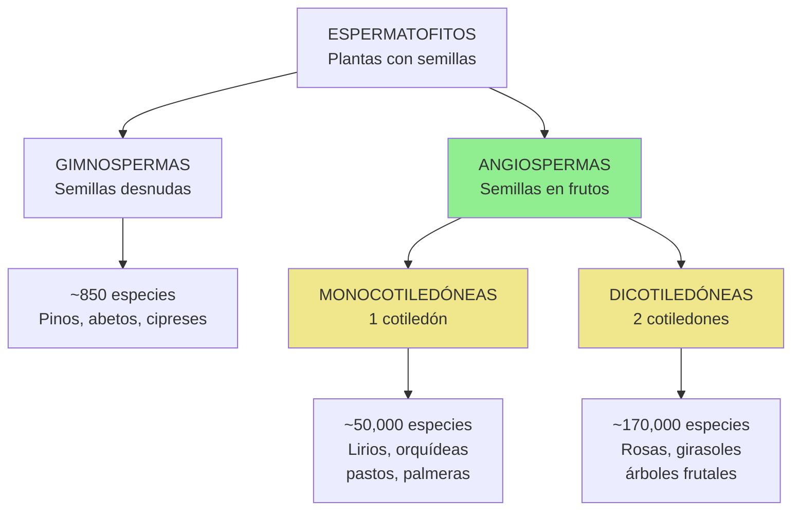
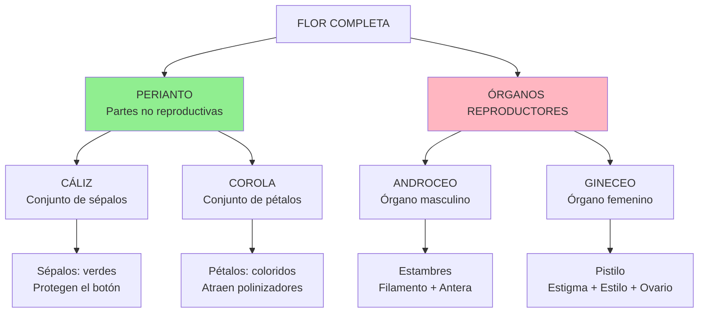
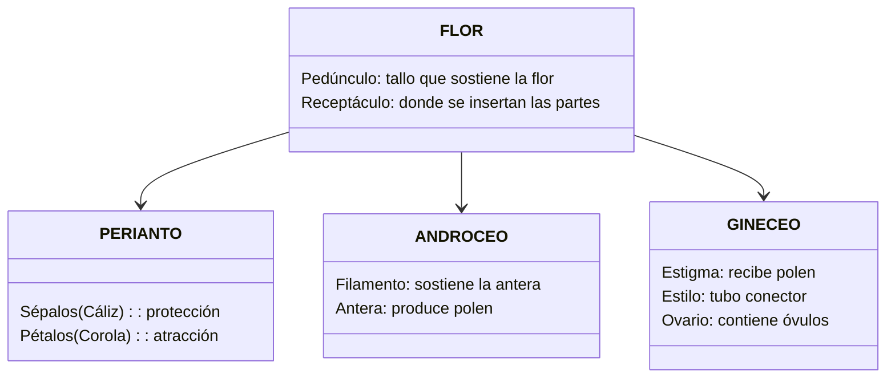
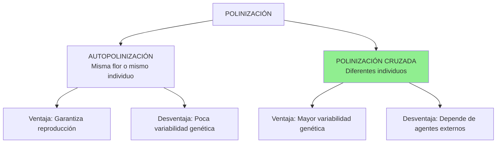
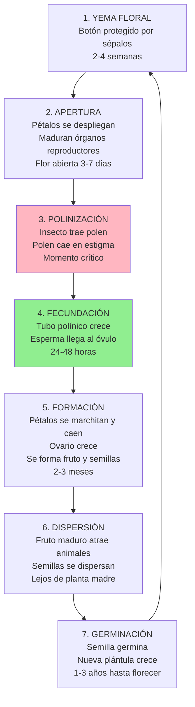

# Flores

<div align="center">


**Área:** Estudio de la Naturaleza
**Código:** EN-005
**Nivel:** 2
**Año de creación:** 1928
**Institución de origen:** Asociación General

---

</div>

## 🌸 EL FASCINANTE MUNDO DE LAS FLORES

¿Alguna vez te has detenido a observar una flor? No solo a verla de pasada, sino realmente **observarla**: sus colores vibrantes, su forma única, su aroma embriagador. Las flores son una de las creaciones más hermosas de Dios, y también una de las más importantes para la vida en la Tierra.

Existen más de **300,000 especies de plantas** en nuestro planeta, y de estas, aproximadamente **250,000 producen flores**. Desde las diminutas flores de las plantas alpinas hasta las enormes flores tropicales que pueden medir más de un metro de diámetro, cada una tiene una historia que contar y un propósito que cumplir.

---

## 🌺 LAS PLANTAS QUE PRODUCEN FLORES

### El gran grupo: ANGIOSPERMAS

El grupo de plantas que produce flores se llama **ANGIOSPERMAS** (del griego *angeion* = recipiente y *sperma* = semilla). Este nombre describe perfectamente su característica principal: sus semillas están **encerradas dentro de un fruto**.

Las angiospermas son el grupo más exitoso y diverso del reino vegetal:
- Representan el **90% de todas las plantas terrestres**
- Se han adaptado a prácticamente todos los ambientes del planeta
- Incluyen desde pequeñas hierbas hasta árboles gigantes

### ¿Cómo clasificamos las plantas con flores?

Las plantas se organizan en grandes grupos según sus características:



**GIMNOSPERMAS** (semillas desnudas):
- Semillas expuestas, sin fruto que las cubra
- Flores pequeñas y poco vistosas
- Polinización por viento
- Ejemplos: Pinos, abetos, cedros, cipreses

**ANGIOSPERMAS** (semillas en frutos):
- Semillas protegidas dentro de frutos
- Flores vistosas y coloridas
- Polinización por insectos, aves, viento
- **¡Este es el grupo más grande y diverso!**

### Dentro de las Angiospermas

Las angiospermas se dividen en dos clases según el número de cotiledones (hojas embrionarias en la semilla):

**MONOCOTILEDÓNEAS** (Liliopsida):
- **1 cotiledón** en la semilla
- Nervaduras **paralelas** en las hojas
- Raíces **fasciculadas** (como un manojo)
- Flores con partes en múltiplos de **3**
- **Ejemplos:** Lirios, tulipanes, orquídeas, palmeras, pastos, maíz, arroz

**DICOTILEDÓNEAS** (Magnoliopsida):
- **2 cotiledones** en la semilla
- Nervaduras **reticuladas** (como una red) en las hojas
- Raíz **pivotante** (una raíz principal)
- Flores con partes en múltiplos de **4 o 5**
- **Ejemplos:** Rosas, girasoles, leguminosas, la mayoría de árboles frutales

---

## 🌹 LA FLOR: ESTRUCTURA Y FUNCIÓN

### ¿Para qué sirve una flor?

Aunque las flores nos parecen hermosas decoraciones de la naturaleza, su verdadero propósito es mucho más práctico: **la reproducción**.

**La flor es el órgano reproductor de las plantas angiospermas.** Su misión principal es producir semillas que darán origen a nuevas plantas.

**Funciones principales de la flor:**

1. **Producir gametos** (células sexuales):
   - Polen (gametos masculinos) en las anteras
   - Óvulos (gametos femeninos) en el ovario

2. **Atraer polinizadores**:
   - Colores brillantes visibles desde lejos
   - Aromas que guían a insectos y aves
   - Néctar como recompensa alimenticia
   - Formas especializadas para ciertos polinizadores

3. **Facilitar la fecundación**:
   - Recibir el polen en el estigma
   - Permitir que crezca el tubo polínico
   - Unir gametos masculinos y femeninos

4. **Formar semillas y frutos**:
   - Óvulos fecundados se convierten en semillas
   - Ovario madura y se transforma en fruto
   - Dispersión de la siguiente generación

### Anatomía de una flor

Una flor completa tiene cuatro verticilos (conjuntos de partes):



**Diagrama de partes de una flor:**



### Partes de la flor en detalle

**PEDÚNCULO:**
- Tallo que conecta la flor con la rama
- Transporta agua y nutrientes
- Sostiene la flor en posición adecuada

**RECEPTÁCULO:**
- Ensanchamiento al final del pedúnculo
- Base donde se insertan todas las partes florales
- Sostiene sépalos, pétalos, estambres y pistilo

**SÉPALOS (forman el CÁLIZ):**
- Generalmente verdes, parecen hojas
- Protegen el botón floral antes de abrirse
- Sostienen los pétalos cuando la flor se abre
- Conjunto de sépalos = cáliz

**PÉTALOS (forman la COROLA):**
- Coloridos y vistosos
- Atraen polinizadores con colores y aromas
- Proporcionan plataforma de aterrizaje
- Conjunto de pétalos = corola
- A veces pétalos y sépalos son similares (tépalos)

**ESTAMBRES (forman el ANDROCEO - órgano masculino):**

Cada estambre tiene dos partes:
- **Filamento:** Tallo delgado que sostiene la antera
- **Antera:** Saco que produce y almacena polen

El conjunto de todos los estambres = androceo

**PISTILO (forma el GINECEO - órgano femenino):**

Tiene tres partes:
- **Estigma:** Parte superior pegajosa que recibe el polen
- **Estilo:** Tubo que conecta estigma con ovario
- **Ovario:** Base ensanchada que contiene los óvulos

El conjunto de pistillos (carpelos) = gineceo

---

## 🐝 POLINIZACIÓN: EL VIAJE DEL POLEN

### ¿Qué es la polinización?

**Polinización** es el proceso de transferencia del polen desde las anteras (parte masculina) hasta el estigma (parte femenina) de una flor.

**Sin polinización, NO hay:**
- Fecundación
- Semillas
- Frutos
- Nueva generación de plantas

### Tipos de polinización



### Agentes polinizadores

**POR INSECTOS (Entomofilia)** - El más común:

Las flores polinizadas por insectos tienen:
- ✅ Colores brillantes (amarillo, rojo, azul, púrpura)
- ✅ Aromas fuertes y dulces
- ✅ Néctar abundante como recompensa
- ✅ Forma que facilita el aterrizaje
- ✅ Polen pegajoso

**Principales polinizadores:**
- **Abejas:** Las más eficientes, el 80% de cultivos dependen de ellas
- **Mariposas:** Prefieren flores rojas, naranjas, púrpuras
- **Polillas:** Activas de noche, flores blancas o pálidas
- **Escarabajos:** Flores robustas, aromas fuertes
- **Moscas:** Algunas especies, flores con olores específicos

**Ejemplos:** Rosas, girasoles, lavanda, orquídeas

---

**POR AVES (Ornitofilia)**:

Las flores polinizadas por aves tienen:
- ✅ Color rojo intenso o naranja (aves lo ven bien)
- ✅ Flores tubulares (adaptadas al pico)
- ✅ Mucho néctar (aves necesitan energía)
- ✅ SIN aroma (aves tienen poco olfato)
- ✅ Estructura robusta (soporta peso del ave)

**Principales polinizadores:**
- **Colibríes/Picaflores:** Principales en América
- **Loros y cotorras:** En trópicos
- **Pájaros sol:** En África y Asia

**Ejemplos:** Fucsia, copihue, eucalipto, hibisco

---

**POR VIENTO (Anemofilia)**:

Las flores polinizadas por viento tienen:
- ❌ SIN colores vistosos (verde o café)
- ❌ SIN aroma
- ❌ SIN néctar
- ✅ Polen muy ligero y abundante
- ✅ Estigmas grandes y plumosos
- ✅ Anteras colgantes que liberan polen fácilmente

**Ejemplos:** Pastos, maíz, pinos, robles, álamos

---

**OTROS AGENTES:**
- **Murciélagos** (quiropterofilia): Flores nocturnas, blancas, mucho néctar
- **Agua** (hidrofilia): Plantas acuáticas (muy raro)
- **Mamíferos pequeños** (zarigüeyas, ardillas): En algunas regiones

---

## 🌻 CICLO DE VIDA DE UNA FLOR

Usemos como ejemplo una rosa común:



### Paso a paso

**FASE 1: Formación del botón floral**
- La planta produce una yema floral en primavera
- Sépalos verdes envuelven completamente el botón
- Dentro se desarrollan pétalos y órganos reproductores
- Duración: 2-4 semanas

**FASE 2: Apertura de la flor**
- Señales ambientales (luz, temperatura) activan la apertura
- Pétalos se despliegan gradualmente
- Estambres y pistilo alcanzan madurez
- Flor produce aromas y néctar
- Permanece abierta: 3-7 días

**FASE 3: Polinización**
- Insecto es atraído por color y aroma
- Se introduce en la flor buscando néctar
- Su cuerpo roza las anteras y se cubre de polen
- Visita otra flor y el polen contacta el estigma
- **¡Polinización completada!**

**FASE 4: Fecundación**
- Polen germina en el estigma
- Tubo polínico crece a través del estilo (24-48 horas)
- Llega al óvulo en el ovario
- Célula espermática fecunda el óvulo
- Se forma el embrión (futura semilla)

**FASE 5: Formación de fruto y semillas**
- Pétalos ya no son necesarios y caen
- Ovario comienza a crecer
- Se transforma en fruto (en rosas = escaramujo)
- Óvulos fecundados maduran como semillas
- Duración: 2-3 meses

**FASE 6: Dispersión**
- Fruto madura (se torna rojo/naranja)
- Atrae pájaros que lo comen
- Semillas pasan por el sistema digestivo
- Son excretadas lejos de la planta madre
- Otras formas: viento, agua, adherirse a pelaje

**FASE 7: Germinación y crecimiento**
- Semilla permanece latente hasta condiciones favorables
- Con humedad y temperatura adecuada, germina
- Crece raíz, tallo, hojas
- Después de 1-3 años, produce sus propias flores
- **¡El ciclo se repite!**

---

## 🎨 DIVERSIDAD DE COLORES Y FORMAS

### ¿Por qué las flores tienen colores?

Los colores no son solo para que nosotros los admiremos. Cada color es una **señal** para los polinizadores:

**COLORES Y SUS POLINIZADORES:**

| Color | Atrae principalmente a | Ejemplos de flores |
|-------|------------------------|-------------------|
| 🔴 **Rojo** | Colibríes, aves | Fucsia, hibisco, clavel rojo |
| 🟠 **Naranja** | Mariposas, abejas | Caléndula, capuchina, lirio naranja |
| 🟡 **Amarillo** | Abejas, moscas | Girasol, rosa amarilla, diente de león |
| 🟢 **Verde** | Viento, moscas | Raras, ortiga, algunas hortensias |
| 🔵 **Azul/Púrpura** | Abejas, abejorros | Lavanda, jacinto, nomeolvides |
| ⚪ **Blanco** | Polillas nocturnas, murciélagos | Jazmín, azucena, dama de noche |

### El arcoíris de las flores

Las flores pueden mostrar prácticamente todos los colores del espectro visible:

**ROJO:** Rosa roja, amapola, tulipán rojo, clavel
**NARANJA:** Caléndula, capuchina, gazania, maravilla
**AMARILLO:** Girasol, rosa amarilla, narciso, botón de oro
**VERDE:** Hortensia verde, crisantemo verde (raros)
**AZUL:** Nomeolvides, aciano, agapanto, hortensia azul
**VIOLETA:** Lavanda, violeta, pensamiento morado, iris

**¿Por qué NO hay flores negras?**
El negro no existe realmente en flores. Lo que vemos como "negro" son tonos muy oscuros de púrpura o rojo. El negro no atraería polinizadores porque no reflejaría luz.

### Formas especializadas

Las flores tienen formas adaptadas a sus polinizadores:

**FLORES TUBULARES:**
- Adaptadas para colibríes y mariposas
- Néctar en el fondo del tubo
- Solo picos o probóscides largas pueden alcanzarlo
- Ejemplos: Fucsia, madreselva, petunia

**FLORES PLANAS:**
- Plataforma de aterrizaje para abejas
- Fácil acceso al néctar y polen
- Ejemplos: Margarita, girasol, rosa

**FLORES COLGANTES:**
- Péndulos que se balancean
- Ideales para colibríes que vuelan estacionarios
- Ejemplos: Fucsia, campanas

**FLORES NOCTURNAS:**
- Abren solo de noche
- Color blanco o pálido (visible en oscuridad)
- Aroma muy fuerte
- Polinizan polillas y murciélagos
- Ejemplos: Dama de noche, don diego de noche

---

## 👨‍🔬 ACTIVIDADES Y OBSERVACIONES

### 🌈 Colección del arcoíris

**Desafío:** Encuentra y fotografía (o dibuja) flores que representen todos los colores del arcoíris.

**Necesitas:**
- 1 flor ROJA
- 1 flor NARANJA
- 1 flor AMARILLA
- 1 flor VERDE (¡la más difícil!)
- 1 flor AZUL
- 1 flor VIOLETA

**Tip para el verde:** Busca hortensias verdes, algunos crisantemos, o flores en etapa de botón que aún son verdes.

---

### 🔢 Contando pétalos

**Desafío:** Encuentra flores con diferentes números de pétalos.

**Necesitas encontrar:**
- Una flor con **3 pétalos** (o múltiplos de 3)
- Una flor con **4 pétalos**
- Una flor con **5 pétalos**
- Una flor **SIN pétalos visibles**

**Pistas:**
- **3 pétalos:** Lirios, tulipanes, iris (son monocotiledóneas)
- **4 pétalos:** Mostaza, repollo en flor, crucíferas
- **5 pétalos:** Rosas, geranios, petunias, fresas (muy común en dicotiledóneas)
- **Sin pétalos:** Pastos, sauces, álamos (polinización por viento)

---

### 👃 Identificación por olfato

**Desafío:** ¿Puedes identificar flores solo por su aroma?

**Actividad:**
1. Selecciona 5 flores con aromas DISTINTOS
2. Huele cada una con los ojos abiertos y memoriza
3. Véndate los ojos
4. Pide a alguien que te presente las flores en orden aleatorio
5. ¡Intenta identificarlas solo por el olfato!

**Flores con aromas fuertes:**
- Rosa (dulce, perfumado)
- Jazmín (intenso, embriagador)
- Lavanda (herbáceo, mentolado)
- Clavel (especiado)
- Eucalipto (medicinal, fresco)

---

### 🐝 Observación de polinizadores

**Desafío:** Observa qué animales visitan diferentes flores.

**Método:**
1. Elige un jardín con variedad de flores
2. Siéntate cómodamente sin moverte
3. Observa UNA flor por 10 minutos
4. Anota cada visitante que llegue

**Registro:**

| Flor observada | Hora | Visitante | Qué hizo |
|----------------|------|-----------|----------|
| Rosa roja | 9:00 AM | Abeja melífera | Recolectó néctar 2 min |
| Lavanda | 9:15 AM | Abejorro | Visitó 5 flores seguidas |
| Girasol | 4:00 PM | Mariposa | Revoloteó sin aterrizar |

**Repite la observación:**
- Por la mañana (8-10 AM)
- Por la tarde (4-6 PM)
- Al anochecer (7-8 PM)

**Preguntas:**
- ¿Cuál flor tuvo más visitantes?
- ¿Qué hora del día fue más activa?
- ¿Qué insecto fue más frecuente?

---

### 🌙 Flores diurnas vs nocturnas

**Desafío:** Compara la actividad en una flor durante el día y de noche.

**Método:**
1. Elige una flor que permanezca abierta día y noche
2. Observa 10 minutos a plena luz del sol
3. Observa 10 minutos después del anochecer (usa linterna con luz roja)

**Mejores flores para observar:**
- Dama de noche (aroma más fuerte de noche)
- Jazmín (activa día y noche)
- Madreselva (atrae polillas nocturnas)

**Anota:**
- Número de visitantes diurnos vs nocturnos
- Tipos de animales diferentes
- Cambios en la flor (aroma más fuerte, más abierta, etc.)

---

## 🏛️ FAMILIAS DE FLORES

Las flores se agrupan en familias botánicas según características compartidas. Conocer las familias te ayuda a identificar flores nuevas.

### Familia ASTERACEAE (Compuestas)

**La familia MÁS GRANDE** con más de 23,000 especies.

**Característica única:** Lo que parece "una flor" es en realidad un **capítulo** (muchas flores pequeñas juntas).

**Ejemplos:**
- Girasol (*Helianthus annuus*)
- Margarita (*Bellis perennis*)
- Diente de león (*Taraxacum officinale*)
- Crisantemo (*Chrysanthemum*)
- Caléndula (*Calendula officinalis*)

**Identificación rápida:** Centro con muchas flores pequeñas rodeado de "pétalos" (que son también flores).

---

### Familia ROSACEAE (Rosáceas)

**Características:**
- Flores generalmente con **5 pétalos**
- Numerosos estambres
- Muchas producen frutos comestibles

**Ejemplos:**
- Rosa (*Rosa* spp.)
- Fresa (flor y fruto) (*Fragaria*)
- Manzano (flor) (*Malus*)
- Cerezo (flor) (*Prunus*)
- Zarzamora (*Rubus*)

---

### Familia LILIACEAE (Liliáceas)

**Características:**
- **Monocotiledóneas**
- Flores con 6 tépalos (3+3)
- Forma de campana o estrella
- Bulbos o rizomas

**Ejemplos:**
- Lirio (*Lilium*)
- Tulipán (*Tulipa*)
- Azucena (*Lilium candidum*)

---

### Familia LAMIACEAE (Labiadas)

**Características:**
- Flores tubulares con **dos labios**
- Tallo cuadrado
- Hojas aromáticas
- Muchas hierbas medicinales y culinarias

**Ejemplos:**
- Lavanda (*Lavandula*)
- Menta (*Mentha*)
- Romero (*Rosmarinus*)
- Salvia (*Salvia*)

---

### Familia ORCHIDACEAE (Orquídeas)

**La familia más especializada:**
- Más de 25,000 especies
- Flores altamente modificadas
- Relaciones específicas con polinizadores
- Muchas son epífitas (viven en árboles)

**Características únicas:**
- Pétalo modificado llamado **labelo**
- Columna que fusiona estambres y pistilo
- Semillas microscópicas (miles por fruto)

---

## 📸 DOCUMENTANDO FLORES

### Creando tu colección

Para completar la especialidad necesitas documentar **25 especies diferentes de flores**.

**Métodos aceptados:**
1. **Fotografía:** Toma fotos claras de cada flor
2. **Dibujo botánico:** Ilustra con detalle cada especie
3. **Flores prensadas:** Preserva flores reales (con permiso)

**Para cada flor documenta:**
- ✅ Nombre común (español)
- ✅ Nombre científico (*Género especie* en cursiva)
- ✅ Familia botánica
- ✅ Imagen clara
- ✅ Dónde y cuándo la encontraste

**Formato sugerido:**

```markdown
## Flor #1: Rosa

**Nombre científico:** *Rosa spp.*
**Familia:** Rosaceae
**Lugar:** Jardín de casa
**Fecha:** 15 de Octubre, 2024

[FOTO O DIBUJO AQUÍ]

**Observaciones:**
- Color: Roja
- Pétalos: Numerosos, en espiral
- Aroma: Fuerte y dulce
- Visitantes observados: Abejas
```

### Herramientas útiles

**Apps de identificación:**
- **iNaturalist:** Comunidad que ayuda a identificar
- **PlantNet:** Identifica por fotos
- **PictureThis:** Identificación rápida
- **Seek:** Para principiantes

**Libros recomendados:**
- Guías de flora de tu país/región
- Guías de jardines botánicos locales

---

## 🌍 IMPORTANCIA DE LAS FLORES

### Para los ecosistemas

**Flores = Base de la vida:**

1. **Producción de alimentos:**
   - 75% de cultivos dependen de polinización
   - Sin flores, no hay frutos ni semillas
   - Frutas, verduras, frutos secos, cereales

2. **Biodiversidad:**
   - Sostienen poblaciones de polinizadores
   - Insectos, aves, murciélagos dependen de ellas
   - Base de cadenas alimenticias

3. **Oxígeno y aire limpio:**
   - Las hojas producen oxígeno
   - Absorben CO₂
   - Purifican el aire

### Para los humanos

**Alimento:**
- Frutas y vegetales que comemos
- Miel producida por abejas
- Especias y hierbas

**Medicina:**
- Muchos medicamentos vienen de plantas con flores
- Plantas medicinales tradicionales
- Investigación farmacéutica

**Cultura y belleza:**
- Decoración y jardinería
- Perfumes y aromas
- Símbolos culturales y religiosos
- Arte e inspiración

### Crisis de polinizadores

**¡ADVERTENCIA!** Las poblaciones de abejas y otros polinizadores están disminuyendo:

**Causas:**
- Uso de pesticidas
- Pérdida de hábitat
- Cambio climático
- Enfermedades

**Consecuencias:**
- Menos polinización
- Menor producción de alimentos
- Amenaza a seguridad alimentaria mundial

**¿Qué puedes hacer?**
- Planta flores nativas
- No uses pesticidas
- Crea refugios para polinizadores
- Educa a otros sobre su importancia

---

## 🛠️ HERRAMIENTAS DEL EXPLORADOR DE FLORES

### Kit básico de campo

**Para observación:**
- Lupa de mano (10x)
- Libreta de campo
- Lápiz y colores
- Cámara o celular
- App de identificación

**Para colección:**
- Tijeras o podadora pequeña
- Bolsas de papel (para muestras)
- Prensa botánica
- Papel periódico
- Cartón

### Creando un herbario

Un herbario es una colección de plantas prensadas y preservadas.

**Método:**

1. **Recolección:**
   - Corta la flor con parte del tallo
   - Incluye una hoja si es posible
   - Anota: fecha, lugar, nombre si conoces

2. **Prensado:**
   - Coloca entre papel periódico
   - Acomoda pétalos planos
   - Pon cartón arriba y abajo
   - Agrega libros pesados encima
   - Deja 1-2 semanas en lugar seco

3. **Montaje:**
   - Cuando esté completamente seca
   - Pega con cinta adhesiva a cartulina blanca
   - Etiqueta con toda la información

4. **Preservación:**
   - Guarda en carpeta o caja
   - Mantén en lugar seco
   - Evita luz directa

---

## 🙏 REFLEXIÓN ESPIRITUAL

> *"Consideren cómo crecen los lirios del campo. No trabajan ni hilan; sin embargo, les digo que ni siquiera Salomón, con todo su esplendor, se vestía como uno de ellos."*
> **- Mateo 6:28-29**

Jesús usó las flores para enseñarnos sobre el cuidado de Dios. Si Él viste las flores del campo con tanta belleza, ¡cuánto más cuidará de nosotros!

**Lecciones de las flores:**

1. **Confianza en la providencia de Dios**
   - Las flores no se preocupan, Dios las sustenta
   - Nosotros también podemos confiar en Su cuidado

2. **Belleza en la simplicidad**
   - Las flores son hermosas en su forma natural
   - No necesitan artificios, son perfectas como Dios las hizo

3. **Propósito en la creación**
   - Cada flor tiene un diseño y propósito específico
   - Nosotros también fuimos creados con propósito

4. **Generosidad**
   - Las flores dan néctar, oxígeno, semillas
   - Nosotros también debemos dar a otros

**Al estudiar las flores, recuerda:**
- Son parte del diseño perfecto de Dios
- Nos enseñan sobre Su carácter
- Nos invitan a cuidar Su creación
- Nos muestran Su amor por los detalles

---

## 📚 REFERENCIAS Y RECURSOS

**Libros recomendados:**
- *Botánica General* - Strasburger
- *Flores de Chile/Argentina/Perú* - Guías regionales
- *El Lenguaje de las Flores* - Varios autores

**Sitios web:**
- iNaturalist.org
- Flora de tu país (búsqueda local)
- Jardines botánicos virtuales

**Videos educativos:**
- "La Polinización" - National Geographic
- "Anatomía de una Flor" - Canales educativos
- Documentales de BBC sobre flores

**Lugares para visitar:**
- Jardín botánico local
- Viveros educativos
- Parques naturales
- Reservas de flora nativa

---

## ✅ COMPLETANDO LA ESPECIALIDAD

### Checklist de actividades

Para completar esta especialidad debes:

- [ ] **Conocer** el grupo de plantas que produce flores (Angiospermas)
- [ ] **Entender** la función de la flor en la reproducción
- [ ] **Documentar** 25 especies diferentes con nombres común y científico
- [ ] **Identificar** todas las partes de una flor
- [ ] **Dibujar** y etiquetar las partes de una flor real
- [ ] **Explicar** el ciclo de vida completo de una flor
- [ ] **Describir** qué es la polinización
- [ ] **Realizar** dos actividades prácticas:
  - [ ] Colección del arcoíris
  - [ ] Flores con diferentes números de pétalos
  - [ ] Identificación por olfato
  - [ ] Observación de polinizadores
  - [ ] Comparación día/noche
- [ ] **Nombrar** ejemplos de flores polinizadas por:
  - [ ] Insectos
  - [ ] Viento
  - [ ] Aves

### Presentación final

Prepara una presentación que incluya:
1. Tu colección de 25 flores documentadas
2. Dibujo anatómico de una flor
3. Fotos o reporte de tus observaciones
4. Ejemplos de flores por tipo de polinizador
5. (Opcional) Herbario de flores prensadas

---

<div align="center">

*Manual de Especialidades - Club de Conquistadores*
*División Sudamericana*

**"Consideren los lirios del campo..."**

---


</div>
