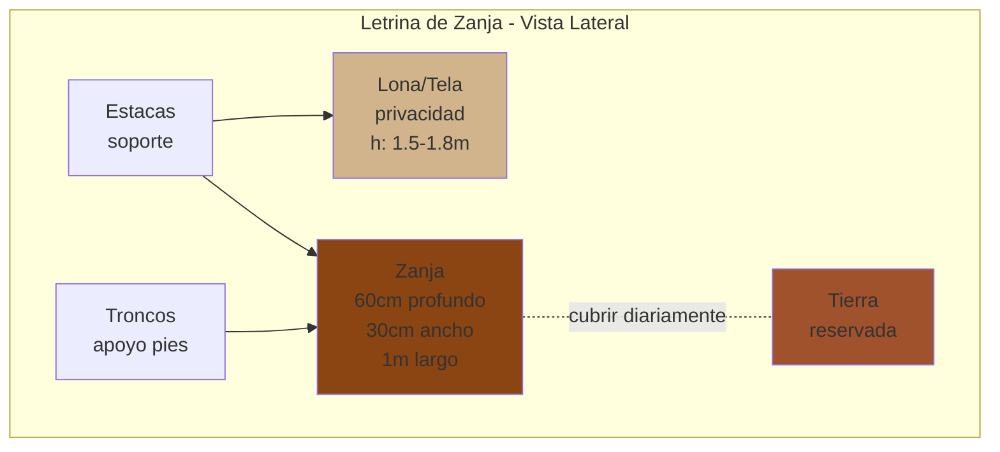
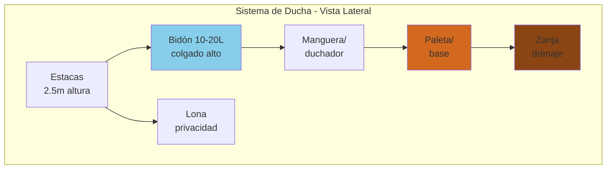

# Campamento III

**Área:** Actividades Recreativas
**Código:** AR-051
**Nivel:** 3
**Año de creación:** 1986
**Institución de origen:** Asociación General

---

## 📋 Requisitos

### 1. Tener como mínimo doce años

**Respuesta:**

Este es un requisito de edad. Debes tener al menos 12 años cumplidos para completar Campamento III.

**Razón:**
- Campamento III es nivel avanzado
- Requiere madurez física y mental
- Habilidades de supervivencia más complejas
- Mayor responsabilidad personal
- Técnicas que requieren fuerza y coordinación desarrolladas

**Progresión:**
- Campamento I: 10+ años
- Campamento II: 11+ años
- Campamento III: 12+ años
- Campamento IV: 13+ años

---

### 2. Trabajar por lo menos tres horas en un proyecto de arreglo de la naturaleza, como hacer o despejar un camino

**Respuesta:**

**[PRÁCTICA REQUERIDA]**
Debes participar en un proyecto real de conservación o mejora de un área natural.

**TIPOS DE PROYECTOS APROPIADOS:**

**1. Mantenimiento de senderos:**
- Despejar camino cubierto de vegetación
- Remover ramas caídas
- Reparar erosión en sendero
- Marcar sendero con señales
- Limpiar drenajes obstruidos

**2. Limpieza de área natural:**
- Recolectar basura dejada por otros
- Limpiar área de campamento abandonada
- Retirar grafiti de rocas/árboles
- Eliminar plantas invasoras

**3. Construcción/reparación:**
- Construir escalones en pendiente pronunciada
- Reparar puente pequeño
- Construir barreras para proteger vegetación
- Instalar señalización educativa

**4. Restauración:**
- Plantar árboles nativos
- Sembrar vegetación en área erosionada
- Construir refugios para vida silvestre
- Limpiar fuente de agua contaminada

**CÓMO ORGANIZAR EL PROYECTO:**

**Planificación (antes):**
1. Identifica área que necesita trabajo
2. Contacta autoridades del parque/área (permisos)
3. Planifica qué harás específicamente
4. Reúne herramientas necesarias
5. Organiza grupo de trabajo
6. Establece fecha

**Herramientas que podrías necesitar:**
- Guantes de trabajo
- Bolsas de basura
- Palas
- Rastrillos
- Sierras de mano
- Martillos/clavos (si construyes)
- Pintura/señales (si marcas sendero)

**Durante el trabajo:**
- Trabaja en equipo
- Sigue indicaciones del líder
- Toma descansos (hidratación)
- Trabaja de manera segura
- No te apresures - calidad sobre velocidad

**Después:**
- Toma fotos "antes y después"
- Documenta horas trabajadas
- Agradece a quienes organizaron
- Escribe reflexión personal

**DOCUMENTACIÓN REQUERIDA:**

Prepara informe breve que incluya:
- Fecha y lugar
- Descripción del proyecto
- Horas trabajadas (mínimo 3)
- Qué hiciste específicamente
- Fotos
- Qué aprendiste

**BENEFICIOS:**
- Retribuyes a la naturaleza
- Desarrollas ética de servicio
- Trabajas en equipo
- Aprendes sobre conservación
- Dejas área mejor para futuros visitantes

**EJEMPLOS DE PROYECTOS:**

**Proyecto 1: Limpieza de sendero**
- 3 horas
- Grupo de 8 conquistadores
- Removieron 15 bolsas de basura
- Despejaron 2 km de sendero
- Repararon 3 áreas erosionadas

**Proyecto 2: Construcción de escalones**
- 4 horas
- Construyeron 20 escalones de madera
- En pendiente pronunciada del sendero
- Previene futura erosión
- Hace acceso más seguro

---

### 3. Revisar los seis puntos importantes en la selección de un buen lugar de campamento. Revisar las reglas de seguridad para hacer una fogata

**Respuesta:**

**SEIS PUNTOS PARA SELECCIONAR LUGAR DE CAMPAMENTO:**

**1. TERRENO:**
- **Busca:** Plano, nivelado, ligeramente elevado
- **Evita:** Depresiones (acumula agua), lechos secos de ríos, terreno muy rocoso
- **Por qué:** Comodidad al dormir, drenaje de agua, facilidad para armar carpas

**2. AGUA:**
- **Busca:** Cerca de fuente confiable (60-90 metros)
- **Evita:** Demasiado cerca (inundación, mosquitos), sin fuente (tendrás que cargar todo)
- **Por qué:** Necesitas agua para beber, cocinar, limpiar, pero distancia protege ecosistema

**3. VIENTO:**
- **Busca:** Protección natural (árboles, rocas, colinas), pero con ventilación
- **Evita:** Crestas expuestas (viento fuerte), valles estrechos (viento canalizado)
- **Por qué:** Viento excesivo enfría y tumba carpas, pero algo de brisa controla insectos

**4. SEGURIDAD:**
- **Busca:** Libre de peligros, acceso a rutas de emergencia
- **Evita:** Bajo árboles muertos, cerca de panales/hormigueros, áreas de animales grandes
- **Por qué:** Tu vida y la del grupo dependen de entorno seguro

**5. IMPACTO AMBIENTAL:**
- **Busca:** Áreas ya usadas o superficies durables (roca, grava, pasto resistente)
- **Evita:** Vegetación frágil, cerca de nidos, áreas de reproducción de animales
- **Por qué:** Minimiza daño al ecosistema, practica "No Dejar Rastro"

**6. REGULACIONES:**
- **Busca:** Área donde está permitido acampar, cumple requisitos de distancia
- **Evita:** Áreas prohibidas, propiedades privadas sin permiso
- **Por qué:** Respeto a leyes y conservación, evita multas o expulsión

**REGLAS DE SEGURIDAD PARA FOGATAS:**

**UBICACIÓN:**
1. Superficie no inflamable (tierra, arena, roca)
2. Mínimo 5 metros de carpas y equipo
3. Lejos de árboles y ramas bajas
4. Protegida del viento pero ventilada
5. Área designada si existe

**PREPARACIÓN:**
6. Limpia 2-3 metros alrededor (hasta tierra mineral)
7. Quita material inflamable (hojas, ramas, pasto seco)
8. Ten agua, arena o extintor cerca
9. Verifica que esté permitido hacer fogata
10. Revisa pronóstico (viento fuerte = no fogata)

**CONSTRUCCIÓN:**
11. Usa círculo de piedras (no de río - explotan)
12. Tamaño controlado (30-40 cm diámetro máximo)
13. Solo madera muerta caída
14. Estructura estable

**DURANTE:**
15. NUNCA dejes sin supervisión
16. Mantén niños a distancia segura
17. No agregues plástico, basura, latas
18. No rocíes líquidos inflamables
19. Controla chispas volando
20. Ten palo largo para mover leña
21. Mantén cabello recogido, ropa ajustada

**APAGAR:**
22. Apaga completamente antes de dormir/salir
23. Rocía con agua, revuelve cenizas, más agua
24. Repite hasta que cenizas estén frías al tacto
25. Debes poder poner las manos en las cenizas
26. Si no está frío, NO está apagado

**DESPUÉS:**
27. Esparce cenizas frías lejos del campamento
28. Desmantela círculo si lo creaste
29. Restaura área a estado natural

**EMERGENCIAS:**
30. Si se sale de control: agua inmediatamente, pide ayuda
31. Si ropa prende: PARA, TÍRATE, RUEDA
32. Botiquín accesible para quemaduras

---

### 4. Participar de un campamento de fin de semana, con un mínimo de dos pernoctes

**Respuesta:**

**[PRÁCTICA REQUERIDA]**
Campamento de viernes a domingo (2 noches) donde demostrarás las habilidades de Campamento III.

**PROPÓSITO:**
Este campamento es más avanzado que Campamento I y II. Aquí demuestras:
- Mayor autonomía
- Habilidades de supervivencia
- Construcción de fogatas avanzadas
- Técnicas sin fósforos
- Cocina con alimentos frescos/deshidratados

**PREPARACIÓN ESPECIAL:**

**Equipo adicional necesario:**
- Herramientas para afilar (piedra de afilar, lima)
- Materiales para encender fuego sin fósforos
- Alimentos frescos O deshidratados
- Diferentes tipos de leña (práctica de fogatas)

**Habilidades a practicar antes:**
- Afilar cuchillo y hacha
- Construir fogatas específicas (estrella, cazador, reflector)
- Métodos de ignición sin fósforos
- Preparar alimentos deshidratados

**ESTRUCTURA DEL CAMPAMENTO:**

**Viernes (noche 1):**
- Llegada y establecimiento
- Revisión de reglas de seguridad avanzadas
- Construcción de fogata del consejo (práctica)
- Devocional nocturno
- Dormir

**Sábado (noche 2):**
- Desayuno
- Proyecto de conservación (requisito 2) - si no se hizo antes
- Escuela Sabática y culto
- Almuerzo
- Taller: construcción de fogatas avanzadas
- Práctica de encender fuego sin fósforos
- Cena con alimentos frescos/secos
- Taller de afilado de herramientas
- Fogata sabática especial
- Dormir

**Domingo (salida):**
- Desayuno
- Evaluación final de habilidades
- Desarmar campamento
- Limpieza exhaustiva
- Inspección grupal
- Reflexión y oración de cierre
- Regreso

**EVALUACIÓN:**

Durante el campamento se evalúa:
- Construcción correcta de 3 fogatas (requisito 5)
- Encendido sin fósforos (requisito 6)
- Afilado de herramientas (requisito 7)
- Cocina con frescos/secos (requisito 8)
- Conocimiento de carpas (requisito 9)
- Comprensión de condensación (requisito 10)

**ACTITUD ESPERADA:**
- Liderazgo entre compañeros
- Ayuda proactiva
- Iniciativa propia
- Responsabilidad total de tu equipo
- Enseñanza a conquistadores menores

---

### 5. Construir las siguientes fogatas y explicar su uso

**Respuesta:**

**[PRÁCTICA REQUERIDA]**
Debes construir físicamente estas tres fogatas y explicar para qué sirve cada una.

**a) FOGATA ESTRELLA (Star Fire)**

**Construcción:**
1. **Material:**
   - 5-7 troncos largos (1.5-2 metros cada uno)
   - Del grosor de tu muñeca
   - Secos

2. **Disposición:**
   - Coloca troncos como rayos de estrella
   - Todos convergen en el centro
   - Extremos internos se tocan
   - Espaciados uniformemente

3. **Centro:**
   - Yesca abundante
   - Combustible pequeño
   - Enciende en el centro

4. **Mantenimiento:**
   - A medida que centro se consume
   - Empuja troncos hacia adentro
   - Mantiene fuego activo sin agregar leña nueva

**Uso:**
- **Fogata de larga duración** sin mantenimiento constante
- Perfecta para mantener fuego toda la noche
- Vigilia, guardias
- **Regulable:** separas troncos = menos calor, juntas = más calor
- Economiza leña
- También llamada "Fogata del flojo" (¡no requiere estar levantándose!)

**Ventajas:**
- Dura horas con una sola carga
- Fácil de controlar intensidad
- Segura (fuego concentrado en centro pequeño)

**b) FOGATA CAZADOR (Hunter's Fire)**

**Construcción:**
1. **Material:**
   - 2 troncos grandes (50-60 cm largo, 15-20 cm diámetro)
   - Secos y firmes

2. **Disposición:**
   - Coloca troncos paralelos
   - Separación: 25-35 cm (ancho de una olla)
   - Orientados hacia dirección del viento

3. **Entre los troncos:**
   - Fogata pequeña
   - Puede ser tipi, cabaña, o pirámide
   - Mantén llama entre los troncos

**Uso:**
- **Especializada para cocinar**
- Los troncos actúan como soporte para ollas/sartenes
- **Protege del viento** = más eficiente
- Control preciso de calor
- Refleja calor hacia arriba
- Múltiples ollas simultáneas

**Ventajas:**
- Soporte natural (no necesitas parrilla)
- Protección del viento
- Eficiencia de combustible
- Control de temperatura ajustando distancia entre troncos

**Técnicas:**
- Troncos más juntos = más calor concentrado
- Troncos más separados = calor más suave
- Coloca olla directamente sobre troncos

**c) FOGATA REFLECTOR (Reflector Fire)**

**Construcción:**
1. **Pared reflectora (detrás del fuego):**
   - **Opción 1:** Apila troncos verdes horizontalmente
     - Claveta dos estacas verticales
     - Apila troncos entre las estacas
     - Altura: 60-90 cm

   - **Opción 2:** Usa roca plana grande natural
     - Coloca fogata frente a roca

   - **Opción 3:** Construye pared de piedras

2. **Fogata (frente a pared):**
   - 30-40 cm de distancia de la pared
   - Tipo inclinado (leña recostada en la pared)
   - O tipo tipi normal

3. **Ángulo:**
   - Pared ligeramente inclinada hacia adelante
   - Refleja calor hacia donde lo necesitas

**Uso:**
- **Refleja calor en una dirección específica**
- Calentar frente de carpa
- Asar carne (entre fuego y reflector)
- Cocinar pan al reflector
- **Eficiencia máxima del calor** en clima frío
- Secar ropa mojada

**Ventajas:**
- Duplica calor efectivo (refleja)
- Direcciona calor donde lo necesitas
- Excelente para hornear (calor envolvente)
- Protege de viento por detrás

**Técnicas de horneado:**
- Cuelga/coloca comida entre fuego y reflector
- Calor de fuego + calor reflejado = "horno"
- Perfecto para pan, pescado, aves

**COMPARACIÓN RÁPIDA:**

| Fogata | Mejor para | Duración | Dificultad |
|--------|-----------|----------|------------|
| Estrella | Calor prolongado, vigilias | Muy larga | Fácil |
| Cazador | Cocinar, múltiples ollas | Media | Media |
| Reflector | Calentar área, hornear | Media | Difícil |

---

### 6. Conocer seis maneras de encender una fogata sin usar fósforos. Construir una fogata usando uno de los siguientes métodos

**Respuesta:**

**[PRÁCTICA REQUERIDA]**
Debes conocer 6 métodos Y demostrar uno físicamente.

**SEIS MÉTODOS PARA ENCENDER FUEGO SIN FÓSFOROS:**

**1. PEDERNAL/PIEDRA DE FUEGO (Flint & Steel):**

**Qué es:**
- Piedra de pedernal + pieza de acero
- O ferrocerio (pedernal artificial moderno)

**Cómo funciona:**
- Golpeas acero contra pedernal
- Crea chispas calientes
- Chispas caen en yesca

**Técnica:**
1. Prepara yesca muy fina (algodón carbonizado ideal)
2. Sostén pedernal cerca de yesca
3. Golpea acero contra pedernal con ángulo
4. Chispas caen en yesca
5. Sopla suavemente cuando prenda

**Ventajas:**
- Funciona mojado
- Miles de usos
- Confiable

**2. FRICCIÓN (Friction Fire):**

**Método del arco y taladro:**

**Materiales:**
- Tabla base (madera suave: sauce, tilo, cedro)
- Husillo (palo giratorio, madera dura)
- Arco (rama curva con cuerda)
- Bearing block (bloque superior para presionar)

**Construcción:**
1. Tabla base: corta muesca en V
2. Husillo: palo recto, 20-25 cm
3. Arco: rama flexible con cuerda tensa
4. Bearing block: madera dura con depresión

**Técnica:**
1. Coloca yesca bajo la muesca
2. Husillo en depresión de la tabla
3. Envuelve cuerda del arco una vuelta en husillo
4. Bearing block presiona husillo desde arriba
5. Mueve arco adelante-atrás (Sierra)
6. Fricción genera polvo caliente
7. Polvo cae en yesca por la muesca
8. Cuando humea, envuelve yesca
9. Sopla suavemente hasta que prenda llama

**Dificultad:** Alta - requiere práctica

**3. CHISPA (Spark - Batería y lana de acero):**

**Materiales:**
- Batería 9V (o2 pilas AA)
- Lana de acero fina (#0000)

**Técnica:**
1. Estira lana de acero
2. Toca ambos terminales de batería con lana
3. Cortocircuito crea chispas
4. Lana prende inmediatamente
5. Coloca en yesca preparada
6. Sopla para propagar llama

**Ventajas:**
- Muy fácil
- Rápido
- Alta tasa de éxito

**4. LENTE DE CRISTAL (Solar ignition):**

**Materiales:**
- Lupa
- O lentes de lectura
- O fondo de botella de vidrio con agua
- O hielo pulido en forma de lente
- O bolsa plástica con agua (emergencia)

**Técnica:**
1. Día soleado requerido
2. Prepara yesca muy fina y seca
3. Enfoca rayos del sol con lente
4. Punto focal en yesca
5. Mantén firme (2-10 minutos)
6. Cuando humee, sopla suavemente

**Ventajas:**
- No desgasta equipo
- Silencioso

**Desventajas:**
- Solo funciona con sol
- Requiere paciencia

**5. FÓSFORO DE METAL (Ferrocerio rod):**

**Qué es:**
- Barra de ferrocerio (material pirofórico)
- Con raspador metálico

**Técnica:**
1. Yesca preparada
2. Sostén barra cerca (2-3 cm) de yesca
3. Raspa barra con raspador/cuchillo
4. Presión firme, movimiento rápido
5. Chispas muy calientes (3000°C)
6. Prende yesca fácilmente

**Ventajas:**
- Funciona mojado
- Miles de usos
- Chispas muy calientes
- Confiable
- Popular en supervivencia

**6. AIRE COMPRIMIDO (Fire piston):**

**Qué es:**
- Pistón de fuego (tubo + émbolo)
- Compresión rápida calienta aire

**Cómo funciona:**
- Física: compresión rápida = calor
- Aire comprimido alcanza 260°C
- Enciende yesca en cámara

**Técnica:**
1. Coloca yesca fina en cámara del émbolo
2. Inserta émbolo en tubo
3. Golpe rápido y fuerte hacia abajo
4. Retira inmediatamente
5. Yesca estará prendida
6. Transfiere a yesca preparada

**Ventajas:**
- Compacto
- Funciona en casi cualquier condición

**DEMOSTRACIÓN PRÁCTICA:**

**Debes construir fogata usando UNO de estos métodos:**

**Método recomendado para demostración: FERROCERIO (Fósforo de metal)**

**Por qué:**
- Alta tasa de éxito
- Relativamente fácil
- No depende del clima
- Equipo económico y portátil

**Preparación para demostración exitosa:**

1. **Yesca preparada:**
   - Algodón (o bolitas de algodón con vaselina)
   - Virutas muy finas de madera
   - Corteza seca de abedul
   - Pelusa de secadora
   - SECA completamente

2. **Combustible graduado:**
   - Tamaño fósforo → lápiz → dedo → muñeca
   - Todo seco
   - Organizado por tamaño

3. **Estructura lista:**
   - Tipi pequeño armado
   - Espacio para insertar yesca prendida

4. **Práctica previa:**
   - Practica 10-20 veces antes
   - Desarrolla técnica correcta
   - Conoce tu equipo

**Día de demostración:**
1. Explica método que usarás
2. Muestra materiales
3. Demuestra técnica
4. Enciende yesca
5. Transfiere a fogata preparada
6. ¡Éxito!

---

### 7. Saber afilar un cuchillo o navaja y un hacha

**Respuesta:**

**[PRÁCTICA REQUERIDA]**
Debes demostrar que sabes afilar ambas herramientas correctamente.

**POR QUÉ AFILAR:**
- Herramienta afilada es MÁS segura
- Requiere menos fuerza
- Cortes más precisos
- Menos riesgo de resbalones
- Mayor control

**AFILAR CUCHILLO/NAVAJA:**

**Materiales:**
- Piedra de afilar (whetstone)
  - Grano medio (1000) para afilar
  - Grano fino (3000-6000) para pulir
- O lima de afilar
- Agua o aceite (según tipo de piedra)
- Trapo

**Ángulo correcto:**
- **20-25 grados** para la mayoría de cuchillos de campamento
- Truco: imagina esquina de caja de fósforos

**Técnica:**

1. **Preparación:**
   - Moja/aceita piedra según tipo
   - Coloca piedra en superficie estable
   - Limpia cuchillo

2. **Determinar ángulo:**
   - Coloca cuchillo plano en piedra
   - Levanta lomo aproximadamente 20°
   - Mantén ángulo constante (crucial)

3. **Movimiento:**
   - Empuja filo contra piedra (como cortar rebanada delgada)
   - Desde talón hasta punta
   - Presión media, consistente
   - Repite 10-15 veces

4. **Voltea:**
   - Gira cuchillo
   - Mismo ángulo en otro lado
   - Mismos pases (10-15)

5. **Alterna:**
   - 10 pases lado A
   - 10 pases lado B
   - Reduce a 5-5
   - Luego 3-3
   - Finalmente 1-1

6. **Verifica:**
   - **Prueba del papel:** corta papel limpiamente
   - **Prueba del pulgar:** desliza (NO cortes) pulgar perpendicular al filo - debe "agarrar"
   - **Prueba visual:** sin rebabas o reflejos en el filo

7. **Pulido (opcional pero recomendado):**
   - Piedra fina
   - Pases ligeros
   - Refina filo

**AFILAR HACHA:**

**Materiales:**
- Lima de mill bastard (10-12 pulgadas)
- O piedra de afilar grande
- Prensa o tornillo de banco (opcional)
- Guantes de trabajo
- Aceite ligero

**Ángulo correcto:**
- **25-30 grados** para hachas de campamento
- Más obtuso que cuchillo (más resistente a impacto)

**Técnica:**

1. **Asegurar hacha:**
   - En tornillo de banco (ideal)
   - O entre rodillas con filo hacia afuera
   - O compañero sostiene (con cuidado)
   - Estable y segura

2. **Con lima:**
   - Lima en una dirección solamente (alejándote)
   - NO vaivén (daña lima)
   - Siguiendo ángulo existente del bisel
   - Golpes largos, uniformes
   - Desde ojo hasta punta del filo
   - 15-20 pasadas por lado

3. **Alternas lados:**
   - Trabaja un lado
   - Voltea, otro lado
   - Mantén simetría

4. **Verifica:**
   - Pasa dedo perpendicular al filo (cuidado)
   - Debe sentirse uniforme, sin secciones desafiladas
   - Sin rebabas grandes

5. **Elimina rebaba:**
   - Pasadas ligeras finales con piedra
   - Alternando lados
   - Hasta eliminar rebaba

6. **Protege filo:**
   - Aplica aceite ligero (previene óxido)
   - Guarda en funda

**FRECUENCIA:**
- Cuchillo: después de uso intenso
- Hacha: inicio de cada campamento o cuando notes pérdida de filo

**SEÑALES DE NECESITAR AFILADO:**
- Requiere más fuerza para cortar
- Filo brillante (luz se refleja = desafilado)
- Aplasta fibras en vez de cortarlas
- Resbala en vez de morder la madera

**ERRORES COMUNES:**

1. **Ángulo inconsistente** - mantén ángulo constante
2. **Demasiada presión** - media presión es suficiente
3. **Movimientos rápidos** - lento y controlado es mejor
4. **Solo un lado** - ambos lados deben afilarse igual
5. **Lima vieja/embotada** - reemplaza herramientas desgastadas

**MANTENIMIENTO:**
- Limpia herramientas después de afilar
- Acéita para prevenir óxido
- Guarda en lugar seco
- No golpees filos contra metal o piedra

---

### 8. Cocinar una comida utilizando alimentos frescos o secos durante el campamento

**Respuesta:**

**[PRÁCTICA REQUERIDA]**
Debes preparar una comida completa usando alimentos frescos O deshidratados.

**OPCIÓN 1: ALIMENTOS FRESCOS**

**Ventajas:**
- Mejor sabor
- Más nutrientes
- Familiar

**Desafíos:**
- Requieren refrigeración (cooler)
- Más pesados
- Perecederos

**EJEMPLO DE MENÚ FRESCO:**

**Desayuno:**
- Huevos revueltos (frescos)
- Salchichas
- Pan tostado
- Frutas frescas (manzana, banano)
- Jugo de naranja

**Almuerzo:**
- Sándwiches (pan, jamón, queso, vegetales frescos)
- Zanahorias y pepinos crudos
- Galletas
- Fruta

**Cena:**
- Pollo a la parrilla (fresco, bien refrigerado)
- Arroz
- Ensalada (lechuga, tomate, pepino)
- Pan de ajo
- Agua/bebida

**Consideraciones:**
- Lleva cooler con hielo
- Consume alimentos más perecederos primero
- Mantén cadena de frío
- Verifica cocción completa de carnes

**OPCIÓN 2: ALIMENTOS DESHIDRATADOS/SECOS**

**Ventajas:**
- Livianos (para mochileros)
- No requieren refrigeración
- Larga duración
- Fáciles de transportar

**Desafíos:**
- Requieren agua para rehidratar
- Sabor menos natural
- Textura diferente

**ALIMENTOS DESHIDRATADOS COMUNES:**

**Comerciales:**
- Comidas liofilizadas (Mountain House, etc.)
- Sopas instantáneas
- Puré de papas instantáneo
- Arroz instantáneo
- Pasta deshidratada
- Leche en polvo
- Huevos en polvo

**Naturales secos:**
- Frutas secas (pasas, manzana, mango)
- Frutos secos (almendras, nueces)
- Carne seca (jerky)
- Frijoles secos
- Lentejas
- Avena

**EJEMPLO DE MENÚ SECO:**

**Desayuno:**
- Avena instantánea con pasas
- Leche en polvo
- Frutos secos
- Barras energéticas

**Almuerzo:**
- Sopa instantánea
- Galletas de campaña
- Carne seca
- Trail mix (mezcla de frutos secos)

**Cena:**
- Comida liofilizada (estofado de carne)
- O arroz instantáneo con atún en lata
- O pasta con salsa deshidratada
- Puré de papas instantáneo
- Bebida en polvo

**TÉCNICA DE PREPARACIÓN - ALIMENTOS SECOS:**

**Principios básicos:**
1. **Lee instrucciones:** cada producto tiene proporción agua diferente
2. **Agua caliente:** rehidrata más rápido que fría
3. **Tiempo:** generalmente 5-15 minutos de reposo
4. **Revolver:** distribuye agua uniformemente

**Ejemplo: Comida liofilizada**
1. Hierve agua (cantidad indicada en paquete)
2. Vierte agua en bolsa de comida
3. Revuelve bien
4. Cierra bolsa
5. Espera tiempo indicado (5-10 min)
6. Revuelve de nuevo
7. Come directamente de bolsa (menos platos para lavar)

**PRÁCTICA SUGERIDA PARA EVALUACIÓN:**

**Menú combinado (lo más práctico):**
- Algunos alimentos frescos (primer día)
- Algunos deshidratados
- Demuestra versatilidad

**Ejemplo día 2 del campamento:**

**Desayuno:**
- Avena instantánea + pasas (seco)
- Leche en polvo reconstituida (seco)
- Manzana fresca (fresco)

**Almuerzo:**
- Sopa instantánea (seco)
- Sándwich de mantequilla de maní (seco/estable)
- Frutos secos (seco)

**Cena (la que prepararás para evaluación):**
- Arroz instantáneo (seco)
- Atún en lata (estable)
- Vegetales deshidratados rehidratados (seco)
- Salsa de tomate (estable)
- Mezcla todo = plato completo nutritivo

**Preparación:**
1. Hierve 2 tazas agua
2. Agrega arroz instantáneo (1 taza)
3. Espera 5 min, tapa
4. Aparte: rehidrata vegetales deshidratados en agua caliente (10 min)
5. Escurre vegetales
6. Mezcla arroz + atún + vegetales + salsa
7. Calienta junto 2-3 min
8. Sazona (sal, pimienta)
9. Sirve caliente

**PRESENTACIÓN AL INSTRUCTOR:**
- Explica qué usaste (fresco vs seco)
- Por qué elegiste esos alimentos
- Cómo los preparaste
- Valor nutricional
- Ventajas/desventajas

---

### 9. Describir los diferentes tipos de carpas y sus utilidades

**Respuesta:**

**TIPOS PRINCIPALES DE CARPAS:**

**1. CARPA TIPO DOMO (Dome Tent):**

**Descripción:**
- Forma de domo/cúpula
- 2-3 varillas que se cruzan
- Autoportante (no necesita estacas para mantenerse en pie)

**Tamaños:** 1-8 personas

**Ventajas:**
- Fácil de armar
- Estable en viento
- Buen espacio interior
- Versatilresiste

**Desventajas:**
- Paredes inclinadas reducen espacio útil
- Menos ventilación que otras

**Mejor para:**
- Camping general
- Familias
- Principiantes
- Clima variable

**2. CARPA TÚNEL (Tunnel Tent):**

**Descripción:**
- Forma alargada de túnel
- Varillas paralelas forman arcos
- Requiere estacas para estabilidad

**Ventajas:**
- Excelente espacio interior
- Paredes verticales = más espacio útil
- Vestíbulo grande
- Liviana para su tamaño

**Desventajas:**
- Menos estable en viento (debe estar bien estacada)
- Orientación importa (contra el viento)

**Mejor para:**
- Campamentos base
- Expediciones largas
- Mucho equipo
- Áreas protegidas

**3. CARPA TIPO A / CANADIENSE (A-Frame / Ridge Tent):**

**Descripción:**
- Forma de "A" clásica
- Varilla o cuerda central horizontal
- Poste en cada extremo

**Ventajas:**
- Diseño probado (décadas)
- Simple
- Buen flujo de aire
- Repelente de agua (forma)

**Desventajas:**
- Pesada
- Poco espacio vertical en lados
- Armado más complejo

**Mejor para:**
- Camping tradicional/nostálgico
- Scouts y grupos
- Campamentos largos
- Climas lluviosos

**4. CARPA GEODÉSICA (Geodesic Dome):**

**Descripción:**
- Múltiples varillas entrecruzadas (4-6+)
- Forma de domo complejo
- Muy estable estructuralmente

**Ventajas:**
- EXTREMADAMENTE resistente a viento
- Excelente en nieve
- Distribución uniforme de tensión
- Resistente

**Desventajas:**
- Compleja de armar
- Pesada
- Costosa

**Mejor para:**
- Expediciones extremas
- Alta montaña
- Condiciones severas
- Vientos muy fuertes

**5. CARPA INDIVIDUAL/BIVVY (Bivy Tent / Solo Tent):**

**Descripción:**
- Minimalista
- Apenas cubre persona acostada
- Ultra liviana

**Ventajas:**
- Muy liviana (500g - 1.5kg)
- Rápida de armar
- Compacta
- Económica

**Desventajas:**
- Espacio MUY limitado
- Claustrofóbica
- Solo equipo esencial cabe

**Mejor para:**
- Mochileros ultraligeros
- Travesías rápidas
- Minimizar peso
- Refugio de emergencia

**6. CARPA FAMILIAR/CABAÑA (Cabin Tent):**

**Descripción:**
- Paredes casi verticales
- Techo alto
- Grande (4-12 personas)
- Cuartos separados a veces

**Ventajas:**
- Espacio interior máximo
- Puedes pararte dentro
- Confortable
- Ventanas/puertas múltiples

**Desventajas:**
- MUY pesada
- Solo para auto-camping
- Compleja de armar
- No para viento fuerte

**Mejor para:**
- Campamentos familiares largos
- Camping con vehículo
- Grupos
- Comodidad prioritaria

**7. CARPA TIPO TIPI/PIRÁMIDE (Tipi / Pyramid Tent):**

**Descripción:**
- Forma cónica
- Poste central único
- Base circular o cuadrada

**Ventajas:**
- Simple
- Resistente a viento (forma aerodinámica)
- Buen espacio vertical central
- Puede acomodar estufa (modelos apropiados)

**Desventajas:**
- Poste central en medio (estorba)
- Espacio menor en orillas
- Requiere estacas

**Mejor para:**
- Camping en áreas abiertas
- Invierno (con estufa)
- Grupos pequeños
- Minimalistas

**8. CARPA TIPO REFUGIO/TARP (Tarp Shelter):**

**Descripción:**
- No es carpa cerrada
- Lona con múltiples configuraciones
- Usas árboles, postes, cuerdas

**Ventajas:**
- Ultra versátil
- Muy liviana
- Económica
- Ventilación total

**Desventajas:**
- Sin piso ni mallas
- Menos protección (insectos, animales)
- Requiere práctica armar

**Mejor para:**
- Mochileros experimentados
- Clima predecible
- Areas sin insectos
- Máxima liviandad

**COMPARACIÓN POR USO:**

**Principiantes → Domo**
**Familias → Cabaña**
**Mochileros → Individual/Túnel liviana**
**Montañistas → Geodésica**
**4 estaciones → Geodésica o Tipi con estufa**
**Ultraligero → Bivy o Tarp**

**FACTORES AL ELEGIR:**

1. **Número de personas**
2. **Temporada de uso** (3 estaciones vs 4 estaciones)
3. **Transporte** (auto vs mochila)
4. **Clima esperado**
5. **Presupuesto**
6. **Experiencia**

---

### 10. ¿Cómo ocurre la condensación en una carpa y cómo se la puede prevenir?

**Respuesta:**

**CÓMO OCURRE LA CONDENSACIÓN:**

**Física básica:**
1. **Respiración humana** produce vapor de agua
   - Cada persona exhala ~1 litro de agua por noche
   - Sale como vapor caliente

2. **Transpiración corporal**
   - Sudor se evapora
   - Aumenta humedad interior

3. **Ropa/equipo mojado**
   - Evapora dentro de carpa
   - Aumenta humedad

4. **Aire caliente retiene más humedad**
   - Dentro de carpa = caliente (cuerpos)
   - Fuera = frío

5. **Contacto con superficie fría**
   - Aire húmedo caliente toca pared fría de carpa
   - Se enfría rápidamente
   - Vapor se condensa = gotas de agua

**Resultado:** Paredes interiores mojadas, goteo, equipo húmedo

**Peor en:**
- Noches frías
- Alta humedad ambiental
- Sin viento
- Carpas cerradas completamente
- Muchas personas en espacio pequeño

**CÓMO PREVENIR CONDENSACIÓN:**

**1. VENTILACIÓN (Más importante):**

**Abre ventilaciones:**
- Ventanas de malla abiertas
- Respiraderos superiores abiertos
- Puerta parcialmente abierta
- SIEMPRE deja ventilación, incluso con frío

**Por qué funciona:**
- Aire fresco entra
- Aire húmedo sale
- Reduce humedad interior
- Ecuali temperatura

**Balance:**
- Suficiente ventilación para reducir humedad
- No tanta que entre frío excesivo

**2. DISEÑO DE CARPA APROPIADO:**

**Doble pared:**
- Carpa interna + sobretecho (rainfly) separados
- Espacio de aire entre ambos
- Condensación forma en sobretecho (exterior)
- Interior permanece seco

**Ventilaciones múltiples:**
- Preferir carpas con ventilación superior E inferior
- Flujo cruzado de aire

**3. UBICACIÓN DE LA CARPA:**

**Evita:**
- Áreas muy húmedas (cerca de río, pantano)
- Depresiones (acumula aire frío húmedo)
- Sin brisa

**Busca:**
- Ligeramente elevado
- Algo de brisa (no viento fuerte)
- Área relativamente seca

**4. LIMITA HUMEDAD INTERNA:**

**Antes de entrar:**
- Sacude ropa mojada afuera
- Quita nieve/lluvia de ropa y zapatos
- No entres sudado (ventila primero)

**Dentro:**
- NO cocines dentro (produce vapor)
- NO seques ropa dentro
- Ropa mojada: guárdala en bolsa sellada

**5. TOALLA/TRAPO:**

**Si ya hay condensación:**
- Ten toalla absorbente
- Por la mañana, limpia paredes
- Antes de que gotee sobre ti/equipo

**Ventila inmediatamente:**
- Abre todo
- Deja secar antes de empacar

**6. TEMPERATURA:**

**No sobrecalientes:**
- Tu cuerpo genera calor
- Suficiente aislamiento sin exceso
- Más calor = más capacidad de retener humedad = más condensación al enfriar

**7. ARMA CORRECTAMENTE:**

**Sobretecho tenso:**
- No debe tocar carpa interna
- Espacio de aire entre ambos
- Si tocan: condensación pasa al interior

**Estacas y tensores:**
- Carpa tensa reduce superficies donde condensa
- Estructura firme

**8. TIMING:**

**Mañana:**
- Ventila completamente al despertar
- Deja carpa abierta mientras desayunas
- Intenta secar antes de guardar

**Noche:**
- Abre ventilaciones ANTES de dormir
- No esperes a que se forme condensación

**SOLUCIONES ESPECÍFICAS POR CLIMA:**

**Frío intenso:**
- Ventilación sigue siendo clave
- Usa sobretecho resistente al frío
- Limpia escarcha antes que se derrita

**Muy húmedo:**
- Maximiza ventilación
- Considera tarp externo adicional
- Acepta que habrá algo de condensación

**Calor:**
- Deja carpa lo más abierta posible
- Solo malla si no hay lluvia

**ERRORES COMUNES:**

1. **Cerrar todo porque hace frío**
   - Causa MÁS condensación
   - Luego todo se moja = MÁS frío

2. **Pensar que es filtración de lluvia**
   - Condensación puede parecer gotera
   - Verifica: si está SECO afuera pero mojado adentro = condensación

3. **No ventilar en lluvia**
   - Aún con lluvia, necesitas ventilación
   - Sobretecho protege mientras ventilas

**ENTENDER ≠ ELIMINAR:**
- Imposible eliminar completamente en ciertas condiciones
- Objetivo: MINIMIZAR
- Ventilación es la clave #1

---

### 11. Demostrar la capacidad de mantener segura y firme una tienda de campaña o carpa

**Respuesta:**

**[PRÁCTICA REQUERIDA]**
Debes demostrar que sabes armar una carpa correctamente para que resista viento y lluvia.

**ELEMENTOS DE SEGURIDAD:**

**1. ESTACAS (Piquetes):**

**Tipos:**
- Metal: Resistentes, para terreno duro
- Plástico: Ligeras, terreno normal
- Madera: Improvisadas en emergencia
- Forma Y: Mayor agarre

**Técnica correcta:**
- Ángulo 45-60 grados hacia la carpa
- Enterradas 2/3 de su longitud
- Martillar firmemente (sin doblar)
- Verificar que no se suelten

**2. TENSORES (Vientos):**

**Función:**
- Mantienen estructura tensa
- Resisten viento
- Evitan acumulación de agua en techo

**Ajuste correcto:**
- Tirantes desde esquinas superiores
- Ángulo 45 grados desde carpa
- Tensión uniforme (ni flojos ni excesivos)
- Usar nudo ajustable (dos medios cotes)

**3. ESTRUCTURA DE VARILLAS:**

**Armado:**
- Ensambla varillas completamente
- Inserta en mangas/clips
- Verifica conexiones seguras
- No fuerces varillas dobladas

**4. SOBRETECHO (Rainfly):**

**Instalación:**
- Debe cubrir completamente carpa interna
- NO debe tocar paredes internas
- Espacio aire entre ambos (5-10 cm)
- Bien tensado para evitar flapping

**PROCEDIMIENTO COMPLETO:**

**Paso 1: Ubicación**
- Terreno plano
- Sin piedras/ramas bajo piso
- Orientación contra viento dominante

**Paso 2: Base**
- Extiende piso de carpa
- Estaca esquinas ligeramente

**Paso 3: Estructura**
- Arma varillas
- Inserta en carpa
- Levanta estructura

**Paso 4: Estacado firme**
- Esquinas primero (45° hacia afuera)
- Puertas/lados después
- Verifica firmeza

**Paso 5: Tensores**
- Instala vientos desde esquinas superiores
- Ajusta con dos medios cotes
- Tensión uniforme

**Paso 6: Sobretecho**
- Coloca sobre estructura
- Estaca faldones
- Ajusta para separación correcta

**Paso 7: Verificación final**
- Tira suavemente esquinas
- No debe moverse
- Estructura firme
- Tensión pareja

**PRUEBA DE SEGURIDAD:**

**Test del viento simulado:**
- Empuja lateralmente
- Debe resistir sin ceder
- Estacas no se sueltan

**Test de lluvia:**
- Rocía agua sobre sobretecho
- Agua escurre (no se acumula)
- Interior permanece seco

**ERRORES COMUNES:**

1. **Estacas flojas** - causa principal de carpas voladas
2. **Sobretecho tocando interior** - transfiere condensación
3. **Tensores desiguales** - estructura torcida
4. **Ángulo incorrecto de estacas** - se sueltan fácil

**NUDOS ESENCIALES:**

**Dos medios cotes (para tensores):**
- Nudo ajustable
- Permite aflojar/tensar fácilmente
- No se suelta solo

**Nudo de anclaje (para estacas):**
- Seguro
- Fácil de deshacer

**MANTENIMIENTO:**

Después del campamento:
- Seca completamente antes de guardar
- Limpia barro de estacas
- Verifica varillas sin fisuras
- Guarda ordenadamente

---

### 12. Durante un campamento, planificar y presentar un devocional de diez minutos u organizar y dirigir un juego sobre la Biblia en la naturaleza, o liderar una Escuela Sabática o el culto de despedida de sábado

**Respuesta:**

**[PRÁCTICA REQUERIDA]**
Debes preparar y liderar UNA de estas opciones durante el campamento.

**OPCIÓN A: DEVOCIONAL DE 10 MINUTOS**

**Estructura sugerida:**

**1. Introducción (1-2 min)**
- Saludo y bienvenida
- Conexión con la naturaleza alrededor
- Presenta tema brevemente

**2. Texto bíblico (2-3 min)**
- Lee pasaje seleccionado
- Explica contexto simple
- Relaciona con experiencia de campamento

**3. Aplicación práctica (4-5 min)**
- ¿Qué nos enseña este texto?
- Ejemplos de la vida diaria
- Conexión con lecciones del campamento

**4. Oración final (1 min)**
- Agradecimiento
- Peticiones relacionadas al tema
- Bendición para el día

**TEMAS SUGERIDOS CON NATURALEZA:**

**Tema 1: "Dios el Creador"**
- Texto: Génesis 1
- Conexión: Observar creación alrededor
- Aplicación: Cuidar lo creado

**Tema 2: "Jesús en la tormenta"**
- Texto: Marcos 4:35-41
- Conexión: Confiar en condiciones difíciles de campamento
- Aplicación: Jesús calma nuestras "tormentas"

**Tema 3: "El buen pastor"**
- Texto: Salmo 23
- Conexión: Dios cuida como pastor cuida ovejas
- Aplicación: Confianza en Su cuidado

**Preparación:**
- Lee el pasaje varios días antes
- Practica en voz alta
- Prepara preguntas para involucrar grupo
- Ten Biblia marcada

**OPCIÓN B: JUEGO BÍBLICO EN LA NATURALEZA**

**Juego 1: Búsqueda del tesoro bíblico**

**Preparación:**
- Esconde 10 objetos naturales
- Cada uno representa historia bíblica
- Crea mapa simple

**Ejemplos de objetos:**
- Piedra = David y Goliat
- Rama = Moisés y vara
- Agua = Bautismo de Jesús
- Pan = Alimentación 5000
- Oveja (figura) = Parábola oveja perdida

**Desarrollo:**
- Divide en equipos
- Entregar mapa
- Encuentran objetos
- Cuentan historia asociada

**Juego 2: Estaciones bíblicas**

**Preparación:**
- 5 estaciones en diferentes puntos
- Cada estación = actividad bíblica

**Estación 1: Creación**
- Identificar 10 cosas creadas por Dios
- Anotar en lista

**Estación 2: Milagros**
- Recrear cruce Mar Rojo (saltar "agua")
- Recolectar "maná" (piedritas blancas)

**Estación 3: Parábolas**
- Buscar "semilla" escondida
- Explicar parábola del sembrador

**Estación 4: Arca de Noé**
- Construir arca miniatura con palitos
- Tiempo límite

**Estación 5: Jesús sana**
- Vendaje de primeros auxilios (práctica)
- Reflexión sobre sanidad espiritual

**OPCIÓN C: LIDERAR ESCUELA SABÁTICA**

**Estructura (45 min - 1 hora):**

**1. Bienvenida e Introducción (5 min)**
- Saludo
- Oración inicial
- Presentación del tema

**2. Canto y adoración (10 min)**
- 3-4 cantos relacionados al tema
- Preferir cantos conocidos
- Usar naturaleza como "escenario"

**3. Lección/Estudio (20-25 min)**
- Presenta lección de la semana
- Usa preguntas participativas
- Divide en grupos pequeños para discusión
- Comparten conclusiones

**4. Actividad práctica (10 min)**
- Relacionada a lección
- Ejemplo: si lección es mayordomía → recolectar basura del área
- Si es creación → observar e identificar especies

**5. Cierre (5 min)**
- Resumen de aprendido
- Oración final
- Anunciar actividades del día

**Preparación:**
- Estudia lección con anticipación
- Prepara preguntas interesantes
- Trae materiales necesarios
- Coordina con instructor

**OPCIÓN D: CULTO DE DESPEDIDA DE SÁBADO**

**Estructura (30-40 min):**

**1. Preparación del ambiente (antes)**
- Fogata pequeña o círculo
- Todos sentados cómodamente
- Materiales preparados

**2. Introducción (5 min)**
- Bienvenida
- Reflexión sobre la semana/día
- Canto suave de apertura

**3. Devocional especial (10 min)**
- Historia o testimonio
- Conexión con experiencias del campamento
- Qué aprendimos esta semana

**4. Momento de compartir (10 min)**
- Cada conquistador comparte:
  - Una bendición recibida
  - Algo que aprendió
  - Agradecimiento a Dios

**5. Cantos de despedida (5 min)**
- Cantos de reflexión
- Cantos de paz

**6. Oración final (5 min)**
- Por semana que comienza
- Por cada conquistador
- Bendición

**Elementos especiales:**
- Velas pequeñas (seguras)
- Círculo de amistad
- Ambiente de reflexión

**TIPS GENERALES:**

**Para cualquier opción:**
- Llega 10 min antes para preparar
- Ten plan B si clima no coopera
- Involucra a participantes
- Mantén energía apropiada al momento
- Termina a tiempo
- Pide feedback después

**Evaluación:**
- ¿Mensaje claro?
- ¿Participación del grupo?
- ¿Timing correcto?
- ¿Impacto espiritual?

---

### 13. Construir una de las siguientes opciones y describir su importancia para el individuo y el medio ambiente

**Respuesta:**

**[PRÁCTICA REQUERIDA]**
Debes construir físicamente UNA de estas opciones en el campamento.

**OPCIÓN A: LETRINA**

**IMPORTANCIA:**

**Para el individuo:**
- Higiene personal básica
- Dignidad y privacidad
- Previene enfermedades
- Comodidad en campamento largo

**Para el medio ambiente:**
- Concentra desechos en un lugar
- Evita contaminación de agua
- Protege flora (no defecar cerca de plantas)
- Facilita descomposición adecuada
- Previene dispersión de enfermedades a fauna

**CONSTRUCCIÓN:**

**Tipo recomendado: Letrina de zanja**

**Materiales:**
- Pala
- Papel higiénico en recipiente impermeable
- Cal o cenizas
- Lona o tela para privacidad
- Estacas y cuerda
- Pala pequeña (para usuarios)

**Ubicación:**
1. **Distancia mínima:**
   - 50-70 metros de fuente de agua
   - 30-50 metros del campamento
   - No en dirección del viento hacia campamento

2. **Terreno:**
   - Ligeramente inclinado (drena lluvia)
   - Tierra excavable
   - Sin rocas grandes

3. **Privacidad:**
   - Detrás de arbustos/árboles
   - No visible desde campamento

**Paso a paso:**

**1. Excavar zanja:**
   - Largo: 1 metro
   - Ancho: 25-30 cm
   - Profundidad: 45-60 cm
   - Reserva tierra excavada (tapar después)

**2. Construir soporte:**
   - Dos troncos paralelos a los lados
   - Distancia 30 cm (ancho zanja)
   - Para apoyar pies

**3. Privacidad:**
   - Cuatro estacas en las esquinas
   - Atar lona/tela alrededor
   - Altura 1.5-1.8 metros
   - Dejar abertura frontal con solapa

**4. Techo (opcional):**
   - Lona sobre estacas
   - Protege de lluvia

**5. Equipamiento:**
   - Papel higiénico en recipiente cerrado
   - Pala pequeña
   - Cal/cenizas en recipiente
   - Señal "Ocupado/Libre"

**USO CORRECTO:**

**Instrucciones para usuarios:**
1. Usa señal "Ocupado"
2. Después de usar, cubre con tierra
3. Agrega cal/cenizas (neutraliza olor, acelera descomposición)
4. Papel higiénico EN la zanja
5. Deja señal "Libre"

**Mantenimiento diario:**
- Agrega capa de tierra cada noche
- Reabastece papel
- Mantiene limpio alrededor
- Agrega cal/cenizas regularmente

**Al finalizar campamento:**
- Rellena completamente con tierra
- Compacta bien
- Marca lugar (opcional, para no reusar pronto)
- Restaura área natural

**OPCIÓN B: DUCHA**

**IMPORTANCIA:**

**Para el individuo:**
- Higiene personal completa
- Comodidad
- Moral del grupo (sentirse limpio)
- Previene infecciones de piel

**Para el medio ambiente:**
- Concentra agua jabonosa
- Permite filtración antes de llegar a cuerpos de agua
- Usa jabón biodegradable
- Evita contaminación dispersa

**CONSTRUCCIÓN:**

**Tipo recomendado: Ducha de gravedad**

**Materiales:**
- Recipiente grande (10-20 litros) con tapa
- Manguera o tubo (2 metros)
- Ducha de mano o perforar tapa
- Cuerda resistente
- 4 estacas largas (2 metros)
- Lona para privacidad
- Paleta de madera (base)

**Ubicación:**
1. **Distancia mínima:**
   - 50 metros de fuente de agua
   - 30 metros del campamento
   - Pendiente para drenaje

2. **Terreno:**
   - Con drenaje natural
   - O cavar zanja drenaje
   - Absorbe agua

3. **Privacidad:**
   - Área apartada
   - Protegida de viento

**Paso a paso:**

**1. Estructura soporte:**
   - Cuatro estacas formando cuadrado (1m x 1m)
   - Altura 2.5 metros
   - Enterradas 50 cm
   - Amarradas en top con amarra cuadrada

**2. Sistema de agua:**
   - Bidón con perforaciones en tapa (duchador)
   - O manguera conectada desde bidón
   - Cuelga de estructura superior
   - Válvula para controlar flujo

**3. Privacidad:**
   - Lona alrededor de tres lados
   - Cuarto lado = entrada con solapa
   - Altura 1.8 metros

**4. Piso:**
   - Paleta de madera o piedras planas
   - Eleva del barro
   - Permite drenaje

**5. Drenaje:**
   - Zanja alrededor (10 cm profundo)
   - Dirigida hacia terreno absorbente
   - Lejos de carpas y agua limpia

**6. Área vestidor:**
   - Espacio seco adyacente
   - Gancho para ropa
   - Estante para toalla

**USO CORRECTO:**

**Preparación:**
1. Calienta agua al sol (día)
2. O mezcla agua tibia de fogata con fría
3. Llena recipiente
4. Verifica temperatura

**Durante ducha:**
1. Usa SOLO jabón biodegradable
2. Moja cuerpo
3. Cierra agua
4. Enjabona
5. Enjuaga
6. Uso eficiente de agua

**Restricciones:**
- NO usar shampoos químicos fuertes
- NO dejar correr agua constantemente
- NO tirar agua directamente al suelo sin drenaje

**Mantenimiento:**
- Limpia recipiente regularmente
- Verifica estructura estable
- Mantiene área alrededor limpia
- Rellenar/cubrir zanja drenaje si se satura

**Al finalizar campamento:**
- Desmantela estructura
- Rellena zanjas
- Restaura área natural
- Verifica no dejar basura

**DIAGRAMAS:**

**Letrina de zanja:**

**Ducha de gravedad:**

---

### 14. Conocer las cuatro amarras básicas y construir un objeto simple

**Respuesta:**

**[PRÁCTICA REQUERIDA]**
Debes conocer las 4 amarras Y construir un objeto físico usándolas.

**📚 Recurso recomendado:** [Knots 3D - Nudos de Amarre](https://knots3d.com/es/nudos-de-amarre) ofrece animaciones 3D interactivas de todas estas amarras.

**LAS CUATRO AMARRAS BÁSICAS:**

**1. AMARRA CUADRADA**

**🔗 Referencia visual:** [Ver animación 3D de Amarra Cuadrada](https://knots3d.com/es/amarre-cuadrado-nudo)

**Uso:** Unir palos que se cruzan en ángulo de 90° (perpendiculares)

**Cómo hacerla:**
1. Nudo ballestrinque en palo vertical
2. Pasa cuerda SOBRE horizontal, BAJO vertical
3. Pasa BAJO horizontal, SOBRE vertical
4. Repite 3-4 vueltas (formar cuadrado)
5. "Frapping": envuelve entre palos (aprieta)
6. Termina con nudo ballestrinque en palo horizontal

**Aplicaciones:**
- Marcos rectangulares
- Mesas
- Sillas
- Bases de estructura

**2. AMARRA DIAGONAL**

**🔗 Referencia visual:** [Ver animación 3D de Amarra Diagonal](https://knots3d.com/es/amarre-diagonal-nudo)

**Uso:** Unir palos que se cruzan en cualquier ángulo (especialmente NO 90°)

**Cómo hacerla:**
1. Nudo ballestrinque donde se cruzan
2. Tres vueltas diagonalmente (/)
3. Tres vueltas diagonalmente opuesto (\)
4. Forma X
5. "Frapping" entre palos
6. Nudo ballestrinque final

**Aplicaciones:**
- Refuerzos diagonales
- Estructuras triangulares
- Tijeras (dos palos cruzados)
- Trípodes

**3. AMARRA REDONDA (PARALELA)**

**🔗 Referencia visual:** [Ver animación 3D de Amarra Redonda](https://knots3d.com/es/amarre-redondo-nudo)

**Uso:** Unir palos paralelos, extender largo de palo

**Cómo hacerla:**
1. Nudo ballestrinque en primer palo
2. Figura de 8 alrededor de ambos palos
3. 6-8 vueltas justas y apretadas
4. "Frapping" entre palos (2-3 vueltas)
5. Nudo ballestrinque en segundo palo

**Aplicaciones:**
- Extender palo largo (asta bandera)
- Hacer vigas más fuertes
- Reparar palo quebrado
- Construir escaleras

**4. AMARRA TRÍPODE (TIJERA)**

**🔗 Referencia visual:** [Ver animación 3D de Amarra de Trípode](https://knots3d.com/es/amarre-de-trípode-nudo)

**Uso:** Unir 3 o más palos para que se abran como trípode

**Cómo hacerla:**
1. Coloca 3 palos paralelos, juntos
2. Nudo ballestrinque en primer palo
3. Envuelve cuerda suelta alrededor de los 3 (6-8 vueltas)
4. NO aprietes mucho
5. "Frapping" entre cada par de palos
6. Nudo final
7. Abre palos en forma de trípode

**Aplicaciones:**
- Soportes para lavamanos
- Asta de bandera
- Estructura de fogata elevada
- Soporte para lámpara

**NUDO ESENCIAL: BALLESTRINQUE**

**Cómo hacer:**
1. Da vuelta completa alrededor del palo
2. Cruza cuerda sobre sí misma
3. Da segunda vuelta
4. Pasa extremo bajo la segunda vuelta
5. Aprieta

**Por qué es importante:**
- Inicio/fin de casi todas las amarras
- No se suelta
- Fácil de ajustar

**OBJETO SIMPLE A CONSTRUIR: MESA DE CAMPAMENTO**

**Materiales:**
- 4 palos verticales (patas): 70-80 cm
- 4 palos horizontales (marco): 60 cm
- 4 palos horizontales (marco): 40 cm
- Palos delgados para superficie: varios
- Cuerda: 15-20 metros

**Construcción:**

**Paso 1: Dos marcos laterales**
- 2 palos verticales (patas)
- 2 palos horizontales (arriba y abajo)
- Únelos con amarra cuadrada
- Repite para segundo marco

**Paso 2: Conectar marcos**
- 4 palos horizontales entre ambos marcos
- 2 arriba (soporte de tabla)
- 2 abajo (estabilidad)
- Usa amarra cuadrada

**Paso 3: Refuerzos diagonales**
- 2 palos diagonales por lado
- Amarra diagonal
- Mayor estabilidad

**Paso 4: Superficie**
- Palos delgados uno al lado del otro
- Ata con amarra redonda
- Forma tope de mesa

**Otras opciones de objetos:**

**1. Trípode para lavamanos:**
- 3 palos de 1.5 metros
- Amarra trípode
- Cuelga recipiente con agua

**2. Perchero:**
- 3 palos en trípode
- Palo horizontal amarrado
- Para colgar ropa/toallas

**3. Silla simple:**
- Similar a mesa pero con respaldo
- Tejido de cuerda para asiento

**EVALUACIÓN:**

Tu instructor verificará:
- Amarras correctamente hechas
- Objeto estable y funcional
- Uso apropiado de cada amarra
- Terminaciones prolijas

**PRÁCTICA PREVIA:**

Antes del campamento:
- Practica cada amarra 10 veces
- Usa palos de escoba en casa
- Cronométrate mejorando velocidad
- Enseña a otro conquistador

**ERRORES COMUNES:**

1. **No apretar suficiente** - amarra queda floja
2. **Omitir frapping** - no queda firme
3. **Ballestrinque mal hecho** - se suelta
4. **Muy poca cuerda** - no alcanza para vueltas necesarias

**TIPS:**

- Cuerda húmeda amarra mejor
- Palos secos y rectos
- Remueve corteza (resbala menos)
- Practica con paciencia

---

### 15. Saber cómo cambiar las camisetas o repuesto de las lámparas de gas. Demostrar cómo colocar el combustible en las lámparas de kerosene y cocinas de campamento. Saber mantener en buen funcionamiento los quemadores de la estufa

**Respuesta:**

**[PRÁCTICA REQUERIDA]**
Debes demostrar estas habilidades de mantenimiento de equipo de campamento.

**A. LÁMPARAS DE GAS (Coleman y similares)**

**CAMBIO DE CAMISETAS (Manto de lámpara):**

**Qué son:**
- Mallas delicadas que se queman para producir luz intensa
- Se desintegran con el uso
- Necesitan reemplazo regular

**Cuándo cambiar:**
- Rotas o con agujeros
- Después de ~50-100 horas uso
- Luz débil aunque tanque lleno

**Procedimiento:**

**1. Preparación:**
   - Lámpara fría y apagada
   - Tanque sin presión
   - Área bien ventilada
   - Camisetas nuevas listas

**2. Remover camiseta vieja:**
   - Quita globo de vidrio (cuidado, frágil)
   - Desatornilla anillo superior
   - Retira camiseta vieja cuidadosamente
   - Limpia soporte con trapo

**3. Instalar camiseta nueva:**
   - Abre paquete (NO toques con dedos grasosos)
   - Ata camiseta nueva al soporte (hilo incluido)
   - Centra correctamente
   - Aprieta anillo superior
   - Reemplaza globo de vidrio

**4. "Quemar" camiseta:**
   - IMPORTANTE: Antes de usar por primera vez
   - Con globo REMOVIDO
   - Enciende cuidadosamente
   - Deja quemar hasta que se consuma el material
   - Se vuelve ceniza blanca frágil
   - Apaga
   - Reemplaza globo
   - Lista para usar

**PRECAUCIONES:**
- Camiseta quemada es MUY frágil
- No toques después de quemar
- Un golpe la destruye
- Lleva repuestos al campamento

**B. LÁMPARAS DE KEROSENE**

**LLENAR TANQUE:**

**Materiales:**
- Kerosene limpio (parafina)
- Embudo
- Trapo limpio

**Procedimiento:**

**1. Verificar:**
   - Lámpara apagada y fría
   - Sin mecha encendida

**2. Llenar:**
   - Desenrosca tapa del tanque
   - Usa embudo (evita derrames)
   - Llena hasta 3/4 (no completamente)
   - Espacio para expansión
   - Cierra tapa firmemente

**3. Limpieza:**
   - Limpia cualquier kerosene derramado
   - NO dejes líquido en exterior
   - Guarda kerosene en recipiente seguro

**AJUSTE DE MECHA:**
- Sube/baja mecha con rueda
- Altura correcta: llama amarilla estable
- Muy alta: humea (carbón)
- Muy baja: luz débil
- Corta punta quemada regularmente

**C. COCINAS DE CAMPAMENTO (Estufa a gas/kerosene)**

**LLENAR COMBUSTIBLE:**

**Cocinas a gas (Coleman, etc.):**

**1. Identificar tipo:**
   - Presurizado (bombear)
   - Gasolina blanca o kerosene

**2. Llenar:**
   - Cocina fría y apagada
   - Exterior, lejos de llamas
   - Desenrosca tapa combustible
   - Usa embudo
   - Llena hasta marca (3/4 tanque)
   - Cierra firmemente
   - Limpia derrames

**3. Presurizar:**
   - Bombea 20-30 veces
   - Hasta sentir resistencia
   - Presión adecuada para funcionamiento

**MANTENIMIENTO DE QUEMADORES:**

**Limpieza regular:**

**1. Inspección:**
   - Agujeros de quemador limpios
   - Sin obstrucciones
   - Sin residuos

**2. Limpieza:**
   - Usa aguja de limpieza (incluida)
   - Destapa orificios obstruidos
   - Sopla para remover residuos
   - Limpia superficie con trapo

**3. Partes a verificar:**
   - Jets (inyectores): Sin carbón
   - Válvulas: Giran suavemente
   - Empaques: Sin fugas
   - Generador: Limpio

**SOLUCIÓN DE PROBLEMAS:**

**Problema:** Llama amarilla (no azul)
- **Causa:** Inyector sucio o presión baja
- **Solución:** Limpia inyector, bombea más

**Problema:** No enciende
- **Causa:** Sin combustible, presión baja, inyector tapado
- **Solución:** Llena, presuriza, limpia

**Problema:** Fuga de combustible
- **Causa:** Tapa floja, empaque dañado
- **Solución:** Aprieta tapa, reemplaza empaque

**Problema:** Llama irregular
- **Causa:** Quemador sucio
- **Solución:** Limpia con aguja

**SEGURIDAD CRÍTICA:**

**SIEMPRE:**
- Llena combustible AFUERA
- Lejos de llamas/chispas
- Cocina fría antes de llenar
- Ventilación adecuada al usar
- Nunca dentro de carpa

**NUNCA:**
- Llenes tanque completamente
- Uses combustible incorrecto
- Enciendas sin verificar fugas
- Dejes desatendida encendida

**MANTENIMIENTO PREVENTIVO:**

**Antes de cada campamento:**
- Verifica nivel combustible
- Prueba encendido
- Limpia quemadores
- Verifica empaques
- Lleva repuestos (camisetas, cerillas)

**Durante campamento:**
- Limpia después de cada uso
- Protege de lluvia
- Guarda en lugar ventilado

**Después de campamento:**
- Limpia completamente
- Vacía combustible si almacenaje largo
- Guarda en lugar seco
- Empaques lubricados

**KIT DE MANTENIMIENTO:**

Lleva siempre:
- Camisetas extra (2-3)
- Aguja de limpieza
- Empaques de repuesto
- Llave apropiada
- Trapo limpio
- Embudo
- Cerillas/encendedor

**DEMOSTRACIÓN:**

Para instructor demostrarás:
1. Cambiar camiseta de lámpara correctamente
2. Llenar lámpara kerosene sin derramar
3. Llenar cocina con combustible
4. Limpiar quemador con aguja
5. Explicar señales de problema

---

## 📚 Referencias y recursos adicionales

- **Libros:**
  - Manual de Supervivencia - Club de Conquistadores
  - "Fogatas Primitivas y Métodos de Ignición"
  - "Bushcraft 101" - Dave Canterbury
  - "El Arte del Fuego" - Daniel Hume

- **Videos recomendados:**
  - Técnicas de encendido primitivo (YouTube)
  - Construcción de fogatas especializadas
  - Afilado de herramientas de campo
  - Alimentos deshidratados para campamento

- **Sitios web:**
  - Leave No Trace - lnt.org
  - Conquistadores DSA
  - Survival Skills - Bushcraft USA
  - **Knots 3D** - knots3d.com/es/nudos-de-amarre (Animaciones 3D de amarras y nudos)
  - **Pathfinders Wiki** - wiki.pathfindersonline.org (Ilustraciones de fogatas y técnicas)

- **Canales YouTube útiles:**
  - Primitive Technology
  - Dave Canterbury (Pathfinder School)
  - MCQBushcraft
  - Corporación Bushcraft

---

*Manual de Especialidades - Club de Conquistadores*
*División Sudamericana*

