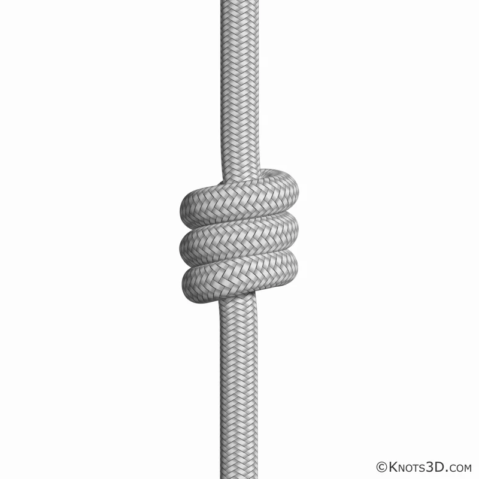
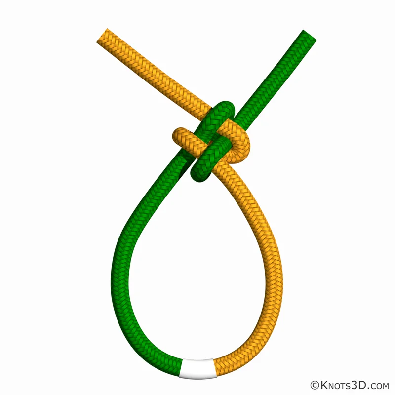

### 1. Definiciones básicas

- **a) Seno:** parte de la cuerda que forma una curva o “panza” entre los extremos, sin cruzarse ni hacer nudo.  
- **b) Punta corrediza:** parte de la cuerda que se desliza (corre) al apretar o aflojar un nudo. Es la sección que se mueve dentro del lazo.  
- **c) Fijo o cuerda restante (parte fija):** tramo de la cuerda que permanece tenso o quieto mientras se hace el nudo; no se mueve.  
- **d) Nudo superior:** nudo simple hecho alrededor de la propia cuerda, parecido a un “ocho” pero de una sola vuelta; sirve como base o remate inicial en otros nudos.  
- **e) Nudo con lazo corredizo:** nudo que forma un lazo cuyo tamaño puede aumentar o disminuir al tirar de la punta corrediza (ejemplo: nudo corredizo, dogal).  
- **f) Vuelta:** una envoltura de la cuerda alrededor de un objeto o de sí misma (media vuelta, vuelta completa o varias vueltas).  
- **g) Curva:** cambio suave de dirección de la cuerda sin llegar a cruzarse ni formar lazo cerrado; es una desviación del recorrido recto.  
- **h) Amarra:** combinación de nudos y vueltas usada para unir firmemente dos o más palos, estacas o estructuras (pionerismo).  
- **i) Unión de cuerdas:** nudo o conjunto de nudos usados para unir dos cabos entre sí (por ejemplo: nudo llano, pescador, cazador).  
- **j) Chicote (punta de trabajo):** extremo libre de la cuerda con el que se trabaja para formar el nudo (opuesto a la parte fija).

---

### 2. Cuidado de las cuerdas

Para conservar las cuerdas en buen estado y seguras:

1. Guardarlas **limpias y secas**, evitando humedad prolongada.
2. **No arrastrarlas** sobre piedras, tierra, bordes filosos ni vidrio.
3. Evitar la **exposición prolongada al sol** (rayos UV debilitan las fibras).
4. No pisarlas con zapatos sucios, clavos o elementos punzantes.
5. No usar las cuerdas para fines distintos a los previstos (no remolcar autos con cuerdas de escalada, por ejemplo).
6. Revisar **desgaste, cortes, pelusas o aplastamientos** antes de cada uso.
7. Guardarlas **enrolladas**, sin nudos apretados, en lugar ventilado y a la sombra.
8. No guardarlas cerca de **combustibles, aceites, ácidos** u otros químicos que dañen las fibras.
9. En caso de caída fuerte o esfuerzo extremo, **marcar la cuerda y reservarla** solo para usos ligeros o desecharla si está comprometida.

---

### 3. Cuerda estática y cuerda dinámica

**Cuerda estática**

- **Características:**
  - Tiene **muy poca elasticidad** (baja elongación).
  - Está diseñada para soportar peso sin estirarse mucho.
  - Transmite casi toda la fuerza directamente al punto de anclaje.

- **Usos (al menos 3):**
  1. Trabajo en altura (limpieza de fachadas, rescate en pozo, acceso por cuerda).
  2. Tiro de cargas y sistemas de polipasto (levantamiento de materiales).
  3. Instalación de tirolesas, puentes de mono o pasamanos.
  4. Fijación de estructuras en campamentos (torres, portales, banderas).

**Cuerda dinámica**

- **Características:**
  - Tiene **alta elasticidad** controlada.
  - Está diseñada para **absorber impactos**, especialmente caídas.
  - Se alarga al recibir un tirón fuerte, reduciendo el golpe sobre la persona.

- **Usos (al menos 3):**
  1. Escalada deportiva y de montaña (cuerda principal del escalador).
  2. Aseguramiento en actividades de aventura (rapel controlado, escalada en roca).
  3. Maniobras de rescate donde puede haber caídas de factor alto.
  4. Instalaciones con personas en movimiento que necesitan amortiguar tirones.

---

### 4. Tipos de cuerdas: ventajas y desventajas

#### a) Poliéster

- **Puntos positivos:**
  - Buena **resistencia a la tracción**.
  - Muy buena **resistencia a la abrasión**.
  - Resiste bien al sol y a la intemperie.
  - Baja elongación (se comporta más como estática).

- **Puntos negativos:**
  - Más pesado que el polipropileno.
  - Puede ser algo más caro que otras cuerdas sintéticas.
  - Si se quema, se derrite y puede pegarse a la piel.

#### b) Sisal

- **Puntos positivos:**
  - Fibra **natural y biodegradable**.
  - Buena textura para amarras (no es muy resbaladiza).
  - Económica y fácil de conseguir en muchos lugares.

- **Puntos negativos:**
  - Menor resistencia que las sintéticas.
  - Se deteriora con la humedad, hongos y moho.
  - Se vuelve rígida y áspera con el uso; puede lastimar las manos.
  - Vida útil más corta.

#### c) Nylon

- **Puntos positivos:**
  - **Muy resistente** a la tracción.
  - Tiene **elasticidad**, absorbe bien impactos (ideal para cuerdas dinámicas).
  - Buena resistencia a la abrasión.
  - Durable si se cuida del sol y químicos.

- **Puntos negativos:**
  - Pierde resistencia cuando está mojada.
  - Se ve afectada por algunos ácidos y productos químicos.
  - Es más pesada que el polipropileno.
  - Puede ser resbaladiza en algunos nudos.

#### d) Polipropileno

- **Puntos positivos:**
  - **Muy liviano**.
  - **Flota en el agua**, ideal para actividades acuáticas.
  - Resistente a muchos productos químicos.
  - Generalmente más económico que otras cuerdas sintéticas.

- **Puntos negativos:**
  - Menor resistencia a la abrasión.
  - Se deteriora más rápido con el sol (rayos UV).
  - Bastante **resbaladizo**, algunos nudos se pueden correr si no se aseguran bien.
  - No es recomendable para escalada o rescate de personas.

---

### 5. Ventajas y desventajas de la cuerda sintética

**Ventajas:**

- Mayor **resistencia** que la mayoría de las cuerdas naturales.
- No se pudren tan fácilmente (mejor resistencia a la humedad).
- Menor peso para la misma resistencia.
- Pueden fabricarse con características específicas (flotante, elástica, estática, etc.).

**Desventajas:**

- Se **derriten con el calor** y el fuego (no soportan altas temperaturas).
- Pueden ser **muy resbaladizas**, lo que exige buenos nudos de seguridad.
- Algunas se dañan con la luz solar (UV) si quedan siempre expuestas.
- Difíciles de reciclar; no son biodegradables como las fibras naturales.

---

### 6. La cuerda más fuerte según la Biblia

La Biblia habla de un tipo de cuerda estática muy resistente:

> “Y si alguno prevaleciere contra uno, dos le resistirán;  
> **y cordón de tres dobleces no se rompe pronto.**”  
> (Eclesiastés 4:12)

Según la Biblia, la cuerda estática más fuerte es el **cordón de tres dobleces** (cuerda trenzada con tres hilos).

---

### 7. Nudos especiales solicitados (descripción teórica)

- **a) Empalme corto:**  
  Unión permanente de dos cabos de igual diámetro, deshaciendo las hebras de cada cuerda y entrelazándolas entre sí. Produce un aumento de diámetro en la zona del empalme, pero queda muy firme.

- **b) Ojo de águila (empalme de ojo):**  
  Empalme que forma un lazo fijo (“ojo”) en el extremo de la cuerda, entrelazando las hebras sobre el propio cabo. Se usa para formar un ojal resistente que no se desliza.

- **c) Piña acollador:**  
  Nudo decorativo y de remate que forma una “piña” alrededor de la cuerda o de un objeto (por ejemplo, un cabo de madera). Sirve como adorno y para mejorar el agarre.

- **d) Remate piña de rosa doble con nudo de Matthew Walker:**  
  Remate muy trabajado, usado en cabos de mando o bastones.  
  - El **nudo de Matthew Walker** crea un abultamiento decorativo que evita que la cuerda se deshilache.  
  - Encima se puede hacer una **piña de rosa doble**, dando un acabado elegante y firme.

- **e) Piña simple:**  
  Versión más sencilla de la piña, con menos vueltas. Sirve para rematar el chicote de una cuerda y darle peso o decoración.

- **f) Cola de puerco:**  
  Serie de vueltas apretadas alrededor de un palo o cuerda, alineadas una junto a la otra. Se usa para sujetar algo firmemente o reforzar una zona (por ejemplo, un ojo, una anilla o un gancho).

---

### 8. Fabricación de cuerdas (tres hilos y trenzado triple)

**a) Cuerda de tres hilos (torcida)**

1. Cortar tres fibras o cordones finos, **un poco más largos** que los 2 metros finales (porque al torcer se acortan).
2. Sujetar juntos los tres extremos de un lado con un nudo simple.
3. Fijar ese extremo a un punto firme (un árbol, estaca o gancho).
4. Separar las tres hebras y torcer **cada una en el mismo sentido** (por ejemplo, a la derecha).
5. Luego ir trenzando las tres hebras entre sí, pero **en sentido contrario** (por ejemplo, a la izquierda), manteniendo tensión.
6. Al llegar al final, hacer otro nudo simple para que no se desarme.
7. Recortar sobrantes y revisar que la cuerda quede pareja.

**b) Cuerda con trenzado triple (trenza de tres “cuerdas”)**

1. Preparar tres **cordeles o cuerdas delgadas** de unos 2,5 m.
2. Unir un extremo de los tres cordeles con un nudo y fijarlo arriba (por ejemplo, a un árbol o clavo).
3. Trenzar como trenza de cabello:
   - Pasar el cabo derecho al centro,
   - luego el izquierdo al centro,
   - repetir alternando hasta el final.
4. Mantener siempre la trenza bien apretada y alineada.
5. Cerrar el extremo con un nudo para que no se deshaga.
6. Comprobar que la longitud final sea de aproximadamente 2 m.

---

### 9. Plantas que proporcionan material para cuerdas

Al menos tres plantas de las que se puede obtener fibra para confeccionar cuerdas:

1. **Sisal (Agave sisalana):**  
   - Sus hojas largas contienen fibras resistentes.  
   - De aquí se hace la cuerda de sisal usada en agricultura y pionerismo.

2. **Cáñamo (Cannabis sativa, uso industrial):**  
   - De su tallo se obtienen fibras muy resistentes.  
   - Tradicionalmente usado para cabos marineros y cuerdas de trabajo.

3. **Yute (Corchorus spp.):**  
   - Planta de la que se sacan fibras largas y flexibles.  
   - Se usa para cuerdas ligeras, sogas y sacos.

Otros ejemplos posibles (según la región): **abacá o manila**, lino, fibras de palma, totora, etc.

---

### 10. Nudos (nombre, uso y limitaciones)

#### Nudos elementales

1. **[Nudo simple](https://knots3d.com/es/nudo-simple)** (overhand)

   

   - **Para qué sirve:** tope básico para evitar que la cuerda se salga de un ojal o polea.
   - **Limitaciones:** se aprieta mucho; difícil de desatar después de cargarlo.

2. **[Nudo ocho](https://knots3d.com/es/nudo-ocho)** (figure-8)

   

   - **Para qué sirve:** tope fuerte y seguro, muy usado en escalada.
   - **Limitaciones:** consume más cuerda que el nudo simple; no sirve para unir cuerdas.

3. **[Nudo fraile](https://knots3d.com/es/nudo-simple-triple)**

   

   - **Para qué sirve:** remate decorativo y práctico al final de un cabo, evita que el chicote pase por una polea.
   - **Limitaciones:** no está pensado para unir cuerdas ni soportar grandes cargas.

#### Nudos de unión

4. **[Nudo llano / verdadero / rizo](https://knots3d.com/es/nudo-de-rizo)**

   

   - **Para qué sirve:** unir dos cuerdas de igual grosor en situaciones simples (vendas, vendas de primeros auxilios, paquetes).
   - **Limitaciones:** puede soltarse si las cuerdas son de distinto grosor o muy resbaladizas; peligroso en rescate.

5. **[Nudo grupo de calabrote o carrick](https://knots3d.com/es/nudo-carrick)** (carrick bend)

   

   - **Para qué sirve:** unión segura para cuerdas gruesas, especialmente en cargas pesadas.
   - **Limitaciones:** requiere práctica para hacerlo correctamente; voluminoso.

6. **[Nudo grupo de calabrote doble](https://knots3d.com/es/nudo-carrick)**
   - **Para qué sirve:** versión reforzada del carrick con mayor seguridad.
   - **Limitaciones:** más complejo y lento de hacer.

7. **[Nudo pescador](https://knots3d.com/es/nudo-de-pescador-doble)**
   - **Para qué sirve:** unir dos cuerdas delgadas, cordines o líneas de pesca.
   - **Limitaciones:** difícil de desatar luego de mucha carga.

8. **[Nudo pescador doble](https://knots3d.com/es/nudo-doble-de-pescador)**
   - **Para qué sirve:** unión muy segura, ideal para cuerdas de escalada (por ejemplo, para cordines de prusik).
   - **Limitaciones:** prácticamente imposible de deshacer después de recibir gran carga.

9. **[Nudo cazador](https://knots3d.com/es/nudo-cazador)** (hunter's bend)
   - **Para qué sirve:** unir cuerdas, incluso algo resbaladizas, con buena seguridad.
   - **Limitaciones:** menos conocido; algunos rescatistas prefieren nudos más estándar.

10. **[Nudo falso](https://knots3d.com/es/nudo-falso-de-rizo)**
    - **Para qué sirve:** nudo de aspecto similar al llano pero mal hecho; sirve como ejemplo de cómo **no** unir cuerdas.
    - **Limitaciones:** se corre y se suelta con facilidad; no debe usarse en situaciones reales.

11. **[Nudo cirujano](https://knots3d.com/es/nudo-del-cirujano)**
    - **Para qué sirve:** unión con doble vuelta inicial, útil en cordones delgados o para que no se afloje mientras se termina el nudo.
    - **Limitaciones:** puede apretarse demasiado; no es un nudo estándar de rescate.

#### Nudos de anclaje

12. **[Nudo ancla](https://knots3d.com/es/ancla-nudo)** (anchor bend)
    - **Para qué sirve:** fijar una cuerda a un anillo, argolla o ancla.
    - **Limitaciones:** requiere asegurar bien el chicote para que no se corra.

13. **[Nudo constrictor](https://knots3d.com/es/nudo-constrictor)**

    

    - **Para qué sirve:** amarre muy firme para cerrar sacos, atar objetos que no se deban soltar.
    - **Limitaciones:** extremadamente difícil de desatar; no apto si luego se necesita recuperar la cuerda fácilmente.

14. **[Nudo vuelta de ballestrinque](https://knots3d.com/es/ballestrinque-nudo)** (clove hitch)

    

    - **Para qué sirve:** sujetar rápidamente una cuerda a un palo o poste.
    - **Limitaciones:** puede deslizarse si la carga no es constante o si la cuerda es muy lisa; se recomienda asegurar con medio cote.

15. **[Nudo as de guía corredizo](https://knots3d.com/es/as-de-gu%C3%ADa-corredizo-nudo)** (running bowline)

    

    - **Para qué sirve:** lazo corredizo seguro, usado para rodear troncos u objetos que se van a arrastrar.
    - **Limitaciones:** no es adecuado para sujetar personas por el cuello o partes delicadas; se ajusta con fuerza.

16. **[Nudo corredizo](https://knots3d.com/es/nudo-corredizo)**
    - **Para qué sirve:** lazo que se ajusta al tirar del chicote; útil para atar paquetes.
    - **Limitaciones:** puede apretarse demasiado y dañar la cuerda u objeto; no apto para rescate.

17. **[Nudo vuelta de braza](https://knots3d.com/es/nudo-de-le%C3%B1ador)** (timber hitch)

    

    - **Para qué sirve:** arrastrar troncos u objetos alargados.
    - **Limitaciones:** si no hay tensión se puede aflojar.

18. **[Nudo vuelta redonda con dos medios cotes](https://knots3d.com/es/nudo-de-cote-doble)**

    

    - **Para qué sirve:** fijar una cuerda a un poste con buena seguridad y fácil desate.
    - **Limitaciones:** requiere un lugar donde dar la vuelta completa; en superficies muy lisas puede deslizar un poco.

#### Nudos de salvamento

19. **[Nudo as de guía](https://knots3d.com/es/as-de-gu%C3%ADa-nudo)** (bowline)

    

    - **Para qué sirve:** formar un lazo fijo que no corre; clásico en rescate y navegación.
    - **Limitaciones:** si está mal hecho se puede desarmar; no se debe cargar sin asegurar el chicote.

20. **[As de guía doble](https://knots3d.com/es/as-de-gu%C3%ADa-por-seno-nudo)** (double bowline / bowline on a bight)

    

    - **Para qué sirve:** lazo doble para sujetar a una persona como silla o arnés improvisado.
    - **Limitaciones:** requiere práctica; se debe revisar bien antes de usar en rescate.

21. **[Nudo mariposa](https://knots3d.com/es/mariposa-alpina-nudo)** (alpine butterfly)
    - **Para qué sirve:** lazo en el centro de la cuerda, sin usar los extremos; útil para puntos de anclaje intermedios.
    - **Limitaciones:** se debe aprender bien la técnica para no confundirlo con otros nudos.

22. **[Nudo Prusik](https://knots3d.com/es/nudo-prusik)**

    

    - **Para qué sirve:** nudo de fricción que se desliza sin carga y se bloquea con carga; útil para subir por la cuerda o autoasegurarse.
    - **Limitaciones:** requiere cuerda auxiliar de menor diámetro; si los diámetros no son adecuados, puede no bloquear bien.

23. **[Nudo silla de bombero](https://knots3d.com/es/silla-de-bombero-nudo)** (bowline on a bight / rescue seat)

    

    - **Para qué sirve:** formar dos lazos que sirven de "asiento" para levantar o bajar a una persona.
    - **Limitaciones:** no reemplaza un arnés homologado; se debe revisar muy bien.

#### Nudos de izamiento

24. **[Nudo dogal de verdugo / de la horca](https://knots3d.com/es/nudo-de-dogal-corredizo)** (hangman's noose)
    - **Para qué sirve:** lazo corredizo con vueltas múltiples; hoy se usa principalmente con fines técnicos (asegurar objetos).
    - **Limitaciones:** lazo que se cierra con fuerza; jamás debe usarse en cuello de personas o animales.

25. **[Nudo vuelta de gato / zarpa de gato](https://knots3d.com/es/zarpa-de-gato-nudo)** (cat's paw)

    

    - **Para qué sirve:** izar baldes, cubos u objetos con ganchos o para usar con poleas.
    - **Limitaciones:** si no se hace correctamente puede desarmarse.

26. **[Nudo vuelta de escota](https://knots3d.com/es/vuelta-de-escota-nudo)** (sheet bend)

    

    - **Para qué sirve:** unir cuerdas de distinto grosor.
    - **Limitaciones:** se recomienda asegurar con doble vuelta cuando la diferencia de grosores es grande.

#### Nudos ornamentales

27. **[Nudo cuadrado](https://knots3d.com/es/nudo-de-la-amistad)** (decorativo / macramé)

    

    - **Para qué sirve:** trenzado decorativo para pulseras, llaveros, etc.
    - **Limitaciones:** no está diseñado para cargas pesadas.

28. **[Nudo encapilladura](https://knots3d.com/es/nudo-de-corona)** (crown knot)

    

    - **Para qué sirve:** remate en el extremo de un cabo para que no se deshilache.
    - **Limitaciones:** requiere práctica; no se usa para unir cuerdas.

#### Nudos de sujetar y acortamiento

29. **[Nudo único](https://knots3d.com/es/nudo-simple)** (overhand on a bight / stopper simple de sujeción)

    

    - **Para qué sirve:** sujetar algo sencillo o impedir que pase por un agujero pequeño.
    - **Limitaciones:** no está pensado para unir cuerdas ni para rescate.

30. **[Nudo margarita](https://knots3d.com/es/nudo-margarita)** (sheepshank)

    

    - **Para qué sirve:** acortar temporalmente una cuerda sin cortarla.
    - **Limitaciones:** se puede salir si la cuerda pierde tensión; no usar para asegurar personas.

---

### 11. Amarras

1. **Amarra cuadrada**
   - **Uso:** unir dos palos que se cruzan en ángulo recto (90°).
   - **Aplicación:** mesas, trípodes, torres sencillas.

2. **Amarra diagonal**
   - **Uso:** unir palos que se cruzan en diagonal o que tienden a separarse.
   - **Aplicación:** refuerzos en estructuras, cruces que no se tocan en el centro.

3. **Amarra paralela o redonda (circular)**
   - **Uso:** unir dos palos paralelos colocados uno al lado del otro.
   - **Aplicación:** formar “piernas” para puentes o estructuras, o unir palos para obtener uno más largo.

4. **Amarra continua simple**
   - **Uso:** fijar muchas varillas delgadas a una viga principal en ángulo recto.
   - **Aplicación:** superficies de mesa, asientos, camillas rústicas.

5. **Amarra continua doble**
   - **Uso:** similar a la continua simple, pero con dos líneas de cuerda o con vueltas de refuerzo.
   - **Aplicación:** estructuras que soportarán mayor peso (camas, plataformas, pisos de torre).

---

### 12. Cuadro de nudos (al menos 25)

Requisito entregado fisicamente con los siguientes nudos:

1. Nudo simple  
2. Nudo ocho  
3. Nudo fraile  
4. Nudo llano  
5. Nudo pescador  
6. Nudo pescador doble  
7. Nudo cazador  
8. Nudo falso  
9. Nudo cirujano  
10. Vuelta de escota  
11. Nudo ancla  
12. Nudo constrictor  
13. Vuelta de ballestrinque  
14. As de guía  
15. As de guía doble  
16. As de guía corredizo  
17. Nudo mariposa  
18. Nudo Prusik  
19. Silla de bombero  
20. Dogal de verdugo / de la horca  
21. Vuelta de gato  
22. Vuelta de braza  
23. Vuelta redonda  
24. Nudo margarita  
25. Nudo encapilladura  
