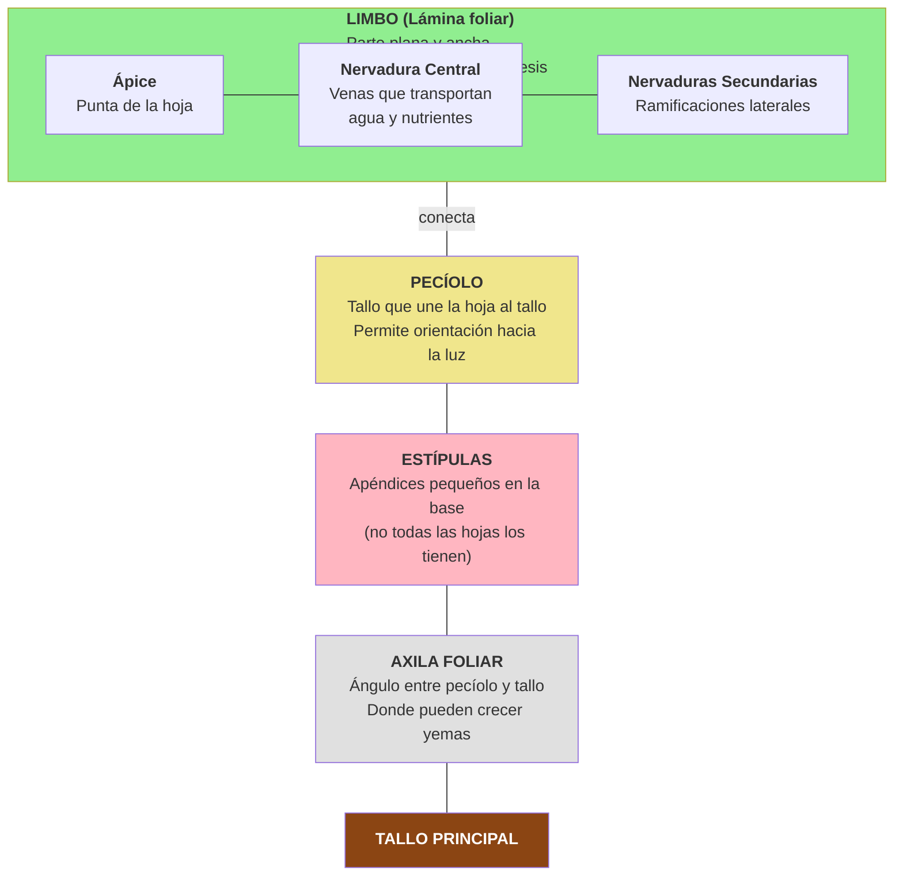
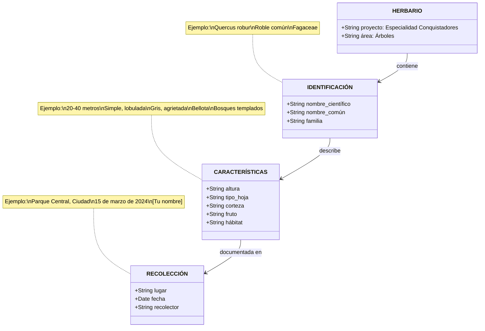

# Árboles

<div align="center">


**Área:** Estudio de la Naturaleza (EN)
**Código:** EN-006
**Nivel:** 1
**Año de creación:** 1928
**Institución de origen:** Asociación General

---

</div>

## 📋 Requisitos

### 1. Describir las diferencias entre árboles y arbustos

**Respuesta:**

Aunque ambos son plantas leñosas perennes, existen diferencias clave que los distinguen:

| Característica | Árbol | Arbusto |
|----------------|-------|---------|
| **Tallo principal** | Un único tronco o fuste dominante | Múltiples tallos desde la base |
| **Altura** | Generalmente más de 4-6 metros en madurez | Usualmente menos de 6 metros |
| **Ramificación** | Ramas secundarias que parten del tronco principal a cierta altura del suelo | Ramificación desde el nivel del suelo |
| **Copa** | Copa elevada, separada del suelo | Copa cerca o sobre el suelo |
| **Dominio apical** | Claro dominio del brote principal (crece más alto) | Sin dominio apical marcado |
| **Forma** | Estructura vertical definida | Estructura más redondeada o extendida |

**Ejemplos visuales:**
- **Árbol:** Roble, pino, eucalipto - un tronco claro que se ramifica arriba
- **Arbusto:** Rosa, hibisco, lavanda - varios tallos desde la base

**Casos especiales:**
- Algunos árboles pequeños pueden tener múltiples tallos (parecidos a arbustos)
- La poda puede hacer que un árbol desarrolle forma arbustiva
- Algunas especies pueden ser arbustos o árboles según condiciones de crecimiento

**💡 Material complementario (GO!):**

Los árboles son plantas perennes de tallo leñoso que se ramifican a cierta altura del suelo. En madurez, superan los 3-6 metros de altura y producen ramas secundarias nuevas cada año desde un único fuste o tronco con claro dominio apical, formando una copa separada del suelo.

---

### 2. Describir la función de las hojas en la vida de un árbol

**Respuesta:**

Las hojas son los "pulmones y cocinas" del árbol. Sus funciones principales son:

#### **1. Fotosíntesis - La más importante**

**Proceso:**
- Las hojas capturan luz solar mediante la **clorofila** (pigmento verde)
- Toman **CO₂** (dióxido de carbono) del aire a través de estomas
- Absorben **agua** y minerales desde las raíces
- **Resultado:** Producen **glucosa** (azúcar) y **oxígeno**

**Ecuación simplificada:**
```
6 CO₂ + 6 H₂O + Luz solar → C₆H₁₂O₆ (glucosa) + 6 O₂
```

**Importancia:**
- La glucosa es el alimento del árbol
- Se usa para crecimiento, floración, fructificación
- Se almacena en raíces, tronco, semillas
- El oxígeno liberado es vital para la vida en la Tierra

#### **2. Transpiración - Regulación de agua**

**Proceso:**
- El agua se evapora a través de los **estomas** (poros microscópicos)
- Ocurre principalmente en el envés (parte inferior) de las hojas

**Funciones:**
- **Enfriamiento:** Como el sudor en humanos, regula temperatura
- **Transporte de nutrientes:** Genera succión que "jala" agua y minerales desde las raíces
- **Ciclo del agua:** Devuelve agua a la atmósfera

**Dato interesante:** Un árbol grande puede transpirar hasta 400 litros de agua por día.

#### **3. Respiración - Intercambio de gases**

**Proceso:**
- Las hojas absorben **oxígeno** y liberan **CO₂** (lo opuesto a fotosíntesis)
- Ocurre continuamente (día y noche)
- Aunque suene contradictorio, es necesaria para que el árbol use su energía

**Balance:** Durante el día, la fotosíntesis produce mucho más oxígeno del que la respiración consume.

#### **4. Almacenamiento**

- Algunas hojas almacenan agua (plantas suculentas)
- Otras almacenan temporalmente azúcares antes de transportarlos

#### **Adaptaciones especiales:**

**Según el clima:**
- **Hojas grandes:** Climas húmedos (capturan más luz, transpiran más)
- **Hojas pequeñas:** Climas secos (reducen pérdida de agua)
- **Hojas gruesas/cerosas:** Protección contra pérdida de agua
- **Espinas:** Hojas modificadas en cactus para reducir transpiración

**Según la luz:**
- **Hojas de sol:** Más gruesas, más clorofila
- **Hojas de sombra:** Más delgadas, superficie mayor

#### **¿Por qué las hojas cambian de color en otoño?**

- La clorofila (verde) se descompone cuando hace frío
- Quedan visibles otros pigmentos: carotenoides (amarillo/naranja) y antocianinas (rojo)
- El árbol reabsorbe nutrientes de las hojas antes de que caigan
- Las hojas caducas ahorran energía en invierno

**💡 Material complementario (GO!):**

Los árboles también desempeñan un papel importante produciendo oxígeno y reduciendo el dióxido de carbono en la atmósfera, así como moderando las temperaturas en el suelo. Un árbol grande puede producir oxígeno suficiente para 2-10 personas por año.

---

### 3. Esquematizar las partes de una hoja completa. Identificar las hojas recolectadas y sus clases

**Respuesta:**

#### **Partes de una hoja completa:**



**Partes detalladas:**

1. **LIMBO (Lámina foliar):**
   - Parte plana y expandida
   - Contiene la mayoría de clorofila
   - Tiene dos caras:
     - **Haz:** Cara superior (más verde, brillante)
     - **Envés:** Cara inferior (más pálida, con estomas)

2. **NERVADURAS (Venas):**
   - **Nervadura central (nervio medio):** La más grande, en el centro
   - **Nervaduras secundarias:** Ramificaciones
   - **Nervaduras terciarias:** Ramificaciones menores
   - Función: Transporte de agua, nutrientes y azúcares

3. **PECÍOLO:**
   - "Tallo" de la hoja
   - Conecta limbo al tallo principal
   - Permite orientación hacia la luz
   - Algunas hojas carecen de él (hojas sésiles)

4. **ESTÍPULAS:**
   - Pequeños apéndices en la base del pecíolo
   - No todas las hojas las tienen
   - Pueden ser persistentes o caer temprano

5. **ÁPICE:**
   - Extremo o punta de la hoja
   - Puede ser agudo, redondeado, acuminado, etc.

6. **BASE:**
   - Parte donde el limbo se une al pecíolo
   - Puede ser redondeada, cordada, cuneada, etc.

7. **MARGEN:**
   - Borde de la hoja
   - Puede ser: entero, dentado, serrado, lobulado, etc.

#### **Tipos de hojas según su estructura:**

**1. Hoja SIMPLE:**
- Un solo limbo
- Ejemplo: roble, manzano, arce

**2. Hoja COMPUESTA:**
- Limbo dividido en **folíolos** (parecen hojas separadas)
- Se identifica porque los folíolos no tienen yemas en su base
- Tipos:
  - **Pinnada:** Folíolos a lo largo de un eje central (como pluma)
    - Paripinnada: número par de folíolos
    - Imparipinnada: número impar (con folíolo terminal)
  - **Palmada:** Folíolos irradian desde un punto (como dedos de una mano)
  - **Bipinnada:** Dos veces dividida

#### **Clasificación según nervadura:**

**1. PENNINERVIA (Pinnada):**
- Nervio central con nervaduras secundarias laterales
- Patrón de pluma
- Ejemplo: mango, roble, nogal

**2. PALMATINERVIA (Palmada):**
- Varias nervaduras principales desde la base
- Patrón de mano abierta
- Ejemplo: arce, vid, papaya

**3. PARALELINERVIA (Paralela):**
- Nervaduras paralelas entre sí
- Común en monocotiledóneas (palmas, bambú)
- Ejemplo: palma, bambú

**4. CURVINERVIA:**
- Nervaduras curvas que convergen en el ápice
- Ejemplo: algunas especies tropicales

#### **Clasificación según forma del limbo:**

- **Lanceolada:** Forma de lanza
- **Ovada:** Forma de huevo
- **Cordiforme:** Forma de corazón
- **Elíptica:** Forma de elipse
- **Lineal:** Larga y angosta
- **Acicular:** Forma de aguja (pinos)
- **Orbicular:** Circular
- **Oblonga:** Más larga que ancha, lados paralelos
- **Deltoidea:** Triangular

#### **Clasificación según el margen:**

- **Entero:** Liso, sin cortes
- **Dentado:** Dientes perpendiculares al margen
- **Serrado:** Dientes inclinados (sierra)
- **Crenado:** Dientes redondeados
- **Lobulado:** Con lóbulos redondeados
- **Partido:** Divisiones profundas

**[PRÁCTICA REQUERIDA - Para completar este requisito]:**

1. **Recolecta hojas** de al menos 15 árboles diferentes
2. **Esquematiza** (dibuja) las partes de una hoja completa
3. Para cada hoja recolectada, **identifica:**
   - ¿Es simple o compuesta?
   - Tipo de nervadura
   - Forma del limbo
   - Tipo de margen
   - Tipo de ápice
   - Presencia/ausencia de pecíolo y estípulas

**💡 Material complementario (GO!):**

El manual GO! incluye ejercicios prácticos para coleccionar e identificar hojas de 15-20 especies diferentes, alisar, secar entre papeles, montar y etiquetar en un cuaderno apropiado.

---

### 4. Hacer un herbario de 15 especies de árboles y etiquetar cada ejemplar. Las etiquetas deben contener el nombre científico, nombre común, familia y características del árbol

**[PRÁCTICA REQUERIDA]**

Un herbario es una colección de plantas preservadas adecuadamente con fines científicos y educativos.

#### **¿Cómo hacer un herbario de hojas de árboles?**

**PASO 1: RECOLECCIÓN**

**Qué recolectar:**
- Hojas completas (con pecíolo)
- Preferiblemente con flores o frutos si están disponibles
- Hojas sanas, sin enfermedades ni daño severo
- De diferentes árboles, no de uno solo

**Cuándo recolectar:**
- Día seco (no después de lluvia)
- Media mañana (después de que secó el rocío)
- Evitar horas de calor extremo

**Cómo recolectar:**
- Usar tijeras o navaja limpia
- Cortar rama pequeña con varias hojas (muestra representativa)
- Si el árbol es muy alto, recolectar hojas caídas recientes
- Llevar en bolsa o entre papel para que no se marchiten

**PASO 2: PRENSADO**

**Materiales:**
- Papel periódico o papel absorbente
- Cartones corrugados
- Prensa (o libros pesados)

**Procedimiento:**
1. Colocar la hoja/rama entre 2-3 hojas de periódico
2. Organizar la hoja para que muestre ambas caras si es posible
3. Alternar: cartón → papel con hoja → cartón → papel con hoja
4. Colocar peso encima (10-15 kg)
5. **Cambiar el papel diariamente** durante los primeros 3-4 días
6. Continuar prensando 7-10 días total hasta que esté completamente seco

**💡 Tip:** Una hoja no completamente seca se pondrá negra o mohosa.

**PASO 3: MONTAJE**

**Materiales:**
- Cartulinas blancas o papel grueso (tamaño A4 o carta)
- Pegamento (no usar cinta adhesiva)
- Hilo y aguja (opcional, para hojas grandes)

**Procedimiento:**
1. Organizar la hoja en la cartulina de forma atractiva
2. Aplicar pegamento en el envés de la hoja (o usar puntos de pegamento)
3. Presionar suavemente
4. Para hojas grandes: coser con hilo fino en algunos puntos

**PASO 4: ETIQUETADO**

**La etiqueta debe incluir:**



**PASO 5: PROTECCIÓN Y ALMACENAMIENTO**

- Cubrir con papel encerado o plástico transparente
- Almacenar en carpeta o caja
- Mantener en lugar seco
- Agregar bolitas de naftalina para evitar insectos

#### **15 especies sugeridas para tu herbario (adaptables según tu región):**

**Árboles comunes en América Latina:**

1. **Ceiba** (*Ceiba pentandra*) - Bombacaceae
2. **Aguacate** (*Persea americana*) - Lauraceae
3. **Mango** (*Mangifera indica*) - Anacardiaceae
4. **Eucalipto** (*Eucalyptus globulus*) - Myrtaceae
5. **Pino** (*Pinus* sp.) - Pinaceae
6. **Cedro** (*Cedrela odorata*) - Meliaceae
7. **Sauce** (*Salix* sp.) - Salicaceae
8. **Algarrobo** (*Prosopis* sp.) - Fabaceae
9. **Jacarandá** (*Jacaranda mimosifolia*) - Bignoniaceae
10. **Ficus** (*Ficus* sp.) - Moraceae
11. **Guayaba** (*Psidium guajava*) - Myrtaceae
12. **Ciprés** (*Cupressus* sp.) - Cupressaceae
13. **Palma** (*Phoenix* o *Roystonea* sp.) - Arecaceae
14. **Tamarindo** (*Tamarindus indica*) - Fabaceae
15. **Acacia** (*Acacia* sp.) - Fabaceae

**Nota:** Adapta según los árboles disponibles en tu región.

**💡 Material complementario (GO!):**

El manual GO! sugiere usar un cuaderno apropiado o hojas uniformes de papel, montando las hojas alisadas y secas con etiquetas que incluyan nombre común y científico. Se recomienda aprender las especies de memoria para poder identificarlas en el campo.

---

### 5. Conocer de memoria las especies del requisito anterior y ser capaz de identificar otros individuos de la misma especie en el campo

**[PRÁCTICA REQUERIDA]**

Una vez completado tu herbario, debes:

#### **Memorización:**

**Técnicas para memorizar:**

1. **Tarjetas de memoria (flashcards):**
   - Foto/dibujo de la hoja en un lado
   - Nombres (común y científico) + familia en el otro
   - Repasar diariamente

2. **Asociación:**
   - Crear historias o nemotecnias
   - Ejemplo: *Mangifera indica* → "El MANGo FERtil de la INDIA"

3. **Características únicas:**
   - Identificar qué hace única a cada hoja
   - "El sauce tiene hojas muy largas y delgadas"
   - "El roble tiene hojas lobuladas características"

4. **Agrupación:**
   - Agrupar por características similares
   - Todas las hojas compuestas juntas
   - Todas las hojas con nervadura palmada juntas

5. **Práctica constante:**
   - Revisar tu herbario diariamente por 2-3 semanas
   - Pedirle a alguien que te examine
   - Intentar dibujar de memoria

#### **Identificación en el campo:**

**Evaluación práctica:**

Un instructor o amigo deberá:

1. **Llevarte a un parque o bosque** donde haya árboles

2. **Señalar árboles** de las especies que tienes en tu herbario

3. **Tú debes identificar:**
   - Nombre común
   - Nombre científico
   - Familia
   - 2-3 características distintivas

**Habilidades necesarias:**

- **Observación:** Mirar forma general, corteza, hojas, frutos
- **Comparación:** Relacionar con las hojas de tu herbario
- **Detalles:** Fijarte en nervaduras, margen, textura
- **Contexto:** Dónde crece (húmedo, seco, montaña, etc.)

**Diferencias campo vs herbario:**

- Las hojas vivas pueden ser más grandes o brillantes
- Los colores pueden variar según la estación
- En el árbol puedes ver corteza, altura, frutos
- Algunos árboles pierden hojas en invierno (deciduos)

**Criterios de aprobación:**

- Identificar correctamente al menos 12 de 15 especies (80%)
- Sin mirar notas o herbario
- En ambiente natural, no en fotos

**💡 Material complementario (GO!):**

El manual GO! enfatiza conocer los especímenes de memoria y a pedido ser capaz de identificar especímenes similares en el campo. Sugiere practicar repetidamente hasta poder reconocer los árboles por sus hojas incluso fuera del herbario.

---

### 6. Citar dos ejemplos de árboles que reciben su nombre por:

**Respuesta:**

Los árboles reciben sus nombres comunes de muchas formas interesantes. Aquí hay ejemplos de cada categoría:

#### **a) Su uso común**

**1. Árbol del Pan** (*Artocarpus altilis*)
- **Razón:** Su fruto se usa como alimento básico (sustitu del pan) en islas del Pacífico
- **Uso:** El fruto se asa, hierve o fríe, sabor similar al pan recién horneado

**2. Árbol de Caucho/Gomero** (*Ficus elastica* o *Hevea brasiliensis*)
- **Razón:** Se extrae látex para producir caucho/goma
- **Uso:** Industria del caucho, neumáticos, productos elásticos

**Otros ejemplos:**
- **Árbol de Papel** (*Melaleuca quinquenervia*): corteza se descascara en láminas como papel
- **Árbol del Jabón** (*Sapindus saponaria*): frutos contienen saponinas (hacen espuma como jabón)
- **Árbol de la Cera** (*Myrica cerifera*): produce cera en sus frutos

#### **b) El ambiente en el que crece**

**1. Mangle** (*Rhizophora mangle*)
- **Razón:** Crece en manglares (zonas costeras inundadas con agua salada)
- **Ambiente:** Zonas intermareales, toleran agua salada

**2. Sauce Llorón** (*Salix babylonica*)
- **Razón:** Típicamente crece cerca del agua (ríos, lagos, zonas húmedas)
- **Ambiente:** Suelos húmedos o inundados

**Otros ejemplos:**
- **Pino de Montaña** (*Pinus montezumae*): alturas elevadas
- **Ciprés de los Pantanos** (*Taxodium distichum*): crece en pantanos y suelos inundados

#### **c) Alguna de sus características específicas**

**1. Palo Santo** (*Bursera graveolens*)
- **Razón:** Su madera tiene fragancia dulce y es usada en rituales religiosos
- **Característica:** Aroma distintivo cuando se quema

**2. Sangre de Drago** (*Croton lechleri*)
- **Razón:** Su resina es color rojo sangre
- **Característica:** Látex rojo oscuro que se usa medicinalmente

**Otros ejemplos:**
- **Árbol Botella** (*Brachychiton rupestris*): tronco hinchado en forma de botella
- **Palo Verde** (*Parkinsonia microphylla*): corteza y ramas de color verde intenso
- **Espino** (*Crataegus* sp.): tiene espinas prominentes
- **Sauce Llorón** (*Salix babylonica*): ramas colgantes que "lloran"

#### **d) La región geográfica donde es encontrado**

**1. Pino de Monterrey** (*Pinus radiata*)
- **Razón:** Originario de Monterey, California, EE.UU.
- **Región:** Costa central de California

**2. Ceibo/Ceiba Brasileña** (*Erythrina crista-galli*)
- **Razón:** Asociado con Brasil y Río de la Plata
- **Región:** Argentina, Uruguay, Brasil

**Otros ejemplos:**
- **Pino Canario** (*Pinus canariensis*): Islas Canarias, España
- **Cedro del Líbano** (*Cedrus libani*): Montañas del Líbano
- **Árbol de Judea** (*Cercis siliquastrum*): Región de Judea, Medio Oriente
- **Quebracho Colorado** (*Schinopsis balansae*): Región del Gran Chaco (Argentina, Paraguay)

#### **e) Las primeras personas que lo descubrieron o describieron**

**1. Árbol de Moctezuma** (*Pinus montezumae*)
- **Razón:** Nombrado en honor a Moctezuma II, emperador azteca
- **Persona:** Moctezuma II (1466-1520)

**2. Araucaria/Pino de Cook** (*Araucaria columnaris*)
- **Razón:** Nombrada por el Capitán James Cook, explorador británico
- **Persona:** James Cook, quien la documentó en sus viajes al Pacífico Sur

**Otros ejemplos:**
- **Secuoya** (*Sequoia sempervirens*): Nombrada por Sequoyah, líder cherokee que inventó el alfabeto cherokee
- **Paulownia** (*Paulownia tomentosa*): Anna Pavlovna, princesa de Rusia
- **Begonia** (*Begonia* sp.): Michel Bégon, gobernador francés
- **Magnolia** (*Magnolia* sp.): Pierre Magnol, botánico francés

**Dato interesante:** Muchos nombres científicos honran a botánicos, exploradores o patrones que financiaron expediciones científicas.

---

### 7. Conocer el nombre científico de dos grandes árboles y saber las diferencias entre ellos

**Respuesta:**

Los árboles más grandes del mundo pertenecen a diferentes especies con características muy distintas:

#### **Árbol 1: Secuoya Gigante (*Sequoiadendron giganteum*)**

**Nombre científico:** *Sequoiadendron giganteum*

**Características generales:**
- **Altura:** 50-85 metros (típico), hasta 95 m (récord)
- **Diámetro del tronco:** 6-8 metros (¡pueden llegar a 10 m!)
- **Volumen:** EL MAYOR VOLUMEN de cualquier árbol
- **Longevidad:** 1,800-3,200 años
- **Distribución:** Sierra Nevada, California, EE.UU. (zona muy limitada)
- **Tipo:** Conífera perenne (siempreverde)

**Ejemplar más famoso:**
- **General Sherman:** El árbol con MAYOR BIOMASA del planeta
  - Volumen: 1,487 m³
  - Altura: 83.8 m
  - Diámetro base: 11.1 m
  - Edad estimada: 2,300-2,700 años

**Características distintivas:**
- **Corteza:** Muy gruesa (30-60 cm), esponjosa, color rojo-canela
- **Resistencia al fuego:** La corteza gruesa lo protege
- **Base:** Tronco MUY ancho en la base, cónico
- **Hojas:** Escamas pequeñas, tipo aguja
- **Conos:** Pequeños (4-7 cm), maduran en 2 años
- **Raíces:** Superficiales pero extendidas

---

#### **Árbol 2: Secuoya Roja (*Sequoia sempervirens*)**

**Nombre científico:** *Sequoia sempervirens*

**Características generales:**
- **Altura:** 60-100 metros, hasta 115.85 m (¡EL MÁS ALTO!)
- **Diámetro del tronco:** 3-5 metros (más delgado que giganteum)
- **Volumen:** Menor que Sequoiadendron giganteum
- **Longevidad:** 1,200-2,200 años
- **Distribución:** Costa de California y sur de Oregon (franja estrecha costera)
- **Tipo:** Conífera perenne

**Ejemplar más famoso:**
- **Hyperion:** El árbol MÁS ALTO del mundo
  - Altura: 115.85 m (¡como edificio de 38 pisos!)
  - Diámetro: 4.84 m
  - Edad: ~600-800 años
  - Ubicación secreta (para protegerlo)

**Características distintivas:**
- **Corteza:** Gruesa (15-30 cm), fibrosa, color rojo-marrón
- **Forma:** Tronco más recto y cilíndrico (no tan cónico)
- **Hojas:** Agujas planas (1-2 cm), dispuestas en dos filas
- **Conos:** Pequeños (1.5-3 cm), maduran en 1 año
- **Niebla:** Dependen de la niebla costera para agua adicional
- **Rebrotes:** Pueden rebrotar de tocón o raíz

---

#### **DIFERENCIAS CLAVE entre ambos:**

| Característica | Secuoya Gigante (*Sequoiadendron*) | Secuoya Roja (*Sequoia*) |
|----------------|-------------------------------------|--------------------------|
| **Récord mundial** | Mayor VOLUMEN/MASA | Mayor ALTURA |
| **Altura típica** | 50-85 m | 60-100 m |
| **Diámetro tronco** | 6-10 m (MUY grueso) | 3-5 m (más delgado) |
| **Forma tronco** | Muy cónico, base enorme | Cilíndrico, más recto |
| **Corteza grosor** | 30-60 cm (MUY gruesa) | 15-30 cm (gruesa) |
| **Hojas** | Escamas pequeñas (como escala) | Agujas planas (1-2 cm) |
| **Conos** | 4-7 cm | 1.5-3 cm (más pequeños) |
| **Hábitat** | Montañas (1,400-2,150 m altitud) | Costa (0-900 m altitud) |
| **Clima** | Nieve en invierno, seco en verano | Niebla constante, húmedo |
| **Distribución** | Sierra Nevada (tierra adentro) | Franja costera estrecha |
| **Longevidad** | 2,000-3,000+ años (más viejo) | 1,200-2,200 años |
| **Rebrote** | NO rebrota de tocón | SÍ rebrota de tocón |

**Memoria fácil:**
- **Sequoiadendron (Gigante)** = G de **GORDO** y **GRUESO**
- **Sequoia (Roja)** = R de **RASCACIELOS** (altura)

#### **Otras diferencias importantes:**

**Adaptaciones:**
- **Secuoya Gigante:** Adaptada a fuego frecuente (necesita fuego para reproducción)
- **Secuoya Roja:** Adaptada a niebla costera (absorbe agua del aire)

**Reproducción:**
- **Secuoya Gigante:** Solo por semilla
- **Secuoya Roja:** Por semilla Y rebrotes de raíz/tocón

**Estado de conservación:**
- Ambas están en peligro pero protegidas en parques nacionales
- Cambio climático es amenaza principal

---

### 8. Escribir un texto sobre la importancia de la conservación de la vegetación del ecosistema donde vives

**[PRÁCTICA REQUERIDA]**

Debes escribir un ensayo/texto de al menos 300-500 palabras sobre este tema. Aquí hay una guía de qué incluir:

#### **Estructura sugerida:**

**INTRODUCCIÓN (1 párrafo)**
- Describe tu ecosistema local (bosque, selva, páramo, bosque seco, etc.)
- Menciona 3-5 árboles o plantas importantes de tu región

**DESARROLLO (3-4 párrafos)**

**Párrafo 1: Servicios ecosistémicos de los árboles**
- Producción de oxígeno
- Captura de CO₂ (mitigación del cambio climático)
- Regulación del ciclo del agua
- Prevención de erosión del suelo
- Moderación de temperaturas (sombra, frescura)

**Párrafo 2: Biodiversidad y hábitat**
- Los árboles son hogar de cientos de especies (aves, insectos, mamíferos)
- Conectividad ecológica (corredores biológicos)
- Alimento y refugio para fauna
- Polinizadores dependen de flores de árboles

**Párrafo 3: Beneficios para los humanos**
- Alimentos (frutas, nueces, especias)
- Medicinas (muchos fármacos vienen de plantas)
- Materiales (madera, fibras, resinas)
- Valor económico (turismo, productos forestales)
- Salud mental (contacto con naturaleza reduce estrés)
- Importancia cultural y espiritual

**Párrafo 4: Amenazas y problemas**
- Deforestación (agricultura, urbanización)
- Incendios forestales
- Plagas y enfermedades
- Cambio climático
- Consecuencias: pérdida de biodiversidad, erosión, cambios en clima local

**CONCLUSIÓN (1 párrafo)**
- Responsabilidad de conservar
- Acciones que puedes tomar personalmente
- Llamado a la acción para tu comunidad
- Perspectiva cristiana: mayordomía de la Creación

#### **Ejemplo de texto modelo:**

```markdown
# Conservación de la Vegetación en [Tu Región]

[Tu región] se caracteriza por su [tipo de ecosistema: bosque húmedo tropical / bosque seco / bosque templado / páramo / etc.]. En esta zona crecen especies importantes como el [árbol 1], [árbol 2] y [árbol 3], que son fundamentales para el equilibrio ecológico de nuestra área.

Los árboles de nuestro ecosistema proporcionan servicios ambientales invaluables. Cada día, producen el oxígeno que respiramos y capturan dióxido de carbono, ayudando a combatir el cambio climático. Sus raíces previenen la erosión del suelo, especialmente importante en [característica geográfica local: montañas/riberas/laderas]. Además, regulan el ciclo del agua: capturan lluvia en su follaje, facilitan la infiltración al suelo y liberan agua a la atmósfera mediante transpiración, manteniendo la humedad local.

La vegetación arbórea de nuestra región sustenta una rica biodiversidad. Los árboles proporcionan hábitat para [menciona 2-3 animales locales], que dependen de ellos para alimentación, refugio y reproducción. Las flores de [nombre de árbol] alimentan a polinizadores como abejas y colibríes, mientras que los frutos de [otro árbol] son consumidos por [animales], que dispersan las semillas y permiten la regeneración del bosque...

[Continúa desarrollando los demás párrafos]

...Como cristianos, tenemos la responsabilidad de ser mayordomos fieles de la Creación que Dios nos confió. Génesis 2:15 nos recuerda que Dios puso al ser humano en el jardín "para que lo labrara y lo guardase". Conservar la vegetación de nuestro ecosistema no es opcional, es parte de nuestro llamado como hijos de Dios. Cada árbol que protegemos, cada espacio verde que conservamos, es un acto de adoración al Creador y amor por las generaciones futuras.
```

#### **Consejos de redacción:**

- **Sé específico:** Menciona nombres de árboles y animales DE TU REGIÓN
- **Incluye datos:** Números, porcentajes, estadísticas locales
- **Usa ejemplos personales:** "En mi comunidad he observado..."
- **Sé positivo:** Enfócate en soluciones, no solo problemas
- **Conecta con la fe:** Integra principios bíblicos naturalmente

**Versículos bíblicos útiles:**
- Génesis 1:28-30 (dominio y cuidado)
- Génesis 2:15 (guardar el jardín)
- Salmo 24:1 (la tierra es del Señor)
- Apocalipsis 11:18 (Dios destruirá a los que destruyen la tierra)

---

### 9. Dar dos ejemplos de árboles que:

#### **a) Crecen mejor en lugares húmedos o inundados**

**1. Sauce** (*Salix* sp.)
- **Hábitat:** Riberas de ríos, lagos, zonas con agua subterránea superficial
- **Adaptaciones:**
  - Raíces extensas que toleran suelos saturados
  - Crecimiento rápido en ambientes húmedos
  - Hojas largas y delgadas que transpiran mucho
- **Características:** Ramas flexibles, hojas lanceoladas, copa llorona
- **Distribución:** Mundial, especialmente zonas templadas
- **Uso:** Control de erosión en riberas, ornamental

**2. Mangle Rojo** (*Rhizophora mangle*)
- **Hábitat:** Zonas costeras intermareales (donde sube y baja la marea)
- **Adaptaciones:**
  - **Raíces zancos:** Raíces aéreas que sostienen el árbol sobre el agua
  - **Tolerancia a sal:** Puede crecer en agua salada
  - **Viviparia:** Semillas germinan en el árbol antes de caer
  - **Neumatóforos:** Raíces que salen del agua para respirar
- **Características:** Raíces aéreas distintivas, hojas gruesas
- **Distribución:** Costas tropicales y subtropicales
- **Importancia:** Protección costera, vivero de peces

**Otros ejemplos:**
- **Ciprés de los Pantanos** (*Taxodium distichum*): Pantanos del sur de EE.UU.
- **Aguapey/Guayacán de agua** (*Sesbania virgata*): Humedales sudamericanos
- **Guajalote** (*Parathesis* sp.): Zonas húmedas de montaña
- **Aliso** (*Alnus* sp.): Riberas de ríos en montañas
- **Palmera de Pantano** (*Mauritia flexuosa*): "Árbol de la vida" amazónico

**Por qué prosperan en agua:**
- Raíces adaptadas para obtener oxígeno en suelos saturados
- Tolerancia a períodos de inundación
- Capacidad de transpirar grandes cantidades de agua
- En algunos casos, semillas que flotan y germinan en agua

---

#### **b) Crecen mejor en lugares altos y montañosos**

**1. Pino de Montaña** (*Pinus* sp., varias especies)
- **Hábitat:** 2,000-4,000 metros sobre el nivel del mar
- **Adaptaciones:**
  - **Hojas aciculares:** Reducen pérdida de agua y resistencia al viento
  - **Forma cónica:** Soporta peso de nieve
  - **Crecimiento lento:** Madera densa y resistente
  - **Raíces profundas:** Anclan en suelos rocosos
  - **Resina abundante:** Protege del frío
- **Características:** Hojas en forma de agujas, conos, siempreverde
- **Ejemplos específicos:**
  - *Pinus montezumae* (México, Guatemala)
  - *Pinus hartwegii* (Árbol que crece a mayor altitud en México)
  - *Pinus radiata* (originalmente de montañas costeras)
- **Altitud:** Hasta 4,000 m en México

**2. Polylepis/Queñoa** (*Polylepis* sp.)
- **Hábitat:** Bosques alto-andinos (3,000-5,000 metros)
- **Adaptaciones:**
  - **Corteza múltiple:** Capas de corteza que se desprenden (protección contra frío y fuego)
  - **Hojas pequeñas:** Reducen transpiración en ambiente seco
  - **Tolerancia a heladas:** Sobrevive a -20°C
  - **Fotosíntesis eficiente:** Aprovecha alta radiación UV de altura
- **Características:** Corteza rojiza que se descascara en láminas, hojas compuestas pequeñas
- **Distribución:** Andes (Venezuela a Argentina)
- **Importancia:** Bosques alto-andinos nativos, retención de agua
- **Récord:** *Polylepis tarapacana* crece hasta 5,200 m (uno de los árboles a mayor altitud del mundo)

**Otros ejemplos:**
- **Araucaria** (*Araucaria araucana*): Andes de Chile y Argentina, hasta 1,800 m
- **Abeto** (*Abies religiosa*): Montañas de México, 2,400-3,600 m
- **Cedro del Himalaya** (*Cedrus deodara*): 1,500-3,000 m
- **Ciprés de la Cordillera** (*Austrocedrus chilensis*): Andes patagónicos
- **Alerce** (*Fitzroya cupressoides*): Andes de Chile, uno de los árboles más longevos

**Por qué prosperan en montañas:**
- Tolerancia al frío extremo y heladas
- Resistencia a vientos fuertes
- Adaptación a suelos pobres y rocosos
- Eficiencia en uso de agua (ambientes secos en altura)
- Resistencia a alta radiación UV
- Crecimiento lento pero muy resistente

**Diferencias entre árboles de tierras bajas vs. montaña:**

| Característica | Tierras bajas | Montañas altas |
|----------------|---------------|----------------|
| Hojas | Grandes, anchas | Pequeñas, agujas, o duras |
| Crecimiento | Rápido | Lento |
| Forma | Extendida, copa amplia | Cónica, compacta |
| Corteza | Delgada a media | Gruesa, protectora |
| Raíces | Superficiales extensas | Profundas, ancladas |

---

### 10. Contar cinco historias bíblicas de árboles que tuvieron un papel importante

**Respuesta:**

Los árboles aparecen en momentos cruciales de la historia bíblica, a menudo con significado espiritual profundo:

#### **1. El Árbol del Conocimiento del Bien y del Mal (Génesis 2-3)**

**Historia:**
En el Jardín del Edén, Dios plantó dos árboles especiales: el Árbol de la Vida y el Árbol del Conocimiento del Bien y del Mal. Dios permitió a Adán y Eva comer de cualquier árbol, excepto del segundo.

La serpiente (Satanás) tentó a Eva diciendo que si comían del fruto prohibido, serían "como Dios, conociendo el bien y el mal". Eva comió y dio también a Adán. Sus ojos fueron abiertos, reconocieron su desnudez, y se escondieron de Dios.

**Consecuencias:**
- Entrada del pecado y muerte al mundo
- Expulsión del Edén
- Pérdida de acceso al Árbol de la Vida
- Inicio del plan de salvación

**Lección espiritual:**
- La desobediencia tiene consecuencias
- Importancia de confiar en Dios, no en nuestro propio juicio
- El pecado separa al ser humano de Dios

**Texto clave:** Génesis 3:6 - "Y vio la mujer que el árbol era bueno para comer, y que era agradable a los ojos, y árbol codiciable para alcanzar la sabiduría; y tomó de su fruto, y comió; y dio también a su marido, el cual comió así como ella."

---

#### **2. El Encina de Mamre - Donde Abraham Recibió a los Ángeles (Génesis 18)**

**Historia:**
Abraham estaba sentado a la puerta de su tienda "junto al encinar de Mamre" cuando vio a tres visitantes. Corrió a recibirlos, les ofreció hospitalidad, agua para lavarse los pies y comida.

Estos visitantes eran mensajeros celestiales (uno era el Señor mismo). Le anunciaron que Sara tendría un hijo (Isaac) al año siguiente, a pesar de su edad avanzada. También revelaron el juicio sobre Sodoma y Gomorra.

**Significado:**
- El encinar de Mamre se convirtió en un lugar sagrado
- Abraham lo usó como lugar de adoración
- Allí recibió promesas de Dios

**Lección espiritual:**
- La importancia de la hospitalidad
- Dios aparece cuando menos lo esperamos
- Los lugares simples pueden volverse santos cuando Dios se encuentra allí

**Texto clave:** Génesis 18:1 - "Después le apareció Jehová en el encinar de Mamre, estando él sentado a la puerta de su tienda en el calor del día."

---

#### **3. La Zarza Ardiente - Llamado de Moisés (Éxodo 3)**

**Historia:**
Moisés estaba cuidando las ovejas de su suegro Jetro en el desierto cuando vio un arbusto (zarza) que ardía en fuego pero NO se consumía. Se acercó para ver este fenómeno extraño.

Dios llamó a Moisés desde la zarza: "Moisés, Moisés". Le dijo que se quitara el calzado porque estaba en tierra santa. Allí Dios reveló su nombre "YO SOY EL QUE SOY" y comisionó a Moisés para liberar a Israel de Egipto.

**Significado:**
- Primera revelación directa de Dios a Moisés
- Inicio de la liberación de Israel
- Revelación del nombre sagrado de Dios

**Lección espiritual:**
- Dios puede manifestarse en lo ordinario (un arbusto común)
- El fuego representa la presencia de Dios (santidad, purificación)
- Dios llama a personas comunes para obras extraordinarias

**Texto clave:** Éxodo 3:2-3 - "Y se le apareció el Ángel de Jehová en una llama de fuego en medio de una zarza; y él miró, y vio que la zarza ardía en fuego, y la zarza no se consumía."

---

#### **4. El Árbol del que Zaqueo Subió (Lucas 19:1-10)**

**Historia:**
Zaqueo era un jefe de publicanos (recaudador de impuestos), rico pero despreciado por su pueblo por colaborar con los romanos. Cuando Jesús pasó por Jericó, Zaqueo quería verlo pero era de baja estatura y la multitud le impedía ver.

Corrió adelante y se subió a un **árbol de sicómoro** para ver a Jesús. Cuando Jesús llegó al lugar, miró hacia arriba y le dijo: "Zaqueo, date prisa, desciende, porque hoy es necesario que pose yo en tu casa."

Zaqueo descendió y recibió a Jesús gozosamente. Los presentes murmuraban que Jesús había ido a la casa de un pecador. Zaqueo declaró que daría la mitad de sus bienes a los pobres y devolvería cuatro veces más a quien hubiera defraudado.

Jesús proclamó: "Hoy ha venido la salvación a esta casa... porque el Hijo del Hombre vino a buscar y a salvar lo que se había perdido."

**Significado:**
- El sicómoro fue el medio para que Zaqueo encontrara a Jesús
- Representa el esfuerzo humano por acercarse a Dios
- Jesús siempre nota a quienes lo buscan sinceramente

**Lección espiritual:**
- Debemos hacer esfuerzo por acercarnos a Jesús (subir al árbol)
- Jesús ve y acepta a los marginados por la sociedad
- El encuentro con Jesús produce transformación genuina
- La salvación trae cambio práctico (Zaqueo restituyó)

**Texto clave:** Lucas 19:5 - "Cuando Jesús llegó a aquel lugar, mirando hacia arriba, le vio, y le dijo: Zaqueo, date prisa, desciende, porque hoy es necesario que pose yo en tu casa."

---

#### **5. El Árbol (Cruz) donde Jesús Murió por Nosotros**

**Historia:**
Después de ser traicionado, juzgado injustamente y torturado, Jesús fue llevado al Gólgota (Lugar de la Calavera). Allí fue crucificado en una cruz de madera entre dos malhechores.

En la cruz, Jesús sufrió agonía física y espiritual. Llevó sobre sí los pecados de toda la humanidad. Exclamó: "Dios mío, Dios mío, ¿por qué me has desamparado?" (experimentando separación de Dios que el pecado causa). Finalmente declaró: "Consumado es" y entregó su espíritu.

**Significado bíblico del "árbol":**
- Gálatas 3:13 - "Cristo nos redimió de la maldición de la ley, hecho por nosotros maldición (porque está escrito: Maldito todo el que es colgado en un madero)"
- 1 Pedro 2:24 - "quien llevó él mismo nuestros pecados en su cuerpo sobre el madero"
- Hechos 5:30 - "El Dios de nuestros padres levantó a Jesús, a quien vosotros matasteis colgándole en un madero"

**Contraste con el Edén:**
- **Primer árbol (Edén):** Desobediencia → muerte entró al mundo
- **Segundo árbol (Cruz):** Obediencia perfecta de Cristo → vida restaurada

**Lección espiritual:**
- La cruz (árbol) es el centro del cristianismo
- Representa el amor infinito de Dios
- Muestra la gravedad del pecado y el costo de la redención
- Transforma símbolo de vergüenza en símbolo de salvación
- Es el medio de nuestra reconciliación con Dios

**Textos clave:**
- Juan 19:17-18 - "Y él, cargando su cruz, salió al lugar llamado de la Calavera, y en hebreo, Gólgota; y allí le crucificaron"
- 1 Corintios 1:18 - "Porque la palabra de la cruz es locura a los que se pierden; pero a los que se salvan, esto es, a nosotros, es poder de Dios"

---

#### **Historias adicionales (menciones honoríficas):**

**6. La Higuera que Jesús Maldijo (Marcos 11:12-14, 20-25)**
- Jesús buscó fruto en una higuera pero solo tenía hojas
- La maldijo y se secó desde las raíces
- Lección: La importancia de dar fruto espiritual, no solo apariencia externa

**7. Los Cedros del Líbano (1 Reyes 5-6)**
- Salomón usó cedros del Líbano para construir el Templo
- Los cedros representaban grandeza, belleza y durabilidad
- Símbolo de los justos: "El justo florecerá como la palmera; crecerá como cedro en el Líbano" (Salmo 92:12)

**8. El Árbol de Mostaza (Mateo 13:31-32)**
- Parábola de Jesús: El Reino de Dios es como semilla de mostaza
- Crece de la semilla más pequeña hasta un árbol grande
- Las aves anidan en sus ramas
- Lección: El Reino de Dios comienza pequeño pero crece enormemente

---

## 📚 Referencias y recursos adicionales

### Libros recomendados:
- "Árboles de América Central" por diversos autores (según tu país)
- "The Tree Book" por Michael Scott
- "Manual de Dendrología" (nivel universitario pero útil)
- "Guía de campo de árboles de [tu país]"

### Sitios web:
- **iNaturalist.org** - Identificación de árboles con fotos
- **Tropicos.org** - Base de datos Missouri Botanical Garden
- **TreesofAmericas.org** - Árboles de América Latina
- **CONABIO** (México) - Base de datos de flora
- **Catálogo de Plantas y Líquenes de Colombia**

### Apps móviles:
- **PlantNet** - Identificación por foto
- **iNaturalist** - Comunidad de naturalistas
- **LeafSnap** - Identificación por hoja
- **PictureThis** - Identificación instantánea

### Para hacer herbario:
- Video YouTube: "Cómo hacer un herbario botánico"
- Materiales en papelerías o tiendas de artesanía

**💡 Material complementario (GO!):**

El manual GO! Árboles I proporciona:
- Guía ilustrada de tipos de árboles comunes
- Actividades prácticas para coleccionar e identificar hojas
- Información sobre diferencias entre árboles y arbustos
- Explicación sobre el origen de nombres de árboles
- Plantillas para completar el herbario

---

<div align="center">

*Manual de Especialidades - Club de Conquistadores*
*División Sudamericana*

</div>
