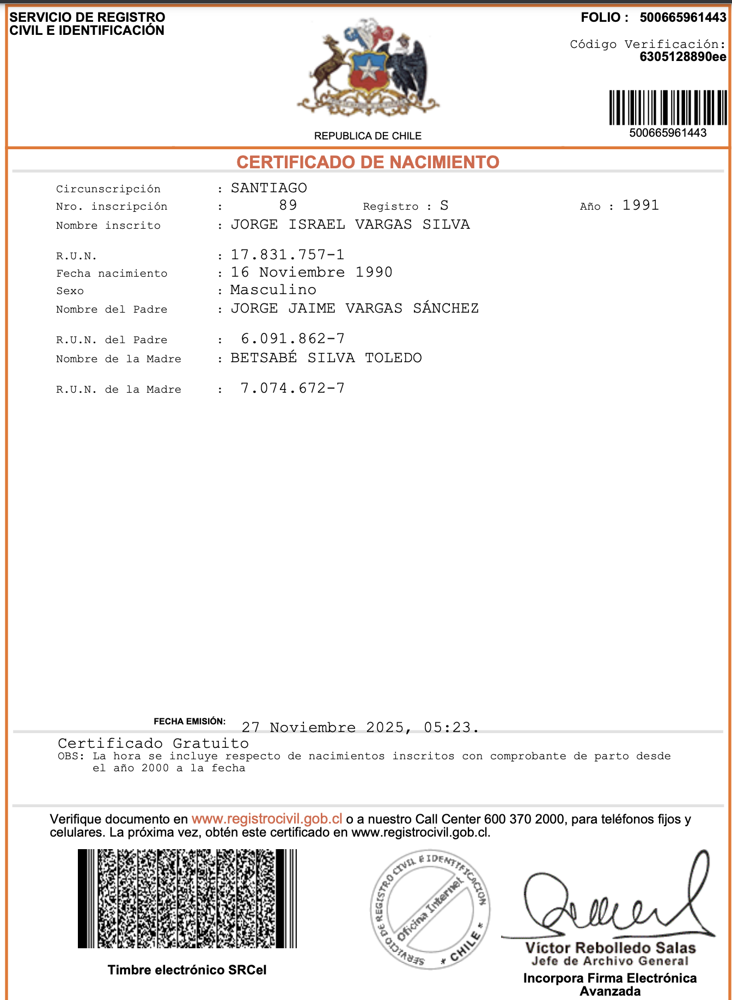

## 📋 Requisitos

### 1. Cuidar un bebé durante cinco horas o más, tres veces por semana

✅ **Completado - Experiencia continua desde 2007**

**Contexto personal:**
- Padre de 4 hijos (edades: 18, 16, 8 y 3 años)
- Experiencia de cuidado infantil: 18 años
- Cuidado diario y regular de bebés y niños pequeños desde el nacimiento de la primera hija en 2007

---

### 2. ¿Qué alimentos no se debe dar a un bebé con menos de un año? Hacer una lista de las precauciones que se deben tomar en la preparación de los alimentos para el bebé. Preparar una comida y alimentar a un bebé

**Respuesta:**

**ALIMENTOS PROHIBIDOS ANTES DEL AÑO:**

**Por riesgo de asfixia:**
- ❌ Miel (puede contener bacteria que causa botulismo)
- ❌ Frutos secos enteros (nueces, almendras, maní)
- ❌ Uvas enteras
- ❌ Palomitas de maíz
- ❌ Caramelos duros
- ❌ Salchichas enteras o en rodajas
- ❌ Zanahoria cruda en trozos grandes

**Por alergias o problemas digestivos:**
- ❌ Leche de vaca (antes de los 12 meses)
- ❌ Clara de huevo cruda
- ❌ Pescados o mariscos (algunos pediatras recomiendan esperar)
- ❌ Chocolate
- ❌ Frutillas (pueden causar alergias)

**Por daño a la salud:**
- ❌ Sal añadida (sus riñones no la procesan bien)
- ❌ Azúcar refinada
- ❌ Comida chatarra o procesada
- ❌ Bebidas azucaradas o gaseosas
- ❌ Café, té o bebidas con cafeína

**PRECAUCIONES AL PREPARAR ALIMENTOS:**

1. **Higiene estricta:**
   - Lavarse manos con jabón antes de cocinar
   - Limpiar bien frutas y verduras
   - Usar utensilios limpios
   - Cocinar en superficie limpia

2. **Consistencia apropiada:**
   - Hacer puré o papilla sin grumos (6-8 meses)
   - Alimentos bien triturados (8-10 meses)
   - Trozos pequeños y blandos (10-12 meses)
   - Nunca piezas que puedan causar asfixia

3. **Temperatura:**
   - Servir tibio, NUNCA caliente
   - Probar temperatura en dorso de tu mano
   - Mezclar bien para evitar puntos calientes
   - No usar microondas (calienta desigual)

4. **Frescura:**
   - Preparar porciones pequeñas y frescas
   - No guardar lo que el bebé ya probó
   - Refrigerar inmediatamente los sobrantes
   - Usar dentro de 24-48 horas

5. **Cocción completa:**
   - Carnes bien cocidas (sin partes rosadas)
   - Huevos completamente cocidos
   - Verduras cocidas hasta que estén blandas

✅ **Práctica completada - Experiencia continua desde 2007**

**Ejemplo de preparación y alimentación realizada regularmente:**

**Receta preparada: Papilla de verduras**

Ingredientes usados:
- Papa pequeña
- Zanahoria pequeña
- Zapallo/calabaza
- Aceite de oliva
- Agua hervida

Proceso aplicado:
1. Verduras lavadas, peladas y cortadas
2. Cocción hasta que estén blandas
3. Puré con consistencia apropiada
4. Temperatura verificada antes de servir

**Alimentación:**
- Bebé sentado en silla alta con babero
- Uso de cuchara apropiada para la edad
- Porciones pequeñas con paciencia
- Respeto al ritmo del bebé
- Limpieza posterior

---

### 3. Preparar el baño, bañarlo, cambiar el pañal y vestirlo

✅ **Completado - Experiencia continua desde 2007**

**Prácticas realizadas regularmente con los 4 hijos desde bebés:**

**PREPARAR EL BAÑO:**

**Materiales necesarios:**
- Tina pequeña o bañera para bebés
- Toalla suave y grande
- Jabón neutro para bebés (sin perfume)
- Shampoo para bebés (sin lágrimas)
- Pañal limpio
- Ropa limpia preparada
- Esponja suave
- Termómetro de baño (opcional)

**Pasos de preparación:**
1. **Preparar TODO antes:** No se puede dejar al bebé solo
2. **Calentar el ambiente:** 22-24°C, sin corrientes de aire
3. **Llenar la tina:** 5-10 cm de agua (hasta la cintura del bebé sentado)
4. **Temperatura del agua:** 37°C (tibia, ni fría ni caliente)
   - Probar con codo o termómetro
   - Debe sentirse cómoda, no caliente
5. **Tener todo al alcance:** Toalla, jabón, pañal, ropa

**BAÑAR AL BEBÉ:**

**Secuencia paso a paso:**

1. **Desvestir al bebé** dejando el pañal puesto
2. **Envolver en toalla** para que no tenga frío
3. **Lavar la cara primero** (sin jabón, solo agua)
   - Usar algodón húmedo
   - Limpiar ojos desde adentro hacia afuera
   - Limpiar nariz y orejas por fuera

4. **Quitar pañal** justo antes de meterlo al agua

5. **Introducir al agua con cuidado:**
   - Sostener firmemente con un brazo bajo su cabeza y espalda
   - Otra mano sostiene las piernas
   - Meter los pies primero
   - Hablarle con voz suave y tranquila

6. **Lavar el cuerpo:**
   - Aplicar poquito jabón con la mano o esponja
   - Lavar cuello, brazos, piernas, barriga, espalda
   - Lavar genitales al final (adelante hacia atrás en niñas)
   - NO sumergir la cabeza

7. **Lavar el cabello:**
   - Mojar con agua
   - Aplicar poquísimo shampoo
   - Enjuagar inclinando cabeza hacia atrás

8. **Sacar del agua:**
   - Sostener firmemente (los bebés mojados resbalan)
   - Envolver inmediatamente en toalla
   - Secar suavemente sin frotar

9. **Secar completamente:**
   - Especial atención en pliegues (cuello, axilas, entrepiernas)
   - Entre los deditos
   - Detrás de las orejas

**CAMBIAR EL PAÑAL:**

1. **Acostar al bebé** en superficie segura
2. **Abrir el pañal sucio** pero dejarlo debajo
3. **Limpiar bien la zona:**
   - Con toallitas húmedas o algodón con agua tibia
   - Niñas: limpiar SIEMPRE de adelante hacia atrás
   - Niños: limpiar bien los pliegues
4. **Secar bien la piel**
5. **Aplicar crema para pañal** si hay irritación
6. **Quitar pañal sucio** y enrollarlo
7. **Colocar pañal limpio:**
   - Levantar piernas suavemente
   - Deslizar pañal debajo
   - Parte con cintas va atrás
   - Cerrar sin apretar (debe caber un dedo)
8. **Desechar pañal sucio** en bolsa cerrada

**VESTIR AL BEBÉ:**

1. **Estar en ambiente cálido**
2. **Ropa preparada de antemano**
3. **Orden de vestimenta:**
   - Pañal primero
   - Camiseta interior
   - Mameluco o conjunto
   - Medias si hace frío

4. **Técnica:**
   - Meter la mano en la manga, tomar la manito y sacarla
   - No jalar brazos ni piernas
   - Pasar ropa por la cabeza cuidando orejas
   - Cerrar broches o botones

5. **Verificar:**
   - Que no haya etiquetas irritando
   - Que no esté muy apretado
   - Que esté cómodo y abrigado apropiadamente

**SEGURIDAD:**
- ⚠️ NUNCA dejar al bebé solo en el agua
- ⚠️ NUNCA dejarlo solo en el cambiador (puede caer)
- ⚠️ Sostenerlo firmemente siempre
- ⚠️ Si suena el teléfono o timbre, IGNORAR o llevar al bebé

---

### 4. Preparar la cuna del bebé y ponerlo a dormir en la noche

✅ **Completado - Experiencia continua desde 2007**

**Rutinas de sueño aplicadas con los 4 hijos:**

**PREPARAR LA CUNA SEGURA:**

**Cuna apropiada:**
- Barrotes separados máximo 6 cm (para que no pase la cabeza)
- Colchón firme que calce bien en la cuna
- Sin almohada
- Sin juguetes blandos, mantas sueltas o protectores acolchados
- Sábana ajustable bien asegurada

**Verificar seguridad:**
- Cuna estable, sin piezas rotas
- Lejos de ventanas, cortinas y cables
- Temperatura ambiente confortable (18-20°C)
- Habitación oscura o con luz tenue
- Libre de humo de cigarrillo

**RUTINA PARA DORMIR:**

**Crear ambiente de sueño:**
1. **Bajar estímulos:**
   - Apagar TV y música fuerte
   - Luz tenue o lámpara nocturna
   - Hablar en voz baja
   - Movimientos suaves

2. **Rutina consistente (repetir cada noche):**
   - Baño tibio relajante
   - Masaje suave con crema
   - Poner pijama
   - Canción de cuna o música suave
   - Cuento corto (bebés mayores)
   - Oración sencilla
   - Beso de buenas noches

3. **Posición para dormir:**
   - **BOCA ARRIBA** (sobre la espalda)
   - NUNCA boca abajo (riesgo de muerte súbita)
   - NUNCA de costado (puede darse vuelta)
   - Cabeza alternando lado (evitar aplanamiento)

4. **Poner en la cuna:**
   - Cuando esté somnoliento pero DESPIERTO
   - No esperar que esté profundamente dormido
   - Colocarlo suavemente
   - Arroparlo con sábana solo hasta el pecho (brazos fuera)
   - Darle chupón si lo usa (reduce riesgo de muerte súbita)

5. **Respuesta al llanto:**
   - Esperar 1-2 minutos (puede auto-calmarse)
   - Si continúa, ir a calmarlo
   - Verificar: pañal, hambre, malestar
   - Calmar con voz suave y palmaditas
   - Evitar sacarlo de la cuna si no es necesario
   - Ser paciente

**SEÑALES DE SUEÑO:**
- Bostezar
- Frotarse los ojos
- Ponerse irritable
- Perder interés en juguetes
- Mirada perdida

**HORARIOS DE SUEÑO POR EDAD:**

- **0-3 meses:** 14-17 horas (con despertares nocturnos)
- **4-11 meses:** 12-15 horas (2-3 siestas diarias)
- **1-2 años:** 11-14 horas (1-2 siestas diarias)

**LO QUE NO SE DEBE HACER:**
- Acostar con biberón en la boca
- Dejar llorar por horas sin atender
- Dormir con el bebé en cama de adultos (riesgo de asfixia)
- Usar mantas pesadas o almohadas
- Abrigarlo excesivamente

---

### 5. ¿Cuál es el peso normal de un bebé al nacer? ¿Cuál es el peso esperado a los 6 y 12 meses? Ver la curva de crecimiento (o del bebé a cuidar), y comparar con los valores esperados en la tabla de crecimiento. ¿Qué se debe hacer para que un bebé tenga un crecimiento adecuado?

**PESO NORMAL AL NACER:**

- **Rango normal:** 2.5 - 4.0 kg (5.5 - 8.8 libras)
- **Promedio:** 3.0 - 3.5 kg (6.6 - 7.7 libras)
- Niños suelen pesar un poco más que niñas
- Peso bajo: menos de 2.5 kg (requiere atención médica)
- Peso alto: más de 4.5 kg (puede indicar diabetes gestacional)

**PESO ESPERADO A LOS 6 MESES:**

- **El bebé DUPLICA su peso de nacimiento**
- Si nació con 3 kg → 6 meses debería pesar 6 kg aproximadamente
- Rango normal: 6-9 kg

**PESO ESPERADO A LOS 12 MESES (1 AÑO):**

- **El bebé TRIPLICA su peso de nacimiento**
- Si nació con 3 kg → 12 meses debería pesar 9 kg aproximadamente
- Rango normal: 8-12 kg

**TABLA DE CRECIMIENTO (VALORES PROMEDIO):**

| Edad | Peso (kg) | Talla (cm) |
|------|-----------|------------|
| Nacimiento | 3.0-3.5 | 48-52 |
| 1 mes | 4.0-4.5 | 52-56 |
| 3 meses | 5.5-6.5 | 58-62 |
| 6 meses | 6.5-8.0 | 63-68 |
| 9 meses | 7.5-9.5 | 68-73 |
| 12 meses | 8.5-10.5 | 71-78 |

✅ **Práctica completada - Controles de salud regulares desde 2007**

**Curvas de crecimiento monitoreadas:**
- Controles de salud regulares con pediatra para los 4 hijos
- Seguimiento de peso, talla y perímetro cefálico
- Verificación de desarrollo apropiado según edad
- Todos los hijos mantuvieron crecimiento dentro de percentiles normales

**¿QUÉ SE DEBE HACER PARA UN CRECIMIENTO ADECUADO?**

**1. ALIMENTACIÓN APROPIADA:**

**0-6 meses:**
- Lactancia materna exclusiva
- A demanda (cuando el bebé pida)
- 8-12 veces al día

**6-12 meses:**
- Continuar lactancia
- Introducir alimentos sólidos gradualmente
- 3 comidas + 2 colaciones
- Variedad de frutas, verduras, cereales, proteínas

**2. SUEÑO SUFICIENTE:**
- Respetar horarios de siesta
- Ambiente tranquilo para dormir
- Rutina consistente

**3. HIGIENE:**
- Baño diario
- Cambio frecuente de pañal
- Lavado de manos
- Ropa limpia

**4. ESTIMULACIÓN:**
- Jugar apropiado a su edad
- Hablarle constantemente
- Canciones y cuentos
- Tiempo boca abajo (fortalece músculos)
- Interacción social

**5. CONTROL MÉDICO:**
- Visitas regulares al pediatra
- Vacunas al día
- Consultar ante cualquier preocupación
- Seguimiento de peso y talla

**6. AMBIENTE AMOROSO:**
- Contacto físico (abrazos, caricias)
- Responder a sus necesidades
- Vínculo seguro con cuidadores
- Ambiente tranquilo sin estrés

**7. PREVENCIÓN DE ENFERMEDADES:**
- Vacunación completa
- Evitar contacto con personas enfermas
- Higiene en preparación de alimentos
- Agua segura

**SEÑALES DE ALERTA:**
-  Pérdida de peso
-  Estancamiento en crecimiento por 2 meses
-  Caída fuera de percentiles normales
-  Rechazo constante de alimentos

**CONSULTAR PEDIATRA INMEDIATAMENTE**

---

### 6. Explicar por qué los biberones y los chupetes deben ser evitados

**POR QUÉ EVITAR O LIMITAR BIBERONES:**

**1. Interfieren con la lactancia materna:**
- El bebé succiona diferente el pezón que la tetina
- Puede confundirse y rechazar el pecho
- La madre produce menos leche si el bebé no mama
- Riesgo de abandono prematuro de lactancia

**2. Riesgos para la salud:**
- **Caries dental:** La leche o jugo en biberón baña los dientes constantemente
- **Infecciones de oído:** Beber acostado hace que líquido entre al oído
- **Obesidad infantil:** Beben más de lo necesario porque es fácil
- **Problemas digestivos:** Tragan más aire

**3. Desarrollo oral inadecuado:**
- Puede afectar alineación de dientes
- Retras en desarrollo del lenguaje
- Músculos de la boca no se fortalecen correctamente
- Problemas para masticar después

**4. Dependencia:**
- Difícil de quitar después del año
- El niño lo asocia con consuelo / Estimula el sistema de recompensas del cerebro
- Puede interferir con alimentación sólida

**5. Higiene:**
- Requieren limpieza y esterilización constante
- Si no se limpian bien, acumulan bacterias

**Por qué evitar o limitar chupetes (chupones):**

**DESVENTAJAS:**

1. **Interferencia con lactancia:**
   - Puede causar confusión de pezón en primeras semanas
   - Reduce tiempo de succión en el pecho
   - Madre produce menos leche

2. **Dependencia psicológica:**
   - El bebé no aprende a auto-calmarse
   - Despierta de noche cuando se cae
   - Difícil de quitar después (berrinches)

3. **Problemas dentales:**
   - Uso prolongado (más de 2 años) deforma paladar
   - Dientes frontales pueden salir chueco
   - Mordida abierta

4. **Infecciones:**
   - Caen al suelo constantemente
   - Acumulan gérmenes
   - Riesgo de infecciones orales y gastrointestinales

5. **Desarrollo del lenguaje:**
   - Dificulta balbuceo y habla
   - El niño habla menos porque tiene la boca ocupada
   - Retraso en articulación de palabras

6. **Higiene:**
   - Padres a veces lo "limpian" chupándolo ellos (transmiten bacterias)
   - Se cae y se ensucia

**¿ALGUNA VEZ ES ACEPTABLE?**

**Biberón:**
- Bebés prematuros que no pueden prender al pecho
- Madre que debe estar ausente (trabajo)
- Madre sin producción suficiente de leche (con supervisión médica)
- **MEJOR ALTERNATIVA:** Vaso, cuchara o jeringa

**Chupete:**
- Solo para dormir (reduce muerte súbita del lactante)
- Después de lactancia establecida (4-6 semanas)
- Nunca con miel o azúcar
- Retirarlo gradualmente antes de los 2 años

**ALTERNATIVAS SALUDABLES:**

**En vez de biberón:**
- Lactancia materna
- Vaso entrenador (6+ meses)
- Vaso con bombilla (12+ meses)
- Vaso normal con ayuda

**En vez de chupete para calmar:**
- Cargar y mecer al bebé
- Cantarle
- Masaje suave
- Ambiente tranquilo
- Satisfacer necesidades (hambre, pañal, sueño)
- Permitir que chupe su pulgar (natural y temporal)

---

### 7. ¿Cuánto tiempo un bebé debe alimentarse exclusivamente de la leche materna? ¿Qué es el destete?

**LACTANCIA MATERNA EXCLUSIVA:**

Según la **Organización Mundial de la Salud (OMS)** y **UNICEF**:

**Los primeros 6 MESES de vida, el bebé debe alimentarse EXCLUSIVAMENTE con leche materna**

**"Exclusivamente" significa:**
- SIN agua
- SIN jugos
- SIN té o infusiones
- SIN fórmula
- SIN alimentos sólidos
- SOLO leche materna

**¿Por qué 6 meses?**

1. **La leche materna es completa:**
   - Tiene toda el agua que necesita
   - Tiene todos los nutrientes
   - Tiene anticuerpos que lo protegen
   - Se adapta a las necesidades del bebé

2. **El sistema digestivo no está listo antes:**
   - No puede procesar otros alimentos bien
   - Mayor riesgo de alergias
   - No puede sentarse ni coordinar tragar

**DESPUÉS DE LOS 6 MESES:**

- **Continuar** lactancia materna
- **Agregar** alimentos complementarios (papillas, purés, etc.) **LENTAMENTE**
- Mantener lactancia hasta los 2 años o más si madre e hijo desean

**CALENDARIO DE ALIMENTACIÓN:**

| Edad | Alimentación |
|------|--------------|
| 0-6 meses | Lactancia materna EXCLUSIVA |
| 6-8 meses | Leche materna + papillas 2-3 veces al día |
| 9-11 meses | Leche materna + 3-4 comidas + 1-2 colaciones |
| 12-24 meses | Leche materna + alimentación familiar + colaciones |
| 24+ meses | Continuar lactancia según deseen madre e hijo |

**¿QUÉ ES EL DESTETE?**

**Destete** es el proceso de transición de la alimentación con leche materna (o fórmula) a una dieta de alimentos sólidos y bebidas regulares.

**TIPOS DE DESTETE:**

**1. Destete gradual (RECOMENDADO):**
- Reducir lentamente las tomas de pecho
- Reemplazar gradualmente con alimentos sólidos y otros líquidos
- Puede tomar semanas o meses
- Menos estresante para madre y bebé
- Reduce riesgo de mastitis en la madre

**2. Destete natural (destete conducido por el niño):**
- El niño reduce naturalmente su interés en el pecho
- Generalmente ocurre entre 2-4 años
- El proceso más suave emocionalmente
- Respeta el ritmo del niño

**3. Destete abrupto (NO RECOMENDADO sí se puede evitar):**
- Detener lactancia de un día para otro
- Solo en emergencias médicas
- Causa estrés emocional en el bebé
- Riesgo de mastitis o engorgement doloroso en la madre

**¿CUÁNDO HACER EL DESTETE?**

**Edad mínima recomendada:**
- OMS recomienda lactancia hasta los 2 años o más
- Destete completo NUNCA antes de los 12 meses

**Razones válidas:**
- Decisión mutua de madre e hijo
- El niño come bien variedad de alimentos
- El niño bebe bien de vaso
- Circunstancias de la madre (trabajo, salud, embarazo)

**CÓMO HACER EL DESTETE GRADUAL:**

**Paso 1:** Eliminar UNA toma cada pocos días (generalmente la del mediodía primero)

**Paso 2:** Reemplazar con:
- Alimento sólido nutritivo
- Vaso con agua o leche
- Atención y cariño extra

**Paso 3:** Mantener las tomas más importantes (mañana y noche) al final

**Paso 4:** Dar tiempo – puede tomar 1-3 meses

**CONSEJOS PARA EL DESTETE:**

- **Aumentar cariño físico:** abrazos, cargarlo, juegos
- **Distraer:** ofrecer actividades cuando pida pecho
- **No rechazar bruscamente:** explicar con amor
- **Involucrar a otros cuidadores:** papá, abuelos
- **Evitar situaciones que recuerden la lactancia:** sillón habitual, rutinas
- **Ser consistente:** no volver atrás una vez iniciado
- **Paciencia:** habrá días difíciles

**SEÑALES DE QUE EL BEBÉ ESTÁ LISTO:**

- Come bien variedad de alimentos
- Bebe bien de vaso
- Se consuela de otras maneras
- Puede pasar horas sin pedir pecho
- Muestra menos interés en mamar

**IMPORTANTE:**
- El destete es un proceso emocional para ambos
- No hay prisa si madre y bebé están felices
- Cada familia decide cuándo es el momento
- Buscar apoyo si es difícil emocionalmente

---

### 8. ¿Qué es la mollera? ¿Alrededor de qué edad desaparece?

**¿QUÉ ES LA MOLLERA?**

La **mollera** (también llamada **fontanela**) es un espacio blando en la cabeza del bebé donde los huesos del cráneo todavía no se han unido completamente.

**Descripción:**
- Área suave en la parte superior de la cabeza
- Se puede sentir latir suavemente (pulso del bebé)
- Cubierta por una membrana resistente
- No es un "hoyo" peligroso – está bien protegida

**¿POR QUÉ EXISTE?**

**1. Facilita el nacimiento:**
- Los huesos del cráneo se superponen ligeramente
- Permite que la cabeza pase por el canal de parto
- Sin mollera, la cabeza sería demasiado grande para nacer

**2. Permite crecimiento del cerebro:**
- El cerebro crece muy rápido el primer año
- Los huesos necesitan expandirse
- La mollera da espacio para ese crecimiento

**TIPOS DE FONTANELAS:**

**1. Fontanela anterior (mollera principal):**
- Forma de diamante
- Ubicada en la parte superior frontal de la cabeza
- Tamaño al nacer: 2-3 cm
- **Se cierra:** entre 12-18 meses (a veces hasta 24 meses)

**2. Fontanela posterior:**
- Forma triangular pequeña
- Parte trasera de la cabeza
- Mucho más pequeña
- **Se cierra:** a los 2-3 meses

**¿ALREDEDOR DE QUÉ EDAD DESAPARECE?**

**La mollera principal se cierra completamente entre los 12 y 18 meses de edad**

- Varía en cada bebé
- Algunos a los 9 meses
- Otros hasta los 24 meses
- Ambos son normales

**Proceso de cierre:**
- Los huesos del cráneo crecen gradualmente
- Se unen en el centro
- La mollera se va poniendo más pequeña y dura
- Eventualmente se osifica completamente

**CUIDADOS DE LA MOLLERA:**

**SÍ SE PUEDE:**
- Tocar suavemente
- Lavar normalmente durante el baño
- Peinar con cuidado
- Secar después del baño

**EVITAR:**
- Golpes fuertes en la cabeza
- Presión excesiva
- Preocupación excesiva (es resistente)

**MITOS SOBRE LA MOLLERA:**

**FALSO:** "No se puede tocar la mollera o le hace daño"
- VERDAD: Está protegida por membrana resistente, se puede tocar con normalidad

**FALSO:** "La mollera 'caída' o 'hundida' se arregla colgando al bebé de los pies"
- VERDAD: Mollera hundida indica deshidratación – LLEVAR AL MÉDICO

**FALSO:** "Si late muy fuerte es malo"
- VERDAD: Es normal ver y sentir el pulso

**SEÑALES DE ALERTA (consultar médico):**

⚠️ **Mollera hundida:**
- Indica deshidratación
- Requiere atención inmediata
- Dar líquidos y consultar

⚠️ **Mollera abultada (sobresaliente):**
- Puede indicar presión en el cerebro
- Especialmente si está llorando, con fiebre o vómitos
- Consultar inmediatamente

⚠️ **Mollera muy grande:**
- Si crece en vez de reducirse
- Puede indicar problema de desarrollo
- Pediatra debe evaluar

⚠️ **Cierre muy temprano:**
- Antes de los 6 meses
- Puede limitar crecimiento del cerebro
- Requiere evaluación

⚠️ **Cierre muy tardío:**
- Después de los 24-30 meses
- Puede indicar deficiencias nutricionales
- Pediatra debe evaluar

**MOLLERA NORMAL:**
- Blanda pero no hundida
- Puede latir suavemente
- Se reduce gradualmente
- Cierra entre 12-24 meses

---

### 9. Entrevistar a trabajadores de una guardería y preguntar sobre el trabajo que realizan y qué ayuda ofrecen a las madres

**Entrevista a una profesional del cuidado infantil**

---

## **1. Datos básicos del jardín infantil**

**Nombre:** Jardín Infantil Ochagavía – JUNJI
**Dirección:** José Joaquín Prieto 6075, Pedro Aguirre Cerda, Santiago
**Código JUNJI:** 13121017
**Tipo:** Jardín Infantil y Sala Cuna, administración JUNJI
**Horario:** 08:30 a 16:30 hrs (con extensión autorizada hasta las 17:00)

---

## **2. Datos de la entrevistada**

**Nombre:** Tía Yessenia
**Cargo:** Educadora de Párvulos – Líder del nivel Medio Menor (3 años)
**Experiencia:** 15 años trabajando con bebés y niños pequeños.

---

## **3. Resumen de la entrevista**

### **Formación y trabajo**

* La tía Yessenia es **Educadora de Párvulos**, profesión requerida para el rol que cumple.
* El jardín incluye distintos equipos: técnicas en párvulos, profesionales, tías de aseo y personal de cocina.

### **Cantidad de niños y edades**

* Es educadora líder del nivel **Medio Menor (3 años)**.
* Trabajan en ciclos de dos años con cada grupo, así que acompañará a mi hijo Emanuel este año y el próximo.

### **Rutina diaria del jardín**

* **08:30:** llegada y desayuno
* Actividades **exploratorias** (cuentos, música, teatro, experiencias Montessori)
* **Recreo y juegos al aire libre**
* **12:00:** almuerzo
* **13:00–14:30:** siesta
* Actividades de **experimentación y juego libre guiado**
* **16:00:** once
* **16:30:** salida oficial

### **Actividades para el desarrollo del niño**

* Juego con harina, exploración sensorial, traslado de objetos con cucharas, búsqueda de tesoros naturales, observación de plantas, picnics, manipulación de piezas de computadora u objetos reutilizados para experiencias.

### **Aspectos difíciles y gratificantes del trabajo**

* **Más difícil:** la relación con algunos padres.
* **Más gratificante:** que los niños se sientan seguros, queridos y expresen cariño.

### **Seguridad**

* Siguen los **protocolos oficiales JUNJI** para protección, higiene y control de acceso.

### **Consejo para cuidar bebés**

> *“Paciencia, mucha paciencia no más.”*

---

## **4. Apoyo a las familias**

* El jardín contribuye a la **conciliación laboral**, permitiendo que las madres trabajen.
* Comunicación diaria mediante **libreta de comunicaciones**.
* Realizan **talleres de formación para padres** con Fundación Santa Rosa.
* No poseen programas especiales (como lactancia o estimulación formal), pero cuidan la **transición emocional** dando un ambiente alegre, de juego y afecto.
* Requisitos: **vacunas al día** y documentos legales del apoderado/tutor.

---

## **5. Impresiones personales y aprendizajes**

El Jardín Infantil Ochagavía me sorprendió por su **entorno acogedor**, la infraestructura adecuada y, sobre todo, su enfoque **experiencial y autosuficiente**, donde los niños aprenden explorando el mundo real.

Pude ver que la tía Yessenia ama lo que hace; transmite cariño, seguridad y un trato respetuoso. Esto refuerza la importancia del **afecto, rutina, exploración y paciencia**, pilares del desarrollo infantil temprano, que también están alineados con los principios de cuidado que valoramos en Conquistadores (desarrollo físico, mental, social y espiritual – *Manual Administrativo* DSA, cap. 1) .

Aprendí que un buen cuidado no depende solo de actividades bonitas, sino de crear **un lugar donde el niño quiere estar**, donde se siente amado, seguro y respetado.

---

## **6. Fotografías**

*(Aquí solo debe insertar 2–4 fotos tomadas con permiso del establecimiento y de la educadora.)*

---

### 10. Conocer el certificado de nacimiento entregado en tu país, y saber cuáles son los datos básicos que aparecen allí

El **certificado (o partida) de nacimiento** es el documento oficial que registra el nacimiento de una persona y es fundamental para la identidad legal.

**DATOS BÁSICOS QUE APARECE:**

**Información del bebé:**
1. **Nombre completo:** Nombre(s) y apellido(s)
2. **Fecha de nacimiento:** Día, mes, año
3. **Hora de nacimiento:** Hora exacta (am/pm)
4. **Lugar de nacimiento:**
   - Hospital o centro de salud
   - Ciudad
   - Estado/provincia
   - País

5. **Sexo:** Masculino, femenino, o indeterminado
6. **Tipo de parto:** Simple, gemelar, triple, etc.
7. **Peso al nacer:** En kilogramos o libras
8. **Talla al nacer:** En centímetros

**Información de los padres:**
9. **Nombre completo del padre**
10. **Nombre completo de la madre**
11. **Nacionalidad de ambos padres**
12. **Edad de ambos padres**
13. **Profesión u ocupación**
14. **Domicilio**
15. **Estado civil**
16. **Número de documento de identidad**

**Información del registro:**
17. **Número de registro:** Código único
18. **Fecha de inscripción:** Cuándo se registró
19. **Oficina de registro:** Donde se inscribió
20. **Firma del oficial del registro civil**
21. **Sello oficial**
22. **Folio y tomo:** Números de archivo

---

### 11. Conocer el calendario de vacunación básico. ¿Qué vacunas son necesarias o exigidas? ¿Qué enfermedades previenen? ¿Cuándo deben ser administradas? Comprobar la tarjeta de vacunación del bebé a cuidar. En caso de estar incompleta, informar a la madre del bebé, ayudarle a buscar un centro de salud y a ponerse al día en los controles

**IMPORTANCIA DE LAS VACUNAS:**

Las vacunas protegen a los bebés de enfermedades graves que pueden causar:
- Discapacidad permanente
- Hospitalización
- Muerte

**CALENDARIO BÁSICO DE VACUNACIÓN (0-12 MESES):**

Este es un esquema general. **NOTA:** Cada país tiene su propio calendario oficial. Consulta el de tu país.

**AL NACER:**
- **BCG:** Tuberculosis
- **Hepatitis B (1ª dosis):** Hepatitis B

**2 MESES:**
- **Pentavalente (1ª dosis):** Difteria, Tétanos, Tos ferina, Haemophilus influenzae tipo b, Hepatitis B
- **Polio oral (1ª dosis):** Poliomielitis
- **Rotavirus (1ª dosis):** Diarrea por rotavirus
- **Neumococo (1ª dosis):** Neumonía, meningitis

**4 MESES:**
- **Pentavalente (2ª dosis)**
- **Polio oral (2ª dosis)**
- **Rotavirus (2ª dosis)**
- **Neumococo (2ª dosis)**

**6 MESES:**
- **Pentavalente (3ª dosis)**
- **Polio oral (3ª dosis)**
- **Influenza (1ª dosis):** Gripe estacional

**7 MESES:**
- **Influenza (2ª dosis)**

**12 MESES:**
- **SPR o Triple viral:** Sarampión, Paperas, Rubéola
- **Neumococo (3ª dosis)**
- **Varicela:** Varicela

**ENFERMEDADES QUE PREVIENEN:**

| Vacuna | Enfermedad que previene | Consecuencias sin vacuna |
|--------|------------------------|-------------------------|
| BCG | Tuberculosis | Infección pulmonar grave, meningitis |
| Hepatitis B | Hepatitis B | Daño hepático, cáncer de hígado |
| Pentavalente | Difteria, tétanos, tos ferina, Hib | Parálisis respiratoria, convulsiones, muerte |
| Polio | Poliomielitis | Parálisis permanente |
| Rotavirus | Diarrea severa | Deshidratación, muerte |
| Neumococo | Neumonía, meningitis | Daño cerebral, sordera, muerte |
| SPR | Sarampión, paperas, rubéola | Ceguera, sordera, encefalitis |
| Varicela | Varicela | Infecciones cutáneas, neumonía |
| Influenza | Gripe | Neumonía, hospitalización |

**VACUNAS OBLIGATORIAS:**

En la mayoría de países latinoamericanos, TODAS las vacunas del esquema básico son:
- ✅ Gratuitas en centros de salud públicos
- ✅ Obligatorias para ingresar a guarderías y escuelas
- ✅ Requeridas para viajar a ciertos países

**EFECTOS SECUNDARIOS NORMALES:**

- Enrojecimiento o dolor en el sitio de inyección
- Fiebre leve (menos de 38.5°C)
- Irritabilidad leve
- Somnolencia

**EFECTOS QUE REQUIEREN ATENCIÓN:**
- ⚠️ Fiebre alta (más de 39°C)
- ⚠️ Llanto inconsolable por más de 3 horas
- ⚠️ Convulsiones
- ⚠️ Reacción alérgica (hinchazón, dificultad para respirar)

✅ **Práctica completada - Experiencia continua desde 2007**

**Verificación de tarjetas de vacunación:**

**Tarjetas monitoreadas:**
- Todos los 4 hijos tienen esquema de vacunación completo y al día
- Control regular en centros de salud públicos
- Verificación en cada control de salud que las vacunas correspondan al calendario
- Participación en campañas de vacunación cuando corresponde

**Experiencia práctica:**
- Conocimiento directo del calendario de vacunación chileno
- Asistencia a centros de salud para vacunación de los 4 hijos
- Seguimiento de fechas de refuerzo
- Manejo de efectos secundarios normales post-vacunación

---

### 12. Conocer los números de emergencia del país, como por ejemplo: de la policía, bomberos, centro de salud, hospital, médicos, etc.

**Respuesta:**

**IMPORTANCIA:**

En una emergencia con un bebé, cada segundo cuenta. Tener los números a mano puede salvar una vida.

**NÚMEROS DE EMERGENCIA UNIVERSALES:**

Estos números funcionan en la mayoría de países de América Latina (verifica los de tu país):

**EMERGENCIAS GENERALES:**
- **911** - Emergencias (en muchos países de América)
- **112** - Emergencias (número internacional)

**SERVICIOS ESPECÍFICOS:**

**🚓 POLICÍA:**
- Violencia, accidentes, robos, situaciones de peligro
- Generalmente: 911 o número local

**🚒 BOMBEROS:**
- Incendios, rescates, accidentes, personas atrapadas
- Generalmente: 911 o número local

**🚑 AMBULANCIA:**
- Emergencias médicas, accidentes, envenenamiento
- Generalmente: 911 o número local

**☠️ CENTRO DE INTOXICACIONES:**
- Envenenamiento, ingestión de productos tóxicos, mordeduras
- Cada país tiene su línea específica

**NÚMEROS POR PAÍS (ejemplos):**

**Argentina:**
- Emergencias: 911
- Policía: 101
- Bomberos: 100
- Ambulancia (SAME): 107

**Chile:**
- Emergencias: 133
- Carabineros: 133
- Bomberos: 132
- Ambulancia: 131

**México:**
- Emergencias: 911
- Cruz Roja: 065
- Locatel: 5658-1111

**Perú:**
- Emergencias: 911 o 116
- Policía: 105
- Bomberos: 116
- SAMU: 106

**Colombia:**
- Emergencias: 123
- Policía: 112
- Bomberos: 119
- Ambulancia: 125

**Brasil:**
- Policía Militar: 190
- Bomberos: 193
- Ambulancia (SAMU): 192

✅ **Práctica completada - Lista de emergencias familiar**

**Lista de números de emergencia creada y mantenida:**

**EMERGENCIAS CHILE:**
- Carabineros: 133
- Bomberos: 132
- Ambulancia (SAMU): 131
- PDI: 134

**CONTACTOS FAMILIARES:**
- Números de contacto de ambos padres disponibles
- Contactos de emergencia de familiares cercanos
- Pediatra: Dr. [Nombre] - Centro de Salud Familiar
- Hospital de referencia: Hospital Barros Luco

**RECURSOS LOCALES:**
- CESFAM más cercano con horarios
- Farmacia de turno de la comuna
- Servicio de urgencia pediátrica 24h

**Formato implementado:**
- Lista impresa en refrigerador del hogar
- Números guardados en celular con marcación rápida
- Información médica de los 4 hijos actualizada

**CONSEJOS PARA LLAMADAS DE EMERGENCIA:**

**Mantén la calma y:**
1. **Identifica:** Dí tu nombre y que estás cuidando un bebé
2. **Ubicación:** Da dirección exacta y puntos de referencia
3. **Problema:** Describe qué pasó, síntomas, cuándo comenzó
4. **Edad:** Dí la edad del bebé
5. **Estado actual:** Está consciente, respirando, sangrando, etc.
6. **Sigue instrucciones:** El operador te dirá qué hacer
7. **No cuelgues:** Hasta que te lo indiquen
8. **Mantén línea libre:** Para que puedan llamarte de vuelta

**SITUACIONES QUE REQUIEREN LLAMADA INMEDIATA:**

Con bebés, SIEMPRE es mejor llamar si hay duda. Especialmente:
- ⚠️ No respira o respira con dificultad
- ⚠️ Está inconsciente o no responde
- ⚠️ Convulsiones
- ⚠️ Sangrado que no para
- ⚠️ Golpe fuerte en la cabeza
- ⚠️ Caída desde altura
- ⚠️ Fiebre muy alta (más de 40°C)
- ⚠️ Vómito o diarrea severa (deshidratación)
- ⚠️ Ingestión de veneno, medicamento o producto tóxico
- ⚠️ Atragantamiento severo
- ⚠️ Quemadura grave
- ⚠️ Reacción alérgica severa

**MIENTRAS LLEGA LA AYUDA:**

- Mantén la calma para no asustar más al bebé
- Sigue instrucciones del operador telefónico
- Ten lista la puerta para que puedan entrar
- Si sabes primeros auxilios, aplícalos
- Consuela al bebé con voz suave
- No des medicamentos sin indicación
- No muevas al bebé si hubo caída o golpe (excepto si es necesario para salvar vida)
