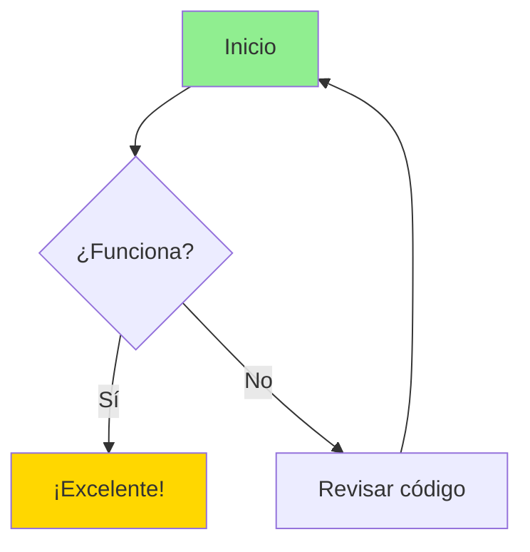
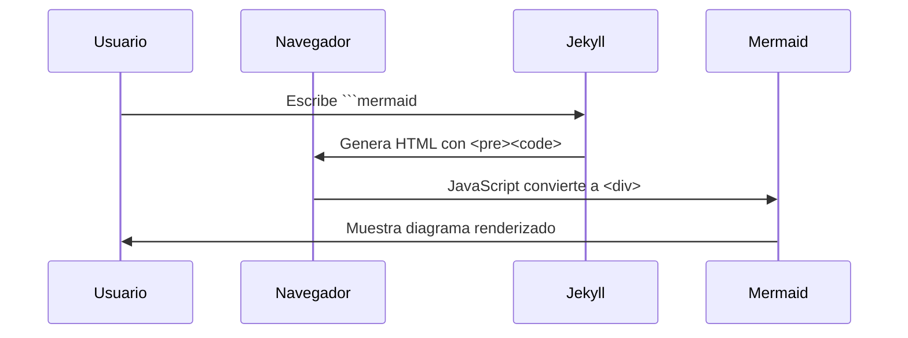
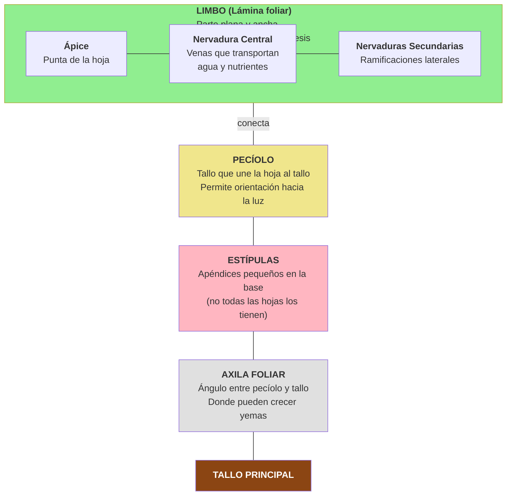

# Test de Diagramas Mermaid.js

Este archivo es para probar que los diagramas Mermaid.js se renderizan correctamente.

## Diagrama de Flujo Simple

## Diagrama de Secuencia

## Diagrama de Partes de una Hoja (del archivo arboles.md)

## Instrucciones

Si ves diagramas renderizados arriba (no código), ¡la solución funciona!

Si ves bloques de código con sintaxis mermaid sin renderizar:
1. Verifica que estás viendo esto a través de Jekyll (no directamente en GitHub)
2. Revisa la consola del navegador (F12) para errores
3. Consulta [docs/MERMAID_FIX.md](docs/MERMAID_FIX.md) para más ayuda
